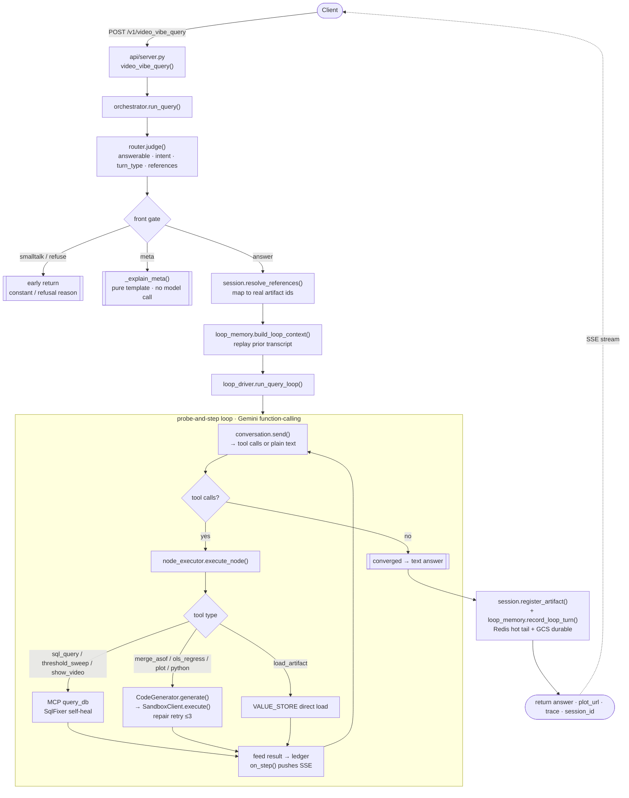
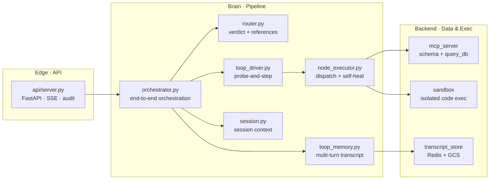

<div align="center">

# ▶ VideoSense

### Understand, query & analyze any video library in natural language — ask in plain English, get back **answers + charts + the code behind them**.

[](https://www.python.org/)
[](https://fastapi.tiangolo.com/)
[](https://deepmind.google/technologies/gemini/)
[](https://cloud.google.com/run)
[](#-tests)
[](#-license)

**English** · [简体中文](README.zh-CN.md)

</div>

---

## What it is

**VideoSense** is a **conversational analytics agent** for a video library. You ask in plain language — *"find every video where someone is skydiving"*, *"align the sensor data with the video events and run a regression"*, *"now plot it as a scatter"* — and it **probes the question, executes step by step, heals its own failures, and remembers across turns**, handing you back the answer, an interactive chart, and the actual Python it ran.

Under the hood there is **exactly one execution path**: a **probe-and-step loop** driven by Gemini 2.5 **native function-calling**. No pre-generated execution graph, no static planning — the model **decides as it probes**, calling real tools at each step (SQL query / time alignment / regression / plotting / sandboxed Python), reading the result, then deciding the next step, until it converges on a natural-language answer.

```text
You:  Find every video that contains skiing or snowboarding.
→     3 videos · Skiing in Aspen · Snowboarding Slopes · Backcountry Snowboarding Run

You:  Plot start time vs. detection confidence for all confirmed activities.
→     scatter chart  →  http://localhost:8000/plots/bb9ab8e1.svg

You:  Take the 3 highest-confidence skiing clips, align them with heart-rate
      sensor data, resample to 10 Hz, and run an OLS regression.
→     R² over time-aligned samples · plus the exact Python that computed it
```

---

## ✨ Features

| | | |
|---|---|---|
| 🔎 **Retrieve** | natural language → grounded SQL, pull the exact videos/facts | `sql_query` |
| 🧮 **Aggregate** | counts / group-by / threshold sweeps in one shot | `threshold_sweep` |
| 📈 **Analyze** | time alignment + interpolation + OLS regression — real data science | `merge_asof` · `ols_regress` |
| 🎨 **Visualize** | pure-SVG scatter / line charts, rendered straight in the browser | `plot` |
| 💬 **Memory** | session tracking + reference resolution — *"plot those"* just works | `loop_memory` |
| ⚡ **Streaming** | SSE pushes every step live, so the process is visible | `/stream` |
| 🔭 **Observability** | per-request audit log: who · tokens · cost · trace | `_audit` |
| 🛡️ **Self-healing** | SQL errors auto-rewritten, sandbox code failures auto-repaired & retried | `SqlFixer` · `CodeGenerator` |

---

## 🧭 The Query Loop

The diagram below is the **single, current execution path** (probe-and-step); nodes map to real modules:



### Step-by-step

1. **Client → API** — `POST /v1/video_vibe_query` (with an optional `session_id`); `api/server.py` serializes same-session turns under an owner lock so nothing is lost.
2. **Router verdict** — `router.judge()` (small `CRITIC_MODEL`) returns, in one shot: **answerability** (smalltalk / refuse / answer), **intent** (retrieve / aggregate / analyze / visualize / meta), **turn_type** (new / followup / meta), and **reference resolution**.
3. **Front gate · early return** — smalltalk returns a constant, refuse returns a plain-English reason, and meta turns go through a **pure template** `_explain_meta()`. These three **never enter the loop and burn zero model tokens**.
4. **Reference resolution** — on followup / meta, `session.resolve_references()` maps *"it / that chart"* to real artifact ids from the catalog (a handle index).
5. **Memory replay** — `loop_memory.build_loop_context()` reads the transcript tail and replays prior steps into the system prompt (CC-style append-only; over budget → LLM-summarize older turns, keep the most recent N verbatim).
6. **probe-and-step loop** — `loop_driver.run_query_loop()` opens a `GeminiConversation` and loops `send → tool calls → execute_node → feed result → send` until the model **stops calling tools** (converges to text), hits `MAX_LOOP_STEPS`, or repeats the same failing tool ≥ `repeat_limit`.
7. **Node execution · self-heal** — `node_executor.execute_node()` dispatches by tool: data tools go through **MCP `query_db`** (SQL error → `SqlFixer` rewrite & retry); science / plotting tools go through **`CodeGenerator` → `SandboxClient`** (stderr → `repair` rewrite, up to `CODE_MAX_RETRIES=3`).
8. **Streaming** — after each step, `on_step()` pushes `{"type":"step","tools":[...]}` to the browser over SSE (the `/stream` endpoint only).
9. **Register + persist** — the final successful step → `session.register_artifact()` (a pure handle: label / kind / preview / n / value_cached — **never the full value inline**); reusable results go to `VALUE_STORE` for next-turn `load_artifact`; `loop_memory.record_loop_turn()` appends the turn to the transcript (Redis hot tail + GCS durable).
10. **Return** — the sync endpoint returns `{answer, plot_url, session_id, trace, ...}`; the streaming endpoint pushes one final `result` event.

---

## 🧩 Components



| Component | Responsibility |
|---|---|
| **`api/server.py`** | FastAPI edge: sync routes (threadpool), SSE streaming, per-session serialization lock, per-request JSON audit |
| **`pipeline/orchestrator.py`** | End-to-end orchestration: router verdict → front gate → reference resolution → loop → artifact registration → transcript record |
| **`pipeline/loop_driver.py`** | **The probe-and-step loop**: Gemini conversation → tool calls → execute → feed → convergence check (pure control flow + live SSE adapter) |
| **`pipeline/router.py`** | Small-model judge: answerability / intent / turn_type + multi-turn reference resolution (`CRITIC_MODEL`) |
| **`pipeline/node_executor.py`** | Single-node execution: dispatch to MCP / sandbox + self-heal (`SqlFixer` / `CodeGenerator` retries) |
| **`pipeline/loop_memory.py`** | Multi-turn transcript memory: append-only (Redis hot tail + GCS durable) + over-budget LLM compaction |
| **`pipeline/transcript_store.py`** | Three-tier transcript storage: Redis LIST + one-object-per-event GCS + large-body overflow |
| **`pipeline/session.py`** | Session context: history / rolling / catalog (handle index) + persistence (physically isolated store) |
| **`sandbox/`** | Private Cloud Run sandbox: code execution + timeout / policy isolation (lazy ID-token fetch) |
| **`mcp_server/server.py`** | MCP server: `get_schema()` + `query_db()` (mock / real backend switch) |

---

## 🚀 Quickstart (Mock mode)

Run locally at **zero cost** — **no cloud database**, an in-memory SQLite store (16 videos + ~50 facts, enough for the test cases), and the LLM's Postgres SQL is auto-translated to SQLite dialect.

**PowerShell (Windows):**

```powershell
$env:GCP_PROJECT      = "your-gcp-project-id"
$env:REPL_USE_MOCK_DB = "1"
uvicorn api.server:app --port 8000
```

**bash (macOS / Linux):**

```bash
export GCP_PROJECT="your-gcp-project-id"
export REPL_USE_MOCK_DB="1"
uvicorn api.server:app --port 8000
```

Open [http://localhost:8000](http://localhost:8000) for the chat UI. Or try it from the terminal:

```bash
curl -X POST http://localhost:8000/v1/video_vibe_query \
  -H "Content-Type: application/json" \
  -d '{"query": "Which videos contain someone skydiving?"}'
```

> 💡 Mock mode needs no GCP data credentials, no database, and costs nothing — code, test, and CI all run with `REPL_USE_MOCK_DB=1`. (You still need `gcloud auth application-default login` so Gemini can run.)
> For real data: drop `REPL_USE_MOCK_DB` and set `ALLOYDB_*` / `GCS_BUCKET` / `SESSION_BACKEND=redis` + Upstash Redis. Prefer a terminal CLI over HTTP? `python -m pipeline.main`.

---

## 🗃️ Data Model

Five business tables — video metadata, discovery tags, perception facts, fact time-instances, and a skydiving column:

| Table | Key columns | Meaning |
|---|---|---|
| **`video_metadata`** | `video_id` · `title` · `gcs_uri` · `duration_sec` | Per-video base metadata |
| **`video_discovery`** | `video_id` · `all_activities` (JSON array) | Known activity tags per video |
| **`video_facts`** | `video_id` · `predicate` · `matched` · `confidence` · `start_ts` · `end_ts` | Perception-extracted activity facts (English predicate + confidence + matched flag + time span) |
| **`video_fact_instances`** | `id` · `fact_id` · `ts` · `frame_count` | Per-second timestamped samples of a fact (drives time-series alignment) |
| **`skydive_segments`** | `video_id` · per-phase `*_start_ts` / `*_end_ts` / `*_confidence` (aircraft · exit · freefall · deploy · canopy · landing) · `jump_type` · `is_wingsuit` · `freefall_sec` | Skydiving column: controlled per-phase metadata — phases may be **NULL** (demonstrates null-safe queries) |

> Mock dataset: **16 videos** (12 general ActivityNet-style + 4 skydiving) and ~50 facts, with confidence scores spread across 0.5–1.0 and a mix of matched / unmatched.

---

## 🛠️ Tool Catalog

Every tool the model can call inside the loop (`node_specs`):

| Tool | Class | What it does |
|---|---|---|
| `sql_query` | data (MCP) | full SELECT → `query_db`; on failure `SqlFixer` self-heals |
| `threshold_sweep` | data (MCP) | SQL template + a list of thresholds, swept and aggregated in-process |
| `show_video` | data (in-process) | `video_id` → signed GCS URL → `<video>` side-channel |
| `load_artifact` | cross-turn reuse | load a prior result straight from the value store (no recompute; needs `value_cached`) |
| `load_sensor_csv` | data science (sandbox) | generate / load simulated sensor data |
| `merge_asof` | data science (sandbox) | `pandas.merge_asof` — nearest-time join of video side + sensor side |
| `interpolate` | data science (sandbox) | scipy interpolation — resample to a uniform rate |
| `ols_regress` | data science (sandbox) | statsmodels OLS → `{params, r_squared, pvalues, n}` |
| `plot` | data science (sandbox) | pure-SVG scatter / line chart → `{svg}` artifact |
| `python` | escape hatch (sandbox) | arbitrary analysis described in natural language |

---

## 🌐 API Endpoints

| Endpoint | Method | Description |
|---|---|---|
| `/` | `GET` | Single-page front end `web/index.html` (bubble-style multi-turn chat + rich rendering) |
| `/health` | `GET` | Liveness probe (`mode: mock \| alloydb`) |
| `/v1/video_vibe_query` | `POST` | Synchronous query (optional `session_id`) |
| `/v1/video_vibe_query/stream` | `POST` | SSE streaming — step-by-step `step` events + a final `result` |
| `/plots/{filename}` | `GET` | Static chart (SVG / PNG) server |

<details>
<summary><b>Response format (JSON)</b></summary>

```jsonc
{
  "ok": true,
  "status": "ok",               // ok | refused | error | smalltalk
  "answer": "Found 3 skydiving videos: …",
  "turn_type": "new",           // new | followup | meta
  "session_id": "a1b2c3…",      // pass it back next turn to continue
  "plot_url": "http://…/plots/ab12cd34.svg",   // null if no chart
  "loop": { "steps": 3, "terminated": "text", "tool_calls": { "sql_query": 1 } },
  "trace": [ /* every step, timed */ ],
  "trace_summary": "router→loop(3 steps)→answer"
}
```

> **Note:** the execution path is unified to the probe-and-step loop. The legacy execution graph (Planner / DAG) is gone — to see *what it did*, read **`trace`** (and `loop` for step metrics). The response still carries a `dag` key for backwards-compatibility, but it is always `null` on the loop path.

</details>

---

## ☁️ Deploy (Cloud Run)

One-shot deploy from source (replace the placeholders with your own values):

```bash
gcloud run deploy videosense \
  --source . \
  --region us-central1 \
  --allow-unauthenticated \
  --memory 1Gi --cpu 1 --timeout 300 \
  --min-instances 0 --max-instances 5 \
  --session-affinity \
  --set-env-vars "^@^GCP_PROJECT=${GCP_PROJECT}@ALLOYDB_HOST=${ALLOYDB_HOST}@ALLOYDB_DB=${ALLOYDB_DB}@ALLOYDB_USER=${ALLOYDB_USER}@ALLOYDB_PASSWORD=${ALLOYDB_PASSWORD}@GCS_BUCKET=${GCS_BUCKET}@SESSION_BACKEND=redis@UPSTASH_REDIS_REST_URL=${UPSTASH_REDIS_REST_URL}@UPSTASH_REDIS_REST_TOKEN=${UPSTASH_REDIS_REST_TOKEN}@APP_ACCESS_KEYS=${APP_ACCESS_KEYS}"
```

| Placeholder | Meaning |
|---|---|
| `${GCP_PROJECT}` | Vertex AI project id |
| `${ALLOYDB_*}` | Neon / AlloyDB connection (host · db · user · password) |
| `${GCS_BUCKET}` | bucket for charts / artifacts |
| `${UPSTASH_REDIS_REST_URL/TOKEN}` | Redis session backend (shared across replicas) |
| `${APP_ACCESS_KEYS}` | HTTP Basic Auth keys (`name:key`, comma-separated for multiple users) |

> Multi-replica continuity needs `SESSION_BACKEND=redis` + `--session-affinity`. Prefer `--set-secrets` (Secret Manager) for passwords/keys. `SANDBOX_URL` points at the separate sandbox service — without it, plotting / science steps are unavailable.
>
> ℹ️ Merging to `main` does **not** auto-deploy and the live URL stays the same — deployment is an explicit step. See [`docs/DEPLOY.md`](docs/DEPLOY.md) and [`docs/MONITORING.md`](docs/MONITORING.md).

---

## 📁 Project Layout

```text
api/          FastAPI server · orchestration API + multi-turn routing + SSE
pipeline/     Core engine: orchestrator / router / loop_driver / node_executor
              loop_memory / transcript_store / session  (probe-and-step lives here)
web/          Single-page front end index.html · bubble chat + rich rendering (tables/charts/code)
sandbox/      Cloud Run isolated sandbox (gVisor) · safe code execution + self-heal
mcp_server/   Model Context Protocol server · schema-grounded DB access
repl/         Mock DB (in-memory SQLite) · zero-cost local dev (REPL_USE_MOCK_DB=1)
ingestion/    Offline video ingestion (download / transcode / upload) · not in the request path
perception/   Offline multimodal perception (Gemini fact extraction) · not in the request path
utils/        Helper scripts: DB checks / fact queries / connection diagnostics
docs/         DEPLOY.md · MONITORING.md · design docs
infra/        Infrastructure config (GCS lifecycle, Redis connection)
```

---

## 🧰 Tech Stack

| Layer | Technology |
|---|---|
| **HTTP API** | FastAPI (sync `def` + threadpool) · uvicorn[standard] |
| **Deploy** | Google Cloud Run (optional multi-instance + session affinity) |
| **Brain** | Gemini 2.5 Pro / Flash — via Vertex AI, probe-and-step function-calling |
| **Database** | Neon PostgreSQL / AlloyDB (psycopg2) · physically isolated from session store |
| **Session store** | SQLite (single node) / Redis + GCS (multi-instance) |
| **Value store** | InMemory / Redis (TTL auto-eviction) |
| **Transcript** | Redis LIST (hot tail) + GCS (durable) |
| **Sandbox** | Private Cloud Run + isolated code execution (timeout / policy) |
| **Chart artifacts** | SVG / PNG → GCS / local → `/plots` static server |
| **Protocols** | MCP (Model Context Protocol) · Pydantic v2 validation |

---

<details>
<summary><b>🔬 Deep dive: core architecture decisions</b></summary>

<br/>

**Single execution path**
- ✅ **The probe-and-step loop is the only path** — Gemini native function-calling; the model probes and executes as it goes.
- ✅ **Removed:** Planner (DAG planning), recipe, visualization DAG. `dag_schema.Node` survives only as a typed shell (the loop's intermediate representation uses `Call` / `ExecResult`); no planning / graph logic remains.
- ✅ **Artifacts are pure handles** — only label / preview / n / kind / value_cached pointers, **never the full value inline**; large values live in `VALUE_STORE` keyed by id.

**Multi-turn memory**
- **Router routing + reference resolution** — followup / meta verdict + matching real ids from the catalog.
- **Transcript replay** — on followup, read the tail → `build_loop_context()` → splice into the system prompt.
- **Transcript compaction** — tail over token budget → LLM-summarize older turns, keep the most recent `KEEP` verbatim.
- **Cross-turn value reuse** — `_is_reusable(final_tool)` heuristic → `VALUE_STORE` (Redis / memory) → next-turn `load_artifact` with zero recompute.

**Security isolation**
- Session data lives in a separate SQLite / Redis store; the business-DB MCP SQL **cannot reach** it.
- Auth: HTTP Basic Auth (`APP_ACCESS_KEYS`, required in production).
- Audit: per-request JSON log → Cloud Logging (`jsonPayload.*`), exportable to BigQuery / Looker Studio.

**Failure handling (fail-open throughout)**
- `sql_query`: `SQL_MAX_RETRIES` retries + `SqlFixer` self-heal.
- Sandbox nodes: `CODE_MAX_RETRIES=3` retries + `CodeGenerator` self-heal.
- Router / hook / self-heal / audit errors **never block** the main path.

</details>

<details>
<summary><b>🔁 Network call sequence</b></summary>

<br/>

1. **Client** → FastAPI (`/v1/video_vibe_query`)
2. **orchestrator** → Router / MCP (`get_schema`, catalog verdict)
3. **orchestrator** → transcript store (read transcript from Redis / GCS)
4. **loop** → Gemini API (function-calling, multi-turn conversation)
5. **loop** → MCP `query_db` (`sql_query` / `show_video`)
6. **loop** → `SandboxClient` (`/execute`: generated code + execution)
7. **session** → SQLite / Redis (store history / catalog)
8. **transcript_store** → GCS (append-only transcript, durable)
9. **artifacts** → GCS / local `/plots` (chart artifacts)
10. **Client** → `/plots` or `<video>` src (chart / video playback)

</details>

---

## 🧪 Tests

```bash
REPL_USE_MOCK_DB=1 pytest
```

**146 passing** across ~18 `test_*.py` files under `pipeline/` (loop driver, loop memory, multi-turn, router, session, node specs, transcript store, artifact value reuse, redis session, …), `sandbox/`, `utils/`, and `perception/`. Dev deps in `requirements-dev.txt` (includes `fakeredis`, so session tests run without a real Redis).

---

## 📜 License

This repository currently ships **no LICENSE file** — all rights reserved by default. For open-source or commercial use, please check with the maintainer first.
