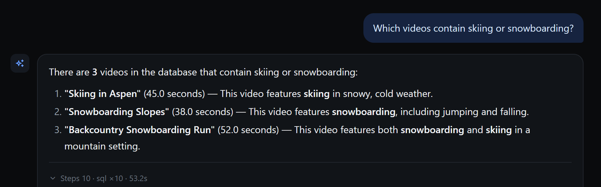
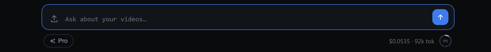

<div align="center">


<br/><br/>

**English** · [简体中文](README.zh-CN.md)

### Your videos hold answers. VideoSense finds them —<br/>it watches, reasons, and replies with the clip and the chart to prove it.

</div>

<br/>

<div align="center">
  <a href="https://kenny0312.github.io/demo/videosense.html"></a>
  <br/><br/>
  <sub>A real session, replayed — the question is typed, the agent streams its tool steps (one self-repair included), then answers with <b>three real clips</b> from the library. &nbsp;<a href="https://kenny0312.github.io/demo/videosense.html"><b>▶ Play the interactive demo</b></a></sub>
</div>

<br/>

<details align="center">
  <summary><sub>▶ &nbsp;Prefer the raw screen recording? &nbsp;<i>(4&nbsp;MB GIF)</i></sub></summary>
  <br/>
  
</details>

<br/>

## 🧾 A real session, unedited

Straight answers, receipts attached. Ask in plain language, get a structured reply — and every reply carries a quiet **Steps** footer, so the full reasoning session is one click away.



<br/>

### 💸 Costs are part of the product

Every session meters its own spend live in the composer — tokens, dollars, and a budget ring. The same telemetry streams to BigQuery in production.



<br/>

<div align="center">

### 🚀 Try it in 30 seconds — free mock mode

</div>

```bash
export GCP_PROJECT="your-gcp-project"  REPL_USE_MOCK_DB=1
uvicorn api.server:app --port 8000        # then open http://localhost:8000
```

<sub>No database, no cost — a built-in sample library. You only need <code>gcloud auth application-default login</code> for Gemini.</sub>

<br/>

## 🧠 How it answers

There is no pre-baked pipeline. An agent loop with **Gemini 2.5** as the brain decides its own next move — watch a video, query the facts it has extracted, search semantically, run a calculation, draw a chart — and keeps going until it can *prove* an answer, streaming every step back live. It remembers you across sessions, meters its own cost per request, and runs in production on Cloud Run with **146 tests** behind it.

<sub>Curious about the internals? Architecture notes live in [`docs/design/`](docs/design/).</sub>

<br/>

<div align="center">

<sub>Built by <a href="https://kenny0312.github.io">Kenny Qiu</a> &nbsp;·&nbsp; see also <a href="https://github.com/kenny0312/social-video-insights">SocialLens</a>, a social-video insights demo &nbsp;·&nbsp; <a href="README.zh-CN.md">简体中文</a></sub>

</div>
