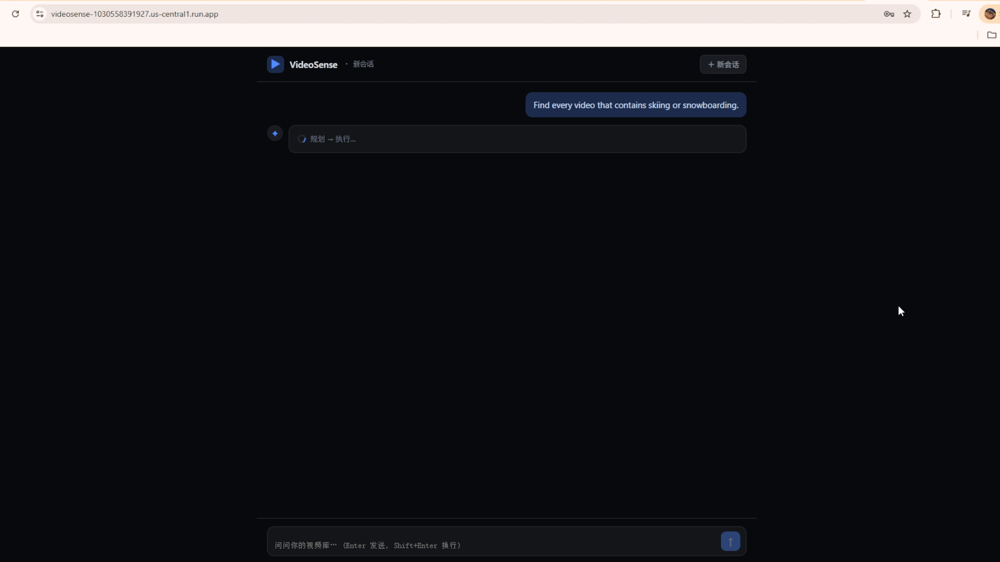

<div align="center">

# 🎬 VideoSense Agent

### Natural-language understanding & analytics for any video library — ask in plain English, get answers, charts, and the code behind them.

[](https://www.python.org/)
[](https://fastapi.tiangolo.com/)
[](https://deepmind.google/technologies/gemini/)
[](https://cloud.google.com/)

</div>

---

## Demo

<div align="center">



<sub>One question → a multi-step plan → self-healing execution → answer + code. <a href="docs/DEMO.md"><b>See the full walkthrough →</b></a></sub>

</div>

```
You:  Find every video that contains skiing or snowboarding.
→     3 videos · Skiing in Aspen · Snowboarding Slopes · Backcountry Snowboarding Run

You:  Plot start time vs. detection confidence for all confirmed activities.
→     scatter chart  →  http://localhost:8000/plots/bb9ab8e1.svg

You:  Take the 3 highest-confidence skiing clips, align them with heart-rate
      sensor data, resample to 10 Hz, and run an OLS regression.
→     R² over time-aligned samples · plus the exact Python that computed it
```

---

## What it does

**VideoSense Agent turns raw video into a knowledge base you can interrogate in natural language.**

A multimodal LLM watches each video and extracts structured, confidence-scored facts
("*snowboarding*, 0.96, 3s–36s"). On top of that fact base, you ask questions the way
you'd ask a data analyst — *"find,"* *"compare,"* *"correlate,"* *"plot"* — and the system:

1. **Routes** the question first — judging whether it can actually be answered with the data and tools at hand. If not (e.g. it refers to an earlier turn it can't see), it **says so honestly instead of guessing**.
2. **Plans** the question into an executable graph of steps.
3. **Writes** the Python for each analytical step on the fly.
4. **Runs** that code in an isolated sandbox, **fixing its own bugs** when it hits one (database steps self-heal too).
5. **Returns** the answer, any charts, and the exact code that produced them.

No dashboards to configure, no SQL to write, no notebooks to babysit. Just ask.

### Why it's different

| | Traditional video search | VideoSense Agent |
|---|---|---|
| **Query** | keyword / tag matching | full natural language |
| **Answers** | a list of clips | computed analytics, regressions, charts |
| **New question** | build a new pipeline | just ask — code is generated per query |
| **Trust** | black box | returns the plan **and** the runnable code |
| **When it can't** | wrong or empty results | refuses honestly, with a plain-English reason |

---

## How it works

```
   Natural-language question
            │
            ▼
   ┌──────────────────┐
   │   ROUTER          │   answerable? · intent?
   │   can I answer?   │   ──► if not, refuse honestly
   └────────┬─────────┘
            │ yes
            ▼
   ┌──────────────────┐   reads live DB schema     ┌──────────────────┐
   │   PLANNER        │ ◀────────────────────────▶ │  Knowledge base   │
   │   question → plan│        (via MCP)            │  (video facts)    │
   └────────┬─────────┘                            └──────────────────┘
            │  a graph of steps
            ▼
   ┌──────────────────┐   writes Python per step
   │  CODE GENERATOR  │ ─────────────────────────┐
   └──────────────────┘                          ▼
                                       ┌──────────────────────┐
                                       │  SECURE SANDBOX       │
                                       │  run · fail · self-fix│  ↺ up to 3×
                                       └──────────┬───────────┘
                                                  ▼
                              answer · chart · generated code
```

The pipeline separates **deciding what to do** (a transparent, auditable plan) from
**doing it** (generated code that runs in isolation and repairs itself). Simple lookups
take the fast path; only analytical work pays for code generation and sandboxed execution.

---

## Tech stack

Built on a modern, cloud-native AI stack:

- **🧠 Multimodal AI** — Gemini 2.5 (Vertex AI) for both perception and code generation
- **🔌 Model Context Protocol** — standardized, schema-grounded database access
- **🛡️ Isolated execution** — Cloud Run + gVisor sandbox with an AST policy gate
- **🗄️ Cloud data** — AlloyDB for PostgreSQL · Google Cloud Storage
- **⚡ Production API** — FastAPI, fully containerized

---

## Requirements

- **Python** 3.11+
- **Google Cloud** account with Vertex AI enabled, and `gcloud` CLI authenticated
- **(Optional)** AlloyDB / PostgreSQL — *or* run in zero-cost **mock mode** (no database required)

Install dependencies:

```bash
pip install -r requirements.txt
```

Authenticate with Google Cloud (needed for Gemini):

```bash
gcloud auth application-default login
```

---

## Quickstart

The fastest way to try it — **mock mode** uses an in-memory database seeded with sample
video facts, so you need **no AlloyDB and pay nothing for storage**.

### 1. Configure your environment

```powershell
$env:GCP_PROJECT      = "your-gcp-project-id"                  # Vertex AI project (required for Gemini)
$env:REPL_USE_MOCK_DB = "1"                                    # zero-cost in-memory data
$env:SANDBOX_URL      = "https://your-sandbox-xxxxx.run.app"   # hosted secure sandbox (science steps only)
$env:SANDBOX_TOKEN    = (gcloud auth print-identity-token)
```

### 2. Start the API

```bash
uvicorn api.server:app --port 8000
```

### 3. Ask a question

Open the built-in test page — or the Swagger docs — in your browser:

```
http://localhost:8000/         # built-in query test page (type a question; see answer + trace)
http://localhost:8000/docs     # interactive API docs
```

Or call it directly:

```bash
curl -X POST http://localhost:8000/v1/video_vibe_query \
  -H "Content-Type: application/json" \
  -d '{"query": "Find every video that contains skiing or snowboarding."}'
```

> 💡 Prefer real AlloyDB? Drop `REPL_USE_MOCK_DB` and set `ALLOYDB_PASSWORD` instead.
> Prefer a terminal CLI over HTTP? Run `python -m pipeline.main`.

---

## Using the API

**`POST /v1/video_vibe_query`**

```jsonc
// Request
{ "query": "Plot start time vs. confidence for all confirmed activities." }

// Response
{
  "ok": true,
  "status": "ok",                                  // ok · refused · error
  "answer": { "n_points": 45 },
  "dag": { "nodes": [ /* the plan that was executed */ ] },
  "generated_code": { "n2": "import json ..." },   // the exact code that ran
  "plot_url": "http://localhost:8000/plots/bb9ab8e1.svg",
  "trace": [ /* every step, timed */ ],
  "trace_summary": "trace: 4/4 steps ok, total 53578ms"
}
```

Charts are served straight from the API — open `plot_url` in your browser.

If a question can't be answered (e.g. it refers to an earlier turn the system can't see), the response
comes back with `"status": "refused"` and a plain-English `reason` — never a fabricated answer.

### Example questions to try

| Ask this | You get |
|----------|---------|
| `How many videos are in the database?` | a count |
| `Find every video that contains skiing or snowboarding.` | a filtered list |
| `Plot start time vs. confidence for all confirmed activities.` | a scatter chart URL |
| `Show the distribution of confidence scores in 0.1 buckets.` | a histogram |
| `Take the top-3 skiing clips, align them with heart-rate data, resample to 10 Hz, and run an OLS regression.` | a regression + the code |

---

## Project layout

```
pipeline/     The query engine: router · planner · code generator · executor · orchestrator
api/          FastAPI service (POST /v1/video_vibe_query)
sandbox/      Isolated code-execution service (Cloud Run + gVisor)
mcp_server/   Schema-grounded database access over MCP
perception/   Multimodal fact extraction from video
ingestion/    Video → transcode → cloud storage → metadata
```

---

<div align="center">
<sub>Built with Gemini, MCP, and a self-healing code sandbox on Google Cloud.</sub>
</div>
