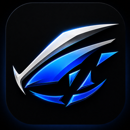
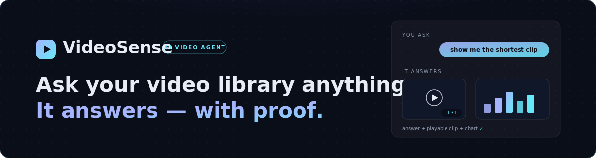
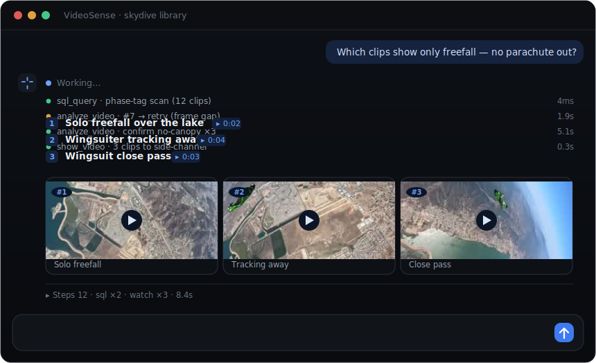
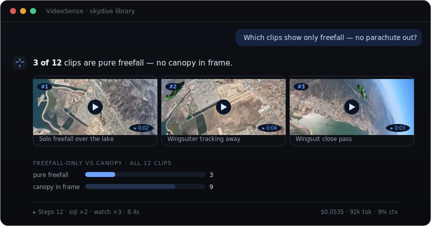
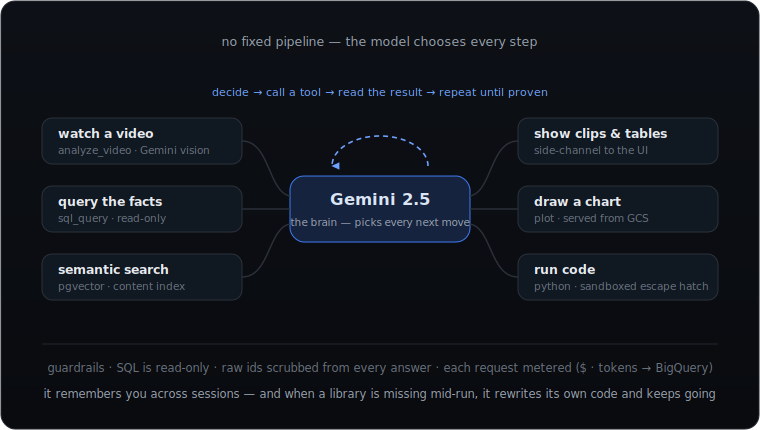

<div align="center">



<br/>



<br/><br/>

[](https://www.python.org/) [](https://fastapi.tiangolo.com/) [](https://deepmind.google/technologies/gemini/) [](https://github.com/pgvector/pgvector) [](https://cloud.google.com/run) [](https://cloud.google.com/bigquery)

它看你的视频、对看到的内容推理，并用可播放的片段和图表来证明它的回答。

### [▶ 在线体验 — **videosense.work**](https://videosense.work)

<sub>[English](README.md) · **简体中文**</sub>

</div>

<br/>

<div align="center">
  <a href="https://kenny0312.github.io/demo/videosense.html"></a>
  <br/><br/>
  <sub>一段真实会话的回放——问题被逐字打出，agent 流式跑完工具步骤（含一次自我修复），然后用<b>库里三段真实视频</b>作答。&nbsp;<a href="https://kenny0312.github.io/demo/videosense.html"><b>▶ 玩可交互版 demo</b></a></sub>
</div>

<br/>

## 答案——以及它花了多少钱

大白话提问；先给结论，再给证明它的片段和数字。每条回复的页脚都安静地带着收据：步骤、工具、耗时——还有花费。

<div align="center">
  
</div>

<br/>

## 它是怎么回答的

<div align="center">
  
</div>

<br/>

没有写死的流水线：模型自己决定每一步，直到能**证明**答案为止，每一步都实时流式返回。有一次分析中途缺库，它自己重写代码把活干完——[看那次运行](docs/DEMO.md)。


## 30 秒跑起来

```bash
export GCP_PROJECT="your-gcp-project"
export REPL_USE_MOCK_DB=1
uvicorn api.server:app --port 8000        # 然后打开 http://localhost:8000
```

<sub>不需要数据库、零成本——内置示例视频库。只需 <code>gcloud auth application-default login</code> 用于调用 Gemini。</sub>

<br/>

## 值得信任的答案

每次变更都要过 **370 道题的自动化评测** —— 确定性校验器打分(不用 LLM 裁判),诚实与安全类是必过题;答案拒绝硬凑:库里没有你问的内容时,它会如实说没有,而不是端出一个最像的。Prompt 的每次改动都先过带统计门槛的进化循环,再交人工审核。

## 许可与商用

VideoSense 以 **source-available** 形式开放源码([Elastic License 2.0](LICENSE)):可以读、可以跑、可以改 —— 但不可以把它(或其衍生品)作为托管/在线服务提供给第三方。商业授权请[联系我](mailto:kennyqiu0312@gmail.com)。

<br/>

<div align="center">

<sub>由 <a href="https://kenny0312.github.io">Kenny Qiu</a> 构建 &nbsp;·&nbsp; 另见 <a href="https://github.com/kenny0312/social-video-insights">SocialLens</a>——社媒视频洞察 demo &nbsp;·&nbsp; <a href="README.md">English</a></sub>

</div>
