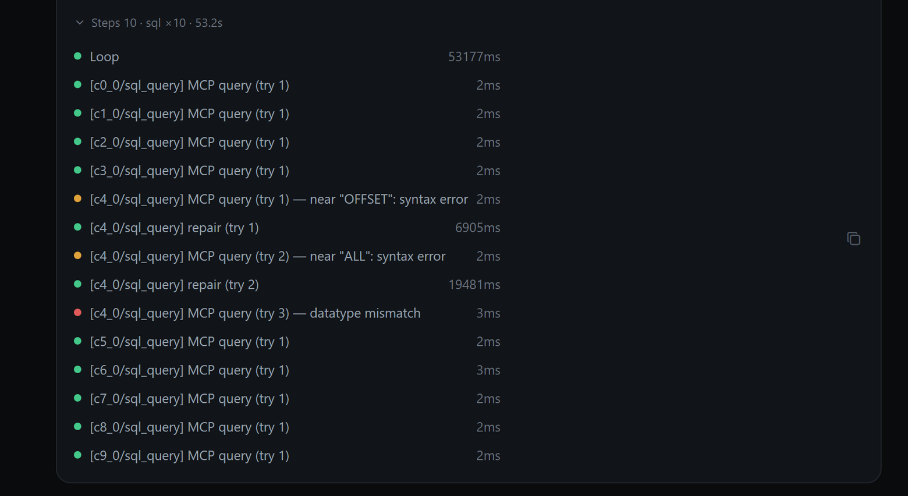
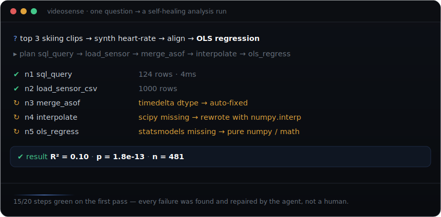

<div align="center">


<br/><br/>

[English](README.md) · **简体中文**

### 你的视频里藏着答案。VideoSense 帮你找到它——<br/>它真的看视频、自己推理，并用可播放的片段和图表来证明。

<br/>

<p align="center">
  
  &nbsp;
  
  &nbsp;
  
</p>

</div>

<br/>

<div align="center">
  <a href="https://kenny0312.github.io/demo/videosense.html"></a>
  <br/><br/>
  <sub>一段真实会话的回放——问题被逐字打出，agent 流式跑完工具步骤（含一次自我修复），然后用<b>库里三段真实视频</b>作答。&nbsp;<a href="https://kenny0312.github.io/demo/videosense.html"><b>▶ 玩可交互版 demo</b></a></sub>
</div>

<br/>

<details align="center">
  <summary><sub>▶ &nbsp;想看原始录屏？点开 20 秒走查 &nbsp;<i>(4&nbsp;MB GIF)</i></sub></summary>
  <br/>
  
</details>

<br/>

## 💬 你来问 · 它来答

| 你问… | …你得到 |
|:---|:---|
| 🪂 &nbsp;*“有多少条翼装飞行的视频？”* | **“12 条”**——每一条它都看过并标注了阶段 |
| 🎬 &nbsp;*“放一下最短的那条”* | **就地播放** |
| 🔎 &nbsp;*“哪些片段只有自由落体、没开伞？”* | 一份筛选好的列表，每条都**可播放** |
| 📊 &nbsp;*“画一下置信度分布”* | 一张**图表** |
| 💬 &nbsp;*“再列几条 · 你是怎么得出来的？”* | **记得**上下文，接着聊 |

<br/>

## ✨ 为什么不一样

<table>
<tr>
<td width="33%" valign="top" align="center"><br/>💬<h3>直接问</h3><sub>不写 SQL，不配仪表盘。<br/>大白话进，答案出。</sub><br/><br/></td>
<td width="33%" valign="top" align="center"><br/>🧠<h3>它真的在看</h3><sub>Gemini 多模态读的是画面本身，<br/>不是文件名和元数据。</sub><br/><br/></td>
<td width="33%" valign="top" align="center"><br/>🎬<h3>看得见的答案</h3><sub>答案 + 片段 + 图表，<br/>连推理过程也给你看。</sub><br/><br/></td>
</tr>
</table>

<br/>

## 🧾 一段真实会话，未经剪辑

有一说一，证据随附。大白话提问，拿到结构化回答——每条回复都带一个安静的 **Steps** 页脚，完整的推理过程一键展开。


<br/>

### 🔧 它展示自己的工作——还会自己修错

展开页脚，你就在看这个循环思考：十次 SQL 探查、一次语法错误、两次自动修复、一次换策略——最后依然给出正确答案。没有黑箱。



<br/><br/>

<div align="center">
  <a href="docs/DEMO.md"></a>
  <br/><br/>
  <sub>极限案例：一个问题 → 五步分析，边跑边<b>自愈</b>——缺 <code>scipy</code> 时它自己改写代码。&nbsp;<a href="docs/DEMO.md"><b>看完整过程 →</b></a></sub>
</div>

<br/>

### 💸 成本也是产品的一部分

每个会话都在输入框旁实时计量自己的花费——token、美元、预算环。生产环境同一套遥测流入 BigQuery。


<br/>

<div align="center">

### 🚀 30 秒跑起来——免费 mock 模式

</div>

```bash
export GCP_PROJECT="your-gcp-project"  REPL_USE_MOCK_DB=1
uvicorn api.server:app --port 8000        # 然后打开 http://localhost:8000
```

<sub>不需要数据库、零成本——内置示例视频库。只需 <code>gcloud auth application-default login</code> 用于调用 Gemini。</sub>

<br/>

## 🧠 它是怎么回答的

没有写死的流水线。一个以 **Gemini 2.5** 为大脑的 agent 循环自己决定下一步——看视频、查它抽取过的事实、语义检索、跑计算、画图——直到能**证明**一个答案为止，每一步都实时流式返回。它跨会话记得你、按请求计量自己的成本，并带着 **146 个测试**跑在 Cloud Run 生产环境上。

<sub>想看内部实现？架构笔记在 [`docs/design/`](docs/design/)。</sub>

<br/>

<div align="center">

<sub>由 <a href="https://kenny0312.github.io">Kenny Qiu</a> 构建 &nbsp;·&nbsp; 另见 <a href="https://github.com/kenny0312/social-video-insights">SocialLens</a>——社媒视频洞察 demo &nbsp;·&nbsp; <a href="README.md">English</a></sub>

</div>
