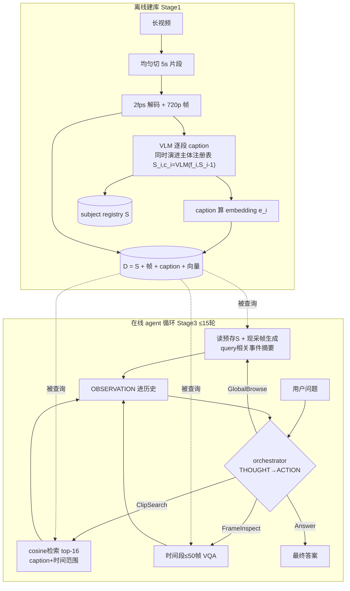

# DVD 论文本地复现方案(Deep Video Discovery → VS 实验装置)

> 交付对象: 单人开发者, Windows 11 + PyCharm + Anaconda(`C:\Users\User\anaconda3\python.exe`, Python 3.13.5)。
> 本文档自足, 不依赖任何对话上下文。所有 file:line 指向仓库 `C:\Users\User\antigravityProject\videoUnderstanding`。
> 论文: DVD (Deep Video Discovery), arXiv 2505.18079, Microsoft, NeurIPS 2025。官方代码: https://github.com/microsoft/DeepVideoDiscovery (MIT)。
> 复现代码全部放在仓库根新建的 `dvd_repro/` 文件夹, **不碰核心 pipeline**。

---

## 0. 论文机制速览(先懂原理再动手)

DVD 的核心思想一句话: **不把整个长视频一次塞给大模型, 而是先把视频做成一个"三层数据库", 再让一个会推理的 agent 拿三个工具反复查库, 查够了再答题**。它在 LVBench(小时级长视频问答)拿到 74.2%, 比"直接把帧喂给同一个模型 o3"(57.1%)高 17.1 个点——这是"agent 查库赢过喂帧"的核心证据。

### 0.1 数据库: 三层结构 D = {S, {f_i, c_i, e_i}}

建库时把视频**均匀切成不重叠的 5 秒片段**(片段数 N=⌈视频长度/5⌉), 每段按 **2 fps 解码成帧并 resize 到 720p**(每段约 10 帧)。然后三层信息:

| 层级 | 存什么 | 人话 |
|---|---|---|
| **frame 层** | 解码帧 f_i(720p, 2fps) | 原始像素, 留给细看工具用 |
| **clip 层** | 每段一条详细 caption c_i + 它的语义向量 e_i | 每 5 秒一段"解说词"+可搜索的索引 |
| **global 层** | 主体注册表 S + (查询时现算的)事件摘要 | 全片"人物志"+按问题定制的"剧情梗概" |

**global 层有两种存法, 这是最容易搞错的点, 必须讲清:**

1. **subject-centric(主体为中心)= 离线预存**。建库 captioning 时维护一个渐进式主体注册表 S: 每处理一个片段, VLM 同时输出 caption 和更新后的注册表, 即公式 `S_i, c_i = VLM(f_i, S_{i-1})`(S_0 为空)。每个主体存 5 类属性: 名字/外观/身份描述/关联动作/出现时间段。论文原文: *"For subject-centric summarization, we pre-construct it when building the multi-granular video dataset ... since it is query-irrelevant."*——因为跟问题无关, 所以能预存。
2. **event-centric(事件为中心)= 查询时现算**。Global Browse 被调用时, 对**整段视频均匀采样帧**喂给 VLM, 并指示它只描述"与用户原始 query 显式相关的重要事件"。原文: *"we uniformly sample frames across the entire video ... describe noteworthy events explicitly related to the original user query."*

两者**都由同一个 Global Browse 工具返回**, 区别是一静一动: 一个 query 无关所以预存, 一个 query 相关所以现算。event-centric 摘要因此**不出现在 D 的公式里**(不落库)。

### 0.2 三个工具(与三层一一对应)

| 工具 | 对应层 | 输入 | 输出 |
|---|---|---|---|
| **Global Browse** | global | 用户原始 query | subject registry + 现算的 query 相关事件摘要 |
| **Clip Search** | clip | agent 合成的搜索词 + top-k(默认 16, agent 可改) | query 向量与全部 caption 向量算 cosine, 返回 top-k 条 {caption, 时间范围} |
| **Frame Inspect** | frame | 时间范围 [t_s, t_e] + 子问题 | 取该范围的帧(上限 50, 超限均匀采样)做开放式 VQA, 返回文本 |

### 0.3 Agent 循环

标准 observe-reason-act 循环(论文 Algorithm 1): 收到问题 Q → 初始化历史 → 每轮 LLM 先写 THOUGHT(推理), 再从 {GlobalBrowse, ClipSearch, FrameInspect, Answer} 选一个动作执行, 观察结果进历史 → 选 Answer 或达到步数上限 **N=15** 时强制作答(LVBench 实际平均 7.3 步)。system prompt 强制 *"You MUST plan extensively before each function call, and reflect extensively on the outcomes"*; 选择题强制 *"Answer with the option's letter ... directly and only give the best option"*。



### 0.4 论文配置与关键数字(校准预期用)

- SOTA 配置: orchestrator 和 Frame Inspect 内部模型都是 **OpenAI o3**; captioner LVBench 用 GPT-4.1(其他 benchmark 省钱用 4.1-mini); embedding 论文只写 "a language embedding model", 官方代码里是 text-embedding-3-large(3072 维)。
- 工具消融(Table 5, 基线 71.9): 去 Clip Search 掉 **12.3**(最大, 命脉); 去 Frame Inspect 掉 8.4; 去 Global Browse 只掉 2.9。→ **片段语义检索价值最高, global 层锦上添花**。
- orchestrator 消融(Table 4): o3→o4-mini 掉 5.8; o3→GPT-4o 掉 **13.7**。原文结论: reasoning 模型是最关键组件。→ **该省 captioner, 别省 orchestrator**。
- 成本: o3 每题平均 **$0.213 / 0.15M tokens**(v4 附录 A.2)。
- 失败模式: "Clip Search Trap"(连续 >3 次同一工具不收敛)是 o3 多数失败的来源, 通常发生在答案根本不在库里时——出题时要故意造这种题(见 Stage 4)。

---

## 1. 复现目标与验收标准

**不是刷榜。** 目标有三:

- **(a) 管线跑通**: 在自己的机器上, 对自己的视频, 完整走通 建库→三工具→agent 循环→答题。
- **(b) 三方对照实验**: 在 3-5 条长视频 + 20 道自建题上, 跑出一张 **准确率 × 成本($) × 延迟(秒)** 对照表, 三个选手:
  1. **DVD-agent**(本方案的复现物);
  2. **基线 A: 单次全喂**——直接调 VS 现有 `analyze_video` 把整条视频+问题一次喂给 Gemini;
  3. **基线 B: 冻结索引**——只查 VS 现有 pgvector 语义索引(enrichment 产出的 caption/transcript), 不看像素, 按检索结果答题。
- **(c) 战略复用**: 这张表就是你战略里 **agency-Δ**(agent 主动查证比一次喂帧多赚多少准确率)和 **cost-accuracy 收敛图** 的第一台实验装置。DVD-agent vs 基线 A 的差值 = agency-Δ 的直接测量; 三个点连起来就是 cost-accuracy 图上的第一条曲线。以后换模型/换参数, 装置不变, 只是多打几个点。

**总验收标准**: 一条 ≥20 分钟的视频上, DVD-agent 能对至少一道"基线 A 答错、且需要定位到具体时间段细看才能答对"的题给出正确答案, 并且全流程成本和延迟被记录在案。

**诚实预期(按消融校准, 别承诺 74.2)**: 原文 orchestrator 是 o3。你用 Gemini: **2.5-pro 约等于 o4-mini 档, 预期比论文低 5-6 个点的水位; 2.5/3.5-flash 约等于 GPT-4o 档或更低, 预期低 13+ 个点**。但注意: 掉点是相对 LVBench 满配而言; 在你自建的 20 题上, 关心的是 **DVD-agent 相对两条基线的 Δ**, 这个 Δ 在弱模型上依然应该为正(论文里连 GPT-4o 当 orchestrator 都有 62.3, 仍高于 o3 直接喂帧的 57.1)。如果 flash 上 Δ≈0, 换 pro 再测一轮, 这本身就是一个有价值的实验结论。

---

## 2. 环境准备

**解释器**: PyCharm 里把项目解释器指向 `C:\Users\User\anaconda3\python.exe`(Python 3.13.5)。**不要用 PATH 上的 python**(是 stub)。

**依赖**: 主仓库 `requirements.txt` 已含 google-genai/google-cloud-storage/psycopg2-binary/pydantic/tqdm。`dvd_repro/requirements.txt` 只需增量:

```
# dvd_repro/requirements.txt —— 在主仓库依赖之上的增量
numpy>=1.26        # 向量存 .npy
opencv-python>=4.9 # 可选: 本地抽帧方案 A 用; 若走 ffmpeg 抽帧可不装
yt-dlp>=2025.1     # 仅 LVBench 备选路线需要
```

**环境变量**: 全部沿用仓库根 `.env`(`pipeline/config.py:12-29` 的 `_load_local_env` 会自动加载), 无需新增 API key——Gemini 走 Vertex ADC(`genai.Client(vertexai=True, project=..., location='global')`, 见 `pipeline/genai_client.py:16-25`)。数据库连接用 `ALLOYDB_HOST/ALLOYDB_PORT/ALLOYDB_DB/ALLOYDB_USER/ALLOYDB_PASSWORD`(Neon Postgres, sslmode=require, `pipeline/config.py:144-148`)。

**ffmpeg 检查(PowerShell)**:

```powershell
Get-Command ffmpeg, ffprobe | Select-Object Source
ffmpeg -version   # 应显示 8.1.1 (winget Gyan.FFmpeg)
```

本机已装; 注意只有本地机有 ffmpeg, Cloud Run 镜像里没有——本复现全程本地跑, 不受影响。

**GCS 访问检查**: `gcloud auth application-default print-access-token` 能出 token 即可(视频要从 `gs://activitynet/...` 拉到本地)。

---

## 3. 选视频

### 3.1 从自己库里选(首选)

按真实 schema(`video_metadata`: video_id varchar PK, title text, gcs_uri text, duration_sec double precision, source text, ingested_at timestamp; 见 `repl/_mock_db.py:41-46` 与 `ingestion/upload_local.py:125`):

```sql
SELECT video_id, title, duration_sec, gcs_uri
FROM video_metadata
WHERE duration_sec IS NOT NULL
ORDER BY duration_sec DESC
LIMIT 10;
```

注意 `duration_sec` 部分行为 NULL(`ingestion/backfill_metadata.py:17` 明说留空), 上面 SQL 只覆盖有时长的行; 若前 10 都不够长, 再跑一次 `WHERE duration_sec IS NULL` 抽几条用 ffprobe 补量。

**选择标准**: ≥20 分钟优先(DVD 的优势在长视频, LongVideoBench 最长桶才拉开差距); 内容要"有情节/多主体/有屏幕文字"(subject registry 才有东西可记); 取 3 条即可。ActivityNet 主语料多为 1-3 分钟短视频, 大概率不够长 → 走备选。

### 3.2 LVBench 备选(推荐, 一批灌库两用)

如果库里最长的也就几分钟, 直接下 2-3 条 LVBench 视频。这**同时服务你已定稿的"LVBench 外部锚"计划**($25 子集), 灌一次库两个实验用。做法: LVBench 官方仓库 (github.com/THUDM/LVBench) 的 meta 数据里有 YouTube video id 列表, 挑 2-3 条 30-60 分钟、题目数多的:

```powershell
yt-dlp -f "bv*[height<=720]+ba/b[height<=720]" -o "dvd_repro/videos/%(id)s.mp4" <youtube_url>
```

下载后用 `ingestion/upload_local.py` 的同款流程灌进 VS 库(720p 转码命令抄 `ingestion/download_transcode_upload.py:145-157`), 这样基线 A/B 也能对同一条视频跑。

---

## 4. Stage 1: 建库(约 1.5 天)

### 4.1 文件夹结构(每文件职责单一, 供你逐个精读)

```
dvd_repro/
├── requirements.txt
├── config.py          # 所有可调参数: CLIP_SECONDS=5, FPS=2, MAX_FRAMES=50, TOP_K=16, MAX_STEPS=15, 模型名
├── segmenter.py       # 视频→[(t_start,t_end)]均匀切段 + ffmpeg 按 2fps/720p 抽帧到 frames/
├── captioner.py       # 逐段调 Gemini: 输入该段帧+上一版注册表 → 输出 {caption, subjects_present, 注册表增量}
├── registry.py        # SubjectRegistry 类: 合并增量、5 属性(名字/外观/身份/动作/时间段)、序列化
├── embedder.py        # 薄封装: 复用 pipeline/embeddings.py 的模型与调用方式
├── store.py           # 数据库读写: clips.jsonl + embeddings.npy + registry.json + frames/ 的统一读取口
├── build_db.py        # CLI 入口: python build_db.py <video_id 或本地mp4路径>
├── prompts.py         # caption prompt / event摘要 prompt / VQA prompt / orchestrator system prompt 集中放
├── tools/
│   ├── global_browse.py
│   ├── clip_search.py
│   └── frame_inspect.py
├── agent.py           # Stage 3: function-calling 循环
├── baselines.py       # Stage 4: 基线 A/B
├── run_eval.py        # Stage 4: 跑 20 题×3 选手, 吐对照表
├── questions/         # 题库 jsonl
├── videos/            # 本地视频缓存
└── db/<video_id>/     # 每条视频一个库目录
    ├── clips.jsonl    # 每行: {"idx":0,"t0":0.0,"t1":5.0,"caption":"...","frame_paths":[...]}
    ├── embeddings.npy # shape (N,768), 行序=idx
    ├── registry.json  # subject registry S
    └── frames/clip_0000/f_00.jpg ...
```

### 4.2 切段与抽帧(按论文)

t=5 秒均匀切、不重叠, N=⌈时长/5⌉; 每段 2fps 抽帧(≈10 帧/段), resize 720p。抽帧直接用 ffmpeg 一条命令搞定, 不用 OpenCV 逐帧读:

```python
# segmenter.py 核心: 每段一次 ffmpeg 调用
cmd = ["ffmpeg", "-y", "-ss", str(t0), "-to", str(t1), "-i", video_path,
       "-vf", "fps=2,scale=-2:720", "-q:v", "3", f"{out_dir}/f_%02d.jpg"]
```

**省钱开关**(学官方代码的 lite 模式): `config.KEEP_FRAMES=False` 时不留帧, Frame Inspect 走方案 B(见 Stage 2)。首轮建议 True, 忠实论文。

### 4.3 Caption + subject registry(同一次调用, 按论文)

关键点: caption 和注册表更新在**同一次 VLM 调用**里完成(`S_i, c_i = VLM(f_i, S_{i-1})`)。captioner 用 **gemini-2.5-flash**(对应论文的"省钱档 4.1-mini"; 消融显示 captioner 降级只温和掉 ~4 点, 该省就省)。prompt 按论文 Table 9 的要求改写(论文原 schema 全文未拿到, 以下是按其结构要求的可用重写版):

```python
# prompts.py — caption prompt 骨架(中文注释, prompt 本体英文)
CAPTION_PROMPT = """You are annotating clip {idx} ({t0}s - {t1}s) of a long video.
Known subjects so far (registry): {registry_json}
Given the frames of this clip, output JSON:
{
 "caption": "smooth and very detailed narration of this clip: actions, scene,
             on-screen text (OCR), camera changes, referring to subjects by their registry name",
 "subjects_present": ["..."],          // names appearing in THIS clip
 "registry_updates": [                 // new subjects or attribute changes
   {"name": "...", "physical_appearance": "...", "identity_descriptors": "...",
    "associated_actions": "...", "time_span": "{t0}-{t1}"}]
}"""
```

调用方式抄 `perception/analyze_video_contextual.py` 的 Gemini 多模态调用; 每次调用后**必须**跟 `usage.add_usage(resp, model)` 记账(仓库纪律, 见 `analyze_video_contextual.py:159`)。注册表随片段推进滚动传入——registry.py 里控制序列化长度(超长时压缩 associated_actions), 防止后期 prompt 膨胀。

### 4.4 Embedding(复用 repo 同款)

不用论文的 text-embedding-3-large(那是 OpenAI 的), 直接复用 VS 配置: `text-multilingual-embedding-002`, **768 维**(`pipeline/embeddings.py:17-18`; 必须多语言型号——005 英文模型中文查询会退化, 这是实测教训)。调用 `client.models.embed_content(..., task_type='RETRIEVAL_DOCUMENT')`, 批量 100(`embeddings.py:22-42`); 查询侧用 `RETRIEVAL_QUERY`。

### 4.5 存储: 为什么 JSONL+npy 就够, 不需要向量库

单条 1 小时视频 = 720 段 = 720 条 768 维向量 = 一个 (720,768) 的 npy, 2MB 出头。cosine 检索就是一行 numpy 矩阵乘, 微秒级。pgvector/FAISS 在这个量级纯属增加层数——符合你"简化优先"的原则(VS 自己的 semantic_index 也故意不建 ivfflat, `pipeline/semantic_index.py:14-31` 同理)。将来回接 VS 时才考虑入 pgvector(Stage 5)。

### 4.6 global 层两种存法的落库

- subject-centric: `registry.json` 落盘(**预存**)。
- event-centric: **不落库**, 只在 `tools/global_browse.py` 里现算——从全视频均匀取帧(论文没给帧数, 建议 32 帧起步, config 可调), 连同用户原始 query 喂 Gemini。

### 4.7 成本估算(每小时视频)

720 段 × (~10 帧 + prompt + 注册表) 输入, 每段输出 ~300 tokens。gemini-2.5-flash 档估算 **$0.5-1.5/视频小时**(分辨率档位可让数字上下 2 倍); embedding <$0.05 忽略。对照: 论文档 GPT-4.1 约 $5-10/小时、4.1-mini 约 $1-2/小时(均为估算, 论文没报建库成本); VS 现有懒加载 analyze_video 约 $0.018/次——**DVD 式全量预建库比 VS 懒加载贵 2-3 个数量级/小时**, 这正是 Stage 5 要"懒建库"的原因。3 条视频总建库预算控制在 **$5 以内**。

### 4.8 验收标准

`python build_db.py <video> --inspect 42` 能打印第 42 段的 `{caption 全文, 向量维度(=768), 帧路径列表}`; `registry.json` 里至少有 3 个主体且带时间段; 抽查 5 段 caption 与实际画面一致(肉眼比对帧)。

---

## 5. Stage 2: 三个工具(约 1 天)

每个工具 = 一个纯函数, 签名按论文, 不依赖 agent 循环, 可单测。

```python
# tools/clip_search.py
def clip_search(db: Store, query: str, top_k: int = 16) -> list[dict]:
    """query→embed(RETRIEVAL_QUERY)→与 embeddings.npy 全量 cosine→top-k。
    返回 [{"time_range": "00:03:20-00:03:25", "caption": "..."}], 按相似度降序。"""

# tools/global_browse.py
def global_browse(db: Store, original_query: str) -> dict:
    """返回 {"subject_registry": <registry.json 内容>,
            "event_summary": <现算: 全视频均匀采32帧+original_query 喂 Gemini>}"""

# tools/frame_inspect.py
def frame_inspect(db: Store, t_start: str, t_end: str, sub_query: str) -> str:
    """HH:MM:SS 时间范围+子问题→开放式 VQA 文本回答。帧数>50 时均匀下采样到 50。"""
```

**Frame Inspect 两种实现(config 开关二选一):**

- **方案 A(论文忠实)**: 从 `db/<vid>/frames/` 取该时间范围内已解码的帧(≤50 张), 作为多图 parts 喂 Gemini + sub_query。依赖 Stage 1 留了帧。
- **方案 B(复用 VS, 推荐做默认)**: 直接借 `analyze_video` 的 time_range 硬裁剪——`perception/analyze_video_contextual.py:149-153` 把 `types.VideoMetadata(start_offset=f'{start:g}s', end_offset=f'{end:g}s')` 塞进 `types.Part(file_data=FileData(file_uri=gcs_uri), video_metadata=vm)`, Gemini 真的只处理该段(更快更省, M4.5 真视频回归验证过 token 数)。给窄区间就是帧级 inspect, **不需要本地抽帧**。前提: 视频在 GCS 上(`AnalyzeRequest.time_range` 见 `:42`)。

工具内部 VQA 模型: 论文用 o3(同 orchestrator), 消融显示这里降级只掉 3.7——起步用 **gemini-2.5-flash**, 对照轮换 **2.5-pro**。

**验收标准**: 三个 pytest 单测各自通过——clip_search 对"已知在第 X 段发生的事件"的查询, top-16 命中该段; global_browse 返回的 registry 主体数与 registry.json 一致且 event_summary 提到 query 关键词; frame_inspect 对一道已知答案的画面细节题(如"03:20 处黑板上写了什么")答对。

---

## 6. Stage 3: agent 循环(约 1 天)

genai SDK 手写 function-calling 循环(初始化抄 `pipeline/genai_client.py`; function declaration 的写法参考 `pipeline/loop_driver.py:46-58` 与 `pipeline/node_specs.py` 的 parameters 结构):

```python
# agent.py 骨架
TOOLS = [clip_search_decl, global_browse_decl, frame_inspect_decl]  # + 隐式的直接文本回答=Answer
def run_agent(db, question, model=config.ORCH_MODEL, max_steps=15):
    history = [system_prompt(question)]           # THOUGHT→ACTION→OBSERVATION 模式
    for step in range(max_steps):
        resp = client.models.generate_content(model=model, contents=history,
                 config=types.GenerateContentConfig(tools=TOOLS, ...))
        usage.add_usage(resp, model)              # 记账纪律
        if not resp.function_calls:               # 无工具调用=Answer, 跳出
            return parse_answer(resp.text), step+1
        obs = dispatch(resp.function_calls[0])    # 执行工具
        history += [resp.candidates[0].content, tool_result_part(obs)]
    return force_answer(history, model), max_steps  # 达上限强制作答(论文同款)
```

**orchestrator prompt**(按论文 Table 10 结构改写, 放 prompts.py): ① 角色=长视频问答 agent, 只能通过三工具了解视频; ② 强制 *plan extensively before each function call, reflect extensively on outcomes*; ③ 工具选择指引: 不知道去哪找→ClipSearch; 需要全局背景/人物关系→GlobalBrowse; 需要对具体时间段确认细节→FrameInspect; ④ MCQ 强制: *Answer with the option's letter from the given choices directly and only give the best option*; ⑤ 防 Trap 提示: 同一工具连续 3 次拿不到新信息就换策略或作答。

**参数**: max_steps=15, top-k 默认 16 但在 declaration 里开放给模型改(论文原话 "leaving the flexibility for LLM to change it")。

**模型选择与预期(按 Table 4 校准)**: 起步 `gemini-3.5-flash`(VS 的 LOOP_MODEL, `config.py:55`)——对应 GPT-4o 档或更低, **预期比论文满配掉 13+ 点**, 但重点看它相对基线的 Δ; 对照跑 `gemini-2.5-pro`——对应 o4-mini 档, 预期掉 5-6 点水位。每题成本: 论文 o3 是 $0.213/0.15M tokens; flash 价目低一个数量级, 预估 **$0.02-0.05/题**, pro 约 $0.1-0.3/题。

**验收标准**: 对一道需要"先搜再看"的两跳题, 日志里能看到完整 THOUGHT→工具调用→OBSERVATION 链且 ≤15 轮收敛; 平均轮数落在 4-9(论文均值 7.3 附近); 无限循环调同一工具的 Trap 有日志可查。

---

## 7. Stage 4: 测试与对照表(约 1.5 天)

### 7.1 出 20 道题(沿用你已有的六关防作弊纪律, 简述)

每条视频 5-7 题, MCQ 四选一, 过防作弊关卡: **纯文本盲测**(只给题不给视频, 模型答对→题泄露先验, 废弃)、**单帧盲测**(给中间一帧能答对→不是长视频题, 废弃)、**插针题**(专出"索引建好之后仅凭 caption 无法答、必须 Frame Inspect 看像素才能答"的细节题, 直接测 agency-Δ)、时间定位题(答案在明确时间段)、跨段聚合题(要串多个 clip)、以及至少 2 道**答案不在视频里**的弃权题(测 Clip Search Trap 与诚实弃权)。题库存 `questions/*.jsonl`: `{"vid":..., "q":..., "options":[...], "answer":"B", "type":"needle|temporal|multi-hop|absent", "evidence_ts":"00:12:30"}`。

### 7.2 三条基线怎么跑(baselines.py)

- **基线 A 单次全喂**: 调 VS 的 `analyze_video`(不带 time_range, 整条视频+问题一次喂 flash/pro 各跑一轮)。
- **基线 B 冻结索引**: 用 VS 现有 pgvector 语义索引(enrichment 产物)检索 top 片段文本, 塞给同一个 LLM 答题, 不看像素。
- **DVD-agent**: Stage 3 的循环。

每题记录: 是否答对 / 总 tokens 换算美元 / 墙钟秒数 / 轮数(agent 独有)。**n≥2 重复跑**(单次翻转不可信——这是你 eval 纪律里踩过的坑), 取均值并报两次是否一致。

### 7.3 对照表模板(run_eval.py 输出)

| 选手 | 模型 | 准确率(20题) | 插针题准确率 | 弃权题正确弃权 | $/题 | 秒/题 | 平均轮数 |
|---|---|---|---|---|---|---|---|
| 基线A 全喂 | flash | | | | | | – |
| 基线A 全喂 | pro | | | | | | – |
| 基线B 冻结索引 | flash | | | | | | – |
| DVD-agent | flash | | | | | | |
| DVD-agent | pro | | | | | | |

**验收标准**: 表填满; DVD-agent 在插针题上显著高于基线 B(索引答不了的题它能答)= agency-Δ 为正的证据; 若 flash 档 Δ≈0 而 pro 档 Δ>0, 记为"orchestrator 推理力是瓶颈"的复现结论(与论文 Table 4 一致), 同样算复现成功。

---

## 8. Stage 5: 回接 VS(设计稿, 不急着做)

目标: 把这套包成 VS 单循环大脑的一个新工具 `deep_video_query`, **由大脑按工具描述自主选**——红线: router 已删, **不做题型分支路由**, 只做"新工具 + planner_desc 引导 + USE_* 开关默认关"。

**四步注册套路**(仓库标准流程):

1. `pipeline/node_specs.py` 的 SPECS 加一条(抄 analyze_video 样例 :97-127; 别忘 :10 提示的 dag_schema ToolName 登记):

```python
"deep_video_query": NodeSpec(
    tool="deep_video_query", needs_sandbox=False,
    planner_desc="深查一条长视频(>15分钟)并回答需要精确时间定位或画面细节的复杂问题。"
                 "首次调用会为该视频建立片段级索引(慢, 一次性), 之后复用缓存。"
                 "短视频或粗粒度问题请继续用 analyze_video。",
    parameters=_obj({"video_id": {"type": "string"},
                     "question": {"type": "string"}}, ["video_id", "question"]))
```

2. `pipeline/node_executor.py` 写 `_run_deep_video_query(node)`, 挂进 execute_node 的 elif 链(:592-632); 开关关闭时 raise ValueError("未开启")(抄 :509-510 semantic_search 样例)。
3. `pipeline/config.py` 加 `USE_DVD = os.environ.get('USE_DVD','0')...`——**默认 '0' 关**(抄 USE_SEMANTIC_SEARCH :81 但默认值反过来)。
4. `pipeline/loop_driver.py` 的 loop_function_declarations() 加 `if d['name']=='deep_video_query' and not config.USE_DVD: continue`(:46-58)——关掉=工具从大脑声明里消失, 零残留。

**懒建库+缓存(护城河纪律)**: 绝不预索引。`_run_deep_video_query` 首次被某 video_id 调用时才触发 Stage 1 建库, 产物按 `db/<video_id>/` 缓存(或入库加 `dvd_clips` 表); 建库期间给大脑返回进度型 observation。幂等键学 enrichment 的 `already_enriched()` 套路(`pipeline/enrichment.py:80-87`, content_key 形如 `dvd:{vid}`)。

**与 enrichment MAX_SEGMENTS=200 截断的关系**: 现状 enrichment 是整视频一次 flash 调用、模型自己断句 5-15s、超 200 段截断(`enrichment.py:21` 定义, `:62` 截断)——长视频后半段直接没索引。DVD 的分块 caption(按 time_range 硬裁剪多次调用再合并, 对接点 `enrich_video()` :90-141 与纯函数入库层 `entries_from_enrichment()` :45-77 加新 source 值)**就是将来修长视频 enrich 的原型**: 同一套切段-caption 代码, 一头喂 dvd_repro 的库, 一头喂 content_embeddings 表。

---

## 9. 工作量与成本总账 + 风险止损

**工作量(约 6 个工作日)**: D1 环境+选视频/下载灌库; D2-D3 Stage 1 建库; D4 Stage 2 三工具+单测; D5 Stage 3 循环; D6-D6.5 出题+跑对照表。Stage 5 只写设计稿不实现, 0.5 天。

**美元预算(上限 ~$30)**: 建库 3 条视频 flash 档 ≈ $2-5; 20 题 × 5 配置 × n=2 ≈ 200 次运行: agent flash 档 ~$5, pro 档 ~$10-15, 基线 ~$3; LVBench 下载 $0。配额与生产共享(评测纪律里的已知坑), 跑大批前看一眼当日用量。

**风险与止损(哪步不通就停)**:

- **Stage 1 caption 质量差**(抽查 5 段有 2 段与画面不符)→ 先换 pro captioner 重跑 20 段对比; 还差→停, 结论"Gemini captioner 不胜任", 别带病往下走。
- **Stage 2 clip_search 单测不命中** → 检查 embedding task_type 是否 DOCUMENT/QUERY 配对; 还不行→问题在 caption 信息量, 回 Stage 1。
- **Stage 3 flash 循环失控**(不会调工具/无限 Trap)→ 直接升 pro; pro 也失控→停, 记录为"function-calling 能力门槛"结论, 仍是有效实验产出。
- **成本超 $30** → 砍到 2 条视频 12 题, 结论照样能出。
- 任何一步卡住 >1 天 → 按"简化优先"原则降配(如放弃方案 A 帧存储全走方案 B), 不加抽象层硬顶。

---

## 10. 伴读指南(每个 Stage 读论文哪部分)

| 阶段 | 读什么 | 看点 |
|---|---|---|
| Stage 1 | **Sec 3.1**(数据库构建)+ 附录 **Table 9**(caption prompt) | D 的公式、5s/2fps/720p 的取舍理由、S_i,c_i=VLM(f_i,S_{i-1}) |
| Stage 2 | **Sec 3.2**(三工具)| 两种 global 摘要一静一动; top-k=16 开放给 LLM 改; 50 帧上限 |
| Stage 3 | **Sec 3.3 + Algorithm 1** + 附录 **Table 10/11**(prompt)| N=15、终止条件、THOUGHT→ACTION→OBSERVATION |
| Stage 4 | **Sec 4.2-4.4 + Table 2/4/5** | 74.2 的完整配置; 换弱模型掉几点(校准你的预期); 三工具贡献排序 |
| Stage 4 出题/失败分析 | **Sec 4.5 + Figure 3** | 五类行为模式; Clip Search Trap=答案不在库里时的典型失败(你的弃权题就是照它出的) |
| Stage 5 | **Limitation 一节** + 官方 repo 的 `config.py`/`local_run.py`/`mcp_server.py` | 论文自认迭代推理开销高→你的懒建库正是回应; 官方也给了 mini 降档路径和 MCP 封装(与 VS 的 MCP 化方向可对照) |

**读代码顺序建议**(官方 repo, 配合你自己的 dvd_repro 对照读): `dvd/build_database.py` → `dvd/frame_caption.py` → `dvd/dvd_core.py`(agent 循环+内嵌 prompt)→ `dvd/func_call_shema.py`(pydantic 自动生成 tool schema 的技巧, 值得学)。注意**官方代码默认配置≠论文配置**: 默认是省钱档(4.1-mini/360p/10 秒段), 复现 SOTA 要按 `reproduce/` 指引换 o3+GPT-4.1+720p——和本方案"flash 起步、pro 对照"的降档思路同构。

---

# 附录 A · 开源模型版管线选型(R1-R5)

> 本章回答: 把上述管线里的模型换成开源/小模型怎么选、三档投入方案、级联玩法与风险。硬件前提(已实测): RTX 4070 Laptop 8GB 显存 + 32GB 内存, Windows 11。

# 开源模型版 DVD 管线选型收口方案

**先给一句话结论**: 你这台 8GB 卡的机器,正确姿势是「本地跑便宜杂活(切镜/ASR/embedding),API 跑值钱的脑力活(caption/orchestrator)」——即方案B。全本地(方案C)是实验玩具不是生产路线;全API(方案A)是第一周先跑通用的脚手架。三个方案共用同一套代码,只换 model 字段和 base_url,这本身就是你级联实验台想要的形态。

---

## 1. 角色选型总表

| 角色 | 首选 | 次选 | 本地/API | 一句话理由 |
|---|---|---|---|---|
| **R1 captioner** (10秒片段密集caption) | **Qwen3-VL-30B-A3B** (走 SiliconFlow API, $0.29入/$1.0出/M,已核实) | Qwen3-VL-8B (API $0.117/M 档) / Tarsier2-7B(描述专项,英文场景) | **API** | 短片段caption是小模型舒适区,但caption要入检索库,幻觉会污染整个下游——这一环别用Q4量化的本地小模型省钱。30B-A3B一小时视频约$0.54,和Gemini flash(约$0.70)同量级但开源可复现;想更省用7B档($0.08/小时,便宜近10倍)。中文屏幕文字/OCR是Qwen3-VL招牌。[HF-4B已核实](https://huggingface.co/Qwen/Qwen3-VL-4B-Instruct) / [SiliconFlow价格已核实](https://www.siliconflow.com/blog/qwen3-vl-on-siliconflow-next-gen-vlm-with-better-world-understanding) |
| **R2 frame inspector** (单帧细看) | **Qwen3-VL-4B-Instruct 本地** (GGUF Q4约2.8GB,8GB卡舒服跑) | InternVL3.5-4B / API复用R1模型 | **本地优先** | 单帧图像问答负载轻、调用频繁,正适合本地常驻;4B在Apache 2.0下Q4只占约3GB,还能留显存给别的。看不清再升API,天然的级联第二级。[HF](https://huggingface.co/Qwen/Qwen3-VL-4B-Instruct)(已核实存在,Apache 2.0,支持视频/长上下文) |
| **R3 orchestrator** (agent大脑,最大风险点) | **GLM-4.6 API** (前代GLM-4.5是BFCL-v3开源榜首76.7-77.8) | 本地 Qwen3-30B-A3B-2507 (BFCL-v3 65.1 / TAU2-Retail 57.0,已核实) | **API为主,本地做级联实验** | 多轮function calling决定整条管线成败,省钱别省在脑子上。8GB本地能跑的7-8B档,单轮凑合、多轮腰斩(TAU2-Telecom只有12-13分)。30B-A3B靠MoE(30.5B总/3.3B激活,已核实)+你的32GB内存offload能跑,是"本地大脑"唯一现实选项,当级联下层。[GLM-4.6](https://huggingface.co/zai-org/GLM-4.6) / [Qwen3-30B-A3B已核实](https://huggingface.co/Qwen/Qwen3-30B-A3B-Instruct-2507) |
| **R4 text embedding** | **Qwen3-Embedding-0.6B** (C-MTEB中文66.33,CPU可跑) | BGE-M3 (要dense+sparse混合检索时) | **本地(CPU)** | 已解决问题,零成本零掉分,不占显存。屏幕文字/专有名词多的库可换BGE-M3做混合检索。[HF](https://huggingface.co/Qwen/Qwen3-Embedding-0.6B) |
| **R5a ASR** | **faster-whisper large-v3-turbo int8** (约1.5GB显存,1小时音频约5分钟) | large-v3 int8 兜底(中文重要素材) | **本地** | 成熟轮子,4070上12倍实时。中文嘈杂素材turbo不够就升large-v3——ASR上的级联翻版。[GitHub](https://github.com/SYSTRAN/faster-whisper) |
| **R5b 镜头切分** | **PySceneDetect** (纯CPU) | — | **本地** | 社区默认答案,别上神经网络。[GitHub](https://github.com/Breakthrough/PySceneDetect) |
| **R5c OCR** (可选) | **PaddleOCR PP-OCRv5 mobile** (CPU版) | captioner直接读(多数够用) | **本地** | 中文OCR开源第一。定位是"captioner读不清才调"的精查工具,不是必装件。[GitHub](https://github.com/PaddlePaddle/PaddleOCR) |

---

## 2. 三个完整方案(投入递增)

**成本口径统一说明**: 建库按"1小时视频=约360个10秒片段,caption约150万输入+10万输出token"估;每题按"orchestrator多轮循环约10-15次工具调用,10-20万文本token+若干次R2帧检查"估。带~号的是推算值,不是实测。

### 方案A「全API开源」——第一周先跑通用这个

| 角色 | 模型 | 走哪 |
|---|---|---|
| R1 | Qwen3-VL-30B-A3B | SiliconFlow |
| R2 | Qwen3-VL-8B | SiliconFlow/OpenRouter |
| R3 | GLM-4.6 | z.ai 或 OpenRouter |
| R4 | Qwen3-Embedding-0.6B | 本地CPU(这个实在没必要API) |
| R5 | faster-whisper/PySceneDetect | 本地(纯pip,不算部署) |

- **建库1小时视频**: 钱 ≈ **$0.55-0.70**(30B档caption $0.54 + ASR本地免费);想抠成本用Qwen2.5-VL-7B档 ≈ **$0.08**。时间受API限速主导,做好限流约20-40分钟。
- **每题**: ~**$0.05-0.15**(GLM-4.6文本token便宜,大头是多轮循环的上下文;具体单价下单前去 z.ai 官网确认,别用博客过期价)。
- **对照Gemini flash基线**($0.018/次视频分析,caption同工作量约$0.70/小时): 30B档建库成本**打平**,7B档**便宜近10倍**;意义不在省钱而在**可复现+自托管权利+级联对照数据**。
- **预期质量**: caption环节基本不掉——MiniCPM-V4.5 Video-MME 73.5、Qwen3-VL-8B短视频段72.3,都过了GPT-4o水位(≈71.9),短片段任务开源已打平闭源。掉分风险集中在R3: GLM-4.5 BFCL-v3约77 vs o3档闭源,多轮上有可感知差距但可用。
- **适合**: 最快跑通、拿到第一批cost-accuracy数据点。零本地部署,Windows零折腾。

### 方案B「混合」——**推荐档,长期主力**

| 角色 | 模型 | 走哪 |
|---|---|---|
| R1 | Qwen3-VL-30B-A3B(关键段)/ 7B档(普通段) | SiliconFlow |
| R2 | Qwen3-VL-4B Q4 | **本地**(llama.cpp/LM Studio) |
| R3 | GLM-4.6 API 为主 + Qwen3-30B-A3B 本地做对照 | 混合 |
| R4 | Qwen3-Embedding-0.6B | 本地CPU |
| R5 | faster-whisper turbo int8 + PySceneDetect + PaddleOCR(CPU) | 本地 |

- **建库1小时视频**: ≈ **$0.1-0.55**(只付caption钱,其余全本地白嫖);时间约30-60分钟(本地ASR 5分钟+API caption限流)。
- **每题**: API脑 ~$0.05-0.15;本地30B-A3B脑 **$0**,但10-20 tok/s意味着一题多轮循环要**几分钟级**,且质量降一档(BFCL 65.1 vs 77)。
- **切换点**: 显存全程分阶段串行——先切镜→ASR(1.5GB)→释放→R2本地4B常驻(3GB)answering阶段用;caption全走API不占卡。**永远不要让whisper、VLM、orchestrator同时驻留**。
- **预期质量**: 与方案A同级(caption同款API),R2本地4B比8B API低几个点但单帧问答差距小,看不清升API兜底。
- **适合**: 你的常态。现成模板可抄结构: [byjlw/video-analyzer](https://github.com/byjlw/video-analyzer)(抽帧→本地Ollama或API二选一+本地Whisper,和DVD同构)。

### 方案C「极限本地」——能跑,但要诚实

| 角色 | 模型 | 显存 |
|---|---|---|
| R1+R2 | MiniCPM-V 4.5 int4(约5-6GB,3D-Resampler同显存能多看帧)或 Qwen3-VL-4B Q4(约3GB) | 阶段1独占 |
| R3 | Qwen3-30B-A3B Q4_K_M,llama.cpp `--override-tensor`把MoE专家层放32GB内存 | 阶段2独占 |
| R4 | Qwen3-Embedding-0.6B GGUF | CPU |
| R5 | faster-whisper int8 + PySceneDetect | 阶段0 |

- **钱**: **$0**。**时间**: 惨——caption 360片段×本地7-8B Q4约每段10-30秒=**1.5-3小时/视频小时**;orchestrator 10-20 tok/s,一题几分钟。全程模型换载(卸caption模型→装orchestrator)。
- **质量代价(有硬证据)**: MBQ论文([arXiv 2412.19509](https://arxiv.org/abs/2412.19509))实测7-8B VLM权重量化平均掉**9.6%**(26B以上只掉1.5%)——"Q4的7B"是双重减配。benchmark宣传数字是64-768帧跑的,你本地每段只能喂8-16帧,再掉几个点。综合估计比Gemini flash基线**低10-15个点**,caption幻觉率明显升高。
- **什么时候值得**: ①断网/隐私素材必须不出机器;②给cost-accuracy图钉一个"成本=0,质量=?"的锚点(这个数据点本身有论文价值);③验证"级联第零级"到底能粗筛掉多少片段。**不值得当日常生产线**。

---

## 3. 级联玩法——这就是你 eval 门控级联的实验台

DVD把长视频拆成短片段,恰好让每一环都能做"小模型先跑、不确定再升级",而且**每个升级决策都产出一个可进 cost-accuracy 图的数据点**:

1. **Caption级联(R1)**: 第零级 SmolVLM2-2.2B/Qwen3-VL-2B 本地粗筛"这段有没有信息量"→ 有料的段升7B API caption → caption里出现"看不清/可能是/文字模糊"这类低置信信号、或该段后续被检索命中频繁,升30B甚至**Gemini flash复核**——你主项目的flash正好当金标准裁判,直接量出"开源caption vs flash caption"的质量差。
2. **帧检查级联(R2)**: 本地4B先答→答案含糊或与caption矛盾→升API 8B/30B重看。触发条件可以就是你eval体系里的critic判据。
3. **大脑级联(R3)**: 便宜路线先上——本地30B-A3B或API上的Qwen3-30B($0.29/M档)跑循环→出现"连续N轮无新信息/工具参数报错/自相矛盾"就把**同一对话状态**换model字段升GLM-4.6(OpenRouter一个key通吃,换模型不换代码,这是选聚合平台的核心理由)。
4. **ASR/OCR级联(R5)**: turbo→large-v3;captioner读字→PaddleOCR精查。同一思路的低配翻版,先在这两个低风险环节练手感。
5. **怎么量化**: 每级记录(触发率,升级成本,升级后答案翻转率)。用你现有的eval套件跑同一题集,横轴钱纵轴分,把方案A/B/C+各级联阈值全画进一张图——"别人抄得走功能,抄不走那张图"说的就是这张。

---

## 4. 诚实风险表

| 风险 | 硬数字 | 止损建议 |
|---|---|---|
| **开源orchestrator多轮掉分**(最大风险) | 官方 vs 第三方复测差距大: Qwen3-8B官方BFCL六十多,Fission-GRPO论文复测仅46.75%;4B档TAU2-Telecom只有**13.2**;本地能跑的最强30B-A3B也就BFCL-v3 65.1(已核实),离GLM-4.5的77差10分 | 别信任何单一榜单。用你的DVD管线做**10条mini eval**定生死(正是你eval主线的活);R3默认走API,本地脑只做对照实验;DeepSeek-R1蒸馏版**直接排除**(chat template不带tool calling,[ollama#8517](https://github.com/ollama/ollama/issues/8517)) |
| **8GB OOM现实** | 权重只是开始: 8B-Q4跑起来每片段只能喂8-16帧,官方benchmark是64-768帧跑的;vLLM默认预分配90%显存,8GB上必压max_pixels | 管线**强制分阶段串行**(切镜→ASR→caption→释放→orchestrator),好在DVD本来就是这结构;本地VLM认准4B档;抽帧先缩768px |
| **量化掉分** | MBQ论文: 7-8B VLM量化平均**-9.6%**;社区共识Q4_K_M是下限,Q2/Q3工具调用肉眼可见变废 | 本地量化模型只当粗筛/帧检查,**caption入库一律API原版权重**;量化下限Q4_K_M写进规范 |
| **caption幻觉污染索引** | 小模型比闭源更爱编屏幕文字和不存在的动作,幻觉入库污染整个检索下游 | prompt加"只描述看得见的";关键片段flash复核;R4考虑BGE-M3混合检索降低对caption措辞的依赖 |
| **Windows生态坑** | vLLM至今无官方Windows支持;Ollama/llama.cpp不收视频文件([#10971](https://github.com/ollama/ollama/issues/10971)/[#17660](https://github.com/ggml-org/llama.cpp/issues/17660)),只能抽帧多图;paddlepaddle挑CUDA版;anaconda base是Python 3.13,新VLM轮子支持参差 | 本地serving只用llama.cpp/Ollama/LM Studio,**不碰WSL2+vLLM**(8GB卡用不上它的吞吐优势);**单开conda 3.11 env**给开源管线;抽帧自理正好契合DVD喂帧思路 |
| **API限速与价格时效** | SiliconFlow低价档/OpenRouter免费档有RPM上限,360片段并发必429;GLM/Kimi具体单价本轮未逐条核实 | 复用你主项目的ratelimit模块;GLM/百炼价格**下单前去官网现查**;2026年中已出现Qwen3.5/GLM-4.7等新一代,动手前顺手查一眼有没有直接替换30B-A3B的新甜点 |

---

## 5. 第一周落地清单

**原则: 先API版跑通拿到基线数字,再谈本地。**

- **Day 1 — 环境+账号(约$10预算)**: 单开 `conda create -n dvd-oss python=3.11`;注册 SiliconFlow(国际版美元/国内版人民币二选一)+ OpenRouter,各充$5;`pip install openai faster-whisper scenedetect[opencv] sentence-transformers`。零GPU部署。
- **Day 2-3 — 方案A跑通**: 拿一条30分钟中文测试视频走全链: PySceneDetect切段→faster-whisper turbo转写→SiliconFlow Qwen3-VL-30B-A3B逐段caption(记得限流+缩768px)→Qwen3-Embedding-0.6B本地建向量→orchestrator先用OpenRouter上的GLM-4.6跑DVD循环。花费预计$1-2。
- **Day 4 — mini eval定生死**: 从你现有eval题库抽10题,跑三个大脑对照: GLM-4.6 vs Qwen3-30B(API) vs Gemini flash基线,记(答对率,钱,轮数)。这一步的结论决定R3终选,别跳过。
- **Day 5 — 本地件上线(方案B成形)**: LM Studio装Qwen3-VL-4B Q4当R2;跑caption级联第一版: 7B API粗跑→低置信段30B重看→抽样flash复核打分。
- **Day 6-7 — 画图**: 把本周所有(成本,质量)点画进cost-accuracy图: flash基线、方案A两档、B、各级联阈值。可选加试: llama.cpp跑Qwen3-30B-A3B本地脑(`--override-tensor`专家层放内存),给图钉上"成本0"锚点。
- **明确不做**: 不装WSL2+vLLM;不买任何硬件;不在8GB上强跑8B以上VLM当生产captioner;方案C整体推后到图上证明有必要再说。

**总预算**: 第一周现金支出 ≈ **$10-15**(两平台充值),对照你主项目单次flash分析$0.018,足够跑几十小时视频的建库实验。