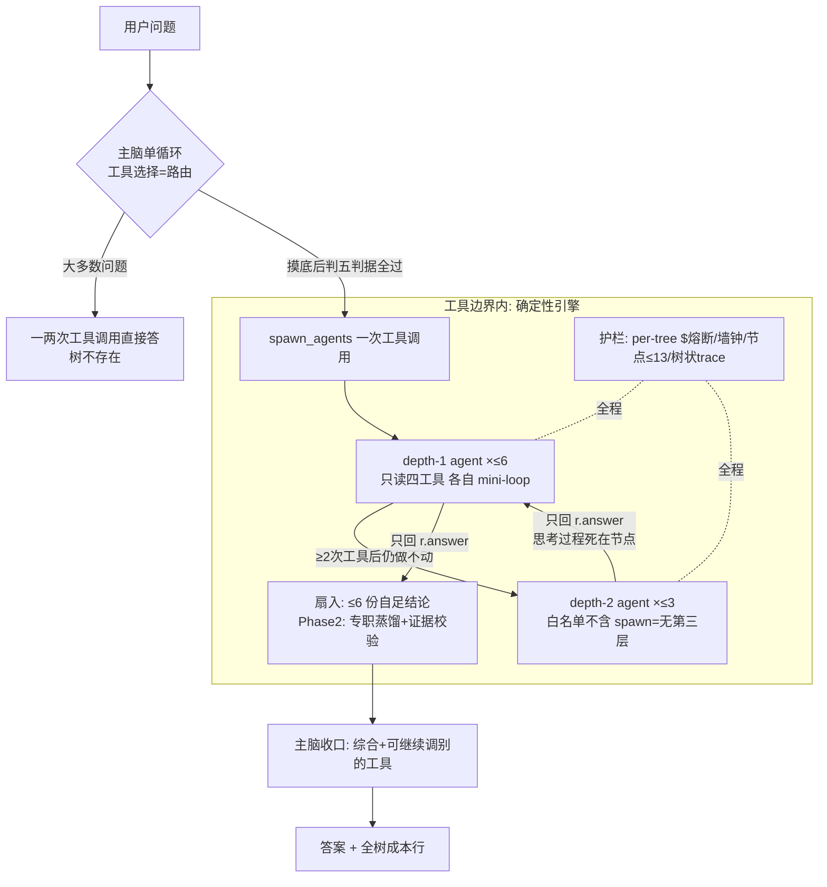

# VS 长程引擎 · 架构设计稿 v2

> **定位**:本文是架构定稿(回答 what & why),吸收了任务书发布后四轮架构答辩的澄清,与任务书冲突处**以本稿为准**。施工按 [longhorizon-multiagent-plan.md](longhorizon-multiagent-plan.md)(分阶段任务书:P0 地基七件 / Phase 1 gate 实验 / Phase 2 赎买清单,含全部验收标准与红队修正)。参考底稿见 [longhorizon-multiagent-references.md](longhorizon-multiagent-references.md)。
> 所有 file:line 为 feat/evals-hardening 分支勘察实况(2026-07-28)。

---

## 0. 一句话架构

**VS 不换架构。** 单脑单循环仍是底盘和唯一收口者;长程能力 = `spawn_agents` 这个工具位内部长出的一棵**受控递归树**。对主脑:一次工具调用(进=任务列表,出=结论列表+成本行);工具边界之内:**确定性执行引擎 + LLM 填空**。

这不是对 ROMA 的削弱——ROMA 本身就是"固定 workflow 引擎 + 四个 LLM 决策点"(其 `Solve()` 递归骨架是硬编码),VS 版只是把引擎的表达力刻意收窄、把每层能力的启用挂在实验证据上。

---

## 1. 第一性原则:控制流分配

"工具还是 workflow"是个假问题,真问题是**每个决策归 LLM 还是归代码**:

| 决策 | 归谁 | 落点 |
|---|---|---|
| 要不要上树 | **主脑(LLM)** | 工具选择 + 五判据 gate(§2.1) |
| 拆成什么子任务 | **LLM** | tasks 结构化列表(§2.5) |
| 树怎么执行(并行/深度/上限/熔断/回收) | **代码** | `run_fanout` 引擎(subagents.py:105-131 升级) |
| 结论怎么回(形态/顺序/成本披露) | **代码定契约** | 每任务一段自足结论 + 全树成本行 |

**原则出处**:这是 VS 一路验证过来的同一条线——router 之死(把该归代码的判断交给了独立 LLM 分类器)、chart_spec(模型吐 IR、壳子确定性渲染)、DVD 复现(工具路由在 Executor 内、不在 Planner)。**值得让模型判断的(拆不拆、拆什么)归模型;能写死的(怎么跑、花多少、何时停)全部写死。**

推论:`tasks` 列表 `[{instruction/goal, task_type, dependencies?}, ...]` 本质是**模型吐出的声明式编排 IR**——chart_spec 模式的第三次应用(图表 IR→ECharts;任务 IR→树引擎)。表达力刻意受限(fan-out/下钻/依赖三种结构,非图灵完备),换取:护栏可静态写死(节点 ≤13 是代码保证不是 prompt 祈祷)、行为可测可复现(三臂实验的前提)、单人维护得动。

---

## 2. 分层设计

### 全流程图

### 2.1 触发层:没有 router,工具选择本身就是路由

**机制**:ReAct 循环里主脑每一步都在做路由(这步调 sql 还是 analyze 还是收口)。`spawn_agents` 只是 11 工具之一,五判据写在它的 planner_desc(node_specs.py:192-199)里,**只在主脑动 spawn 念头时起作用,零额外 LLM 调用**。ROMA 的根级 Atomizer(每节点一次专门调用)被吸收进主脑本来就要做的那次 generate。

与被删 router 的四点区别:循环**内**而非循环前 / 零额外调用 / **可先用便宜工具摸底再决定**(查 SQL 发现命中 40 条→"这得拆") / 分错可在同一对话退回自己做。

**五判据**(P0-4,纯 prompt +8 行):①原子性(sql/semantic 两三步能答的不拆) ②独立性(子任务互不需要对方中间结果) ③多步性(只查一条 SQL 的不配当子任务) ④可综合(收口只需结论+证据引用) ⑤成本(每子 agent ≈ 一次完整分析的钱,K 个值不值)。

**诚实代价**:路由质量押在 flash 的在环判断力上。可测:P0-4 验收=5 道单 SQL 简单题 spawn 触发率 ≤1/5;Phase 1 副指标持续盯误 spawn/下钻触发数。flash 判不好本身是有价值结论("orchestrator 决定水位"适用于 gate)。

### 2.2 分解层:按需下钻,不预拆全树

ROMA 是 Planner 预拆全树递归到 max_depth=5;VS 版是 **ADaPT 式按需下钻**(贴懒惰哲学):

- depth-1 子 agent 先自己干,**成功执行 ≥2 次工具调用后**才允许 spawn 第二层(代码强制,execute 闭包里数;红队修正 D1:文本理由 `why_stuck` 只记 trace 不做放行依据——非空字符串检查是装饰,模型一句模板就绕过);
- **depth 封顶 2**:depth-2 的白名单不含 spawn_agents(subagents.py:29 改 `_allowed(depth)` 函数),结构上拿不到第三层;
- 乘法护栏:二层扇出 `SUBAGENT_L2_FANOUT=3`,**全树节点数锁内计数硬顶 13**(防 6×6=36;Kalshi 案例实证 depth=2 就撞限流);
- depth 经 contextvar 传播(每线程快照天然按枝隔离),树级共享状态(节点数/成本)按引用共享——与现有 usage dict 同模式(usage.py:20)。

### 2.3 执行层:只读,聚焦,不互写

子 agent 白名单四只读工具(analyze_video/semantic_search/sql_query/web_search,subagents.py:29);video_ids 聚焦从 prompt 约束(subagents.py:88-89)升级为检索层硬过滤(P0-5:semantic_index.py:40-42 SEARCH_SQL 加 `WHERE video_id = ANY(%s)`,主库现状**没有**这个能力,别按已有设计)。兄弟间零互读;上游结果传递(Phase 2 依赖)只走单向 context_input 注入,不共享可变状态。

### 2.4 聚合层:逐层自蒸馏是递归的涌现性质

**关键事实(答辩定稿)**:深树不会撑炸主脑,因为**每一级只上传最终结论**——

- 子 agent 交回的只有 `r.answer`(subagents.py:98),整个 ReAct 过程(工具轨迹/中间思考)在返回时丢弃,只进 trace 留档,**不进任何上级 prompt**;
- depth-2 孩子的输出作为 depth-1 agent 的工具返回值进入**它自己的**有界上下文,被它消化成一段自足结论再上传——**主脑永远看不到 depth-2 原始输出**;
- 每级上下文规模是有界常数:主脑扇入 ≤6 份结论,depth-1 扇入 ≤3 份。子 agent system prompt(subagents.py:32-38)本就强制输出"自足的、可直接被引用的一段文字"。

**Phase 2 专职 Aggregator 补的是三件事**(不是从零发明聚合):①**证据不许丢**——现在信任每个孩子自我蒸馏,但漏 video_id/掉时间戳无任何检查;专职蒸馏带**确定性双向包含校验**(原文全部 video_id/时间戳 ⊆ 蒸馏文,反向也查),不满足 **fail-open 回原文**(红队 D2:等长数组检查不算校验);②扇入点压缩(6 份长结论进主脑目前是全文拼接);③历史答辩——subagents.py 设计注释当初**明文删掉过 LLM 汇总**("收集各 output 原样返回给主脑自己综合"),立案时必须先回答"当初为什么删、现在什么变了"(红队 A1;预期答案:一层扇入主脑还行,深度 2 后信息量质变——但要用 Phase 1 trace 数据说话)。

### 2.5 依赖层(Phase 2):推迟不是砍掉

ROMA 论文里依赖图**允许为空**(全独立=全并行)——现有 spawn_agents 已实现这个默认情形。推迟 DAG 调度的三个理由:①单变量纪律(C 臂多带 DAG 则归因断裂);②依赖调度对一层 fan-out 同样有用,是正交升级,Phase 2 单独 A/B;③**表面依赖大多坍缩进聚合**——"先找出所有 X 再对比"的"对比"不是依赖下游的兄弟,就是聚合步本身;首发赛道(库级聚合)天然兄弟独立。Phase 2 形态:tasks 加 `dependencies`(整数索引,自指/越界静默丢弃),Kahn 波次调度 ~35 行手写不引 networkx,上游失败→下游整枝作废(NEEDS_REPLAN 语义只许整枝报废,不许改兄弟);`_run_one` 返回结构化 `{"ok": bool, ...}`,调度器看 ok 位不做字符串嗅探(红队 D4)。

### 2.6 护栏层:钱和时间写死在代码里

- **per-tree 美元熔断**(P0-3,ROMA 没有的必须件):挂 `_make_executor._do`(loop_driver.py:539-560,照抄 :546-556 配额闸软失败模板)+ run_loop 每步 generate 前(红队 B1:防 Trap 循环只思考不调工具在闸外烧钱)。检查是"预估后比"(spent+保守单次估价>cap 即拦,锁内完成);熔断=软失败信封教子 agent 就已有证据收口、没查到的明确写【未核查】,不 kill 线程;触发时披露 `wasted_usd`(作废枝已烧成本,浪费必须有账)。前置依赖:usage.py 思考 token 修复(P0-1,:54-61 累加/:77-85 计价,主库未修)——不修则 C 臂思考更重、成本对比系统性偏心。
- **墙钟闸** `MAX_TREE_WALL_S`(生产 900s):只有美元闸时请求可以不超 $0.80 挂 20 分钟。
- **树状 trace**(P0-2):TraceStep 加 span_id/parent_id/depth/t_start/t_end(trace.py:22-31 现状扁平且子 agent 裸共享父对象);span_id 用模块计数器不用 len(红队 A5 竞态)。钱花在树的哪个枝上必须可见——这是"成本每轮可见"红线在树上的形态。
- **成本行回主脑**:spawn_agents 返回值末尾追加"(系统) 全树累计 $X.XXX"(subagents.py:130 旁)。
- 配额:子 agent 复用父 execute 闭包(subagents.py:96)→ MAX_VIDEOS_PER_REQUEST 天然全树共享,不绕过任何现有闸。

---

## 3. 与 ROMA 原版的完整差异对照

| 环节 | ROMA 原版 | VS 版 | 理由 |
|---|---|---|---|
| Atomizer | 每节点一次专门 LLM 调用 | 根级:吸收进主脑工具选择(零调用);深层:≥2 次工具后才许拆(代码协议) | 大多数问题原子,判断税不值;红线"不复活 router" |
| Planner | 预拆全树,max_depth=5 | 按需下钻,depth≤2,全树≤13 | 懒惰哲学;Kalshi 实证;错误乘法可控 |
| Executor | 任意工具,ReAct/CodeAct | 只读四工具白名单 | Cognition 教训:不互写共享状态 |
| Aggregator | 每节点专职 LLM 蒸馏(占 40% 成本) | Phase 1:递归自蒸馏(r.answer only);Phase 2:专职蒸馏+确定性证据校验+fail-open | 涌现性质已够测;证据校验是 ROMA 没有的 |
| 依赖图 | dependencies_graph + 拓扑调度 | Phase 2(Kahn 手写);表面依赖坍缩进聚合 | 论文里本就可选;单变量纪律 |
| Verifier | 论文有 Signature,挂载点未确认 | 不做运行时 Verifier,验证在 eval 侧 judge | ROMA 自己都没落地;VS 的 judge 体系更成熟 |
| 成本护栏 | 超时/重试/熔断器,**无美元预算** | per-tree $ 熔断+墙钟+wasted_usd+思考 token 入账 | ROMA"成本不可预算"是其最大工程缺陷 |
| 部署形态 | 独立框架(DSPy/Postgres/MLflow 全家桶) | 抄四样机制融入现有代码(几百行),零新依赖 | 仓库停更 Beta/License 缺失;简化优先 |
| 启用方式 | 默认全开 | 五开关全默认关,每层能力实验赎买 | gate 裁决前生产行为零变化 |

---

## 4. 形态边界:同步工具,与"工具变任务"的升级线

现在:**请求内同步**(主脑阻塞等树,实验墙钟 15min)——Phase 1 的树(≤13 节点)够用。

远期触发条件(**先有任务证据再建**):Phase 2 后若出现 >15min 的真实深树任务,同步形态撞请求超时/体验墙 → 升级为"工具变任务":spawn 返回 task_id,树在后台跑,完成通知。这与 ingest 侧讨论过的 Job 队列是同一套基建(队列+worker+断点续跑+进度),届时统一立案,不提前建。

---

## 5. 红线合规对照

| 红线 | 本设计的落法 |
|---|---|
| 不复活 router/动态题型分支 | 无前置分类器;五判据是工具说明书;task_type→模型映射(Phase 2 G)是静态成本分层表,已明文豁免 |
| 子 agent 只读、不互写共享状态 | 白名单四只读工具;依赖传递单向注入;NEEDS_REPLAN 只许整枝报废 |
| 成本每轮可见、全口径 | per-tree 熔断+树状 trace+成本行回主脑+wasted_usd+思考 token 入账(P0-1 最先) |
| 懒惰按需 | 树只在 gate 判"值得"才长;下钻只在"做不动"才发生;不预拆全树 |
| 简化优先 | 零新依赖;contextvar+闭包两条现成通道;开关仅五个全默认关 |

---

## 6. 建造与验证顺序(指向任务书)

**Phase 0 地基七件**(4.5-5 天,P0-1 账本修复最先)→ **Phase 1 三臂 gate 实验**(裸 depth-2 单变量;18 题 dev/holdout 切分;~$42 硬顶 $50;判停条件已冻结:T2 上 C−B≥+0.10 且成本双门[中位≤2×B 且 P90≤3×B]且熔断触发率≤30% 才建;cap-受限保护条款;归档措辞必须带"flash orchestrator 条件下")→ **Phase 2 逐件赎买**(DAG/Aggregator/模型分层各自单独 A/B 立案)。

**"不建"是合法结局**:实验不过,VS 停留在单循环+一层 fan-out,本设计稿归档——判停条件跑前写死,这句话是本稿的验收标准之一。

---

## 7. 开放问题(诚实清单)

1. flash 在 gate 上的判断力水位——P0-4 验收先量,不合格则 gate 判据要加严或换 pro 判(那是成本分层不是 router)。
2. Phase 2 Aggregator 立案必须先答"subagents.py 当初为什么明文删掉 LLM 汇总、现在什么变了"(用 Phase 1 trace 的扇入体积数据回答)。
3. 转写时间戳偏移(semantic_search 时间段→show_video 跳错)今天就在伤用户,先量后修还是播放器加 pad,待拍板(Stage 5 遗留)。
4. 1h+ 长视频语料($9-11)与复合交付物任务:Phase 2 之后另批。
