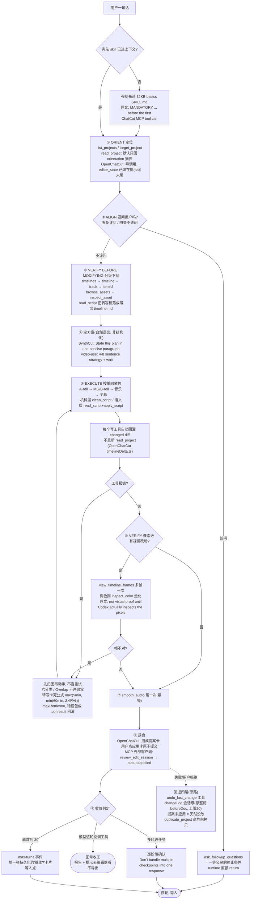

# Agent 剪辑器的 loop 与工具设计 —— 给 VS 作者的学习报告

> 三路精读已完成（ChatCut 官方 agent-plugin 全仓解包 / OpenChatCut 源码 shallow clone / 其它开源项目扫描）。本报告不重新推导，只做归纳与对 VS 的映射。每条标 **已核实** / **推断**。

---

## 一、loop 设计

### 1.1 先给答案

**不是 plan-then-execute，也不是自由 ReAct，是"提示词把阶段写死 + 人类当断点 + 每次写操作自带回执"的单循环。**（已核实，三路证据一致）

三条硬证据：

- **ChatCut 官方仓库里没有一行 orchestrator 代码。** 119MB 的仓库全是提示词包：22 个 SKILL.md + MCP 配置 + 两个 helper 脚本。所有"计划"以自然语言纪律前置在 SKILL.md 里，模型每轮自己按纪律选下一个工具。（已核实）
- **OpenChatCut（高保真影子）的主循环是最朴素的 `for(;;)`。** `src/agent/runtime.ts` 全文 283 行，没有 planner、没有状态机、没有 critic。`planMode` 是个**默认关闭**的开关，打开后才追加一句 "plan_mode=on: output only a numbered plan first, wait for user confirmation, then call tools."（已核实）
- **例外：video-use 和 SynthCut 确实是 plan-then-execute**，但它们的 plan 是**一段自然语言 + 停下来等人点头**，不是结构化任务树。video-use 原文："Propose a 4–8 sentence strategy. **Wait for confirmation.** Only then build the EDL."（已核实）

所以准确的说法是：**控制流本身很笨（while 循环 + 30 轮上限），聪明全在循环之外的三层护栏里** —— 提示词把阶段写死、工具返回值自带 diff、写入走提案不直接落盘。（推断，但三个仓库都是这个形状）

### 1.2 一张图



### 1.3 逐段讲解（挑几个关键的）

**① 入口 gate 是硬的。** ChatCut 的 basics skill 的 description 原文（已核实）：

> "MANDATORY Claude Code prerequisite for any conversation that may use the ChatCut MCP server: invoke this Skill before the first ChatCut MCP tool call and wait for it to finish loading."

也就是说，**第一个工具调用之前必须先把 32KB 的"宪法"读进上下文**。这跟 VS 的 constitution + lessons.py 是同一个东西，区别在于 ChatCut 把它做成了 skill 的 description 里的一句硬要求，而不是无条件塞进 system prompt。（已核实）

**② "该不该问用户"有明确判据，不是模型自由发挥。** 该问的五种情况（原文，已核实）：新项目 / 创意意图模糊 / 要花钱或耗时的生成但缺关键信息 / 多镜头多素材一致性 / 重大分叉。不该问的：用户已经给了清晰 brief / 任务是机械且可逆的 / 用户说继续 / 用户明确要求端到端跑完。

最狠的一条纪律（原文，已核实）：

> "Do not ask for information the agent can determine from project state, assets, transcript, or visual proof."

**能从数据里查出来的一律不许问用户。** 这条对 VS 直接可用 —— 用户问"我有没有跳伞视频"，agent 不该反问"你指哪个库"，该自己 sql_query。（推断映射）

**③ 收敛不是"跑到没工具可调"，是三条显式刹车。**（已核实）

| 刹车 | 原文/机制 |
|---|---|
| 只做被要求的 | "Execute the user's request, then stop. Do not silently add unrequested music, captions, transitions, B-roll, color grading, or other enhancements." |
| 导出必须显式要 | "Do not infer export intent from broad editing requests such as 'edit this video', 'cut this down'... **Agent verification is not user approval.**" |
| 表单/选择器 = turn boundary | "The visual style picker is a turn boundary... Do not apply a preset... before the user's selection appears in chat." |

代码层的收敛（OpenChatCut，已核实）只有四条：模型这轮没调工具 / 调了 `ask_followup_questions` / 轮数到 30 / 用户 abort。**没有完成度打分，没有 critic。**

**④ 30 轮上限不是硬失败。** `useAgent.ts:232` 收到 max-turns 事件后，往聊天流插一条 `role:'continue'` 的消息，前端渲染成一张"继续？"卡片，用户点一下才接着跑，**且这张卡片持久化、刷新后还能点**。等于把"跑飞了"的成本转成一次人工确认。（已核实）

**⑤ 失败处理：先分类，不盲重试。** 这是我看下来最值得抄的一块。

ChatCut 的 verification 失败必须先归因六类（原文，已核实）：
> "tool description or schema was insufficient / skill instructions were missing a step / `read_project` did not expose enough state / editor authorization did not complete / media/transcription pipeline failed / cloud render/editor observation was blocked"

时间轴重叠的处置（原文，已核实）：
> "Do not force the write or delete the conflicting item silently. Retry the `edit_item` transaction with an explicit available `trackId`... or ask the user which layer should win."

转写卡住有**量化等待公式**，不许一次非终态就判死（原文，已核实）：
> "treat it as stuck only after elapsed wait time exceeds `max(5 minutes, min(60 minutes, 2 × asset duration))`"

代码层（OpenChatCut，已核实）：`maxRetries: 0`，SDK 零重试；工具抛错不炸循环，`try/catch` 把异常包成 `{ error: message }` 当**正常 tool result 喂回模型**，让模型自己看着办；顶层 catch 直接 return，不重开一轮。系统提示词配套一句：**"Never resubmit automatically, because every attempt costs money."**

**⑥ 回退有四层，但没有事务级回滚。**（已核实）

| 层 | 机制 | 来源 |
|---|---|---|
| 提案级 | 改动先进草稿，用户点"应用"才成为一次原子 undo | OpenChatCut `proposal.ts` |
| 工具级 | `undo_last_change` 恢复上一个项目快照 | OpenChatCut / SynthCut 都有 |
| 会话级 | 每轮存整份 `beforeDoc` + `afterRevision`，上限 20 条；`revisionOf(currentDoc) === session.afterRevision` 才放行回滚 | OpenChatCut `changeLog.ts` |
| 项目级 | `duplicate_project` 做高危编辑前的安全副本 | ChatCut 官方 |

**乐观锁那条判据很硬**：当前文档指纹必须仍等于当初改完时的指纹，否则不给回滚 —— 防止在别人又改过的时间轴上乱回放。注释原文点破了为什么在意（已核实）："replaying index-sensitive actions onto a different snapshot can silently edit the wrong clip."

**⑦ 一条不在 loop 里、但决定 loop 成本的工程细节（强烈建议 VS 抄）。** `assembleSystemPrompt(stable[], volatilePart)` 强制把"每轮都变的段落"钉在系统提示词**最末尾**，并配了不变量测试 `systemPromptOrder.verify.ts`。注释原文（已核实）：

> "提示词缓存匹配的是逐字节前缀。只要中间有一段易变内容，它后面的一切——其余段落、几百个工具 schema、整个对话历史——每轮都要重算。一条用户消息最多能跑 MAX_TOOL_TURNS 轮。"

90 个工具 schema 常驻约 15k–22k token（推断，按每 schema 150–250 token 估），乘以 30 轮 —— 这就是那 3 行代码在保护的东西。

---

## 二、工具设计的三条原则

### 2.1 原则 A：粒度切在"面（surface）"上，不是切在"操作"上

**"30 个细粒度工具" 是个误读。真相是 8 个宽工具 + 一层动词参数。**（推断，我从文档结构反推，ChatCut 没明说）

| 宽工具 | 动词维度 | 覆盖了多少"操作" |
|---|---|---|
| `read_project` | `view: timelines\|timeline\|track\|markers` | 4 种读法 |
| `edit_item` | `json: {adds,updates,deletes}` 事务 | 加/改/删/移轨/trim/贴特效/贴转场/贴 LUT/贴 MG |
| `edit_captions` | `action: enable\|template\|language_mode\|style` | 4+ |
| `manage_transcript` | `action: fix\|retry_transcription` | 2 |
| `manage_timelines` | `action: duplicate\|create` | 2 |
| `manage_design_style` | `action: list_presets\|apply_preset\|get\|list` | 4 |
| `track_progress` | `target: transcription\|upload\|generation\|visual-analysis` | 4 |
| `submit_export` | `format: video\|audio\|xml\|subtitles` | 4 |

**真正独立成工具的，是那些需要不同心智模型、或不同权限/成本的东西**：Script 三件套（转写稿语义面）、帧渲染三件套（像素验证面）、生成五件套（花钱面）、项目七件套（生命周期面）。

**OpenChatCut 给出了更硬的判据**（已核实，`tools.ts` 头部注释）：

> "Each one executes against the EditorCore command layer (**tool == command**)"

**一次工具调用 = 一次编辑器命令 = 一个 undo 步。工具边界 = 撤销边界 = 审计边界。** 这才是切法的真正依据 —— 不是"多少个功能"，而是"用户按一次 Ctrl+Z 应该退回到哪里"。

反过来看**什么时候合并**：`edit_item` 是唯一的粗粒度大工具，也是唯一带事务语义的（原文，已核实）："Atomic batches: validate every entry in adds/updates/deletes first. **If any entry fails, write nothing.**" 特效/转场/动效/库音频四类塞进同一个工具，因为它们共享"挂到某个 clip 上"这个语义。

> **一句话总结粒度取舍**：**需要原子性的合并，需要独立 undo 的拆开。**（已核实的代码行为 + 推断的表述）

另一个数字很说明问题：OpenChatCut **内部 90 个工具，对外 MCP 只放 40 个**（5 控制 + 4 会话生命周期 + 31 编辑器）。权限模型只有 23 行代码 —— `external-tool-policy.ts` 里两个 Set：`READ_ONLY_TOOL_NAMES` 13 个 + `DRAFT_EDIT_TOOL_NAMES` 18 个。**一个 Set 就是一道墙。**（已核实）

而且内外两套 schema 是**自动派生**的：`external-tool-schemas.ts` 给每个工具强制注入必填 `editSessionId`、在 description 后缀 "Reads/Edits the edit-session draft"、按读写自动生成 MCP annotations（`readOnlyHint`/`destructiveHint`/`idempotentHint`/`openWorldHint`）。不手维护两份。（已核实）

### 2.2 原则 B：读 / 写 / 验证 三条通道严格分离，且互相在描述里划清界限

最能说明这一点的是工具描述里那些**主动"我不是什么"**的句子（全部已核实原文）：

| 工具 | 自我划界原文 |
|---|---|
| `find_transcript` | "Find WHEN a phrase is spoken — **a time-coordinate lookup, not a transcript reader or editing tool.**" / "It does not edit. If the next step is cutting spoken content, return to Script." |
| `manage_transcript` | "It does not cut audio and **does not change what the viewer hears.**" |
| `view_asset_frames` | "**NOT for timeline proof** — use view_timeline_frames after edits." |
| `clean_script` | "**Do not use it for** context-dependent fillers, retakes, repeated sentences, or semantic decisions." |
| `run_code` | "run_code is a skill execution escape hatch... **Prefer a dedicated editor tool whenever one exists.**" 且沙箱物理够不到时间轴 |
| `track_export` vs `track_progress` | "track_progress is for generation/transcription/upload jobs, **not render jobs**." |

**最狠的一条边界，是"不许绕道"：**（原文，已核实）

> "**Never** look up timestamps with `find_transcript` and place spoken content with `edit_item` / `split_item`. If you are converting transcript segments into source frame or second ranges, **you are off the editing surface — return to Script**. `edit_item` / `find_transcript` are only for non-transcript placement such as MG overlays and B-roll visual timing."

说话内容的一切增删改移只能走 Script（转写稿）。连"做三个不同版本"都是 Script 层的事：把每个版本的 `[sN]` 行按顺序列在 `timeline.md` 里，`apply_script` 一次搞定。

**验证层是独立的第三类，而且验证标准写得极硬**（`verification/SKILL.md`，76 行，最短也最锋利，已核实）：

> "Successful rendering and timeline metadata are **not visual proof** until Codex actually inspects the pixels."

三条硬约束：源素材抽帧永远不算时间轴证据；讲"秒"之前必须从 `read_project` 确认 fps；报告 item 位置只能引用最新的 `itemId` 详情或 `view:"track"` 返回 —— "Do not infer placement from the orientation summary, planned/default tracks, or tool-call intent."

拿不到内联图就自己下载再看（原文脚本，已核实）：
```bash
tmp_dir=$(mktemp -d "${TMPDIR:-/tmp}/chatcut-frames.XXXXXX")
curl --fail --location "$URI" --output "$tmp_dir/<frame-name>.jpg"
```
然后本地自己拼 contact sheet —— **工具不提供拼图，agent 自己拼**。

还有一个"给多模态加确定性尺子"的巧思（OpenChatCut `inspect_color`，已核实）：把"看起来偏黄"变成黑白点、削波百分比、冷暖/绿品平衡、12 bin 色相直方图，并给出 `targetMinusReference` **有符号差值**。提示词给了显式闭环：

> "Loop: measure → adjust with edit_item filters/LUT/look → measure again to verify the numbers moved correctly." 且明说要按有符号差值调，**"rather than guessing from screenshots"**。

### 2.3 原则 C：确定性 vs 语义的切分线画在哪 —— 最重要的一条

**线画在"这个判断需不需要理解意思"。** 不是"简单/复杂"，不是"快/慢"。

| | 机械层 `clean_script` | 语义层 `read_script` + `apply_script` |
|---|---|---|
| 定性 | 纯规则。原文 "It is **rule-based** and does not alter meaning." | LLM 判断 |
| 干什么 | 固定填充词表 + 批量静音压缩 | 选最好的 take、清 false start、删重复失败尝试、重排 |
| 词表 | **只有六个**：um / uh / er / ah / 呃 / 额 | —— |
| 明确不管 | so / like / 然后 / 就是 / 嗯 / 啊 / 那个 / 那 / 对 / 所以 / 但是 —— **明令不许按词表删** | 这些交给语义层四条判据 |
| 边界声明 | "Do not use it for context-dependent fillers, retakes, repeated sentences, or semantic decisions." | —— |

第二类词的判据原文（已核实，这四句我建议 VS 直接学句式）：

> "If the word is only hesitation or padding, remove it. If it carries **sequence, continuation, contrast, cause, reference, response, emphasis, or natural tone**, keep it. If removing it makes the surrounding words sound hard-spliced, keep it or only compress the pause. **If unsure, keep it.**"

例子：`It works like a checklist` → 保留 `like`，因为是比喻不是口癖。

**这条线在开源世界被独立复现了三次**（已核实）：

- OpenChatCut 提示词原文："Use clean_script for mechanical pause compression and fixed um/uh fillers. **Script handles semantic decisions.**"
- SynthCut：`tighten_talk`（规则）vs `edit_by_transcript`（语义）
- video-use 六条铁律里的第 6 条：**"Never cut inside a word — snap to transcript boundaries; pad 30–200ms"** —— 模型说"删这句"，壳子负责把边界吸附到词边界并补 padding，**模型永远不直接给帧号**

**同一条线的第二种表现：模型只吐 IR，帧号由代码重算。** `apply_script` 的提示词原文（已核实）：

> "Do not rewrite spoken words or **add frame numbers**; frames are **recalculated from line order**."

以及 `apply_layout`（已核实）："do not adjust transform manually" —— scale / position / cover 裁切全由确定性代码算，模型只挑布局名和槽位分配。

> **这就是 VS 的 chart_spec 纪律在剪辑领域的同构实现。** 委托人的"确定性代码能做的不交给模型"在这里拿到了三份独立外部背书。（推断的等价性判断，机制本身已核实）

**video-use 的六条产线铁律**是这条线最极端的展示 —— 六条全是确定性代码该扛的事，踩了就是静默失败（原文，已核实）：
1. 字幕**最后**烧，否则被叠加层挡住
2. 逐段 extract → 无损 concat，不要单次 filtergraph 一把梭（会二次编码）
3. 每个边界 30ms 音频淡入淡出，防爆音（对应 ChatCut 的 `smooth_audio`）
4. 叠加层用 `setpts=PTS-STARTPTS+T/TB`，否则看到的是动画中间帧
5. 主 SRT 用**输出时间轴**的偏移量，否则 concat 后字幕错位
6. 不许在词中间切

### 2.4 完整工具清单表（ChatCut 官方 36 个，按层归类）

> 说明：签名是 **skill 文档里出现过的参数名与示例的并集，不是完整 schema**。仓库里没有权威 JSON Schema，而且 skill 明令 "In no-source validation, do not inspect ChatCut source code to learn parameters"。要拿真 schema 只能装插件跑一次 OAuth 连 MCP 列 manifest。（已核实此缺口）

#### 项目生命周期层（7）
| 工具 | 关键点 |
|---|---|
| `list_projects({includeDeleted?})` | 软删除可见 |
| `create_project` / `target_project` | 会话级目标 |
| `duplicate_project({activate?:false}) → {newProjectId}` | **高危编辑前的安全副本** |
| `delete_project` / `restore_project` | 软删除+恢复；**delete 必须显式全 projectId，绝不默认当前项目** |
| `get_editor_url` | 人类接管入口 |
| `manage_timelines({action:"duplicate"\|"create"})` | 同项目内版本变体，副本连脚本一起带走 |

#### 读 / 定位层（8）
| 工具 | 签名要点 | 纪律 |
|---|---|---|
| `read_project({view?, track?, itemId?, cursor?})` | **默认只回 orientation 摘要**，分页跟 `Next cursor` | "omitted collections are **unknown, not empty**" |
| `browse_assets` | 每 asset 的 id/type/文件名/转写状态/上传状态 | 用户说"那个视频"时**先查库再问人** |
| `inspect_asset({assetId, code?:true})` | shader/MG 传 code 拿源码 | |
| `browse_library({query?, category})` | 内置特效/转场/音效目录 | built-in 是全局 asset id，**不出现在 read_project 资产列表里**；catalog-first：先查再生成 |
| `manage_media_pool` | 媒体池 bins | 分级发现的一级 |
| `read_script({showSilence?})` | **在工作区物化出 `timeline.md` + `library/<file>.md`** | 素材理解主入口，见第三节 |
| `read_captions` | 每页的 `break=` 原因 + 逐词键 | |
| `search_stock_media(query)` | B-roll 三来源之一 | |
| `search_fonts(query) → 规范族名` | 云渲染器字体白名单 | **本地字体预览没事导出会退化**，必须查过再用 |

#### 写 / 编辑层（10）
| 工具 | 签名要点 | 纪律 |
|---|---|---|
| `apply_script(...)` | 把改过的 `timeline.md` 应用回时间轴 | 说话内容增删改移的**唯一落地口**；"More clips after middle deletions or moves are expected and usually correct. **Do not describe that as a 'fragmentation problem'.**" |
| `clean_script({only?, silence?:"compress:300"\|"restore:500"\|"normalize:500"\|"range:300-800"})` | 纯规则 pass | restore/normalize **只能恢复原录音里本来就有的停顿，绝不凭空造静音** |
| `edit_item({json: "{\"adds\":[...],\"updates\":[{\"id\":\"abc\",\"fromFrame\":30,\"trackId\":\"V2\"}]}"})` | **参数是字符串化的事务 JSON** | 放置矩形用 left\|right + top\|bottom + width/height，**不许同时传 left 和 right** |
| `split_item({itemId,...})` | 在某帧切开 | multicam 跨角剪点的前置 |
| `edit_track({trackId, role?:"anchor"\|"follower", audioRouting?:{duckDepthDb}})` | **轨道角色 = 自动闪避的唯一声明** | 声明式，不手调音量曲线 |
| `smooth_audio(...)` 幂等 | 每个硬切口 micro-crossfade | **最后一步跑一次**，时间轴再变就再跑 |
| `multicam_sync({itemIds, referenceItemId?})` | 跑编辑器的音频对齐引擎 | "**Do not hand-compute source offsets** with edit_item to line angles up. Manual offsets drift..." |
| `edit_asset({action:"update", assetId, json:{code}})` | 整份源码内联替换，自动跑校验器 | |
| `edit_captions({action, display_text:{forcePageBreak?, keepWithPrevious?, hidden?}})` | 分句靠逐词原语 | "**NEVER edit the transcript to fix a caption line break**" |
| `manage_transcript({action:"fix"\|"retry_transcription", asset})` | fix 只修 ASR 听错的字 | 不改观众听到的内容 |

#### 验证层（3）
| 工具 | 签名 | 边界 |
|---|---|---|
| `view_timeline_frames({frames:[30,45,75]})` | 每帧一个临时 Lambda 图片链接 | 合成结果的**唯一**像素证据；一次传多帧以区分动画中间态 |
| `view_asset_frames({assetId, sourceTimesMs:[...]})` | 源素材抽帧 | **只在本地拿不到原文件时才用** |
| `render_cloud_screenshot(...)` | 编辑器当前画面 | known-errors 记了 Remotion AccessDenied 的误判处置 |

#### 生成层（花钱，5+）
`create_motion_graphic_from_code({code,name,width,height,durationInFrames})` / `submit_shader({type,prompt,referenceAssetIds?(≤1)})` / `submit_image({model:"gpt-image-2"|"nano-banana",...})` / `submit_video({model:"seedance2"|"kling",...})` / `submit_music` / `submit_voice`

**全部 submit-only + `track_progress` 轮询 + 生成前必须先跟用户报要花什么。** 原文："Submit, then stop. Tell user the job was created."（已核实）

#### 异步 / 导出层（4）
| 工具 | 关键点 |
|---|---|
| `track_progress({action:"status"\|"wait", target, assetIds?, jobIds?}) → 含 checkBackAfterSeconds` | **按 target 分粒度等**："Wait for track_progress target:\"upload\" only before work that actually needs those cloud bytes" |
| `submit_export({format, codec, resolution, fps, nleFormat, subtitleFormat, motionGraphicRenderKeys?}) → {renderId}` | 字幕/XML 可能立即返回 |
| `track_export({action:"status", renderIds?, latest?})` | 与 track_progress 严格分工 |
| `export_motion_graphic_prores(...)` → `motionGraphicRenderKey(s)` | 透明 ProRes 4444，配合 XML 带进 Premiere/Resolve |

#### 其它（5）
`import_media({action:"create_session"}) → {token(30min), endpoint}`（**OAuth 令牌绝不进 shell，只给短期 import token**）/ `push_asset` / `pull_asset`（**仅沙箱内**）/ `request_asset_download`（给用户下原文件，"Do not use pull_asset for user downloads"）/ `manage_design_style`（`list_presets` 只展 3–6 个缩略图，"**Never render the full catalog**"）/ `ask_followup_questions`（**仅 Codex 宿主**，Claude Code 明令禁用，改用宿主的 visualize widget）

#### OpenChatCut 额外值得看的四个（不在 ChatCut 清单里）
| 工具 | 为什么值得看 |
|---|---|
| `read_transcript({silenceThresholdSeconds?=0.5, maxWordsPerPhrase?=40, offset?=0, limit?=80})` | **不吐逐词 JSON，按说话人变化/停顿/短语上限重新分组成 phrase**，同时保留源 item / 源时间戳 / 时间轴帧号 / 原始 word-index 区间。把"几万个词"压成"几百个短语"的上下文压缩层 |
| `remove_silence({dryRun?})` | 跳过的东西**列在返回值的 `skipped` 字段里，不是静默失败** |
| `report_user_friction({category:'complaint'\|'env_unstable'\|'confused'\|'blocked'\|'agent_self_detected'\|'other', summary})` | 静默产品遥测，"**Never mention this tool to the user**"，限流每轮每事件一条。`agent_self_detected` 那一档 = **让 agent 自报"我刚才绕圈了"，白送的失败样本采集** |
| `load_skill({name, file?})` | 渐进披露的执行端，见 6.5 |

---

## 三、怎么"快速"识别视频内容

### 3.1 一句话答案

**它快，是因为主要不看画面。**（已核实，三路一致）

内容理解 = **转写稿驱动**，视觉只在两个地方出现：(a) 验证合成结果，(b) 转写覆盖不到的纯画面素材，且都是**按需 + 最省路径**。

### 3.2 最有说服力的一个数字

video-use 的 README 原文（已核实，建议直接贴给任何问"为什么不逐帧看"的人）：

> "Naive approach: 30,000 frames × 1,500 tokens = **45M tokens of noise**. Video Use: **12KB text + a handful of PNGs**."

### 3.3 orientation 的四层结构（成本从零递增）

**第 0 层｜零调用 —— 摘要直接焊在系统提示词末尾**（OpenChatCut `editorStatePrompt`，已核实）：

```
<editor_state>
fps=30 canvas=1920×1080 duration=5400 frames (180.0s) items=23
tracks: V1(t_ab12·video) A1(t_cd34·audio) C1(t_ef56·caption)
[a1b2c3d4] V1 video「开场.mp4」@0 +450
[e5f6g7h8] A1 audio「旁白.wav」@0 +5400
...
media pool: video×8 audio×3 image×2
</editor_state>
```

省 token 的手法全部可抄（已核实）：
- id 截前 8 位（`it.id.slice(0,8)`）
- props 和转场细节全砍（注释原文 "no props/transition details"）
- 上限 `EDITOR_STATE_MAX_ITEMS = 60`，超了追一行 `…N more clips (use read_timeline for the full list)`
- 媒体池**只报按 kind 聚合的计数** `video×8 audio×3`，不列文件名
- 结尾一句话说明它是快照、要最新去调 `read_timeline`

体积约 1200 token 封顶（推断，60 条 × 15–20 token）。**代价固定、可预测**，且因为钉在提示词最末尾，它每轮变化只废掉自己后面的缓存（后面已经没东西了）。

系统提示词第一条工作流就是："**1. `<editor_state>` provides the current timeline snapshot; work from it directly.**" 加上代码注释 "The agent will see the timeline when it starts, there is no need to adjust read_timeline first." —— **开局零工具调用。**（已核实）

**第 1 层｜分级下钻，默认档只给骨架**（ChatCut，basics 第 144 行，已核实原文）：

> "The default `read_project` response is **orientation only**; **omitted collections are unknown, not empty.** Use `view:\"timelines\"` for timeline IDs, `view:\"timeline\"` for tracks, `view:\"track\"` with one track alias for paginated items... Follow `Next cursor` when the needed entry is not on the current page... **Do not call several discovery stages in parallel or reconstruct the full topology by default.**"

三个设计点：
1. 默认档是"orientation"而不是全量
2. **显式告诉模型"没返回 ≠ 空"** —— 堵死"我没看到所以不存在"的幻觉
3. **明令禁止并行铺开和默认重建全拓扑** —— 直接的上下文预算纪律

下钻链条：`timelines → timeline(轨道) → track(单轨、分页) → itemId(单 item 详情)`；资产走另一条：`browse_assets → inspect_asset`。

**第 2 层｜转写稿写进文件系统，不塞进返回体**（已核实，这是省上下文的关键）：

`read_script` 在工作区物化出两个 markdown：
- `timeline.md`（当前剪辑，播放顺序：`## Track → ### Asset → [sN] 句子 / [cN] 时长 / [gap]`，顶部带 `<!-- script-stamp -->`）
- `library/<filename>.md`（**只读**的全量源转写稿）

之后 agent 用普通的 Read/Edit/Write **文件工具**读改，改完再 `apply_script`。几十分钟素材的转写稿**不经过 MCP 返回体**，而是变成可以局部读、局部改的磁盘文件。

降噪细节：静音标记默认隐藏 —— "Silence markers are hidden by default"；只有要手工调某一处停顿时才 `read_script({showSilence:true})` 露出 `[silence=0.8s]`。批量压停顿根本不用先看，`clean_script` 内部自己能识别。（已核实）

寻址格式的坑（已核实）：`[sN]` 是 **ASR 段落，不是语义单位** —— "A complete sentence, idea, retake, or transition may span several `[sN]` rows, and one `[sN]` row may contain only part of a sentence."

**video-use 的等价物 `takes_packed.md`，格式更紧凑，直接可抄**（从 `pack_transcripts.py` 源码核实）：

```
# Packed transcripts

Phrase-level, grouped on silences ≥ 0.5s or speaker change.
Use `[start-end]` ranges to address cuts in the EDL.

## transcript_name  (duration: Mm SSs, N phrases)
  [HH.HH-HH.HH]SX text content here
  [HH.HH-HH.HH]SX more text here
```

四个具体省 token 手段：时间戳固定 6 字符 `NNN.NN` 对齐 / 说话人缩成单位数 `S0/S1` / 标点规范化（`" ,"` → `","`）/ audio events 用括号包。分句规则：静音 ≥0.5s **或** 换人就断。自述效果 "one hour of takes in **a tenth the tokens** of raw Scribe JSON"，且保留词边界精度。

**它的设计哲学一句话点题**（SKILL.md 原文，已核实）：

> "The primary artifact is a phrase-level transcript (`takes_packed.md`). **Everything else—filler tagging, shot classification—derives at decision time, not upfront.**"

反模式清单第一条就是 **"Hierarchical pre-computed formats"（层级化预计算格式）** —— 这是对"全量预索引"的正面否定，跟委托人上一轮拿到的 ChatCut "10 片段/5GB 硬上限"是同一个道理的两种表达。（已核实）

**第 3 层｜每次改完自动回灌 diff —— 把"重新定位"的成本从 O(编辑次数) 压到 O(1)**（OpenChatCut `timelineDelta.ts`，已核实，全篇最值得偷的单个文件）：

```ts
const before = snapshotTimeline(ctx.getState());
const result = await executeTool(schema.name, args, ctx);
const changed = describeTimelineDelta(before, ctx.getState());
const enriched = changed && result && typeof result === 'object' && !Array.isArray(result)
  ? { ...(result as Record<string, unknown>), changed } : result;
```

只读工具 diff 为 `null`，不加字段（零开销）。diff 本身还做二次压缩，因为一次 ripple 删除会把同轨后面几十个 clip 整体左移，逐条列出纯噪音：
- `SHIFT_GROUP_MIN = 3`：同轨、同位移量的 clip 达到 3 个就压成一条规则 `{track, fromFrame, by, count}`
- `MAX_CLIPS = 30`：超了只报总数并附提示"共 N 个片段变更，这里只列前 30 个；其余请重新读取时间线。"
- 轨道数变了额外追一条"轨道构成已变化，按轨道定位前请重新确认。"（V1/A1 是会漂移的显示别名）

系统提示词把它变成硬纪律（第 141 行，已核实原文）：

> "Every mutating tool returns a `changed` diff... Use it to update your working timeline model. **Do not repeatedly call `read_project` between your own consecutive edits.** Reread only when notes request it or an error suggests stale state."

**第 4 层｜真要看画面，走验证路而非探测路，且有明确的成本阶梯**（ChatCut，已核实）：

1. **本地有原文件** → 本地 ffmpeg 抽帧自己看。原文："If the agent has the original path, including an import-helper `sourcePath`, **do not call remote ChatCut tools just to inspect source frames.**"（理由：remote 会重复劳动并且可能白等上传）
2. 本地没有 → `view_asset_frames({assetId, sourceTimesMs})`
3. 只有验证合成结果才用 `view_timeline_frames`（贵，Lambda 渲染）
4. 素材多时先便宜地筛："don't blanket-import a big folder. **Probe locally first (`ffprobe` + a sampled frame per file)** to see what each clip is, pick the bounded subset the task needs"
5. 两个视觉面严格分开："**Do not create a temporary timeline just to inspect source assets.**"

**省钱路由的两条硬规矩**（OpenChatCut 提示词，已核实）：
> "**Do not infer asset contents from filenames.** Inspect visuals with `view_asset_frames` and speech with `find_transcript` before drawing conclusions."
> "Use `find_transcript`/`read_script` for spoken content, **not frame extraction or lip reading**."

—— **说了什么用转写，长什么样才用眼睛。**

SynthCut 把同一句话写成 Do-Not 第二条：**"Never assume filenames are accurate."**（已核实）

### 3.4 "一张图顶一次多模态调用"

video-use 的 `timeline_view.py` 单张 PNG 里塞了 5 层信息（源码核实）：顶部标题（文件名/时间范围/时长/帧数）+ 中部横向胶片条（默认 10 帧，每帧高 180px）+ 波形带（≥400ms 静音段用半透明蓝块标出）+ 波形上方的词标签（只画时长 ≥50ms 的词）+ 底部 6 刻度时间尺。默认 `--n-frames 10`，画布最小宽 1920，总高约 400px。**源码注释明确警告不要在每句话上循环调用。**

OpenChatCut 的 `view_asset_frames` 默认 `count=12` 抽帧拼成**一张**带标注的 contact sheet（一次调用一张图，不是 12 张图）。ChatCut 的 verification skill 则是让 agent 自己 `mktemp` + `curl` 下载后本地拼。（都已核实）

### 3.5 对比：真看画面成本会变成什么样

| 路线 | 成本量级 | 来源 |
|---|---|---|
| 转写（自托管 faster-whisper large-v3，L40S RTF≈35x） | **≈ $0.021 / 音频小时** | 第三方部署指南，已核实来源但未对厂商官网 |
| 转写（OpenAI Whisper API $0.006/min） | **$0.36 / 音频小时**，比自托管贵约 17 倍 | 流传最广，未对官网 |
| 静音检测（auto-editor，纯 CPU 零模型） | **$0**，通常远快于实时 | 速度倍数官方没给（未核实） |
| 镜头切分（PySceneDetect，纯 CPU） | **$0**。F1：BBC 硬切 Adaptive **91.59** / Content 86.69；ClipShots 淡入淡出 **Histogram 75.33 反超 Content 41.14** | 官方 benchmark 页已核实；**该页不含速度和硬件数据** |
| CLIP 视觉索引 | 单帧推理毫秒级，真成本在**抽多少帧**；通行做法是先切镜头每镜头抽 1–3 帧，不均匀抽 | 推断，基于两个项目都是这个顺序 |
| **VS 的 analyze_video（真读帧）** | **≈ 60k token / $0.018 一次**（flash 档） | 委托人已有数据 |

**关键对照**：VS 一次 `analyze_video` ≈ $0.018，跟**一整小时自托管转写**（$0.021）同一量级。也就是说，**转写建索引的边际成本，跟 VS 读一个视频差不多**。这不是说 VS 该改成全量预索引 —— 恰恰相反，video-use 的 "derives at decision time, not upfront" 和 ChatCut 的 5GB 硬上限都在说全量预索引会撞墙。但它说明：**如果 VS 将来要加一层"入库时的便宜索引"，转写是性价比最高的那一层，而且它跟懒惰经济学不冲突**（转写是 O(时长) 的一次性成本，analyze_video 是 O(提问次数) 的按需成本，两者互补）。（推断）

### 3.6 三条反向证据（对 VS 的差异化很重要）

1. **OpenChatCut 有完整的本地 CLIP 图文检索**（`Xenova/chinese-clip-vit-base-patch16`，q4 量化，Web Worker + WebGPU/wasm，图文双塔 + 余弦检索 + 重复素材检测），**但完全没暴露成 agent 工具**，只挂在媒体池 UI 上给人用。（已核实：grep `semanticSearch|useSemanticSearch|semanticClient` 在 `src/agent` 下零命中）
2. **ChatCut 官方**：全量预索引 + 10 片段/5GB 硬上限（上一轮已核实）。
3. **SynthCut** 做了 `index_visual`/`search_visual`，但仓库只有 5 star / 21 commit，没有任何证据证明真能跑。

> **VS 把 `semantic_search` 做成 agent 一等公民这件事，目前看没人跟。**（推断，样本量 3）

### 3.7 一个诚实的天花板

这套东西对"**这段素材在讲什么**"很强（转写 → 短语视图 → 脚本视图三级），对"**这段素材长什么样**"很弱 —— 没有任何入库时的画面打标/caption 管线。OpenChatCut 的 `track_progress` 有个 `target:'visual-analysis'`，但描述写得很清楚（已核实）："polls **contact-sheet warm / frame-readiness** jobs (enqueue on ingest; use view_asset_frames / view_timeline_frames for **actual vision**)" —— 那只是缩略图预热，不是理解。

**这正是 VS 的相反面：VS 的 `analyze_video` 真读帧，是它们的空白。**（推断）

---

## 四、cut workflow 全链路

### 4.1 走一遍 "Cut the silences and tighten the open..."

> 每步标注：**用户说什么 → agent 调什么 → 拿到什么 → 下一步依据什么**。步骤全部出自 talking-head-guide 的 A-roll workflow + basics 的 onboarding（已核实）；把它们串成这条特定 prompt 的执行序是我的组装（推断）。

**第 0 步 · 宪法前置。** agent 还没碰任何 MCP 工具，先加载 `chatcut-plugin-basics`（32KB）。**依据**：skill description 里的 MANDATORY 声明。

**第 1 步 · 定位项目。**
- 调：`list_projects` → `target_project(projectId)`
- 拿到：项目 id、时间轴 id
- 立刻：发 `preview_start` 卡片把编辑器开出来，让用户边看边等。纪律原文（已核实）："Automatically issue a preview_start card at these two core workflow moments: 1. Immediately when the project is first created or targeted for visible work... 2. Immediately after reporting the first reviewable result"，且**强制先写完文字报告再发卡、发完卡就结束这一轮**。

**第 2 步 · 素材确认。**
- 调：`browse_assets`
- 拿到：每个 asset 的 id / type / 文件名 / **转写状态** / 上传状态（`uploading` | `cloud-backed` | `local-only; original upload deferred`）
- **依据**：用户说"这段"时不要反问，先在库里按文件名/类型/转写状态匹配。原文："first inspect the targeted project's asset library with `browse_assets` and match by filename, type, visible content, transcript state"

**第 3 步 · 只等转写这一项。**
- 调：`track_progress({action:"wait", target:"transcription", assetIds})`
- **依据（关键）**：上传字节没就绪**不挡**转写稿编辑。原文："begin transcript-based A-roll work as soon as the transcription is available, **even if the original video is still uploading**"
- 卡住判据：`max(5min, min(60min, 2 × 素材时长))` 才判死，然后 `manage_transcript({action:"retry_transcription"})`

**第 4 步 · orientation 读一遍。**
- 调：`read_script` → 工作区出现 `timeline.md`
- 用普通文件 Read 读**一次**
- 拿到：内容结构、有没有固定填充词、有没有长停顿、开场（the open）长什么样
- **提醒（已核实）**：如果接下来要跑 `clean_script`，**别在这遍上建完整的语义编辑方案**（会失效）

**第 5 步 · "Cut the silences" = 机械 pass。**
- 调：`clean_script({only:"silence", silence:"compress:300"})`（或不带 only，顺手把 um/uh/呃/额 一起清）
- 量化规则（已核实）："Obvious long pauses over 0.8-1s: usually compress to about 0.3s"；句间保留 0.3–0.5s
- 用户口语 → 参数的映射表四条：`compress:300` / `restore:500` / `normalize:500` / `range:300-800`

**第 6 步 · 强制重读**（这一步最容易漏，原文，已核实）：

> "After `clean_script`, **always** read the refreshed clean `timeline.md` before semantic editing... `clean_script` changes the canonical timeline and rematerializes the script, so previously read text may be stale. **Do not edit from memory based on the pre-clean script.**"

**第 7 步 · "tighten the open" = 语义 pass。**
- 调：普通 Edit/Write 改 `timeline.md`（**不是 MCP 工具**）
- 干什么：选最好的开场 take、删 false start、删被后面覆盖的重复尝试、必要时重排
- **决策依据 —— retake 四步（已核实）**：
  1. 先判断"**是不是真的 retake**"（刻意强调 / 结构标记 / 补充新信息的**不算**）
  2. 定义"完整版本"（可能要连带 lead-in、连接词、主语、结论）
  3. 只剪失败或被覆盖的部分 —— "The cut boundary starts at the repeated or failed idea, **not automatically at the earlier transition, setup, or continuous speech**"
  4. 选最好的一条完整版本 —— "usually prefer the later one... **But do not choose the last attempt mechanically.**"
- **铁律（已核实）**："**Do not stitch unfinished fragments across retakes.** Do not combine incomplete pieces from different attempts into one artificial sentence. This does not make the earlier attempt disposable: keep a complete useful lead-in, setup, contrast, category, evaluation, or context if it is not repeated later and can naturally connect to the later complete retake."
- 长稿建议**一段一段做**

**第 8 步 · 落地。**
- 调：`apply_script`
- 会发生什么（已核实）："Deleting words or pauses **in the middle of a sentence splits the original clip into multiple new clips**: one kept range before the deletion and one kept range after it."
- 预先堵住误判："More clips after middle deletions or moves are expected and usually correct. **Do not describe that as a 'fragmentation problem'.**"

**第 9 步 · 复查（读回，不是看帧）。**
- 调：读回重新生成的 `timeline.md`
- 检查"**观众实际会听到什么**"：逻辑断没断 / 上下文丢没丢 / 删过头没有 / 顺序错没错 / 停顿太紧或太松
- **只修明显问题**。还嫌停顿多就再 `clean_script({only:"silence"})`

**第 10 步 · 收尾音频。**
- 调：`smooth_audio()` 一次。幂等，时间轴再变就再跑。

**第 11 步 · 像素验证（本例可跳过）。** 这条 prompt 没有视觉改动，所以不必调 `view_timeline_frames`。若有，则一次传多帧，且判定要以 "settled frame" 为准 —— "apparent truncation, missing elements, or 'broken design' visible in **only some** of the batch is animation, not a real flaw"。（已核实）

**第 12 步 · 停。**
- 报告 + 提示用户去编辑器点播放
- **不导出**。要 MG / B-roll / 音乐 / 字幕，各自再走一个 checkpoint。

### 4.2 这条链路里三个反直觉的地方

**(1) 时间戳是禁区。** 全程 agent 一次都没碰帧号 —— 剪辑发生在 markdown 文本层，帧号由 `apply_script` 重算。`find_transcript`（时间戳定位器）在这条链路里**根本不该出现**。（已核实，见 2.2 的"不许绕道"原文）

**(2) agent 可能根本没直接改用户的时间轴。** OpenChatCut 的做法（已核实，`useAgent.ts:272`）：ops 攒够之后 `setProposal(...)` 弹出一张**提案卡**，含逐条人话操作行（`add_motion_graphic`→"添加动画"、`delete_text`→"删文字=删视频"、`clean_script`→"清理口播"）、每条的影响量（`+3 片段 · −1 片段 · 5 处改动`）、`totalImpact`、以及可直接预览的 `resultState` 草稿结果。**用户点"应用"才原子提交为一次 undo 步。**

配套两个巧思：
- `compactOperations` 把连续的完全相同调用（同 tool 同 target 同 args）折叠成一行带 `callCount`，避免卡片被刷屏
- `partitionProposalActions`：把 `addAsset` 类动作（生成出来的图/视频/音乐 —— **钱已经花了、文件已经落地**）从提案里摘出来**立即持久化**，只把时间轴改动留在提案里等审批。注释原文：**"Generated files are durable side effects: save assets now, propose only timeline edits."** —— **不可逆的花费不参与"可能被拒绝"的流程。**

**(3) 有个防错位的乐观锁。** `isProposalStale(proposal, currentDoc)`：先按引用比较（doc 不可变，引用不等即变），再退回结构化比较。陈旧则不给直接应用，UI 提供"仍然应用"（用户自担索引错位风险）和"重新提案"两条路。（已核实）

**外部 MCP 客户端还多一层显式的草稿会话隔离**（已核实原文序列）：
```
openchatcut_status → list_projects → target_project
→ begin_edit_session({clientName, approvalMode:'manual'}) → editSessionId
→ read_project({ editSessionId })      ← 连【读】都必须带 sessionId
→ load_skill(...) → …N 次编辑工具, 每次都带同一个 editSessionId…
→ review_edit_session({ editSessionId, summary })
→ get_edit_session 轮询, 直到 status === 'applied'
```
MCP server 的 `instructions` 字段把最后一条写死给客户端看：**"Do not claim success until status is applied."**

### 4.3 一条对 VS 直接有用的"解释纪律"

（ChatCut 原文，已核实，跟剪辑无关，纯输出规范）

> "**Explain content, never indices.** You MUST NOT explain edits to the user with internal addresses such as `[sN]`, `[cN]`, `[gap]`, word indices, clip ids, or segment ids."

内部寻址不许泄漏给用户，只能用引语或人话描述。**这跟 VS memory 里的"用户讨厌故弄玄虚术语"是同一条规则的工程化表达。**（推断映射）

---

## 五、开源可看清单（排序 + license）

### 第一梯队 —— 一手官方，证据地位最高

**1. `github.com/ChatCut-Inc/agent-plugin`** · GPL-3.0-only · commit f39cdae · plugin.json v0.2.20

**这是唯一的一手官方证据。** 但要清楚它是什么：**纯提示词包 + MCP 配置，零行 orchestrator 代码**。真正的 loop 跑在 `api.chatcut.io/api/external-mcp/mcp` 服务端，你看不到。

**要不要 clone**：要，但只为读 22 个 SKILL.md。119MB 里大头是打包的 ffmpeg 二进制，可以只拉几个 raw 文件。

**只读三个文件的话**：
| 文件 | 大小 | 看什么 |
|---|---|---|
| `claude/skills/chatcut-plugin-basics-claude/SKILL.md` | 32KB | 宪法。**第 144 行的分级下钻段最值得抄** |
| `claude/skills/talking-head-guide/SKILL.md` | 63KB / 639 行 | cut workflow 五步、填充词两类表、retake 四步、停顿量化、Script-only 铁律 |
| `claude/skills/verification/SKILL.md` | 76 行 | **最短也最锋利**。两个首选信号、mktemp+curl 自制 contact sheet、失败六分类 |

其余值得看：`known-errors/SKILL.md`（edit_item 事务的正确/错误写法对照）、`create-motion-graphics/SKILL.md`（17 条 Code Contract）、`shader-gen/SKILL.md`（最好的 edit_item 事务样例来源）。

**本地已解包副本**（可直接 grep 逐字复核）：
`C:\Users\User\AppData\Local\Temp\claude\C--Users-User-antigravityProject-videoUnderstanding\1d51d73f-5ed5-4322-aeaf-3448557bd16a\scratchpad\cc\agent-plugin-main`

⚠️ **GPL-3.0-only。** 读设计可以，**别把提示词原文成段搬进 VS 的代码库**。学机制、自己重写措辞。

---

**2. `github.com/browser-use/video-use`** · **MIT** · 18.2k star · main 上仅 18 个 commit

**license 最友好、代码量最小、性价比最高的一个。** 整个 agent 就是一个 SKILL.md + 6 个 Python 脚本，没有 MCP、没有服务端，直接跑在 Claude Code 里。

**要不要 clone**：**要，而且值得真跑一次**（需要 ElevenLabs key）。它是"少工具 + 紧凑文本"路线的完整可读实现，跟 VS 的 11 工具规模最接近。

| 文件 | 看什么 |
|---|---|
| `SKILL.md` | **只读一个文件的话读这个**：完整 loop + 六条产线铁律 + 反模式清单 + 3 轮自查封顶 |
| `helpers/pack_transcripts.py` | **orientation 可抄模板**：`takes_packed.md` 的生成逻辑 |
| `helpers/timeline_view.py` | 一图顶一次多模态调用；胶片条+波形+词标签+时间尺合成 |
| `helpers/render.py` | 确定性执行层：extract → concat → overlay → 字幕最后。看"模型吐 IR、壳子执行"怎么落地 |

MIT 意味着可以直接借代码。

---

### 第二梯队 —— 第三方克隆，可当高保真影子读

**3. `github.com/0xsline/OpenChatCut`** · **AGPL-3.0** · 676 star · 活跃

**证据地位要说清楚：这不是 ChatCut 服务端代码泄漏。** 它是第三方**照着 ChatCut 公开的 skill 文档 + 工具名重新实现**的。硬证据：15 个 skill 的 `NOTICE.md` 明写 "adapted from ChatCut-Inc/agent-plugin"；工具名高度重合（`read_project` / `edit_item` / `manage_timelines` / `find_transcript` / `clean_script` / `view_asset_frames` / `track_export` 全对得上）。（已核实）

**可以外推到 ChatCut 的**：工具怎么切粒度、读写如何分层、转写驱动剪辑的骨架、`begin_edit_session` 这套提案模型（ChatCut 侧有 `author_kind`/`agent_session_id` 表结构佐证）。

**不能外推的**：`MAX_TOOL_TURNS=30`、`EDITOR_STATE_MAX_ITEMS=60`、`MAX_CLIPS=30`、`SHIFT_GROUP_MIN=3` 这些常数。ChatCut 是服务端 35 张表的多租户架构，OpenChatCut 是单份 `ProjectDoc` JSON 存 IndexedDB 的本地单机架构，规模压力完全不同。

> ⚠️ **别搞混**：OpenChatCut 对外 MCP 注册的工具数正好也是 35（4 会话 + 31 编辑器），这跟 ChatCut 的 35 张表**毫无关系**。

**要不要 clone**：**要，这是本次唯一能读到"真实 loop 代码"的仓库。**

| 文件 | 行数/大小 | 为什么读 |
|---|---|---|
| `src/agent/timelineDelta.ts` | 147 行 | **全篇最值得偷的单个文件**。上下文经济学教科书 |
| `src/agent/runtime.ts` | 283 行 | 主循环全文。想抄 loop 只读这一个 |
| `src/agent/systemPrompt.ts` | 29KB | 剪辑领域的 constitution + `<editor_state>` 生成器 + `assembleSystemPrompt` 缓存排序 |
| `src/agent/systemPromptOrder.verify.ts` | 短 | **给提示词写不变量测试**。VS 的 lessons.py 可照抄这个套路 |
| `src/agent/external-tool-policy.ts` | **23 行** | 整个权限模型。一个 Set 就是一道墙 |
| `src/agent/proposal.ts` | | propose→apply 契约、`compactOperations`、`isProposalStale`、`partitionProposalActions` |
| `src/agent/skills/plugin-skills.ts` | 58 行 | 渐进披露完整实现 |
| `src/agent/settings/agentSettings.ts` | | `HIGH_COST_TOOLS` 名单 + `skillGuard` |
| `src/agent/tools/schemas/` | 44 个文件 | 想看工具描述怎么写才让模型不犯错，重点读 `transcript-tools.ts`、`frames-tool.ts`、`read-project-tools.ts` |

⚠️ **AGPL-3.0 是最强的传染性 license**（网络服务也算分发）。**读设计，绝对不要抄代码进 VS。**

一个有意思的工程细节：`package.json` 的 test 脚本串了 **80+ 个 `*.verify.ts`**，全是 tsx 直跑的断言脚本，**没有测试框架**。（已核实）

---

### 第三梯队 —— 设计参考，不是生产验证

**4. `github.com/Relo-video/SynthCut`** · GPL-3.0 · **仅 5 star** · 21 commit · 很新

文档质量比 star 数体面得多，但**没有任何证据证明这 94 个工具都真的实现了、能跑**。当"设计参考"读，不能当"生产方案"读。

- `packages/skill-installer/TOOLS_LIST.txt` —— **工具粒度研究的金矿**。94 个工具按 13 组分类，注意它把 **UNDERSTANDING FOOTAGE (AI "watches" it)** 单列成一组共 12 个工具
- `packages/skill-installer/skill/SKILL.md` —— 六步 Non-negotiable Operating Loop + 四条 Do-Not

**不建议 clone 跑。**

**5. `github.com/WyattBlue/auto-editor`** · **Unlicense（公有领域）** · 4.6k star · 2482 commit · **0 open issue**

零 LLM 的确定性剪静音基线。**公有领域 = 可以直接抄算法。** 看点：`--edit` 支持布尔表达式组合多检测器 `"(or audio:0.03 motion:0.06)"`；每帧整数标签体系（0/1，最多 255 类）；`--export` 直出 premiere/resolve/final-cut-pro。

**6. `github.com/Breakthrough/PySceneDetect`** · 镜头切分事实标准。看 `detectors.py` 里三种检测器的实现差异。官方 benchmark 页（`scenedetect.com/benchmarks/`）证明**没有单一最优检测器** —— 硬切用 Adaptive、渐变用 Histogram。**该页不含速度和硬件数据。**

**7. `github.com/calesthio/OpenMontage`** · AGPL-3.0 · 44.1k star

偏**生成**（15 家视频生成供应商）而非剪辑理解，是 12 条固定流水线不是通用 agent。但**三层知识架构**值得看：Layer1 工具与流水线定义="什么存在" / Layer2 项目约定与质量标准 / Layer3 外部技术知识包 `.agents/skills/`，**每个工具声明自己需要哪些 Layer3 skill**，agent 按需逐层加载。这对 VS 的 lessons.py 预算管理有直接参考价值。

---

### 值得盯但现在没代码

**`github.com/OpenCut-app/OpenCut`** · MIT · **80k star**。⚠️ **Editor API 与 MCP server 在 README 里是"计划实现"，不是已交付**（多篇第三方博客写成"已提供"，我判断博客在提前叙述）。项目正在 "from the ground up" 重写。**80k star 的开源 NLE 一旦开 MCP，就是 agent 剪辑的默认底座。**

**`arxiv.org/pdf/2606.07636`** Crayotter（长视频剪辑多智能体，卖点是 traceable）。论文自称代码在 `github.com/idwts/Crayotter`，**我未验证该仓库是否真实存在**。

**Mosaic (YC W25)** —— 确认无开源仓库。产品形态（节点式画布 + 从同一批素材 A/B 出多个变体）值得看，代码不可读。

⚠️ **`trykimu/videoeditor`**：AGPL-3.0 + 专有双授权，且受 **Remotion 的 BUSL 授权约束**（<$1M ARR 免费，$1M–10M $50/月，以上 $200/月）。**Remotion 不是标准开源**，凡是依赖它的项目都继承这个限制。

---

## 六、VS 能直接搬的 5 条

> 全部不破 VS 红线：不做剪辑 / 无 ffmpeg / 成本可见 / 确定性优先。

### 6.1 【orientation 摘要焊进系统提示词末尾】+ "omitted ≠ empty" 措辞

**机制**（已核实，来自 OpenChatCut `editorStatePrompt` + ChatCut basics 第 144 行）：

VS 现在主脑一进来，"库里有什么"是零知识的 —— 要么盲猜，要么先跑一次 `sql_query`。搬过来就是造一个 `<library_state>`：

```
<library_state>
videos=1,247  facts=1,247  segments=8,913  index_rows=1,094(transcript 994 / caption 100)
verticals: skydive_segments×312  meeting×88  general×847
recent_ingest: 2026-07-28 ~ 2026-07-30, 14 videos
top_tags: (受控分类法的前 8 个 + 计数)
未建索引: 153 videos (semantic_search 覆盖不到)
This is a snapshot. Use sql_query for exact counts.
</library_state>
```

**三个必须照抄的细节**：
1. **有硬上限**（对标 `EDITOR_STATE_MAX_ITEMS=60`），超了就写 `…N more, use sql_query`，代价固定可预测
2. **钉在系统提示词最末尾**，因为它每轮都可能变。ChatCut 影子的注释说得很清楚：中间放易变段会废掉后面**所有** schema + 对话历史的缓存
3. **抄那句措辞**："omitted collections are **unknown, not empty**" —— VS 版本："本摘要之外的库内容属于**未知，不是不存在**；断言'库里没有 X'之前必须先 sql_query。"

**为什么这条对 VS 特别值钱**：VS memory 里记着 skydive 那次事故 —— 跳伞视频在单独的表里没有 `video_facts`，导致"有没有跳伞？"被错答成"没有"。**那正是"omitted ≠ empty"要防的那类错误。**（已核实的历史事故 + 推断的对症关系）

**落点**：系统提示词组装处 + 一个 `build_library_state()` 确定性函数 + 一个"易变段永远在最后"的不变量测试（对标 `systemPromptOrder.verify.ts`）。

**标记**：机制**已核实**，对 VS 的映射**推断**。

---

### 6.2 【每次工具调用自动回灌压缩过的 changed diff】

**机制**（已核实，OpenChatCut `timelineDelta.ts`，147 行）：工具执行前后各拍一次状态快照，diff 出来塞进返回值的 `changed` 字段；只读工具 diff 为 null 不加字段；diff 本身做二次压缩（同类分组 + 上限截断 + "请重新读取"提示）。配套提示词纪律："**Do not repeatedly call read_project between your own consecutive edits.**"

**VS 的映射**：VS 现在 `analyze_video` 跑完之后，agent 想知道"我现在掌握了什么"只能自己记或者重新查。搬过来：

| VS 工具 | 该回灌什么 |
|---|---|
| `analyze_video` | `changed: { video_id, 新增 facts N 条, 新入 index M 行, 覆盖时间段 [a,b], 本次花费 $X, 累计 $Y }` |
| `semantic_search` | `context: { 命中 N 条, 来自 M 个视频, 索引覆盖率 K%, 未建索引视频数 }` |
| `sql_query` | `context: { 返回 N 行, 被 LIMIT 截断? , 涉及表 }` |
| `spawn_agents` | `changed: { 子 agent 数, 各自花费, 汇总 }` |

**这条的可移植性最高，跟剪辑毫无关系，纯粹是 agent 工程。** 收益是把"重新对齐状态"的成本从 O(工具调用次数) 压到 O(1)。

**必须照抄的两个压缩手法**：`SHIFT_GROUP_MIN` 式的**同类合并成规则**、`MAX_CLIPS` 式的**截断 + 显式告知被截断**（截断不告知就是制造幻觉）。

**落点**：VS 工具执行的公共包装层（如果没有就建一个），加一个 `enrich_with_delta(result, before, after)`。

**标记**：机制**已核实**，映射**推断**。

---

### 6.3 【工具粒度按"面 × 动词"切 + 高成本工具单独成 Set 在代码层拦截】

**两个机制，一起搬。**

**(a) 粒度判据（已核实）**：`tool == command`，**工具边界 = 撤销边界 = 审计边界**；**需要原子性的合并，需要独立 undo 的拆开**；30 个工具其实是"8 个面 × 各自的动词"。

**VS 的 11 工具怎么长**：不要加 20 个平行小工具，而是先问"**VS 有几个面**"。我的读法（推断）：

| 面 | 现有工具 | 动词维度可以怎么长 |
|---|---|---|
| 库定位面 | `sql_query` | `view: overview \| verticals \| video \| segment`（对标 read_project 分级下钻）—— 让模型不用写 SQL 就能做常见下钻 |
| 语义检索面 | `semantic_search` | `scope: transcript \| caption \| both`；`return: hits \| coverage` |
| 感知面（花钱） | `analyze_video` | 已经是独立的，**保持独立**，因为它的心智模型和成本档次跟别的完全不同 |
| 呈现面 | `plot` / `show_video` | `chart_spec` 已经是 IR 模式，对 |
| 编排面 | `spawn_agents` | 只读 fan-out |

**关键洞察**：ChatCut 把 30 个工具切成 8 个面，靠的是"每个面有不同的心智模型/权限/成本"。VS 的 11 个工具**已经**大体是按面切的 —— 这说明 VS 的切法没问题，**扩容时别按功能加，按面加，或者给现有面加动词参数**。

**(b) 高成本工具单独圈成 Set + 执行前代码层拦截**（已核实，OpenChatCut `HIGH_COST_TOOLS` + `skillGuard`）：

```ts
// 运行时在 execute 前先 await onSkillGuard，用户点 deny 就返回：
{ denied: true, note: 'User denied this generation via skill_guard.
  Do not retry automatically; ask what to adjust instead.' }
```

**成本护栏落在代码里，不是在提示词里祈祷。** 配套 `maxRetries: 0` 和提示词那句 "**Never resubmit automatically, because every attempt costs money.**"

**VS 的落点**：`analyze_video` 已知 60k token / $0.018 一次。把它（以及 `spawn_agents`）做成显式的 `HIGH_COST_TOOLS` Set，在 execute 前拦截，**比现在的"档位预留"更硬** —— 档位预留是估算，Set 拦截是事实。而且 deny 的返回文本要抄那句 "Do not retry automatically; **ask what to adjust instead**"，否则模型会原地重试。

**顺带一条 23 行的权限模型**：`READ_ONLY_TOOL_NAMES` + `DRAFT_EDIT_TOOL_NAMES` 两个 Set 就是一道墙。VS 的 `spawn_agents` 是只读 fan-out —— **子 agent 能碰哪些工具，应该是一个显式 Set 而不是靠约定**。

**标记**：机制**已核实**，VS 面的划分**推断**。

---

### 6.4 【确定性 / 语义分层：找出 VS 的 `clean_script`】

**机制**（已核实，三份独立实现）：一条线画在"这个判断需不需要理解意思"。机械的交给规则代码（且**明确声明自己不管什么**），语义的交给模型。

**问题：VS 的"clean_script"是什么？** 我的答案（推断）——VS 现在很可能有一批活是模型在干、但本该是代码干的：

| 现在可能交给模型的 | 该抽成确定性工具/后处理 |
|---|---|
| 时间戳算术（"第 3 分 20 秒" ↔ 秒数 ↔ 帧） | 纯函数。对标 SynthCut 的 `frames = round(seconds × fps)` 硬规定 |
| 片段边界吸附（跳到某个时刻，但该对齐到 segment 起点） | 纯函数。对标 video-use "**Never cut inside a word** — snap to transcript boundaries; pad 30–200ms" |
| 检索结果去重 / 同一视频多命中合并 | 纯函数。对标 `SHIFT_GROUP_MIN` 分组 |
| 聚合统计（"我有多少跳伞视频""平均时长") | SQL，不是模型心算 |
| 引用三联的格式化与校验（视频 id 存在？时间戳在时长范围内？） | 纯函数 + 断言 |
| **该交给模型的**：哪段视频回答了用户的问题、怎么排序、怎么讲 | 保持交给模型 |

**要照抄的措辞模式**：给每个确定性工具在 description 里写一句**"我不管什么"**。ChatCut 那批句子（`find_transcript` "not a transcript reader or editing tool" / `clean_script` "Do not use it for... semantic decisions" / `view_asset_frames` "NOT for timeline proof"）是**防止模型用错工具的最便宜手段** —— 比在 constitution 里加规则便宜得多，因为它只在该工具出现在候选里时才占位置。

**还有一条"if unsure, keep it"的兜底模式**：`clean_script` 的四条判据最后一句是 "**If unsure, keep it.**"。VS 的对应物是"**不确定就别断言"没有"**"——回到 6.1 的 skydive 事故。

**标记**：机制**已核实**，VS 的具体清单**推断**（需要你自己扫一遍现有 prompt 看哪些算术活在模型手里）。

---

### 6.5 【验证步真看像素 → 接进 VS 的引用三联】

**机制**（已核实，ChatCut `verification/SKILL.md` 76 行 + OpenChatCut `inspect_color`）：

核心判词：
> "Successful rendering and timeline metadata are **not visual proof** until Codex actually inspects the pixels."

三条硬约束（原样可搬）：
1. **源素材抽帧永远不算最终产物的证据**（错误的证据来源要被显式否定）
2. **讲"秒"之前必须先确认 fps**（讲一个派生量之前先确认它的基准）
3. **报告位置只能引用最新的详情返回** —— "Do not infer placement from the orientation summary, **planned/default tracks, or tool-call intent**"（**不许从"我打算做什么"推断"结果是什么"**）

**VS 的映射 —— 引用三联的自验**：

VS 的引用三联（视频 + 时间戳 + 依据）现在的失效模式是：**agent 从 `semantic_search` 的命中直接生成引用，但那条命中的时间戳可能来自转写索引而不是实际画面内容**。搬 ChatCut 的三条约束就是：

| ChatCut 约束 | VS 版本 |
|---|---|
| 源素材帧 ≠ 时间轴证据 | **`semantic_search` 的命中 ≠ 画面证据。** 如果用户问的是"画面里有没有 X"，转写命中不能作为答案的依据，必须 `analyze_video` 真读帧 |
| 讲秒之前先确认 fps | **讲时间戳之前先确认视频时长/分段边界**，别吐出超过时长的时间点 |
| 不许从 tool-call intent 推断结果 | **不许从"我调用了 analyze_video"推断"我看到了 X"** —— 只能引用返回体里真实出现的内容 |

**第二个可搬的机制 —— 给多模态自评加一把确定性尺子**（`inspect_color` 模式，已核实）：

把"看起来偏黄"变成 `targetMinusReference` **有符号差值**，并给显式闭环："measure → adjust → measure again to verify the numbers moved correctly"，且 "**rather than guessing from screenshots**"。

**VS 的对应物**（推断）：VS 的 eval / critic 现在是模型判分。可以在模型判分**旁边**加一把确定性尺子 —— 比如"引用的时间戳是否落在该视频实际时长内""引用的 video_id 是否真实存在""answer 里提到的实体是否在检索返回体里出现过"。**这些是布尔断言，不是判分，但它们能把一整类幻觉在判分之前就筛掉。** 这跟 VS 已有的"确定性代码能做的不交给模型"是同一条纪律往 eval 侧的延伸。

**落点**：VS 的引用生成后置校验器 + eval 套件里的确定性前置断言层。

**标记**：机制**已核实**，VS 映射**推断**。

---

### 备选第 6 条（如果想要的话）：【渐进披露 skill —— description 常驻，body 按需】

**机制**（已核实，OpenChatCut `plugin-skills.ts`，58 行）：`import.meta.glob('./*/**/*', {query:'?raw', eager:true})` 把 15 个 skill 目录全部原文打包进 bundle；`PLUGIN_SKILLS_INDEX` **只把 name + description（15 行）放进系统提示词**；`load_skill(name)` **原样返回文件字节**。注释原文：'exactly the Agent Skills contract (**description in context, body on demand**)'。

**为什么对 VS 值得提**：VS 已经删掉了 skills / Router / `USE_ROUTER_GATE`（V1-C），这是对的 —— 那是**控制流层**的 Router，该删。但渐进披露是**纯提示词层，不改控制流**：如果将来要给不同视频垂类（跳伞 / 会议 / 解梗）不同的工作流指引，`description 常驻 + body 按需 load` 比重建 Router 轻得多，而且不会重蹈 Router 的覆辙（Router 的问题是**它替模型做了路由决策**；渐进披露是**模型自己决定要不要读**）。

**这条我标为备选，因为它跟 VS 已删 Router 的历史决策贴得很近，需要你自己判断会不会是同一个坑。**（推断）

---

## 附：三处必须知道的证据缺口

1. **ChatCut 的工具签名不是权威 schema。** 仓库里没有 JSON Schema，skill 还明令 "In no-source validation, do not inspect ChatCut source code to learn parameters"。我给的签名 = skill 文档里出现过的参数名与示例的**并集**。要拿真 schema 只能装插件跑 OAuth 连 MCP 列 manifest。（已核实此缺口）

2. **与上一轮事实底座的三处出入**（已核实）：
   - 上一轮记的 `clean_script` 静音规则"**> 3s 压到 200ms、> 1s 压到 600ms**"，**在本仓库版本里搜不到**。本仓库给的是 `compress/restore/normalize/range` 四种规则语法 + 建议值（>0.8–1s 压到约 0.3s，句间保 0.3–0.5s）。可能来自 npm `@chatcut/skill` 的另一版本，需单独核。
   - 上一轮记的 "**Transcription-based content understanding... Visual analysis coming soon**" 这句**在本仓库任何文件里都搜不到**。本仓库对视觉的态度不是"还没有"，而是"**有，但只在验证和按需抽帧时用**"。
   - 上一轮的 30 工具名清单基本对得上，但本仓库还多出至少 12 个：`browse_library`、`edit_track`、`split_item`、`multicam_sync`、`search_stock_media`、`download_media`、`request_asset_download`、`export_motion_graphic_prores`、`push_asset`/`pull_asset`、`submit_shader`/`image`/`video`/`music`/`voice`、`ask_followup_questions`。

3. **仓库落后于服务端的证据**（推断）：`talking-head-guide` 第 552 行引用了 `read_av_script` 和一个叫 `visual` 的 skill，但**这两样在本仓库都不存在**。合理推断：服务端已经上了更强的视听理解通道（能读"音视频脚本"、能做视觉区域判断），插件仓库的 skill 文件落后了。**这条正好是"ChatCut 到底能不能看画面"这个问题的答案所在，值得单独追一轮。**

4. **没有任何一个开源项目做了美元熔断。** 成本控制全靠"少调贵工具"。（推断，基于扫过的所有 SKILL/README 都没出现预算字样）**VS 现有的"成本每轮可见"在开源世界里可能确实是罕见的。**

5. **我没跑起来的东西**：`read_project` orientation 档的具体字段、`timeline.md` 的确切 markdown 格式（`[sN]` 之外还有什么）、真实 token 消耗与收敛轮数。**`timeline.md` 的实际长相是最值得下一步搞到手的东西** —— 它是整个"转写稿即 IR"设计的核心，跟 VS 的 `chart_spec` 纪律是同一个模式。

---

# 附录 · 三路精读原始明细

> 一路=ChatCut 官方 agent-plugin 全仓解包读原文; 二路=OpenChatCut 源码; 三路=其它开源项目扫描。

## 源: github.com/ChatCut-Inc/agent-plugin (main, commit f39cdae, plugin.json v0.2.20, GPL-3.0-only)。我把整仓 zip 下载解包读原文(119MB，大头是打包的 ffmpeg 二进制），不是网页摘要。仓库本质=纯提示词包+MCP 配置：codex/ 与 claude/ 两份宿主包（互为符号链接）、22 个 SKILL.md、若干 references、两个 helper 脚本(upload-media.mjs / serve-local-media.mjs)，零行 orchestrator 代码——真正的 edit loop 跑在 https://api.chatcut.io/api/external-mcp/mcp 服务端。已核实。
### loop 设计
【总判定·已核实】不是 plan-then-execute，也不是自由 ReAct，而是"skill 文档把控制流写死成阶段 + 强制人类 checkpoint 的单循环"。所有"计划"以自然语言纪律前置在 SKILL.md 里，模型每轮自己按纪律选下一个工具。仓库里没有任何 planner/状态机代码。

【入口 gate·硬性】chatcut-plugin-basics-claude/SKILL.md 的 description 原文："MANDATORY Claude Code prerequisite for any conversation that may use the ChatCut MCP server: invoke this Skill before the first ChatCut MCP tool call and wait for it to finish loading." 即：第一个 MCP 调用前必须先把这份 32KB 的"宪法"读进上下文。

【五阶段】
1) Establish project："First action for a new ChatCut task: use `list_projects`, `create_project`, `target_project`, or `get_editor_url` through the ChatCut MCP tools. Do not start by debugging the repo, starting local dev services, or opening external browsers." 下面列了 6 条分支规则（新建/已有/复制/软删除）。
2) Align（可跳过，有明确判据）。该问："a new project, vague creative intent, paid or time-consuming generation with missing creative details, multi-shot or multi-asset consistency, or a major fork"。不该问："the user already gave a clear brief...; the task is mechanical and reversible; the user said to continue; ... or the user explicitly asked to run end-to-end"。怎么问："Ask only for load-bearing information. Do not run a fixed checklist. Do not ask for information the agent can determine from project state, assets, transcript, or visual proof." —— 能从数据里查出来的一律不许问用户。
3) Verify Before Modifying（改之前先刷新，分级下钻）：见 orientation 字段。
4) Execute（按依赖顺序）：talking-head-guide 定死单向依赖 A-roll → MG/B-roll/音乐/字幕。"The speech timing (set by A-roll editing) anchors everything downstream"；"finalize A-roll editing before committing any visual, audio, or text layer"。收尾一次 `smooth_audio`："run `smooth_audio` once as the last audio step — it micro-crossfades every hard audio cut and fades exposed edges so edits don't pop... it's idempotent, so re-run it if the timeline changes again."
5) Verify（必须看像素）：见 tools 里 view_timeline_frames 与下面的"验证纪律"。

【收敛/终止条件】不是"跑到没工具可调"，是三条显式刹车：
- "Execute the user's request, then stop. Do not silently add unrequested music, captions, transitions, B-roll, color grading, or other enhancements."
- 导出必须用户显式要："Do not infer export intent from broad editing requests such as 'edit this video', 'cut this down'... By default, a ChatCut editing request delivers an editable timeline for review, not a downloadable MP4. Agent verification is not user approval."
- turn boundary：风格选择器/表单出现后必须停轮等人类。"The visual style picker is a turn boundary... Do not apply a preset, create MG assets, inspect more frames, or continue detailed MG planning from your own recommendation before the user's selection appears in chat."
- 多治疗时逐步确认："You must confirm the result with the user after each major step before starting the next... Don't bundle multiple checkpoints into one response — confirm each step separately."

【失败处理·分类优先，不是盲重试】
- verification 失败必须先归因六类再换工具："tool description or schema was insufficient / skill instructions were missing a step / `read_project` did not expose enough state / editor authorization did not complete / media/transcription pipeline failed / cloud render/editor observation was blocked"。
- MG 失败同样先分类："invalid tool shape, invalid JSX, missing/incorrect property key, timeline placement, async asset readiness, or canvas/export safety"。
- apply_script 失败："fix the markdown error or stale state, re-read the current `timeline.md` if needed, and apply again"。
- 时间轴重叠：错误文本 "Overlap: updated item at ... would overlap existing item at ... on this track."，处置原文 "Do not force the write or delete the conflicting item silently. Retry the `edit_item` transaction with an explicit available `trackId`, for example an update containing \"trackId\":\"V2\", or ask the user which layer should win."
- 转写卡住有量化等待公式，不许一次非终态就判死："treat it as stuck only after elapsed wait time exceeds max(5 minutes, min(60 minutes, 2 × asset duration))"；时长未知则跨多次调用至少等 10 分钟；然后才 manage_transcript action:"retry_transcription"。
- 浏览器/权限失败也有专门话术：per-origin 审批卡 "A 'navigation denied or failed' result therefore usually means 'waiting for the user's approval click', NOT a broken browser"。
- 上传被宿主策略拒绝时是硬停："stop the ChatCut workflow immediately. Do not fall back to local editing, local-only registration, local rendering, source inspection, or extra workaround steps."

【回退/安全网】没有事务级回滚，但有四层：(a) duplicate_project 做风险编辑前的安全副本；(b) manage_timelines action:"duplicate" 在同项目内做版本变体；(c) 编辑器人类侧 Undo/Redo + Versions 快照；(d) 服务端 edit_item 是事务式 json（adds/updates），转场还会做可行性校验并拒绝会产生冻结帧的时长。推断：真正的原子性/回滚在服务端 Zero/DB 层，仓库不可见。
### 工具(36)
- [读/定位] **read_project** `read_project({ view?: "timelines"|"timeline"|"track"|"markers", track?: "V1", itemId?, projectId?, cursor? }) → 默认只回 orientation summary；分页用 `Next cursor`` — 项目/时间轴/轨道/单 item 的分级下钻读取。核心纪律：'The default read_project response is orientation only; omitted collections are unknown, not empty.'
- [读/定位] **browse_assets** `browse_assets(...) → 每个 asset 的 id/type/文件名/转写状态/上传状态(uploading | cloud-backed | 'local-only; original upload deferred')` — 素材库清单+就绪度。用户说'那个视频'时先查库再问人：'first inspect the targeted project's asset library with browse_assets and match by filename, type, visible content, transcript state'
- [读/定位] **inspect_asset** `inspect_asset({ assetId, code?: true })` — 单资产详情；shader/MG 传 code:true 拿源码
- [读/定位] **browse_library** `browse_library({ query?, category?: "transitions"|"audio-fx"|"sound-effects" })` — 内置特效/转场/音效目录，是 built-in 的唯一真相源（built-in 是全局 asset id，不出现在 read_project 的资产列表里）。catalog-first 规则：先查再生成
- [读/定位] **manage_media_pool** `manage_media_pool(...)` — 媒体池 bins/文件夹（属于分级发现的一级）
- [读/定位] **read_script** `read_script({ showSilence?: boolean }) → 在工作区物化出 timeline.md（当前剪辑）和 library/<filename>.md（只读全量源转写稿）` — 素材理解的主入口。把转写稿落成本地文件让 agent 用普通 Read/Edit 读改，不塞 MCP 返回体。showSilence 默认 false 以降噪
- [写/编辑] **apply_script** `apply_script(...) 把改过的 timeline.md 应用回时间轴` — 说话内容的一切增删改移的唯一落地口。'Deleting words or pauses in the middle of a sentence splits the original clip into multiple new clips'
- [写/编辑] **clean_script** `clean_script({ only?: "silence", silence?: "compress:300"|"restore:500"|"normalize:500"|"range:300-800" })` — 纯机械 pass：固定填充词表(um/uh/er/ah/呃/额)+批量静音压缩。明确禁用于语义判断：'Do not use it for context-dependent fillers, retakes, repeated sentences, or semantic decisions.' 且 restore/normalize 只能恢复原录音里本来就有的停顿，绝不凭空造静音
- [读/定位] **find_transcript** `find_transcript({ query, includeWordTimestamps?: true })` — 只做定位（某句话在第几秒），不是编辑面。'It does not edit. If the next step is cutting spoken content, return to Script.'
- [写/编辑] **edit_item** `edit_item({ json: "{\"adds\":[{...}],\"updates\":[{\"id\":\"abc\",\"fromFrame\":30,\"trackId\":\"V2\"}]}" }) —— 参数是一个字符串化的事务 JSON` — 时间轴写入总闸：加/改 item、移轨、trim、贴特效/转场/LUT/MG。放置矩形用 left|right + top|bottom + width/height（不许同时传 left 和 right）
- [写/编辑] **split_item** `split_item({ itemId, ... })` — 在某帧切开 clip。多机位场景里是 multicam_sync 的前置：跨参考角剪点的整段 cutaway 必须先切开
- [写/编辑] **edit_track** `edit_track({ trackId, name?, role?: "anchor"|"follower"|unset, audioRouting?: { duckDepthDb } })` — 轨道角色=自动闪避（ducking）的唯一声明。'A track's role is the single declaration that drives the audio mix'——声明式，不手调音量曲线
- [写/编辑] **smooth_audio** `smooth_audio(...) 幂等` — 剪完之后统一给每个硬切口加 micro-crossfade 防爆音，最后一步跑一次
- [写/编辑] **multicam_sync** `multicam_sync({ itemIds: [...], referenceItemId? })` — 多机位对齐，跑编辑器里的音频对齐引擎。明令禁止手算 offset：'Do not hand-compute source offsets with edit_item to line angles up. Manual offsets drift...'
- [写/编辑] **edit_asset** `edit_asset({ action: "update", assetId, json: { code } }) —— 整份源码内联替换，更新时自动跑校验器` — 改已存在的 MG/shader 源码
- [生成] **create_motion_graphic_from_code** `create_motion_graphic_from_code({ code, name, width, height, durationInFrames })` — 新建 MG 资产（JSX 内联传服务端）。width/height 必须是图形自身的自然盒，不是画布尺寸
- [写/编辑] **edit_captions** `edit_captions({ action: "enable"|"template"|"language_mode"({languageCode})|style/layout, display_text: { forcePageBreak?, keepWithPrevious?, hidden? } })` — 字幕开启/预设/翻译/分句。分句是逐词原语控制的，跟转写稿无关：'NEVER edit the transcript to fix a caption line break'
- [读/定位] **read_captions** `read_captions(...) → 每页的 break= 原因 + 逐词键` — 看字幕分页为什么这么断，配合 display_text 三原语修
- [写/编辑] **manage_transcript** `manage_transcript({ action: "fix"|"retry_transcription", asset })` — fix 只修 ASR 听错的字/说话人归属，'It does not cut audio and does not change what the viewer hears.'；retry 强制重跑 ASR
- [验证] **view_timeline_frames** `view_timeline_frames({ frames: [30, 45, 75] }) → 每帧一个临时 Lambda 图片资源链接` — 合成后时间轴的像素级证据（trims/layers/captions/effects/markers/crops/transitions/layout）。一次传多帧以区分动画中间态
- [验证] **view_asset_frames** `view_asset_frames({ assetId, sourceTimesMs: [...] })` — 源素材抽帧——但只在本地拿不到原文件时才用（编辑器上传的/只在云端的）
- [验证] **render_cloud_screenshot** `render_cloud_screenshot(...)` — 编辑器/时间轴当前画面截图；known-errors 记录了 Remotion AccessDenied 的误判处置
- [验证] **track_progress** `track_progress({ action: "status"|"wait", target: "transcription"|"upload"|generation, assetIds?, jobIds? }) → 含 checkBackAfterSeconds` — 异步作业统一进度面。纪律：按 target 分粒度等，'Wait for track_progress target:"upload" only before work that actually needs those cloud bytes'——不要一刀切等全部就绪
- [其它] **import_media** `import_media({ action: "create_session" }) → { token(30min), endpoint }；再由 upload-media.mjs 一次最多 4 个文件` — 客户端字节入库。OAuth 令牌绝不进 shell，只给短期 import token
- [其它] **push_asset / pull_asset / download_media / request_asset_download** `push_asset(公网URL/type:"motion-graphic" 需 width/height/duration)；pull_asset 仅沙箱内用；request_asset_download 给用户下原始源文件` — 素材出入通道的四个方向，用途被严格区分（'Do not use pull_asset for user downloads'）
- [导出] **submit_export** `submit_export({ format: "video"|"audio"|"xml"|"subtitles", codec: "h264"|"vp8"|"mp3", resolution: "1080p", fps: 24|25|30|50|60, name, nleFormat: "fcp_xml"|"fcp_xml_resolve", subtitleFormat: "srt"|"txt", timelineId?, motionGraphicRenderKeys? }) → { renderId } 或直接 downloadUrl` — 耐久渲染作业。字幕/XML 可能立即返回，视频音频要 track_export 等
- [导出] **track_export** `track_export({ action: "status", renderIds?: "abc123", latest?: true })` — 渲染作业状态与最终 downloadUrl。与 track_progress 严格分工：'track_progress is for generation/transcription/upload jobs, not render jobs.'
- [导出] **export_motion_graphic_prores** `export_motion_graphic_prores({ itemId|assetId|itemIds|assetIds, filenameMode: "asset"|"xml", timelineId? }) → motionGraphicRenderKey(s)` — 单个 MG 导成透明 ProRes 4444；配合 XML 导出把 MG 带进 Premiere/Resolve
- [生成] **submit_shader** `submit_shader({ type: "effect"|"transition", prompt, name?, referenceAssetIds?(≤1) }) → { success, job: { jobId, status }, manage: { status, wait, watch } }` — 生成 WebGL 特效/转场。submit-only，提交完就停：'Submit, then stop. Tell user the job was created.'
- [生成] **submit_image / submit_video / submit_music / submit_voice** `submit_image({ model: "gpt-image-2"|"nano-banana", prompt, quality?, count?, referenceAssetIds?, name })；submit_video({ model: "seedance2"|"kling", prompt, ratio, durationSeconds, refImages?, refVideos?, multiPrompts? })` — 四类付费生成，全部 submit-only + track_progress 轮询；生成前必须先跟用户报要花什么
- [其它] **manage_design_style** `manage_design_style({ action: "list_presets"({scenario, locale})|"apply_preset"({presetId})|"get"|"list" })` — 项目视觉身份。list_presets 只展 3–6 个缩略图选项（'Never render the full catalog'），选完必须 get 拿完整 designSpec 再动手
- [读/定位] **search_fonts** `search_fonts(query) → 规范族名` — 云渲染器能加载的字体白名单。本地字体(PingFang SC / Microsoft YaHei / system-ui)预览没事导出会退化，所以必须查过再用
- [项目管理] **manage_timelines** `manage_timelines({ action: "duplicate"|"create", ... })` — 同项目内做版本变体；duplicate 的副本连脚本一起带走，可直接 read_script→trim→apply_script
- [项目管理] **list_projects / create_project / target_project / duplicate_project / delete_project / restore_project / get_editor_url** `list_projects({ includeDeleted?: true })；duplicate_project({ activate?: false }) → { newProjectId }；delete_project 必须显式全 projectId，绝不默认当前项目` — 项目层生命周期。软删除+restore 可撤销；显式 per-call projectId 永远压过会话级 target
- [读/定位] **search_stock_media** `search_stock_media(query) → 选中后下载到沙箱再走 asset-import + push_asset` — B-roll 三来源之一（另两个是项目库、AI 生成）
- [其它] **ask_followup_questions** `ask_followup_questions({ fields: [{ id, label, preview }] }) —— 仅 Codex 宿主` — 结构化表单提问（含视觉缩略图单选）。Claude Code 明令禁用它（渲染不了 MCP-App），改用宿主的 visualize.show_widget
### 快速定位素材
【一句话】靠"分级下钻的项目摘要 + 落成本地文件的转写稿"，视觉是按需、最省路径的补充，全程反对"一把梭把全项目拉进上下文"。已核实。

【1. read_project 是分级的，默认只给骨架】原文（basics 第 144 行）："The default `read_project` response is orientation only; omitted collections are unknown, not empty. Use `view: \"timelines\"` for timeline IDs, `view: \"timeline\"` for tracks, `view: \"track\"` with one track alias for paginated items, placement, and track-bound effects, `browse_assets` for the library, `view: \"markers\"` for markers, and `manage_media_pool` for folders. Follow `Next cursor` when the needed entry is not on the current page. Use `itemId` with `read_project` for item detail or `inspect_asset` with `assetId` for asset detail. **Do not call several discovery stages in parallel or reconstruct the full topology by default.**"
三个设计点值得抄：(a) 默认档是"orientation"而不是全量；(b) 显式告诉模型"没返回 ≠ 空"，堵死了"我没看到所以不存在"的幻觉；(c) 明令禁止并行铺开和默认重建全拓扑——这是直接的上下文预算纪律。
下钻链条：timelines → timeline(轨道) → track(单轨、分页) → itemId(单 item 详情)。资产走另一条：browse_assets(库清单) → inspect_asset(单资产)。

【2. 内容理解=转写稿驱动，而且是"写进文件系统"不是"塞进返回体"】read_script 会在工作区物化出两个 markdown：`timeline.md`（当前剪辑）和 `library/<filename>.md`（全量只读源转写稿）。之后 agent 用普通的 Read/Edit/Write 文件工具读改，改完再 apply_script。这一步是它省上下文的关键：几十分钟素材的转写稿不经过 MCP 返回体，而是变成可以局部读、局部改的磁盘文件。已核实（talking-head-guide 第 350 行："read_script materializes timeline.md (current cut) and library/<filename>.md (full read-only source transcripts) in the workspace."）。
降噪细节：静音标记默认隐藏——"Silence markers are hidden by default"；只有要手工调某一处停顿时才 `read_script({ showSilence: true })` 露出 `[silence=0.8s]`。批量压停顿根本不用先看，clean_script 内部自己能识别。
寻址格式：`[sN]` 是 ASR 段落，不是语义单位——"A complete sentence, idea, retake, or transition may span several [sN] rows, and one [sN] row may contain only part of a sentence."

【3. 视觉理解=按需 + 就近取材，明确的成本阶梯】
- 本地有原文件 → 本地 ffmpeg 抽帧自己看，禁止绕远："If the agent has the original path, including an import-helper `sourcePath`, do not call remote ChatCut tools just to inspect source frames."（理由写得很直白：remote 会重复劳动并且可能白等上传）
- 本地没有 → view_asset_frames({assetId, sourceTimesMs})
- 只有验证合成结果才用 view_timeline_frames（贵，Lambda 渲染）
- 素材多的时候先便宜地筛："don't blanket-import a big folder. Probe locally first (`ffprobe` + a sampled frame per file) to see what each clip is, pick the bounded subset the task needs"
- 两个视觉面被严格分开："To inspect raw imported or attached source media, use host-native file capabilities... **Do not create a temporary timeline just to inspect source assets.**"

【4. find_transcript 是定位器不是理解器】只回"某句话在什么时间"，可选 includeWordTimestamps 拿逐词时间戳（给 MG 内部节奏用）。它明确不是编辑面。

【5. 与 VS 的对照·推断】ChatCut 的"快速搞清素材"其实是把索引成本前移到 ingest（ASR 全量转写），agent 侧只做检索与下钻；VS 是懒惰经济学（按需 analyze_video 真读帧）。可直接偷的是**分级返回 + "omitted ≠ empty" 的措辞 + 落盘成文件而非返回体**这三样，跟贪不贪心无关。
### cut workflow
以最典型的"把这段口播剪干净"为例，从一句话到时间轴真的被改（全部步骤出自 talking-head-guide 的 A-roll workflow + basics 的 onboarding，已核实）：

1) 触发 basics skill（强制前置，第一个 MCP 调用之前）。
2) 定位项目：list_projects / create_project / target_project；一旦项目确定，立刻发 preview_start 卡片把编辑器开出来，让用户边看边等。纪律原文："Automatically issue a preview_start card at these two core workflow moments: 1. Immediately when the project is first created or targeted for visible work... 2. Immediately after reporting the first reviewable result of the session"，并且强制先写完文字报告再发卡、发完卡就结束这一轮。
3) 素材入库/确认：browse_assets 先看库里有没有（用户可能自己在编辑器传过了）；没有才走 asset-import（Claude Code 默认路径是"本地回环 http 服务 + 页面里合成一次 OS 拖放"，drop 到资产面板=只入库，drop 到画布=顺带落到时间轴）。
4) 等转写：track_progress({action:"wait", target:"transcription", assetIds})。注意只等这一项——上传字节没就绪不挡转写稿编辑（"begin transcript-based A-roll work as soon as the transcription is available, even if the original video is still uploading"）。
5) **orientation 读一遍**：read_script → 读 timeline.md 一次，判断"用户目标 / 内容结构 / 有没有固定填充词和长停顿"。原文提醒：如果接下来要跑 clean_script，就别在这遍上建完整的语义编辑方案（会失效）。
6) **机械 pass**：clean_script 干固定 hesitation（um/uh/er/ah/呃/额）+ 批量停顿压缩。停顿默认规则也是量化的："Obvious long pauses over 0.8-1s: usually compress to about 0.3s"、句间保留 0.3–0.5s；用户口语→参数的映射表原文给了四条：compress:300 / restore:500 / normalize:500 / range:300-800。
7) **强制重读**："After clean_script, always read the refreshed clean timeline.md before semantic editing... clean_script changes the canonical timeline and rematerializes the script, so previously read text may be stale. Do not edit from memory based on the pre-clean script."
8) **语义 pass**：用普通 Edit/Write 改 timeline.md——选最好的 take、清 false start、删重复失败尝试、保留有用铺垫、必要时重排。长稿建议一段一段做。
9) **落地**：apply_script。它做的事："Deleting words or pauses in the middle of a sentence splits the original clip into multiple new clips: one kept range before the deletion and one kept range after it."，并且预先堵住误判："More clips after middle deletions or moves are expected and usually correct. Do not describe that as a 'fragmentation problem'."
10) **复查**：读回重新生成的 timeline.md，检查"观众实际会听到什么"——逻辑断没断、上下文丢没丢、删过头没有、顺序错没错、停顿是不是太紧或太松。只修明显问题。还嫌停顿多就 clean_script only="silence"。
11) **收尾音频**：smooth_audio 跑一次（幂等，时间轴再变就再跑）。
12) **像素验证**（只在有视觉改动时）：view_timeline_frames({frames:[...]}) 一次多帧，判定要以"settled frame"为准——"apparent truncation, missing elements, or 'broken design' visible in only some of the batch is animation, not a real flaw"。
13) **停**：报告 + 提示用户可以在编辑器点播放；不导出。要 MG/B-roll/音乐/字幕，各自再走一个 checkpoint。

【决策依据里最狠的一条】说话内容的选择/放置/复用只能走 Script，不许绕道时间戳：
"Never look up timestamps with `find_transcript` and place spoken content with `edit_item` / `split_item`. If you are converting transcript segments into source frame or second ranges, you are off the editing surface — return to Script. `edit_item` / `find_transcript` are only for non-transcript placement such as MG overlays and B-roll visual timing."
连"做三个不同版本"都是 Script 层的事：把每个版本的 [sN] 行按版本顺序一路列在 timeline.md 里，apply_script 一次搞定，同一段 [sN] 重复出现就是重复播放。

【三件套的完整规则·已核实】
- clean_script = 纯规则。可删词表只有六个：um / uh / er / ah / 呃 / 额。第二类词（so / like / 然后 / 就是 / 嗯 / 啊 / 那个 / 那 / 对 / 所以 / 但是）**明令不许按词表删**，判据是四条："If the word is only hesitation or padding, remove it. If it carries sequence, continuation, contrast, cause, reference, response, emphasis, or natural tone, keep it. If removing it makes the surrounding words sound hard-spliced, keep it or only compress the pause. If unsure, keep it."（例子：`It works like a checklist` → 保留 like，因为是比喻）
- read_script + apply_script = 语义判断面。retake 四步决策：先判断"是不是真的 retake"（刻意强调/结构标记/补充新信息的不算）→ 定义"完整版本"（可能要连带 lead-in、连接词、主语、结论）→ 只剪失败或被覆盖的部分（"The cut boundary starts at the repeated or failed idea, not automatically at the earlier transition, setup, or continuous speech"）→ 选最好的一条完整版本（"usually prefer the later one... But do not choose the last attempt mechanically"）。
- 禁止跨 take 拼接那条原文："**Do not stitch unfinished fragments across retakes.** Do not combine incomplete pieces from different attempts into one artificial sentence. This does not make the earlier attempt disposable: keep a complete useful lead-in, setup, contrast, category, evaluation, or context if it is not repeated later and can naturally connect to the later complete retake."
- 还有一条对 VS 直接有用的"解释纪律"：**"Explain content, never indices. You MUST NOT explain edits to the user with internal addresses such as [sN], [cN], [gap], word indices, clip ids, or segment ids."** —— 内部寻址不许泄漏给用户，只能用引语或人话描述。
- 一个反直觉的坑：不要在主视频轨上造出 [gap] 当"停顿"用——那渲染出来是黑屏；要呼吸感就用 clean_script 恢复源静音，或用 B-roll/MG 盖住。

【verification skill 的判定标准·完整】两个首选信号：分级 read_project（结构）+ 帧渲染（像素）。核心判词："Successful rendering and timeline metadata are not visual proof until Codex actually inspects the pixels." 拿不到内联图就自己下载再看："tmp_dir=$(mktemp -d \"${TMPDIR:-/tmp}/chatcut-frames.XXXXXX\")"、"curl --fail --location \"$URI\" --output \"$tmp_dir/<frame-name>.jpg\""，然后"Inspect them individually or stitch only the temporary local copies into a contact sheet for comparison"（contact sheet 是本地自己拼的，不是工具给的；get_contact_sheet 在 Codex 面上不可用）。三条硬约束：源素材抽帧永远不算时间轴证据；讲"秒"之前必须从 read_project 确认 fps；报告 item 位置只能引用最新的 itemId 详情或 view:"track" 返回，"Do not infer placement from the orientation summary, planned/default tracks, or tool-call intent"。都失败就明说被挡住并请用户自己去编辑器看。

【MG 代码约束·17 条 Code Contract 的要点】纯 JS JSX 不许 TypeScript；不许 import（全局预注入 React / spring / useCurrentFrame / useVideoConfig / interpolate / interpolateColors / Math / random / Easing / AbsoluteFill / Sequence / Series / Img / Video / Audio）；不许 Remotion.xxx；不许 export default，只能 `const Component = ...`；组件内不许 Sequence 包裹，用扁平的帧驱动逻辑；JSX props 里不许写内联逻辑，先算成变量；AbsoluteFill 是组件不是样式对象、绝不能当根；根必须是 `<div style={rootStyle}>`；``/`<Video>` 的 src 只能读 item.props 且必须判空（空 src 会崩运行时），绝不硬编码 URL；组件签名必须 `({ item })`，asset 的 width/height 是图形自然盒不是画布；**属性 schema 声明规则**：每条要有稳定 key / 用户可见 label / 类型 / 默认值，类型集是 text、number、color、boolean、select、font、image、video；"Code keys must match the property schema keys exactly"；而且"Never add fallback values like `|| \"Default\"` or `?? false` after props.key; declared runtime properties already have values"；背景默认透明，加了背景面就要暴露 transparentBackground 布尔属性。（shader 的属性类型集不同，只有 number/boolean/color/select/vec2）
### 代码指针
- https://github.com/ChatCut-Inc/agent-plugin — 仓库首页；README 说明 codex/ 与 claude/ 两个包、MCP 端点 api.chatcut.io/api/external-mcp/mcp、以及 codex/skills 是指向仓库规范 skill 的符号链接
- https://raw.githubusercontent.com/ChatCut-Inc/agent-plugin/main/claude/skills/chatcut-plugin-basics-claude/SKILL.md — 32KB 主 skill（宪法）：MANDATORY 前置声明、数据模型（project/asset/track/item、gap 默认不 ripple）、对齐判据、Verify-Before-Modifying 的分级下钻段（第 144 行最值得抄）、Do-Only-What-Was-Asked、编辑器 handoff 与 preview_start 两卡时机
- https://raw.githubusercontent.com/ChatCut-Inc/agent-plugin/main/claude/skills/talking-head-guide/SKILL.md — 639 行、最大的一份（63KB）：cut workflow 五步、填充词两类表、retake 四步决策、禁止跨 take 拼接、停顿量化规则、Script-only 铁律、MG/B-roll/多机位/轨道角色 ducking/BGM 平铺/字幕分句原语
- https://raw.githubusercontent.com/ChatCut-Inc/agent-plugin/main/claude/skills/verification/SKILL.md — 76 行、最短也最锋利：两个首选信号、mktemp+curl 自制 contact sheet、'not visual proof until ... inspects the pixels'、失败六分类
- https://raw.githubusercontent.com/ChatCut-Inc/agent-plugin/main/claude/skills/create-motion-graphics/SKILL.md — 298 行：Before-You-Code 六项输入、style alignment gate（代表作 MG 硬停）、Editable Properties、Fonts（必须 search_fonts）、17 条 Motion Graphic Code Contract、Placement And Review
- https://raw.githubusercontent.com/ChatCut-Inc/agent-plugin/main/claude/skills/known-errors/SKILL.md — 错误剧本：edit_item 的 json 事务正确/错误写法对照、Overlap 处置、push_asset 不再收内联 code、MG 校验器保留标识符 scale、render_cloud_screenshot AccessDenied 的误判提醒
- https://raw.githubusercontent.com/ChatCut-Inc/agent-plugin/main/claude/skills/export/SKILL.md — submit_export 四种 format 的完整参数与取值、track_export、export_motion_graphic_prores 与 XML 的 motionGraphicRenderKeys 串联、XML 会丢什么的警告清单
- https://raw.githubusercontent.com/ChatCut-Inc/agent-plugin/main/claude/skills/transcription/SKILL.md — 转写就绪流程 + 卡住判据公式 max(5min, min(60min, 2×时长)) + retry_transcription
- https://raw.githubusercontent.com/ChatCut-Inc/agent-plugin/main/claude/skills/asset-import/SKILL.md — Claude Code 的默认导入路径：回环 token 文件服务 + 页面内合成 DragEvent 拖放（含 MIME 表和资产面板 CSS 选择器）、pipeline 生命周期与 relink 失败模式
- https://raw.githubusercontent.com/ChatCut-Inc/agent-plugin/main/claude/skills/shader-gen/SKILL.md — 最好的 edit_item 事务样例来源：builtin:zoom 的 track-bound 三字段、LUT 的 assetId:"lut" 反直觉绑定、transition 的 outgoingItemId/incomingItemId/durationInFrames
- https://raw.githubusercontent.com/ChatCut-Inc/agent-plugin/main/claude/skills/product-help/references/ui-and-features.md — 产品侧对照：Transcript 面板就是 Script 的人类界面、Agent/Video Gen 双模式、生成前的 credit 确认卡与 Generation Auto-Allow
- https://raw.githubusercontent.com/ChatCut-Inc/agent-plugin/main/claude/.claude-plugin/plugin.json — MCP 声明：type http、url api.chatcut.io/api/external-mcp/mcp、oauth_resource 同址、headers x-chatcut-mcp-surface: embedded-preview（Codex 那份是 surface: codex）——同一后端按 header 分宿主行为
- C:/Users/User/AppData/Local/Temp/claude/C--Users-User-antigravityProject-videoUnderstanding/1d51d73f-5ed5-4322-aeaf-3448557bd16a/scratchpad/cc/agent-plugin-main — 我解包的完整本地副本（含 codex/ 与 claude/ 两套、全部 references 和 helper 脚本），要逐字复核直接在这里 grep；原始 zip 在同目录 cc.zip
### 未确定
1）【最大的空白·已核实】仓库里没有一行 loop 代码。所有工具的权威 JSON Schema 也不在仓库，skill 自己说 "load the matching ChatCut skill and use tool schemas for task-specific workflows"，还专门有一条 "In no-source validation, do not inspect ChatCut source code to learn parameters or hidden behavior. Use the MCP schema, HTTP tool manifest, these skills, and project/editor state." 所以我给的工具签名 = skill 文档里出现过的参数名与示例的并集，不是完整 schema。要拿到真 schema 只能装插件后跑一次 OAuth 连上 MCP 列 manifest。

2）【与上一轮事实底座的三处出入】(a) 上一轮记的 clean_script 静音规则"> 3s 压到 200ms、> 1s 压到 600ms"，**本仓库版本里没有**；本仓库给的是 compress/restore/normalize/range 四种规则语法 + 建议值（>0.8–1s 压到约 0.3s，句间保 0.3–0.5s）。可能来自 npm @chatcut/skill 的另一版本，需要单独核。(b) 上一轮记的 "Transcription-based content understanding... Visual analysis coming soon" 这句**在本仓库任何文件里都搜不到**——本仓库对视觉的态度不是"还没有"，而是"有，但只在验证和按需抽帧时用"。(c) 上一轮的 30 工具名清单基本都对得上，但本仓库还多出至少 12 个没在清单里的：browse_library、edit_track、split_item、multicam_sync、search_stock_media、download_media、request_asset_download、export_motion_graphic_prores、push_asset/pull_asset、submit_shader/image/video/music/voice、ask_followup_questions。

3）【仓库落后于服务端的证据·推断】talking-head-guide 第 552 行引用了 `read_av_script` 和一个叫 `visual` 的 skill，但这两样在本仓库都不存在。合理推断：服务端已经上了更强的视听理解通道（能读"音视频脚本"、能做视觉区域判断），插件仓库的 skill 文件落后了。这条如果要确认，值得单独追——因为它正好是"ChatCut 到底能不能看画面"这个问题的答案所在。

4）【工具粒度为什么这么切·我的解读，标推断】看下来不是 30 个平行细工具，而是**8 个宽工具 + 一层动词参数**：read_project(view)、edit_item(json 事务)、edit_captions(action)、manage_transcript(action)、manage_design_style(action)、manage_timelines(action)、track_progress(target)、submit_export(format)。真正独立成工具的，是那些**需要不同心智模型或不同权限/成本的**：Script 三件套（转写稿语义面）、帧渲染三件套（像素验证面）、生成五件套（花钱面）、项目七件套（生命周期面）。所以"30 个工具"更像是"8 个面 × 各自的动词"，切分依据是**面（surface）而不是操作**。这个观察对 VS 的 11 工具扩容有直接参考价值，但它是我从文档结构反推的，ChatCut 没有明说。

5）【没验证的部分】我没有安装插件、没有连过 MCP、没有跑过一次真实剪辑，所以"服务端返回体到底多大""read_project orientation 档具体含哪些字段""timeline.md 的确切 markdown 格式（[sN] 之外还有什么）"这三样我只有间接描述，没有样例原文。timeline.md 的实际长相是最值得下一步搞到手的东西——它是整个"转写稿即 IR"设计的核心，而 VS 的 chart_spec 纪律跟它是同一个模式。

---

## 源: github.com/0xsline/OpenChatCut (AGPL-3.0, TypeScript, 676 stars, 最后推送 2026-07-30，活跃)。已 shallow clone 精读；原文可用 raw.githubusercontent.com/0xsline/OpenChatCut/main/<path> 取。技术栈：React 19 + Vite 8 + Remotion 4.0.489 + Electron 43，本地优先（项目存 IndexedDB），localhost:5199 同时跑编辑器 UI、内置 agent、对外 MCP 端点。

定性（重要）：仓库自称 "independent open-source ChatCut alternative"，其 15 个 skill 的 NOTICE.md 明写 "adapted from ChatCut-Inc/agent-plugin"。所以它是【照着 ChatCut 公开的 skill 文档 + 工具名重新实现了一套】，不是 ChatCut 服务端代码泄漏。工具名高度重合（read_project / edit_item / manage_timelines / find_transcript / clean_script / view_asset_frames / track_export 全对得上）——已核实。因此：工具切法与 loop 骨架可当 ChatCut 的高保真影子读；但具体常数（30 轮上限、60 条快照上限）是 OpenChatCut 自己的选择，不能直接归给 ChatCut（推断）。
### loop 设计
【一句话】不是 plan-then-execute，是最朴素的 while(true) ReAct 单循环。所有"聪明"都不在控制流里，而在循环外的三层护栏：提示词缓存排序、每次工具调用后自动回灌 diff、改动不直接落盘而是攒成提案。

【主循环原文】src/agent/runtime.ts 的 runAgent（已核实，逐字）：

const MAX_OUTPUT_TOKENS = 64000;
const MAX_TOOL_TURNS = 30;

export async function runAgent(messages, ctx, onEvent, opts?) {
  let conv = normalizeLlmMessages(messages);
  const system = assembleSystemPrompt([
    SYSTEM_PROMPT, capabilitiesPrompt(), PLUGIN_SKILLS_INDEX,
    agentSettingsPrompt(settings), designStylePrompt(...), creativeModePrompt(...),
  ], editorStatePrompt(ctx));
  let toolTurns = 0;
  for (;;) {
    const tools = opts?.askOnly ? {} : createAgentTools(...);
    try {
      const result = streamText({ model, system, messages, tools,
        maxOutputTokens: MAX_OUTPUT_TOKENS, maxRetries: 0, abortSignal: opts?.signal });
      for await (const part of result.stream) { /* text/reasoning/tool-input/error/abort 分流 */ }
      conv = [...conv, ...await result.responseMessages];
      if (askedFollowup) return conv;
      if (!responseUsedTools(responseMessages)) return conv;
      if (++toolTurns >= MAX_TOOL_TURNS) { onEvent({ type: 'max-turns', turns: toolTurns }); return conv; }
    } catch (error) {
      if (opts?.signal?.aborted) return conv;
      onEvent({ type: 'error', message: errorMessage(error).trim() });
      return conv;   // 出错即退出本轮，不自动重试
    }
  }
}

【终止条件四选一】（已核实）
1. 模型这一轮没调工具（responseUsedTools 为 false）= 任务说完了，正常收工。这是最主要的收敛方式——没有"完成度打分"，也没有 critic。
2. 调了 ask_followup_questions（askedFollowup 标志）= 主动停下来问用户，把控制权交回去。
3. toolTurns 到 30 = 发 max-turns 事件。注意这不是硬失败：useAgent.ts:232 收到后往聊天流插一条 role:'continue' 的消息，前端渲染成一张"继续？"卡片，用户点一下才接着跑，且这张卡片持久化、刷新后还能点。等于把"跑飞了"的成本转成一次人工确认。
4. abort（用户按停止）→ completeAbortedTurn 补齐半截的 tool-call/tool-result 配对再返回，保证历史不残缺。

【失败处理，三点值得抄】（已核实）
- maxRetries: 0。SDK 层零重试。系统提示词里另有一条对应纪律："Never resubmit automatically, because every attempt costs money."（针对 submit_* 生成类工具）
- 工具抛错不炸循环：createAgentTools 里 try/catch 把异常包成 { error: message } 当作正常 tool result 喂回模型，让模型自己看着办。denied 的情况走 AI SDK 的 { type: 'execution-denied' } 输出类型。
- 顶层 catch 直接 return，不重开一轮。也就是说"重试"这件事完全交给人。

【没有 plan 阶段，但有一个开关】src/agent/settings/agentSettings.ts：planMode 默认 false；打开后往系统提示词追加一句 "plan_mode=on: output only a numbered plan first, wait for user confirmation, then call tools."。所以 plan-then-execute 是可选项而非默认（已核实）。

默认路径上代替 plan 的是提示词里的【分阶段确认】纪律（systemPrompt.ts "Multi-stage creation · step-by-step confirmation"，已核实原文）："When a task includes multiple kinds of work such as A-roll editing, motion graphics, B-roll, music, or captions, stop after each major stage and ask the user to confirm before continuing" + "Do not combine several checkpoints into one response." + "Upstream changes invalidate downstream work... Lock upstream work before moving downstream."。即：用提示词把长任务切成若干个 30 轮以内的短 loop，靠人当断点，而不是靠代码写 planner。

【回退/回滚三层】（已核实）
- 工具级：undo_last_change（恢复上一个项目快照）。
- 会话级：src/agent/changeLog.ts。每轮 agent 修改存一条 AgentChangeSession { beforeDoc（整份 ProjectDoc）, afterRevision, operations, rollbackable }，最多留 20 条（MAX_CHANGE_SESSIONS = 20）。canRollbackAgentChange 的判据很硬：revisionOf(currentDoc) === session.afterRevision —— 当前文档指纹必须仍等于当初改完时的指纹，否则不给回滚（防止在别人又改过的时间轴上乱回放）。
- 提案级：见 cutWorkflow。改动先进草稿，用户点"应用"才成为一次原子 undo。

【一条隐形但很值钱的工程细节】assembleSystemPrompt(stable[], volatilePart) 强制把"每轮都变的段落"（editorStatePrompt 时间轴实时快照）钉在系统提示词最末尾。注释原文（已核实，机翻痕迹明显但意思清楚）："提示词缓存匹配的是逐字节前缀。只要中间有一段易变内容，它后面的一切——其余段落、几百个工具 schema、整个对话历史——每轮都要重算。一条用户消息最多能跑 MAX_TOOL_TURNS 轮。" 还配了专门的不变量测试 src/agent/systemPromptOrder.verify.ts 断言"易变段永远在最后"。对 VS 直接可用：90 个工具 schema 一轮重算的代价，乘以 30 轮。
### 工具(24)
- [其它] **总览：90 个内部工具 / 40 个对外 MCP 工具** `内部 TOOL_SCHEMAS = tools.ts 内联 16 个 + tools/schemas/*.ts 的 74 个 = 90 个唯一名，零重叠（已核实，脚本去重计数）。对外 MCP = 5 个控制工具 + 4 个会话生命周期工具 + 31 个会话内编辑器工具 = 40。` — 回答'为什么是 30 个细粒度工具而不是 5 个大工具'：真相是内部 90 个、对外只放 40 个。粒度不是一刀切的，而是按'一次工具调用 = 一次 EditorCore 命令 = 一个 undo 步'来切——tools.ts 注释原文 'Each one executes against the EditorCore command layer (tool == command)'。工具边界 = 撤销边界 = 审计边界，这才是切法的真正依据。
- [读/定位] **read_project** `{ view?: 'timeline'|'assets', timelineId?, track?, fromFrame?, toFrame?, itemId?, assetId?, code?: boolean } → 轨道 + 时间轴条目 + markers + 媒体池文件夹 + 素材 + 明确的 offline 状态` — 唯一的全局定位工具。描述原文 'Default = full overview. Narrow with view/timelineId/track/fromFrame/toFrame/itemId/assetId'。所有窄化参数都是可选的——先给全景、再让 agent 自己收窄，而不是逼它先猜。
- [读/定位] **read_timeline** `{}（无参）→ fps + 每个 clip 的 id/track/name/startFrame/durationInFrames/props` — read_project 的重型版，唯一能拿到 props 和转场细节的入口。描述里明说 'Call this first to see current state before editing'，但系统提示词第 141 行反过来压制它：'Do not repeatedly call read_project between your own consecutive edits.'
- [读/定位] **read_transcript** `{ itemId?, track?, silenceThresholdSeconds?=0.5, maxWordsPerPhrase?=40, offset?=0, limit?=80 } → 按短语分组的转写视图` — 长视频的默认转写读取面。关键是它不吐逐词 JSON，而是'按说话人变化、停顿、短语上限'重新分组成 phrase，同时保留 source item / 源时间戳 / 时间轴帧号 / 原始 word-index 区间。带 offset+limit 分页。这是把'几万个词'压成'几百个短语'的上下文压缩层。
- [读/定位] **find_transcript** `{ query, asset?, track?, fuzzy?: bool, includeWordTimestamps?: bool, limit?=10 } → 匹配 + fromFrame/toFrame` — 描述原文一上来就划边界：'Find WHEN a phrase is spoken — a time-coordinate lookup, not a transcript reader or editing tool.' 它是文字→帧号的坐标转换器。默认不返回逐词时间戳（includeWordTimestamps 默认 false，理由写在描述里：'skip for plain phrase anchoring (extra output)'）——按需付费的上下文设计。
- [读/定位] **read_script** `{} → timeline.md（播放顺序：## Track → ### Asset → [sN] 句子 / [cN] 时长 / [gap]），顶部带 <!-- script-stamp -->` — 把整条时间轴渲染成一份 Markdown 稿子。这是'素材理解'的最高层视图：agent 读一份文档就知道整条片子在讲什么、顺序如何、哪里有空隙。
- [写/编辑] **apply_script** `{ timelineMd, preview?: bool } → 原子应用；stale 则报错要求重读` — 读回来的稿子改完整份提交。改法是文本级的：删词用 ~~strike~~，删整行 = 删这句，移动行 = 重排片段，删 [gap] 行 = 闭合空隙。提示词明令 'Do not rewrite spoken words or add frame numbers; frames are recalculated from line order.' —— 模型只吐意图（文本），帧号由确定性代码重算。这就是 VS 的 chart_spec 纪律在剪辑领域的同构。
- [写/编辑] **clean_script** `{ track?='A1', itemId?, only?: 'fillers'|'silence'|'fillers,silence', silence?: 'compress:400'|'restore:500'|'normalize:500'|'range:300-800', longSilence?=3000ms, maxPauseSeconds?, removeFillers?=true, cutPadMs?: 0..500 } → 整体一个 undo 步` — 纯规则层，明确写着 'Mechanically clean ... It is rule-based and does not alter meaning.'。与 read_script/apply_script 的语义层严格分工：提示词原文 'Use clean_script for mechanical pause compression and fixed um/uh fillers. Script handles semantic decisions.' 这就是委托人已知的那条分层，在源码里得到确认。cutPadMs 是个巧思：切口两侧留呼吸空间，且'从录音里已有的静音借'，绝不吃进邻词。
- [写/编辑] **edit_gap** `{ action: 'list'|'delete'|'cap'|'restore', track?, itemId?, afterWordIndex? | afterText? | gapIndex?, maxSeconds?, minGapSeconds?=0.25 }` — clean_script 的单点版。三种定位方式（词序号 / 后接文本 / 空隙序号）并存，说明作者预期模型定位能力不稳，给了冗余入口。描述里指路：'Prefer list first to get afterWordIndex.'——工具自己教 agent 两步走。
- [写/编辑] **delete_text** `{ query } → 删掉匹配词的音频与时长并重排片段` — 提示词原文一句话点题：'deleting text deletes media'。文本即时间轴，是转写驱动剪辑的核心杠杆。
- [写/编辑] **edit_item** `{ adds?: [...], updates?: [...], deletes?: [...], validateOnly?: bool } —— 条目形如 {type:'effect'|'transition'|'motion-graphic'|'audio', targetItemId?, assetId, propertyOverrides?, track?, startFrame?, incomingItemId?}` — 唯一的粗粒度大工具，也是唯一带事务语义的：'Atomic batches: validate every entry in adds/updates/deletes first. If any entry fails, write nothing.' 外加 validateOnly:true 干跑。特效/转场/动效/库音频四类被塞进同一个工具，因为它们共享'挂到某个 clip 上'这个语义。粒度分界线由此可见：需要原子性的合并，需要独立 undo 的拆开。
- [写/编辑] **edit_track** `{ action: 'list'|'create'|'update'|'delete'|'tighten', ... }` — 提示词强制 'Call edit_track(action="list") first to inspect stable ids, current aliases, order, and roles.' 因为 V1/A1 只是显示别名、插轨后会漂移，稳定引用必须用 track id。这条'别名会骗你'的坑在 timelineDelta 的 notes 里也有对应告警。
- [写/编辑] **remove_silence** `{ dryRun?: bool, ... } → 局部检测低于各段自身语音电平的长停顿，保留呼吸间隙，分段删除并 ripple 闭合，一个 undo 步` — 有 dryRun 预览。更值得学的是它明确声明自己的失效边界：'It skips transcribed clips with word-level edits or silence caps ... It also skips clips with speed changes or zoom and explains them in skipped.' —— 跳过的东西列在返回值的 skipped 字段里，不是静默失败。
- [写/编辑] **apply_layout** `{ layout: 'full'|'2up-horizontal'|'2up-vertical'|'3up-horizontal'|'grid-4'|'pip', assignments: [{slot, itemId}], insetCorner?, insetSize? }` — 提示词原文 'do not adjust transform manually'。scale/position/cover 裁切全由确定性代码算，模型只挑布局名和槽位分配。又一处'模型吐 IR、壳子确定性执行'。返回的 notes 会提醒前置条件（inset 必须在更上层轨道、时间上必须重叠）。
- [验证] **view_timeline_frames** `{ frames?: number[], seconds?: number[], count?=4(max 16), fromSeconds?, toSeconds?, timelineId? } → 多帧合成一张带标注的 contact sheet JPEG` — 验证层主力：渲染【当前时间轴合成结果】（含未提交草稿）并真看像素。运行时对图像有专门通道——runtime.ts 的 toolModelOutput 检测 result.__images，把 base64 帧包成 AI SDK 的 file part 传给模型，而不是塞进 JSON 字符串。
- [验证] **view_asset_frames** `{ assetId, sourceTimesMs?: number[](1..16) | frames? | seconds? | count?=12(max 16), fromSeconds?, toSeconds? } → 带标注 contact sheet` — 看【媒体池原始素材】而非时间轴。描述里把两者的分工钉死：'NOT for timeline proof — use view_timeline_frames after edits.' 默认 count=12 做整片扫描再收窄，是明确写进描述的两阶段套路。/media/uploads 上的视频走 ffmpeg 快路径。
- [验证] **inspect_color** `{ frame?/seconds?, assetId?, referenceFrame?/referenceSeconds?/referenceAssetId? } → 黑白点、削波百分比、冷暖/绿品平衡、饱和度、12 bin 色相直方图，带 targetMinusReference 有符号差值` — 把'看起来偏黄'变成数字。提示词给了显式闭环：'Loop: measure → adjust with edit_item filters/LUT/look → measure again to verify the numbers moved correctly.' 且明说要按 signed targetMinusReference 调，'rather than guessing from screenshots'。这是给多模态自评加一把确定性尺子——VS 可直接借鉴的模式。
- [验证] **track_progress** `{ action: 'wait'|..., target: 'generation'|'transcription'|'upload'|'visual-analysis', assetIds?, jobIds?, timeoutSeconds? }` — 所有异步等待的统一闸门。转写、上传、生成、缩略图预热四类共用一个工具。MCP 侧强制截断：mcp.ts 里 action==='wait' 时 timeoutSeconds = Math.min(45, ...)，防止外部 agent 把 HTTP 连接挂死。
- [其它] **load_skill** `{ name: string, file?: string } → 原封不动返回 SKILL.md（或 references/*.md）的文件字节` — 按需加载的执行端。见 orientation 里的渐进披露机制。描述里直接把 15 个 slug 拼进去了，模型不用猜名字。
- [其它] **ask_followup_questions** `{ prompt?, fields: [{ id, label, type:'single'|'multi', options:[{value,display}], required?, allowOther? }] } → 前端渲染表单卡片并暂停` — 把'提问'做成工具而不是自然语言。调用它会置 askedFollowup 标志，runtime 直接 return conv 终止循环——问问题是一等公民的终止条件。提示词还给了等价的 <widget> 内联写法做兜底。
- [其它] **report_user_friction** `{ category: 'complaint'|'env_unstable'|'confused'|'blocked'|'agent_self_detected'|'other', summary }` — 静默产品遥测。提示词两次强调 'Never mention this tool to the user.' 且限流 'at most one report per distinct friction incident per turn.'。注意 agent_self_detected 这一档——让 agent 自报'我刚才绕圈了/用错工具了'，是白送的失败样本采集。
- [其它] **run_code** `{ ... } → E2B 沙箱内跑 ffmpeg / node / python` — 逃生舱。系统提示词把它压到最后：'run_code is a skill execution escape hatch ... Prefer a dedicated editor tool whenever one exists.' 且沙箱明确够不到时间轴（'The sandbox cannot access the timeline'）——能力给了，但物理隔离掉最危险的那部分。
- [项目管理] **begin_edit_session / get_edit_session / review_edit_session / discard_edit_session** `begin: { clientName?, approvalMode?: 'manual'|'auto' } → editSessionId；review: { editSessionId, summary? }；get/discard: { editSessionId }。全部带 MCP annotations（readOnlyHint/destructiveHint/idempotentHint/openWorldHint）` — 只对外部 MCP 客户端存在的四个生命周期工具，内部 agent 没有。所有 31 个编辑器工具在暴露给外部时被强制注入必填的 editSessionId（requiredWithSession 把它并进 required 数组）。
- [生成] **submit_image / submit_video / submit_music / submit_voice / submit_motion_graphic / submit_shader / submit_export 等 20 个** `全部异步提交，返回 jobId，靠 track_progress 轮询` — 被 HIGH_COST_TOOLS 集合（agentSettings.ts）单独圈出来做花钱闸门。skillGuard 默认 true：运行时在 execute 前先 await onSkillGuard，用户点 deny 就返回 { denied: true, note: 'User denied this generation via skill_guard. Do not retry automatically; ask what to adjust instead.' } 并被 AI SDK 转成 execution-denied 输出类型。成本护栏落在代码里而不是提示词里。
### 快速定位素材
【结论先行】它的定位靠四层，且【一次真正的"素材理解"调用都不需要】就能开工。核心洞察是：把定位成本从"进门时探测"挪到了"入库时预处理 + 提示词免费搭车"。

第一层｜零调用：<editor_state> 直接焊在系统提示词末尾（src/agent/systemPrompt.ts:27 editorStatePrompt，已核实）。每条用户消息发出时抓一次时间轴快照，格式极紧凑：

<editor_state>
fps=30 canvas=1920×1080 duration=5400 frames (180.0s) items=23
tracks: V1(t_ab12·video) A1(t_cd34·audio) C1(t_ef56·caption)
[a1b2c3d4] V1 video「开场.mp4」@0 +450
[e5f6g7h8] A1 audio「旁白.wav」@0 +5400
...
media pool: video×8 audio×3 image×2
</editor_state>

设计细节全是省 token 的：id 截前 8 位（it.id.slice(0, 8)）；props 和转场细节全砍（注释原文："no props/transition details"）；上限 EDITOR_STATE_MAX_ITEMS = 60，超了追一行 "…N more clips (use read_timeline for the full list)"；媒体池只报按 kind 聚合的计数 video×8 audio×3，不列文件名。结尾一句话说明它是快照、要最新状态去调 read_timeline。

体积估算（推断）：60 条 clip 每条约 15-20 token，加头尾约 1200 token 封顶。代价固定、可预测，且因为它被钉在提示词最末尾，它每轮变化只废掉自己后面的缓存（后面已经没东西了）。

系统提示词第一条工作流就是 "1. <editor_state> provides the current timeline snapshot; work from it directly."。加上代码注释 "The agent will see the timeline when it starts, there is no need to adjust read_timeline first."——【开局零工具调用】。

第二层｜每次改完自动回灌 diff：src/agent/timelineDelta.ts + runtime.ts 的工具包装器（已核实）。每个工具执行前后各拍一次时间轴快照，diff 出来塞进返回值的 changed 字段：

const before = snapshotTimeline(ctx.getState());
const result = await executeTool(schema.name, args, ctx);
const changed = describeTimelineDelta(before, ctx.getState());
const enriched = changed && result && typeof result === 'object' && !Array.isArray(result)
  ? { ...(result as Record<string, unknown>), changed } : result;

只读工具 diff 为 null，不加字段（零开销）。而这个 diff 本身还做了二次压缩，因为一次 ripple 删除会把同轨后面几十个 clip 整体左移，逐条列出纯噪音：
- SHIFT_GROUP_MIN = 3：同轨、同位移量的 clip 达到 3 个就压成一条规则 { track, fromFrame, by, count }，不到 3 个才逐条列。
- MAX_CLIPS = 30：变更 clip 最多列 30 条，超了只报总数并附中文提示"共 N 个片段变更，这里只列前 30 个；其余请重新读取时间线。"
- 轨道数变了额外追一条"轨道构成已变化，按轨道定位前请重新确认。"——因为 V1/A1 是会漂移的显示别名。

系统提示词把它变成硬纪律（第 141 行，已核实原文）："Every mutating tool returns a changed diff ... Use it to update your working timeline model. Do not repeatedly call read_project between your own consecutive edits. Reread only when notes request it or an error suggests stale state."

这一条是整篇最值得偷的：把"重新定位"的成本从 O(编辑次数) 压到 O(1)。VS 现在每次 analyze_video 之后要不要重新 sql_query 对齐状态，是同一个问题。

第三层｜入库时就把素材嚼碎（不是进门时探测）：
- ASR 全自动，落库即触发。MediaAsset 类型上有 transcript?: TranscriptWord[] 和 transcribeStatus?: 'running'|'done'|'failed' 两个字段（src/editor/types.ts，已核实）。注释原文："upload and transcribe: transcribe is automatically triggered after ingest"。
- clip 从 asset 继承转写：注释 "A clip created from this asset copies the transcript into item.transcript so per-clip edits stay isolated from the asset master."——素材层是母版，时间轴层是副本，剪辑不污染源。
- 提示词还写了抢跑优化："once the audio/video master lands, ingest immediately extracts 64k audio and starts ASR without waiting for proxy transcode."（对应 src/transcript/assemblyai.ts：先 POST /api/extract-audio 抽一条 64kbps 单声道 ASR 轨，避免 1GB 母带整个重传）
- ASR 供应商 = AssemblyAI（已核实，src/transcript/assemblyai.ts，走 Vite 代理 /assemblyai → api.assemblyai.com，key 只在服务端；词级时间戳默认开；默认语言 zh，可传 auto 走语言检测）。

第四层｜真要看画面，走验证路而非探测路：
- view_asset_frames 默认 count=12 抽帧拼成一张带标注的 contact sheet（一次调用一张图，不是 12 张图）。
- 提示词的两条硬规矩（已核实）："Do not infer asset contents from filenames. Inspect visuals with view_asset_frames and speech with find_transcript before drawing conclusions." 以及 "Use find_transcript/read_script for spoken content, not frame extraction or lip reading."——【说了什么用转写，长什么样才用眼睛】，明确的省钱路由。

【一个反直觉的空白，很重要】仓库里有一个本地 CLIP 语义检索：src/media/semantic-search/，模型是 Xenova/chinese-clip-vit-base-patch16，q4 量化，跑在 Web Worker 里，WebGPU 优先 wasm 兜底，图文双塔嵌入 + 余弦检索 + 重复素材检测（@huggingface/transformers）。但我 grep 过 src/agent 全目录，【它完全没有暴露成 agent 工具】（已核实：grep semanticSearch|useSemanticSearch|semanticClient 在 src/agent 下零命中），只挂在媒体池 UI 上给人用。

对 VS 的意义：OpenChatCut 已经有了 VS 引以为长的那块能力（向量语义检索），却没给 agent 用；而 VS 的 semantic_search 是 agent 一等公民。这说明"agent 化的检索"确实是 VS 的差异点，不是标配。（推断）

【素材理解的天花板，诚实说】这套东西对"这段素材在讲什么"很强（转写 + 短语视图 + 脚本视图三级），对"这段素材长什么样"很弱——没有任何入库时的画面打标/caption 管线，只有按需抽帧给多模态看。track_progress 有个 target: 'visual-analysis'，但 withProgressTargets 里描述写得很清楚："polls contact-sheet warm / frame-readiness jobs (enqueue on ingest; use view_asset_frames / view_timeline_frames for actual vision)"——那只是缩略图预热，不是理解。这跟 ChatCut 官方文档 "Visual analysis coming soon" 完全同步（已核实两边）。
### cut workflow
分两条路，都以"用户一句话"开始，但落盘方式不同。

═══ 路径 A｜内置 agent（编辑器里那个聊天框）═══

第 0 步 定位｜零调用。<editor_state> 已在系统提示词里，agent 直接知道 fps / 画布 / 每个 clip 的 id、轨道、起始帧、时长 / 媒体池构成。

第 1 步 路由｜按提示词的 "End-to-end tool routing" 五条流水线选道（已核实原文分组）：
- Ingest and understand: import/download → probe_media / view_asset_frames / read_transcript → 等转写
- Edit and recover: edit_asset / edit_item / manage_markers / undo_last_change
- Reformat and brand: manage_design_style → manage_timelines 或 set_aspect_ratio → auto_reframe / apply_layout → 库、字幕、特效、字体、水印
- Package reusable work: manage_template / manage_skill / load_skill
- Deliver and verify: submit_render_job 或 submit_export → track_export / track_progress → verify_export → read_export_history

第 2 步 加载专项知识｜若任务命中 15 个 skill 之一（例如"给这条口播加字幕"命中 transcription），先调 load_skill(name='transcription') 拿到完整 SKILL.md 再动手。系统提示词里常驻的只有 15 行 "- slug — description"。

第 3 步 等素材就绪｜典型口播剪辑必须先 track_progress(action='wait', target='transcription', assetIds='13c1aa02cd')。提示词硬约束（已核实）："Do not apply_script, delete words, or add captions before transcription succeeds." 注意 transcription SKILL.md 里还给了一条防误判的等待公式：非终态时，只有当已等时间超过 max(5 分钟, min(60 分钟, 2 × 素材时长)) 才判定卡死，然后走 manage_transcript(action='retry_transcription')。

第 4 步 定位剪切点｜三选一，成本递增：
- 知道要删哪句 → find_transcript(query) 拿 fromFrame/toFrame
- 要通读全片决定删哪些 → read_script 拿一份 timeline.md
- 只是机械清理 → 直接跳到第 5 步的 clean_script

第 5 步 真正下刀｜决策依据是【语义 vs 机械】二分（提示词原文："Use clean_script for mechanical pause compression and fixed um/uh fillers. Script handles semantic decisions."）：
- 机械层（不需要模型判断）：clean_script（删 um/uh + 压停顿）、remove_silence（按各段自身语音电平检测长停顿，dryRun 可预览）、edit_gap（单个空隙 list/delete/cap/restore）
- 语义层（需要模型判断哪条 take 好、哪段啰嗦）：read_script → 在 markdown 里用 ~~strike~~ 删词、删整行删句、移动行重排 → apply_script(timelineMd) 原子提交
- 精确单点：delete_text(query)，删文字即删媒体
- 结构操作：split_item / remove_item / move_item / set_item_timing(ripple:true)

第 6 步 每步免费拿回执｜每个改动工具的返回值自动带 changed diff（clips / shifted 规则 / removedItemIds / createdTracks / notes）。agent 据此更新脑内模型，【不重新 read_project】。

第 7 步 视觉自验｜有画面改动就 view_timeline_frames 真看像素；调色则 inspect_color 测数字，按 targetMinusReference 有符号差值调整再复测。

第 8 步 落盘（关键，与直觉相反）｜agent 并不直接改用户的时间轴。src/agent/useAgent.ts:272：ops 攒够之后 setProposal(buildProposal(ops, assistantText, proposalBaseDoc, draft.getState()))——弹出一张【提案卡】，含：
- 逐条人话操作行（proposal.ts 的 VERB 中文映射表：add_motion_graphic→"添加动画"、delete_text→"删文字=删视频"、clean_script→"清理口播"…）
- 每条的影响量（impactOf：+3 片段 · −1 片段 · 5 处改动）
- totalImpact 总影响
- resultState：草稿结果，可直接在播放器里预览
用户点"应用"才原子提交为一次 undo 步。有一个 compactOperations 会把连续的完全相同调用（同 tool 同 target 同 args）折叠成一行带 callCount，避免卡片被刷屏。

第 9 步 防错位｜isProposalStale(proposal, currentDoc)：提案基于 baseDoc 快照构建，若用户期间手动改过时间轴，先按引用比较（doc 不可变，引用不等即变），再退回结构化比较（migrateProjectDoc 归一化后 JSON 比对）。陈旧则不给直接应用，UI 提供"仍然应用"（用户自担索引错位风险）和"重新提案"两条路。注释原文点破了为什么在意："replaying index-sensitive actions onto a different snapshot can silently edit the wrong clip."

另有一条正交的分区规则 partitionProposalActions（已核实，很聪明）：把 addAsset 类动作（生成出来的图片/视频/音乐——钱已经花了、文件已经落地）从提案里摘出来【立即持久化】，只把时间轴改动留在提案里等审批。理由注释原文："Generated files are durable side effects: save assets now, propose only timeline edits." 即：不可逆的花费不参与"可能被拒绝"的流程。

═══ 路径 B｜外部 agent 走 MCP（Claude Code / Codex）═══

比路径 A 多一层显式的草稿会话隔离。标准序列（skills/openchatcut/references/editing-workflow.md，已核实原文）：

1. openchatcut_status（看编辑器连上没）
2. list_projects → target_project(projectId)
3. begin_edit_session({ clientName: 'Claude', approvalMode: 'manual' }) → 返回 editSessionId
4. read_project({ editSessionId })  ← 注意：连【读】都必须带 sessionId
5. load_skill(...) 加载专项指引
6. …N 次编辑工具，每次都带同一个 editSessionId…
7. review_edit_session({ editSessionId, summary })
8. get_edit_session 轮询，直到 status === 'applied' 才能宣称成功

MCP server 的 instructions 字段（server/external-agent/mcp.ts）把最后一条写死给客户端看："Do not claim success until status is applied." + "If an auto session becomes stale, discard it and begin a new session."

两种审批模式：manual（默认，编辑器里弹提案卡等人点）/ auto（review_edit_session 时直接整份应用，无人值守）。SKILL.md 建议 "Use approvalMode: manual unless the user explicitly asks for unattended application."
### 代码指针
- src/agent/runtime.ts — 主循环全文，只有 283 行。MAX_TOOL_TURNS=30 / maxRetries:0 / 工具错误包成 tool result 回灌 / toolModelOutput 把 __images 转成 AI SDK file part 让模型真看图。想抄 loop 只读这一个文件就够。
- src/agent/systemPrompt.ts — 29KB 系统提示词全文 + editorStatePrompt(<editor_state> 生成器，EDITOR_STATE_MAX_ITEMS=60) + assembleSystemPrompt(强制易变段落钉最后，附缓存原理注释)。剪辑领域的 constitution 长什么样，看这个。
- src/agent/systemPromptOrder.verify.ts — 给'易变段永远在最后'写的不变量测试。把提示词工程当代码测，VS 的 lessons.py 可以照抄这个套路。
- src/agent/timelineDelta.ts — 147 行的上下文经济学教科书。工具执行前后拍快照做 diff，SHIFT_GROUP_MIN=3 把同轨同位移压成规则，MAX_CLIPS=30 截断并附'请重新读取'提示。全篇最值得偷的单个文件。
- src/agent/proposal.ts — propose→apply 契约。Proposal{options[]→Operation{tool,args,actions,action,target,impact,rationale}}，compactOperations 折叠重复调用，isProposalStale 双层陈旧检测，partitionProposalActions 把已花钱的生成物摘出提案立即落地。
- src/agent/external-edit-session.ts — 草稿隔离。makeDraft(baseDoc) 造影子引擎；forkExternalEditSession 每次工具调用前再 fork 一次（注释:'Isolate one tool call so a throwing tool cannot leave a half-written draft'）；revisionOf 是 FNV-1a 哈希当乐观锁；externalDraftContext 刻意不给外部 agent 项目导航/改名的回调。
- src/agent/external-tool-policy.ts — 只有 23 行，但是整个权限模型：READ_ONLY_TOOL_NAMES 13 个 + DRAFT_EDIT_TOOL_NAMES 18 个。90 个内部工具里只有这 31 个能给外部 agent 碰。一个 Set 就是一道墙。
- src/agent/external-tool-schemas.ts — 对外 schema 的机器改写层：给每个工具强制注入必填 editSessionId、在 description 后缀 'Reads/Edits the edit-session draft'、按读写自动生成 MCP annotations(readOnlyHint/destructiveHint/idempotentHint/openWorldHint)。内外两套 schema 由同一份源自动派生，不手维护两份。
- src/agent/tools.ts — 90 个工具的注册表。头部 16 个内联核心工具，之后 44 个 spread 导入。尾部 EXECUTOR_GROUPS 用 (ReadonlySet<name>, () => import(...)) 做按名字动态 import 的执行器懒加载——schema 常驻、实现代码分包。注释:'tool == command'。
- src/agent/skills/plugin-skills.ts — 渐进披露的完整实现，58 行。import.meta.glob('./*/**/*', {query:'?raw', eager:true}) 把 15 个 skill 目录全部原文打包；PLUGIN_SKILLS_INDEX 只把 name+description 放进系统提示词；load_skill 原样返回文件字节。注释原文：'exactly the Agent Skills contract (description in context, body on demand)'。
- src/agent/skills/verification/SKILL.md — 验证纪律三级（L0 静态检查 / L1 真实 agent 跑 localhost:5199 + 结构与渲染双证据 / L2 打包桌面应用人工过目）。末尾'Real Agent transcript check'要求跑完逐行查工具行、展开失败行、比对 read_project 与可见时间轴，并给出失败归因五分类。VS 的 eval 纪律可直接对照。
- src/agent/settings/agentSettings.ts — planMode 开关（默认关）、skillGuard（默认开）、HIGH_COST_TOOLS 名单（20 个花钱/长 GPU/不可逆工具）。附带一个跨 chunk 的 <think>/<thinking> 流式状态机 createInlineThinkingExtractor，处理国产模型把推理混在正文里的情况。
- src/agent/changeLog.ts — 会话级回滚。每轮存整份 beforeDoc + afterRevision，MAX_CHANGE_SESSIONS=20；canRollbackAgentChange 要求 revisionOf(currentDoc)===session.afterRevision 才放行。
- src/agent/useAgent.ts — 前端 loop 编排。第 232 行收到 max-turns 事件插 role:'continue' 消息渲染成可持久化的'继续？'卡片；第 272 行构建提案；应用/拒绝/重新提案三条路。
- server/external-agent/mcp.ts — MCP 端点（StreamableHTTP + @modelcontextprotocol/sdk）。5 个控制工具 + 动态 registeredTools()；instructions 字段把'必须先 begin_edit_session''status 是 applied 才算成功'写给客户端；track_progress/track_export 的 wait 被强制 Math.min(45, ...) 秒；toMcpContent 把 __images 拆成独立 image content part。
- src/agent/tools/schemas/ — 44 个 schema 文件，每个导出 XXX_TOOL_SCHEMAS 数组 + XXX_TOOL_NAMES Set。想看工具描述怎么写才让模型不犯错，重点读 transcript-tools.ts(find_transcript 描述开头就划边界)、frames-tool.ts(两个看图工具互相划清界限)、read-project-tools.ts。
- src/editor/types.ts — 数据模型全文。ProjectDoc / Timeline / TimelineItem / MediaAsset(带 transcript + transcribeStatus) / TrackFlags / TransitionItem / Marker / DesignStyle。
- src/media/semantic-search/types.ts + semantic.worker.ts — 本地 Chinese-CLIP q4 跑 WebGPU/wasm 做图文检索，但【没暴露给 agent】，只挂 UI。VS 的对照组。
- src/transcript/assemblyai.ts — ASR 客户端。走 Vite 代理隐藏 key；大文件先 POST /api/extract-audio 抽 64kbps 单声道再上传；默认语言 zh。
- skills/openchatcut/references/editing-workflow.md — 外部 agent 的标准剪辑序列（8 步），最简洁的 cut workflow 说明书。
- package.json — ai@7 (Vercel AI SDK) + 8 家 provider adapter + @modelcontextprotocol/sdk + remotion 4.0.489 + @e2b/code-interpreter(run_code 沙箱) + @huggingface/transformers(本地 CLIP) + ffmpeg-static + @ffprobe-installer/ffprobe。注意 test 脚本串了 80+ 个 *.verify.ts，全是 tsx 直跑的断言脚本，没有测试框架。
### 未确定
【必须说清的定性风险】OpenChatCut 是第三方按 ChatCut 公开文档做的克隆，不是 ChatCut 服务端代码。工具名对齐是硬证据（已核实两边名单高度重合，且 NOTICE.md 自认改编自 ChatCut-Inc/agent-plugin），但内部实现全是本仓库作者的选择。所以：
- 可以当作 ChatCut 的合理影子来读的：工具怎么切粒度、读写如何分层、转写驱动剪辑的骨架、begin_edit_session 这套提案模型（ChatCut 侧也有对应的 author_kind/agent_session_id 表结构佐证）。
- 不能外推到 ChatCut 的：MAX_TOOL_TURNS=30、EDITOR_STATE_MAX_ITEMS=60、MAX_CLIPS=30、SHIFT_GROUP_MIN=3 这些常数；ChatCut 是服务端 35 张表的多租户架构，OpenChatCut 是单份 ProjectDoc JSON 存 IndexedDB 的本地单机架构，规模压力完全不同，常数没有可比性。

【架构上的关键差异，别搞混】委托人提到 ChatCut 是"35 张表的服务端文档模型"。OpenChatCut 不是——它是一个 ProjectDoc { version, assets[], mediaFolders[], timelines[], activeTimelineId, designStyle? } 的单一 JSON 文档，存浏览器 IndexedDB，版本迁移走 src/persist/migrations/。巧合的是对外 MCP 注册的工具数正好也是 35（4 会话 + 31 编辑器），这跟 ChatCut 的 35 张表毫无关系，别混为一谈。

【我没能证实的】
- 实际跑起来的 token 消耗与真实收敛轮数：我只读了代码没跑起来。<editor_state> 约 1200 token 封顶是我按 60 条 × 15-20 token 估的（推断）。90 个工具 schema 的常驻体积我没测算，但按每个 schema 平均 150-250 token 估，是 15k-22k token 量级（推断），这才是提示词缓存排序那条注释真正在保护的东西。
- 30 轮上限在真实剪辑任务里够不够用：max-turns 的"继续"卡片是持久化设计，暗示作者预期它会被触发（推断），但没有数据。
- planMode 默认关闭，说明作者实测下来 plan-then-execute 不划算，或只是没做完——无法区分（推断）。
- 90 个工具里有相当一部分我只看了 schema 没看 executor 实现（shader-tools 23KB、generate-schemas 24KB、highlight-tool 17KB、mg-video-tools 17KB、upload-tools 18KB 等）。如果要深挖 find_highlights（自动找精彩片段）或 detect_scenes 这类"素材理解"工具的真实算法，需要再读一轮 executor。

【对 VS 最直接可用的四条，按可移植性排序】
1. 【每次写操作自动回灌压缩 diff】（timelineDelta.ts 模式）——VS 的 analyze_video / sql_query 之后如果 agent 需要重新对齐状态，同样可以让工具自己吐"变了什么"，配上分组压缩和截断提示。可移植性最高，跟剪辑无关。
2. 【易变段落钉在系统提示词最末尾 + 写不变量测试】——VS 有 lessons.py 和每轮成本可见的纪律，这条是纯赚。assembleSystemPrompt 那 3 行代码 + 一个 verify 脚本。
3. 【渐进披露 skill：description 常驻 + body 按需 load_skill】——VS 已删掉 skills/USE_ROUTER_GATE，但如果未来要给不同视频垂类（跳伞/会议/解梗）不同的工作流指引，这个模式比重建 Router 轻得多，而且是纯提示词层不改控制流。
4. 【高成本工具单独圈成 Set + 执行前拦截】（HIGH_COST_TOOLS + skillGuard）——VS 的 analyze_video 已知 60k token / $0.018 一次，把花钱工具做成显式名单在代码层拦截（而非在提示词里祈祷），比现在的档位预留更硬。

【一条反向证据，值得记进 memory】OpenChatCut 有完整的本地 CLIP 图文检索却不给 agent 用，只做 UI 功能。这是"agent 化的语义检索"确实是 VS 差异点的第三方旁证（前有 ChatCut 的全量预索引 + 10 片段/5GB 硬上限，后有这个）。竞品们要么不做检索，要么做了不给 agent——VS 把 semantic_search 做成 agent 一等公民这件事，目前看没人跟。（推断，样本量 2）

---

## 源: 其它开源 agentic 视频剪辑/理解项目扫描(2026-07-30)。全部经 WebSearch + WebFetch(含 GitHub API / raw.githubusercontent 原文)逐个核实。核心发现:开源世界里跟 ChatCut 最像、且能直接读代码的两个是 **browser-use/video-use**(MIT,18.2k star,纯 Claude Code skill + 6 个 Python 脚本,没有 MCP)和 **Relo-video/SynthCut**(GPL-3.0,94 个 MCP 工具,只有 5 star 但工具清单和 SKILL.md 是完整的)。前者是"少工具 + 紧凑文本"路线,后者是"多工具 + MCP"路线,正好是 ChatCut 30 工具的两侧对照。
### loop 设计
【共性:所有能跑通的项目都是 plan-then-execute,没有一个是"直接干"】

■ video-use(MIT,18.2k star)—— SKILL.md 原文(已核实):
工作流一行字:"**Inventory** → **Pre-scan problems** → **Converse & propose** → **Execute** → **Preview & self-eval** → **Iterate**"
展开的执行链:"Transcribe → Pack → LLM Reasons → EDL → Render → Self-Eval (max 3 iterations)"
交互纪律原文:"Ask shaped-by-material questions. **Propose a 4–8 sentence strategy. Wait for confirmation. Only then build the EDL.**"
收敛条件原文:"Run `timeline_view` on the rendered output at every cut boundary, first 2s, last 2s, and mid-points. Check for: visual discontinuity, audio pops, captions hidden, overlay misalignment. **Cap at 3 passes; flag remaining issues rather than loop forever.**"
反模式清单里明确点名两条控制流错误:"editing before strategy confirmation"、"re-transcribing"(已核实)。
—— 这条 3 次封顶 + 剩余问题上报而不是死循环,是我扫到的最干净的"怎么收敛/怎么认输"设计。

■ SynthCut(GPL-3.0,94 工具)—— SKILL.md 六步"Non-negotiable Operating Loop"(已核实):
1. **ORIENT** —— 先 `timeline_summary`,确认工程/画布尺寸/fps/现有时间轴;所有时间换算走 `frames = round(seconds × fps)`
2. **INSPECT REAL MEDIA** —— 原文 "Never assume filenames are accurate";用 index_transcript+get_transcript 验对白,inspect_clip/get_frame 验画面,analyze_silence/analyze_scenes 验结构
3. **PLAN THE CUT** —— 动手前先定平台/画幅、前 2 秒钩子、删什么、重点在哪、怎么结尾,"State this plan in one concise paragraph before proceeding"
4. **EXECUTE IN BATCHES** —— 原文要求"同类归堆"(先全部剪切,再调色,再图形),明确禁止两个极端:"not isolated single calls or massive combined operations"
5. **VERIFY WITH YOUR EYES** —— 每次视觉改动后 get_frame 取入点/中点/出点;调色后 inspect_color;时序/音频后 render_preview;"Fix problems immediately; never export unverified work"
6. **EXPORT + PROVE IT** —— 导出后再探测实际输出文件抽查,原文 "not just the preview"
四条 Do-Not:不许跳过开头的 timeline_summary;不许信文件名;不许未验证就导出;不许把不相关的编辑合成一次调用。

■ Crayotter(arXiv 2606.07636,长视频剪辑多智能体)—— 卖点是 traceable:每一步 agent 决策可被检视和干预,支持中途改判(已核实论文摘要层;工具集细节论文没展开,标 推断)。

■ open-source-cinema 的 Agent-Driven-Editing-2026.md(社区综述,已核实)提出的通用回路,原文:"Agent reads the current edit... Agent modifies the timeline... Agent renders a low-res preview... **Multimodal model watches the preview and evaluates**... Agent adjusts based on evaluation, loops" —— 明确类比 Cursor:agent 出改动、人审、迭代。

■ OpenMontage(AGPL,44.1k star)—— 是流水线式而非自由 loop:读 YAML pipeline manifest → 读该 stage 的 director skill(markdown)→ 执行带"打分选供应商"的 Python 工具 → 自审 → checkpoint 落决策日志 → 在创意关口停下等人批 → 合成前/渲染后各一次校验。原文 "Your AI coding assistant IS the orchestrator"(已核实)。这是 12 条固定流水线,不是通用 agent。

【失败与回退的共性做法(已核实的三种)】
a) 迭代上限 + 上报(video-use:3 pass 封顶)
b) 人类闸门(OpenMontage 的 creative gates;video-use 的"wait for confirmation";SynthCut 的 plan 段落)
c) 状态可回滚(SynthCut 有 undo/redo 工具;OpenChatCut 的 begin_edit_session 草稿隔离;OpenMontage 的 checkpoint+决策日志)
—— 值得注意的反例:没有任何一个开源项目做了"美元熔断",成本控制全靠"少调贵工具"这一条(推断,基于我扫过的所有 SKILL/README 都没出现预算字样)。
### 工具(20)
- [读/定位] **helpers/transcribe_batch.py (video-use)** `python helpers/transcribe_batch.py —— 对多个源片并行调 ElevenLabs Scribe,产出词级时间戳 + 说话人分离 + audio events 的 transcript.json,按源片缓存` — 一次性把"声音"变成可检索文本,后续所有推理都基于它;SKILL.md 反模式明确禁止 re-transcribing
- [读/定位] **helpers/pack_transcripts.py (video-use)** `python helpers/pack_transcripts.py --edit-dir <edit_dir> [--silence-threshold 0.5] [-o <output>] → takes_packed.md` — 把词级 JSON 压成短语级 markdown,是 agent 的"主阅读视图";README 原话:"one hour of takes in a tenth the tokens of raw Scribe JSON"
- [验证] **helpers/timeline_view.py (video-use)** `python helpers/timeline_view.py <video> <start> <end> [-o OUTPUT] [--n-frames 10] [--transcript PATH] [--edl PATH] → 单张 PNG(画布宽 ≥1920,高约 400)` — 按需生成"胶片条 + 波形 + 词标签 + 时间尺"合成图,只在决策点和自查点调;源码注释明确警告不要在每句话上循环调用
- [其它] **helpers/render.py (video-use)** `按 EDL 执行:逐段 extract → 无损 concat → overlay(带 setpts=PTS-STARTPTS+T/TB 位移)→ 最后烧字幕` — 确定性执行层,模型只吐 EDL,壳子负责六条产线正确性铁律(顺序、避免二次编码、30ms 淡入淡出等)
- [写/编辑] **helpers/grade.py (video-use)** `逐段调色` — 把"每段观感统一"这种规则活从模型手里拿走
- [读/定位] **timeline_summary (SynthCut)** `返回工程名/画布尺寸/fps/现有时间轴内容` — 六步 loop 的第 0 步,Do-Not 里写死"Never skip";等价于 ChatCut 的 read_project
- [读/定位] **index_transcript / get_transcript / search_transcript / locate_in_timeline (SynthCut)** `Whisper 词级转写 → 建索引 → 语义/关键词检索 → 把命中映射回时间轴位置` — 转写驱动的定位四件套;locate_in_timeline 是关键的一步——检索结果必须能落回时间轴坐标才可剪
- [读/定位] **index_visual / search_visual (SynthCut)** `CLIP 视觉索引 + 语义视觉检索` — 补转写盲区(无对白素材);ChatCut 官方文档说 "Visual analysis coming soon",SynthCut 已经做了
- [读/定位] **analyze_scenes / analyze_silence (SynthCut)** `镜头切分 / 静音段检测,返回时间区间表` — 确定性预处理,给 agent 一张"结构骨架"而不是让它逐帧看
- [验证] **get_frame / inspect_clip / inspect_timeline / inspect_color (SynthCut)** `取指定时刻帧 / 检视单个 clip / 检视整条时间轴 / 客观色彩读数` — 纯验证层;SKILL.md 第 5 步 "VERIFY WITH YOUR EYES",改完必须看入点中点出点
- [写/编辑] **cut_range / split_clip / trim_clip / ripple_delete_ranges (SynthCut)** `区间切除 / 切分 / 裁剪 / 波纹删除多个区间` — 写层的最小原子;ripple_delete_ranges 一次收多个区间,是"批量执行"纪律的载体
- [写/编辑] **edit_by_transcript / delete_transcript_ranges / tighten_talk (SynthCut)** `按转写稿文本区间直接改时间轴 / 删掉指定转写区间 / 一键收紧口播` — 文本驱动剪辑三件套,直接对标 ChatCut 的 read_script/apply_script/clean_script;tighten_talk 是规则活(等价 clean_script)
- [项目管理] **undo / redo / save_project / get_state (SynthCut)** `撤销 / 重做 / 存盘 / 取全量状态` — 回退机制;开源项目里少见的把 undo 也做成工具暴露给模型
- [导出] **render_preview / export_video / list_jobs / cancel_job (SynthCut)** `渲预览 / 按平台预设导出 / 列后台任务 / 取消任务` — 渲染是异步 job,agent 能查能撤;段缓存让小改动只重渲受影响的几秒,"verification loops are near-instant"
- [导出] **export_otio / import_otio (SynthCut)** `OpenTimelineIO 双向互转` — 互换层,让 agent 产出的时间轴能进 Resolve/FCP;OTIO 原生 JSON 被社区综述称为"可编程 EDL"
- [其它] **auto-editor CLI** `auto-editor <input> --edit audio:threshold=0.04,stream=all | motion:threshold=0.02 | "(or audio:0.03 motion:0.06)" --margin 0.2sec --export premiere|resolve|final-cut-pro|shotcut|kdenlive|clip-sequence` — 零 LLM 的确定性剪静音基线;打标体系是每帧一个整数标签(0=剪,1=留,最多 255 类),布尔表达式可组合多种检测器
- [读/定位] **PySceneDetect(ContentDetector / AdaptiveDetector / ThresholdDetector / HashDetector / HistogramDetector)** `scenedetect -i video detect-adaptive list-scenes split-video;ContentDetector 用 HSV 色彩空间帧间差 + 固定阈值,AdaptiveDetector 改成邻帧差的滚动均值做自适应阈值,ThresholdDetector 用 RGB 平均亮度抓淡入淡出` — 镜头切分事实标准;AdaptiveDetector 在 BBC Planet Earth 硬切上 F1=91.59,ContentDetector 86.69(官方 benchmark 页,已核实)
- [导出] **LosslessCut CLI + HTTP API** `基础 CLI 与 HTTP API(官方 README 措辞 "Basic CLI and HTTP API");工程文件可存切段,支持导入导出 MP4/MKV chapters、CSV、XML` — 关键帧对齐的无损切割(直接拷数据流不重编码);对 agent 的价值是"CSV 切段表 ↔ 剪辑"这条极窄接口
- [读/定位] **OpenMontage 分析类工具** `transcription / scene detection / frame sampling / vision-language understanding,外加对每个输入文件先探测分辨率、编码、声道、时长` — "创意决策开始前先探测每个源文件"——把素材元数据当前置条件而不是让模型猜
- [其它] **OpenCut Editor API + MCP server(路线图)** `README 措辞是计划中:"An Editor API"、"MCP server (for AI agents)"、"Headless mode (automation, batch rendering)"、plugin-first 架构` — 80k star 的开源 NLE 正在给 agent 让路;目前没有可读的工具清单,只能盯
### 快速定位素材
【这是本次扫描最有料的一块,开源世界的共识非常一致:不看帧,看文本;帧只在决策点和自查点看】

■ video-use 的算术(README 原文,已核实,这句话建议直接贴给委托人):
"Naive approach: 30,000 frames × 1,500 tokens = 45M tokens of noise. Video Use: **12KB text + a handful of PNGs**."
它的两层抽象(SKILL.md 原文 "LLM reasons from raw transcript + on-demand visuals"):
- 第一层 = 每个源片一次 ElevenLabs Scribe,拿词级时间戳 + 说话人 + audio events;全部素材压成一个约 12KB 的 `takes_packed.md`
- 第二层 = `timeline_view` 按需出图,**只在决策点出**

`takes_packed.md` 的确切格式(从 pack_transcripts.py 源码核实,这是"紧凑摘要"的可抄模板):
```
# Packed transcripts

Phrase-level, grouped on silences ≥ 0.5s or speaker change.
Use `[start-end]` ranges to address cuts in the EDL.

## transcript_name  (duration: Mm SSs, N phrases)
  [HH.HH-HH.HH]SX text content here
  [HH.HH-HH.HH]SX more text here
```
省 token 的四个具体手段(已核实):时间戳固定 6 字符 `NNN.NN` 对齐;说话人缩成单位数 `S0/S1`;标点规范化(`" ,"` → `","`);audio events 用括号包。分句规则:静音 ≥0.5s **或** 换人就断。效果自述 "one hour of takes in a tenth the tokens of raw Scribe JSON",且保留词边界精度。
关键设计哲学(SKILL.md 原文):"The primary artifact is a phrase-level transcript (`takes_packed.md`). **Everything else—filler tagging, shot classification—derives at decision time, not upfront.**" 反模式清单里第一条就是 "Hierarchical pre-computed formats"(层级化预计算格式)—— 这是对"全量预索引"的正面否定,跟委托人上一轮拿到的 ChatCut"10 片段/5GB 硬上限"是同一个道理的两种表达。

■ SynthCut 的 orientation 是"先摘要,再按需下钻",六步 loop 的前两步就是它:
第 1 步只调一个 `timeline_summary`(工程/画布/fps/现有内容),第 2 步才按需要选:对白问题走 index_transcript+get_transcript,画面问题走 inspect_clip/get_frame,结构问题走 analyze_silence/analyze_scenes,色彩问题走 inspect_color。
一句可抄的红线(原文):"**Never assume filenames are accurate.**" —— 文件名不是素材理解。

■ `timeline_view.py` 出的那张图,是"一张图顶一次多模态调用"的范本(源码核实):
单张 PNG 里塞了 5 层信息 —— 顶部标题(文件名/时间范围/时长/帧数)、中部横向胶片条(默认 10 帧,每帧高 180px)、中间波形带(≥400ms 的静音段用半透明蓝色块标出)、波形上方的词标签(只画时长 ≥50ms 的词,带刻度线)、底部 6 个刻度的时间尺。默认 `--n-frames 10`,画布最小宽 1920,总高约 400px。
—— 对 VS 的直接启发:委托人的 analyze_video 是真读帧,而这张图证明"把波形+词+抽帧合成一张 PNG"能用一次视觉调用换掉几十次。

【开源世界"快速识别视频内容"的五种标准做法 + 成本/速度量级】

1. **词级转写 + 说话人分离**(事实上的一号做法,几乎所有项目的地基)
   - 托管:OpenAI Whisper API $0.006/min = **$0.36 / 音频小时**(已核实)
   - 自托管 faster-whisper large-v3:L40S 上 RTF ≈ 35x(1 GPU 小时处理 35 小时音频),按 $0.75/GPU 小时算 ≈ **$0.021 / 音频小时**,比托管便宜约 17 倍(已核实,来源 Spheron 部署指南)
   - faster-distil-whisper-large-v3:英文 WER 接近 large-v3,**90x RTF**,快约 6 倍(已核实)
   - WhisperX:开源版自述最快 **70x 实时**,词级时间戳精度 **<100ms**;注意它不提升识别准确率,只做强制对齐加词级时间戳(已核实)
   - video-use 用的是 ElevenLabs Scribe(托管,带 audio events),具体价格我没核实

2. **静音检测**(auto-editor 路线,零模型)
   - 算法:默认 `--edit audio:threshold=0.04,stream=all`,即音频响度阈值(也支持 dB 写法如 `-19dB`);可组合 `--edit "(or audio:0.03 motion:0.06)"`;`--margin 0.2sec` 在保留段前后补padding 防切太紧;输出是每帧一个整数标签(0=静音要剪 / 1=有声保留,最多 255 类)
   - 成本:**$0,纯 CPU**,通常远快于实时(具体倍数官方没给,标 推断)
   - 对比:ChatCut 的 clean_script 走的是"固定填充词表 + 静音压缩"的规则路线,auto-editor 是同一个家族的更纯粹版本

3. **镜头切分**(PySceneDetect,事实标准)
   - ContentDetector:HSV 色彩空间帧间差 + 固定阈值,抓快切
   - AdaptiveDetector:同上但阈值改成邻帧差的滚动均值,抗渐变镜头运动
   - ThresholdDetector:RGB 平均亮度,专抓淡入淡出
   - 官方 benchmark 已核实的 F1:BBC Planet Earth 硬切 —— Adaptive **91.59** / Content 86.69 / Hash 83.10 / Histogram 79.96;AutoShot —— Adaptive 73.86 / Content 69.26;ClipShots 硬切 —— Content 与 Adaptive 并列约 55.8;ClipShots 淡入淡出 —— **Histogram 75.33** 反超(Content 只有 41.14)
   - 调参后最佳平均 F1:Adaptive 76.3 / Content 73.4 / Hash 69.8 / Histogram 66.3
   - 官方一句可抄的经验:"Long-form broadcast content (BBC) generally prefers lower thresholds than short web clips"
   - 成本:**$0,CPU**;官方 benchmark 页**没有公布速度/硬件**(已核实此缺失),通常远快于实时但我不敢给数(标 未核实)
   - 关键结论:**没有单一最优检测器**,硬切用 Adaptive、渐变用 Histogram —— 这本身就是"确定性工具也要选型"的证据

4. **关键帧 CLIP 打标 / 视觉语义索引**
   - SynthCut 的 index_visual/search_visual、OpenMontage 的 "CLIP-searchable corpus"
   - 成本:CLIP 推理本身很便宜(单帧毫秒级 GPU),真正的成本在**抽多少帧**;通行做法是先用 PySceneDetect 切镜头,每镜头抽 1-3 帧,而不是均匀抽帧(推断,基于两个项目都是这个顺序)
   - 这是"无对白素材"的唯一解;ChatCut 官方还写着 "Visual analysis coming soon",SynthCut 已经落了

5. **视觉多样性打分 / 合成图审阅**
   - video-use 的 timeline_view 合成图属于这一类的"人给模型看"版本
   - ChatCut 客户端表里的 visualDiversity/contentTags 字段是"预建标签"版本(委托人已核实)
   - 成本:合成图 = 一次抽帧 + 一次 PIL 绘制,几乎免费;贵的是把图喂给多模态模型的那次调用

【一句话总结这五种的分工】1+2+3 是**确定性预处理**(便宜、可缓存、跑一次),4 是**按需语义检索**,5 是**验证**。开源世界的共识是:1 建索引 → 2/3 建结构骨架 → agent 在文本上推理 → 只在决策点和自查点用 4/5 烧多模态。
### cut workflow
【从"一句话"到"时间轴被改"的完整链路,两条可读代码的路线并列】

■ 路线 A:video-use(无 MCP,纯 Claude Code skill + CLI 脚本;这条对 VS 更有参考价值,因为它不需要建服务端)
1. 用户把素材丢进文件夹,说"把这些剪成一条发布视频"
2. **Inventory** —— agent 跑 `transcribe_batch.py` 并行转写所有源片(按源片缓存,反模式明确禁止重复转写),再跑 `pack_transcripts.py --edit-dir <dir> --silence-threshold 0.5` 生成 `takes_packed.md`
3. **Pre-scan problems** —— 在 takes_packed.md 这层文本上扫问题(重复 take、口误、长静音)
4. **Converse & propose** —— 提"由素材形状决定的问题"(shaped-by-material questions),然后给一段 **4-8 句**的剪辑策略。**停下等确认**。SKILL.md 反模式里点名 "editing before strategy confirmation" 和 "assuming video type without asking"
5. 用户确认后才 **build the EDL** —— EDL 里的区间直接引用 takes_packed.md 里的 `[start-end]` 坐标(格式头里写死了 "Use `[start-end]` ranges to address cuts in the EDL")
6. **Execute** —— `render.py` 确定性执行:逐段 extract → 无损 concat → overlay(带 PTS 位移)→ **字幕最后烧**;动画槽位并行派 sub-agent 生成(SKILL.md 原文 "spawn animations in parallel via the `Agent` tool, never sequentially"),引擎可选 HyperFrames / Remotion / Manim / PIL+ffmpeg
7. **Self-eval** —— 对渲染结果在**每个切点、头 2 秒、尾 2 秒、各中点**跑 `timeline_view`,查视觉不连续 / 爆音 / 字幕被挡 / 叠加错位;**最多 3 轮**,剩下的问题写出来交给人,不死循环
8. 结论写进 `project.md` 做跨会话记忆

■ 路线 B:SynthCut(MCP,94 工具;这条对标 ChatCut 的服务端 loop)
ORIENT(timeline_summary)→ INSPECT(转写/取帧/静音/镜头/色彩,按问题类型选)→ PLAN(一段话讲清平台画幅、前 2 秒钩子、删什么、重点、结尾)→ EXECUTE(**同类归堆批量调**:先全部剪切,再调色,再图形)→ VERIFY(改完立刻 get_frame 看入点中点出点;调色后 inspect_color;时序音频后 render_preview)→ EXPORT + 探测实际输出文件抽查

【决策依据分层——这是最值得委托人抄的一条,和 ChatCut 的 clean_script vs read_script 完全同构】
- **规则/确定性代码决定的**:哪里静音(auto-editor 的响度阈值 / SynthCut 的 analyze_silence)、哪里换镜头(PySceneDetect)、填充词表、切点必须对齐词边界、每个切点 30ms 音频淡入淡出
- **LLM 决定的**:哪条 take 更好、叙事顺序、前 2 秒放什么钩子、哪里该给重点、哪里该结束
- **多模态决定的**:只有验证 —— "这一帧看起来对不对"
video-use 的六条铁律里第 6 条最能说明边界(原文):"**Never cut inside a word**—snap to transcript boundaries; pad 30–200ms" —— 模型说"删这句",壳子负责把边界吸附到词边界并补 padding,模型永远不直接给帧号。

【一条产线正确性的硬顺序(video-use 六铁律,已核实,踩了就是静默失败)】
1. 字幕**最后**烧,否则被叠加层挡住
2. 逐段 extract → 无损 concat,不要单次 filtergraph 一把梭(会二次编码)
3. 每个边界 30ms 音频淡入淡出,防爆音(对应 ChatCut 的 smooth_audio 兜底)
4. 叠加层用 `setpts=PTS-STARTPTS+T/TB`,否则看到的是动画中间帧
5. 主 SRT 用**输出时间轴**的偏移量,否则 concat 后字幕错位
6. 不许在词中间切
—— 这六条全是确定性代码该扛的事,一条都不该交给模型。委托人的"确定性代码能做的不交给模型"纪律在这里拿到了外部背书。
### 代码指针
- https://github.com/browser-use/video-use —— 【本次第一推荐】MIT / 18.2k star / 2.2k fork / 建于 2026-04-12 / 最后推送 2026-07-01 / main 上仅 18 个 commit(极简)。看点:整个 agent 就是一个 SKILL.md + 6 个 Python 脚本,没有 MCP、没有服务端,直接跑在 Claude Code 里。这是"少工具 + 紧凑文本"路线的完整可读实现。
- https://raw.githubusercontent.com/browser-use/video-use/main/SKILL.md —— 【最高优先级单文件】完整的 loop + 六条产线铁律 + 反模式清单 + 3 轮自查封顶。委托人如果只读一个文件,读这个。
- https://raw.githubusercontent.com/browser-use/video-use/main/helpers/pack_transcripts.py —— 【orientation 可抄模板】takes_packed.md 的生成逻辑:按静音 ≥0.5s 或换人分句、6 字符时间戳、S0/S1 单位数说话人、标点规范化。CLI:--edit-dir / --silence-threshold 0.5 / -o
- https://raw.githubusercontent.com/browser-use/video-use/main/helpers/timeline_view.py —— 【一图顶一次多模态调用】胶片条 + 波形 + ≥400ms 静音带 + ≥50ms 词标签 + 时间尺合成一张 PNG。默认 --n-frames 10,画布 ≥1920×~400。源码注释警告别在每句话上循环调。
- https://raw.githubusercontent.com/browser-use/video-use/main/helpers/render.py —— 确定性执行层:extract → concat → overlay(PTS 位移)→ 字幕最后。看"模型吐 IR、壳子执行"怎么落地。
- https://github.com/Relo-video/SynthCut —— GPL-3.0 / **仅 5 star** / 21 commit / 很新。看点:94 个 MCP 工具的完整清单 + 六步 Non-negotiable Operating Loop,是 ChatCut 30 工具的"更细粒度"对照组。star 少不代表设计差,文档质量很高。
- https://raw.githubusercontent.com/Relo-video/SynthCut/main/packages/skill-installer/TOOLS_LIST.txt —— 【工具粒度研究的金矿】94 个工具按 13 组分类的完整名单(IMPORT & PROJECT / LIBRARY / **UNDERSTANDING FOOTAGE (AI "watches" it)** / TIMELINE / SPEED-TRANSFORM / COLOR / TEXT-CAPTIONS / TRANSITIONS / AUDIO / TEXT-BASED EDITING / MARKERS / JOBS / INTERCHANGE)。注意它把"理解素材"单列成一组共 12 个工具。
- https://raw.githubusercontent.com/Relo-video/SynthCut/main/packages/skill-installer/skill/SKILL.md —— 六步 loop 原文 + 四条 Do-Not(不许跳过 timeline_summary / 不许信文件名 / 不许未验证就导出 / 不许把不相关编辑合成一次调用)。
- https://github.com/Relo-video/SynthCut/blob/main/packages/mcp/src/guide.ts —— 23KB 的 MCP 引导文档,推断是塞给 agent 的 system 级说明;想看"怎么给 90 个工具写导航"的话读这个(我未逐字核实内容)。
- https://github.com/calesthio/OpenMontage —— AGPL-3.0 / **44.1k star** / 5.3k fork / 321 commit / 73 issue。看点:100+ 工具 + 12 条固定流水线 + 三层知识架构(Layer1 工具与流水线定义="什么存在" / Layer2 项目约定与质量标准 / Layer3 外部技术知识包 .agents/skills/),每个工具**声明自己需要哪些 Layer3 skill**,agent 按需逐层加载。这条"工具声明依赖的知识包"机制对 VS 的 lessons.py 预算管理有直接参考价值。注意:它偏生成(15 家视频生成供应商)而非剪辑理解。
- https://github.com/WyattBlue/auto-editor —— **Unlicense(公有领域)** / 4.6k star / 2482 commit / 0 open issue(维护极干净)。看点:零 LLM 的确定性基线。--edit 支持布尔表达式组合多检测器 "(or audio:0.03 motion:0.06)";每帧整数标签体系(0/1,最多 255 类);--export 直出 premiere/resolve/final-cut-pro/shotcut/kdenlive。公有领域=可以直接抄算法。
- https://github.com/Breakthrough/PySceneDetect —— 镜头切分事实标准。看点是 detectors.py 里 ContentDetector(HSV 帧间差+固定阈值)vs AdaptiveDetector(滚动均值自适应阈值)vs ThresholdDetector(RGB 亮度抓淡入淡出)的实现差异。
- https://www.scenedetect.com/benchmarks/ —— 官方 F1 对照表(BBC 硬切 Adaptive 91.59 / Content 86.69;ClipShots 淡入淡出 Histogram 75.33 反超 Content 41.14)。证明"没有单一最优检测器"。**该页不含速度和硬件数据**。
- https://github.com/mifi/lossless-cut —— GPL-2.0 / 42.5k star / 3764 commit。看点:关键帧对齐的无损切割(直接拷数据流)+ "Basic CLI and HTTP API" + CSV/XML 切段表导入导出。对 agent 的价值是那条极窄接口:agent 只产 CSV 切段表,剪辑由它执行。
- https://github.com/OpenCut-app/OpenCut —— MIT / **80k star**(README 页当前读数;各博客在 2026-02 记 45.9k、2026-05 记 48k、更晚记 64.7k,增长很快)/ 1597 commit / 263 open issue。**注意:Editor API 与 MCP server 在 README 里是"计划实现",不是已交付**;项目正在"from the ground up"重写(新版在 new.opencut.app)。现在没代码可抄,但值得盯——80k star 的开源 NLE 一旦开 MCP,就是 agent 剪辑的默认底座。
- https://github.com/trykimu/videoeditor —— AGPL-3.0 + 专有双授权(且受 Remotion 授权约束)/ 2.2k star / 489 commit / 活跃。React+Vite 前端 + FastAPI 后端 + Postgres,有 "Vibe AI Assistant" 自然语言编辑。看点在多轨时间轴数据模型 + Remotion 渲染管线,agent 部分比 SynthCut 薄。
- https://github.com/ismael-joffroy-chandoutis/open-source-cinema/blob/master/Agent-Driven-Editing-2026.md —— 社区综述,不是代码。看点是那张 NLE agent 就绪度对照表:DaVinci Resolve(Python/Lua,API 覆盖约 25-35%,-nogui 需守护进程,MCP 最完整,就绪度高)/ Final Cut Pro(仅 FCPXML 往返,无法 headless,有 34 工具的 MCP,中)/ Blender VSE(Python 覆盖约 95%,真 headless,无 MCP,中)/ Premiere Pro(ExtendScript/UXP 实验中,不能 headless,低)。以及把 OpenTimelineIO 定位成"现代可编程 EDL"。
- https://arxiv.org/pdf/2606.07636 —— Crayotter: Traceable Multi-Agent Workflows for Long-Form Video Editing。论文自称代码在 https://github.com/idwts/Crayotter(**我未验证该仓库是否真实存在/可访问**)。看点是 traceability:每步 agent 决策可检视可干预。
- https://github.com/showlab/MovieAgent —— 多智能体 CoT 规划做长片生成(生成向不是剪辑向),看它的分层规划怎么切角色。
- https://filmagent.github.io/ —— FilmAgent(SIGGRAPH Asia 2024),3D 虚拟空间里模拟导演/编剧/演员/摄影四种角色。人评 3.98/5。学术对照,不是可用工具。
- https://github.com/AcademySoftwareFoundation/OpenTimelineIO —— 时间轴互换格式;0.18.1 支持转 FCPXML/AAF/EDL。原生 .otio 是 JSON,社区共识是"LLM 可以直接读写"。VS 若将来要吐时间轴,这是格式选型的默认答案。
### 未确定
1) **WebFetch 会用小模型压缩页面**,我拿到的"原文引用"里,SKILL.md 和 TOOLS_LIST.txt 的结构化内容(94 个工具名、六步 loop、六条铁律、takes_packed.md 模板、CLI 参数默认值)可信度高(来自 raw.githubusercontent 且格式规整),但**不能保证是逐字全文**——video-use 的 SKILL.md 真实长度很可能远超我拿到的量,尾部还有"one proven video 的完整 worked example"我没读到。委托人要抄细节请直接拉原文。

2) **SynthCut 只有 5 star、21 个 commit、建仓极新**。它的 SKILL.md 写得比 star 数体面得多,但我没有任何证据证明这 94 个工具都真的实现了、能跑。工具清单可以当"设计参考"读,不能当"经过生产验证的方案"读。另外 fetch 返回过 "85-94 tools" 的模糊数字,TOOLS_LIST.txt 明确是 94,以 94 为准。

3) **star 数随抓取时间波动很大**。OpenCut 我从仓库页读到 80k,而多篇博客在 2026-02/05 分别记 45.9k / 48k / 64.7k。OpenMontage 的两条搜索结果标题本身就自相矛盾("100+ tools, 700+ skill files" vs "52 tools, 500+ skills"),说明它 README 改得很勤;我采信了仓库页当前值(100+ 工具),但这个数不稳定。

4) **OpenCut 的 Editor API / MCP server 我判定为"路线图"**,依据是 README 措辞用了 "plans to implement"。多篇第三方博客写成"已提供 MCP server",我倾向认为博客在提前叙述。委托人若要依赖,需自行到仓库确认。

5) **PySceneDetect 的速度量级我没有权威数字**——官方 benchmark 页只有 F1,明确不含处理速度和硬件规格。我在正文里标了"通常远快于实时"属于推断,没有引用来源。auto-editor 的速度同理没有官方数。

6) **转写成本数字来自第三方博客而非厂商官网**(Spheron 部署指南的 $0.021/音频小时、Groq 的 164x、WhisperX 的 70x)。OpenAI Whisper API $0.006/min 这个数流传最广但我没去官网核对。ElevenLabs Scribe(video-use 实际用的)的价格我完全没查。

7) **Crayotter 的代码仓库 github.com/idwts/Crayotter 我没有实际访问验证**,只是论文 PDF 里给的地址。论文本身(arXiv 2606.07636)的工具集与索引机制细节,我拿到的摘要层信息偏空泛,标为推断。

8) **Mosaic(YC W25)确认无开源仓库**——搜索结果只有商业站点 mosaic.so、YC 公司页、HN Launch 帖。它的"节点式画布 + 自建剪辑 agent + 从同一批素材 A/B 出多个变体"这个产品形态值得看,但代码不可读。

9) **revideo / Remotion / Motion Canvas 我只做了产品层比较,没读代码**。这三个是"代码化生成视频"而不是"agent 剪辑已有素材",跟委托人的 loop/工具设计问题相关性较低,所以我没深挖。授权要留意:Remotion 是 BUSL(<$1M ARR 免费,$1M-10M $50/月,以上 $200/月),不是标准开源;Kimu 因为依赖 Remotion 也继承了这个限制。

10) **我没有找到任何"moviepy + LLM agent"的像样项目**。搜到的都是零散脚本。这个方向大概率是空的。

11) **没有一个开源项目做美元熔断/预算护栏**——这是我扫完的印象,不是穷举验证的结论。如果委托人在意这一点,VS 现有的"成本每轮可见"可能确实是开源世界里罕见的。