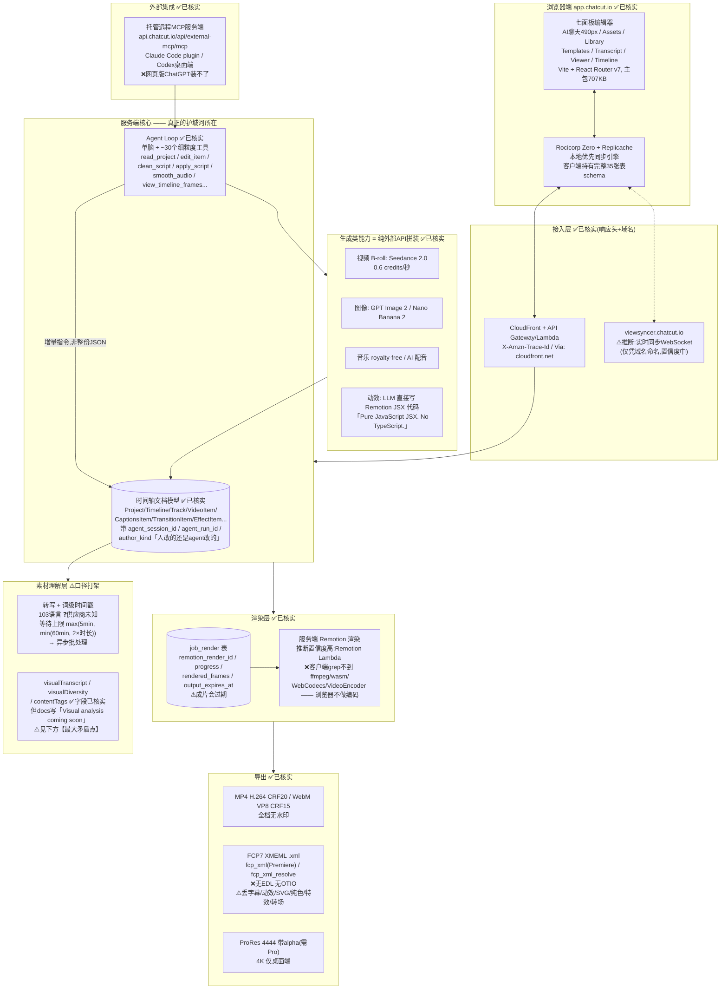

# ChatCut 研究报告

**给 VideoSense(VS)单人开发者的产品/架构分析**
调研日期 2026-07-30 | 四路并行调研合并 | 全部基于公开面(官网/docs/blog/GitHub/JS bundle/Product Hunt/融资报道),**未注册账号实跑**

---

## 开篇:三句话结论

1. **ChatCut 不是 VS 的竞品,是 VS 的镜像**。它「强操作、弱理解」(核心决策链路靠转写稿文本),VS 「强理解、零操作」(真读画面帧、但生产镜像连 ffmpeg 都没有)。两家在同一条河的两岸。
2. **它的技术壁垒比看起来薄得多**。真正难的两块——多轨时间轴文档模型 + 云端渲染流水线——是重工程轻智力;AI 那层几乎全是外部 API 拼装。证据:上榜几周内就出了架构高度雷同的开源克隆 OpenChatCut。它真正花钱买到的是**分发**,不是技术。
3. **本次调研最硬的一条,是从它自己客户端代码里 grep 出来的**:`VideoAsset` 表带 `visualTranscript` / `visualTranscribingState` / `visualDiversity` / `contentTags` 字段,配上「单项目最多 10 片段 / 5GB」的硬上限 —— **它是「上传即全量预索引」,和 VS 的「零预索引、被问到才花钱」正面相反**。这是 VS 懒惰经济学拿到的教科书级对照组,而且是对手自己的字段名作证。

---

## 一、【一页看懂 ChatCut】

### 一句话定位

> **一个把「粗剪」这件体力活自动化的浏览器 NLE**:你上传口播/访谈素材,用大白话下指令,agent 帮你删废话、拼顺序、上字幕、配音乐,产出一条**你还能继续手动拖拽的真时间轴**。

投资方 Antler 的官方说法更准确也更克制:「ChatCut is your **superhuman assistant editor**」——注意是 **assistant editor(助理剪辑)**,不是 editor。([Antler 博客](https://www.antler.co/blog/why-we-invested-in-chatcut-professional-filmmakers-reimagining-the-future-of-video-editing))

### 它是什么

- **形态**:浏览器端多轨 NLE(非线性编辑器),外加 macOS/Windows 桌面壳、以及 Claude Code / Codex 的 MCP 插件。
- **公司**:ChatCut Inc.,总部 Austin, Texas,两位创始人 Kaiwen Li(CEO,RISD 影像 BFA)+ Alima Strickland(COO),都是拿过奖的纪录片/广告导演,**不是工程背景**。$1.35M 种子轮,2025-10-22 close,真格基金(ZhenFund)领投 + Antler 跟投。Tracxn 显示约 9 人(**单一来源,置信度中**)。
- **时间线**(纠正一个易错点):2025-10 融资 → 2026-03 已有第三方视频 → **2026-07-10 Product Hunt 当日 #1 / 当周 #4(519 赞)**。所以 **PH 是营销节奏不是首发**,产品公开运行已 4 个月以上。
- **但它至今自称公开 beta**:首页 HTML 里有 `betaNotice: "Currently in public beta"`,S3 桶名也带 `beta`。拿了融资、PH 第一、卖到 $100/月,自标 beta。

### 给谁用(官方口径 vs 实际客群)

| | 说法 |
|---|---|
| **官方口径** | editors, producers, directors, marketing teams, content creators;痛点锚在纪录片 100–200:1 的拍摄比 |
| **产品形状泄露的真实客群** | `BrandKit` 品牌套件 + 21 套字幕预设 + 100+ 语言字幕 + Seedance 生成 B-roll + 官方教程主打 UGC 广告/短视频/播客切片 —— **这些是营销投放和短视频运营的活,不是纪录片剪辑师的活** |

**推断(置信度中)**:自称专业工具,实际吃的是「没有专职剪辑师的营销团队 + 个人创作者」,和 CapCut 正面撞车,但贵 2–5 倍。它保留 XML 导出和 ProRes 4444,是给专业剪辑留的「接不动就交接出去」的退路。

### 一次典型使用流程(用户视角)

```
1. 建项目 → 拖进素材(硬上限:10 个片段 / 合计 5GB)
   ↳ 上传瞬间后台就开跑:语音转写(词级时间戳,103 种语言)+ 画面理解 + 打标 + 视觉多样性评分
   ↳ 这一步【不扣 credits】(成本被摊进订阅价和上传上限里)

2. 左侧 AI 面板打字,可以 @ 引用素材。官方演示的复合 prompt:
   "Cut the silences and tighten the open so the first line lands in the first
    two seconds. Then lay captions over the whole thing and drop a soft music
    bed underneath."

3. agent 先给【分析 + 计划】:"Found 7 silent gaps and 3 filler words, here's the plan"
   然后逐条报告执行:"Cut 7 silences · saved 20s"
   ↳ 右侧多轨时间轴【实时变化】(视频层/B-roll/字幕/音频)

4. 三条并行的修改路径,随时插手:
   ① 继续在聊天里说    ② 直接拖时间轴    ③ 改转写稿(删词=自动切时间轴)

5. 不满意 → 版本历史回退(快照存整条时间轴 + 全部素材记录)
   ↳ 妙处:【恢复旧版本这个动作本身也进 undo 栈】,回退还能再回退

6. 导出:MP4/WebM 全档免费无水印;4K 仅桌面端本地导出;
   或导 FCP7 XMEML .xml 回 Premiere / DaVinci(两套不同预设)
```

**流程里最关键的设计**:agent 的中间产物**不是一份抽象的 EDL 或计划 JSON,就是最终那条可编辑的多轨时间轴**。没有「AI 产物 vs 人工产物」的隔离。这是它和「模板式 AI 视频工具」的根本分界,官网首页那句 "a real first cut instead of slapping a template on your footage" 讲的就是这个。

---

## 二、【它是怎么做出来的】技术架构

### 架构图



### 逐层讲解 + 「我要复现的话,这层难在哪」

---

#### 层 1:素材理解层 —— **本报告最大的矛盾点**

**已核实的两条互相打架的证据:**

- 官方 docs 白纸黑字:「Transcription-based content understanding... Works best with talking head and interview footage. **Visual analysis coming soon**」([docs/what-is-chatcut](https://chatcut.io/docs/what-is-chatcut))
- 但客户端 JS bundle 里的 `VideoAsset` 表**确实有** `visualTranscript`(json)、`visualTranscribingState`、`visualDiversity` 字段;agent 工具里也**确实有** `view_asset_frames` / `view_timeline_frames`(抽帧看画面)。

**我的解读(推断,置信度中高)**:三种可能——(a) 视觉理解已上线但文档没更新;(b) 字段先建好、pipeline 还没全量跑;(c) 视觉理解只在**验证环节**小剂量用(它的 verification skill 明确要求 agent「真去看像素」才算数),**不在理解环节全量用**。

倾向 (c),理由是它的 verification skill 那句写得很硬:

> Successful rendering and timeline metadata are not visual proof until Codex actually inspects the pixels.

**讽刺之处**:它**有**抽帧看画面的装置,却主要拿来「验证自己剪对没有」,而不是「理解素材内容」。**合理推断:全量看画面的成本它扛不住**——而这正是 VS「懒惰按需重看」经济学要解的同一个问题,只是两边给了相反的答案。

**同时另一条已核实事实**:主站营销文案说 agent "watches your footage",而自家 docs 说 visual analysis coming soon。**这是本次调研最硬的一处「营销 vs 现实」落差。**

**复现难点**:低。买 API 即可。真正的难点不在技术,在**成本决策**——全量预索引 vs 按需索引,这个选择决定了你的定价、上传上限、和整个商业模型。ChatCut 选了全量,代价就是「10 片段 / 5GB」这个低到刺眼的上限。

---

#### 层 2:转写与词级时间戳 —— 工程细节比想象中阴险

**已核实的机制**:

- 词级(word-level)时间戳,103 种语言。**供应商未公开**(不是 Whisper/WhisperX/Deepgram/AssemblyAI 中的哪一个,官方从未说过 —— **别当事实用**)。已核实的只有:等待上限公式 `max(5分钟, min(60分钟, 2×素材时长))`,说明是**异步批处理而非实时流式**。
- 删词的动作链:「ChatCut splits the underlying clip at the word boundaries, removes that piece, and ripples the track close」。
- **最关键的一句不变量承诺**:「**Only the track you're editing ripples; other tracks never shift**」——只 ripple 当前轨,别的轨永不移动,避免多轨失同步。
- filler word **词表写死并公开**:英文删 um/uh/er/ah,中文删「呃」「额」;**明确排除「嗯」「啊」「哦」,理由是这些可能带语义**。
- 静音处理默认开启:>3 秒的停顿压到 200ms,>1 秒的压到 600ms(另一处 skill 文档写 `compress:300`)。**是压缩不是删光**,理由「Spoken video needs natural breathing room」。

**业界标准解法(已核实)**:Whisper 原生只有 ±500ms 段级精度,不够用;要么用 [WhisperX](https://github.com/m-bain/whisperX) 跑 wav2vec2 强制对齐拉到 ±50ms(**但 issue #1247 / #1220 有用户报告 3.3.3 之后对齐回归,学术界公认更准的是 Montreal Forced Aligner —— 要自建务必先拿自己素材实测,别信宣称值**),要么买自带词级时间戳的商用 API(AssemblyAI Universal 约 $0.15/小时,Deepgram Nova-3 约 $0.46/小时)。

**最容易被低估的一块:删词后不爆音。** ChatCut 的做法写在它自己的 skill 里 —— 语义剪完之后跑 `smooth_audio` 收尾:

> micro-crossfades every hard audio cut and fades exposed edges so edits don't pop

业界通行参数:5–10ms 等功率(equal-power)交叉淡化,尽量在零交叉点下刀;**淡化要淡进「房间底噪 room tone」而不是淡进绝对静音**,否则听感突然死掉。反面教材是 Descript 长期被抱怨的「剪得太碎、不像人说话」——它删的其实不是「静音」而是「没识别出词的空隙」,所以笑声、语气词、外语会被误删([来源](https://cotovan.com/post/word-gap-removal-in-descript-storyboard-is-not-silence-removal/))。

**复现难点**:中。数据结构一周量级。但音频平滑那块「小而阴险」——代码量很小,**不做产品就不能用**。

---

#### 层 3:时间轴中间表示 —— **这才是真正的护城河**

**已核实**:客户端持有**完整关系表 schema,35 张表**,我从 bundle 里抓出的清单:

```
Project / Timeline / Track / VideoAsset / VideoItem / AudioAsset / AudioItem /
CaptionsItem / CaptionWordOverride / CaptionStylePreset / MotionGraphicAsset /
MotionGraphicItem / SvgAsset / TextItem / SolidItem / TransitionItem / EffectItem /
GifItem / ImageItem / BrandKit / Marker / MediaPoolEntry / JobRender /
GenerationJobStatus / CreditGrant / ProjectMember / UserShortcutPreset ...
```

**其中三个字段最能说明设计意图**:`agent_session_id` / `agent_run_id` / **`author_kind`(区分这一笔编辑是人改的还是 agent 改的)**。

同步引擎是 **Rocicorp 的 Zero + Replicache**(bundle 里 grep 到 `replicache` 19 次、`rocicorp`、`zero-cache`)——本地优先(local-first)同步数据库。

**这才是「每一步 agent 编辑都还能手改」的真正实现方式:agent 不生成视频,agent 写数据库行,UI 实时同步渲染。** 人和 agent 改的是**同一张表**。

**导出格式的市场真相(和直觉相反)**:OpenTimelineIO(OTIO,Academy Software Foundation 项目)确实是「标准」,但实际定位是**大厂后期流水线内部交换**(Resolve 最早支持,Avid 技术预览,Premiere 还在 beta)。ChatCut 实际导的是 **FCP7 XMEML**,而且**分别给 Premiere 和 DaVinci 准备了两套方言预设**。

**结论:目标用户是个人剪辑师而非大厂管线时,先做 FCPXML,OTIO 可以完全不碰。**

一个诚实到值得赞的坑,它自己写明了:

> captions, GIFs, motion graphics, solids, SVGs, and text items are dropped, along with border-radius, effects, and transitions

**也就是 XML 只能带走「剪辑决策」,带不走「渲染结果」。所有 AI 生成的花活全丢。**

**复现难点:★最高。** 不可变时间轴状态 + 编辑会话隔离 + 提案式改动 + 完整 undo/redo,**月级工作量**。它既是编辑器的地基,也是 agent 能安全操作的前提。开源克隆 OpenChatCut 把这个模式说得更透:`begin_edit_session` 开一个隔离草稿,agent 在草稿上提案,提交才落主状态。

---

#### 层 4:agent 如何产出剪辑决策 —— 不吐 timeline JSON,而是当「熟练的编辑器用户」

**已核实**。我原本预期是「LLM 输出结构化 timeline JSON → 确定性渲染器执行」,但它的实际设计更像**「LLM 当一个会用快捷键的剪辑师」**:时间轴状态由服务端持有,LLM 只发**增量指令**。

从官方 skill 文档逐个抄出的工具名(约 30 个):

| 类别 | 工具 |
|---|---|
| 项目/时间轴 | `read_project` `edit_item` `manage_timelines` `list_projects` `create_project` `target_project` `duplicate_project` `delete_project` `restore_project` |
| 素材 | `browse_assets` `manage_media_pool` `inspect_asset` `import_media` `edit_asset` |
| **看画面** | `view_asset_frames` `view_timeline_frames` `render_cloud_screenshot` |
| 转写/文本 | `find_transcript` `read_captions` `edit_captions` `manage_transcript` `clean_script` `read_script` `apply_script` `smooth_audio` |
| 创作 | `create_motion_graphic_from_code` `manage_design_style` `search_fonts` |
| 导出 | `submit_export` `track_export` `track_progress` `get_editor_url` |

**最值得抄的一处分层设计**:填充词/重复 take 的删除被拆成**两层**——

- `clean_script` 做**机械活**:固定填充词批量删、静音批量压缩。**纯规则,不需要模型。**
- `read_script` / `apply_script` 做**语义活**:哪一遍 take 是好的、那个 "so/like/then" 是废话还是逻辑连接词。**LLM 判断。**

规则很保守:只删「错的、悬空的、废弃的、或已被保留版本完全覆盖的词」,且**明令禁止跨 take 拼接碎片**。

> **确定性代码能做的绝不交给模型;模型只负责回答「哪些字该消失」,消失之后怎么不爆音全由确定性代码兜底。**

**关于「自动挑最好的一条重复镜头」—— 我倾向认为被夸大了(置信度中高)**。这句话密集出现在首页、融资通稿、SEO 博客里(「cuts the repeated takes」「AI detects silences, low-energy moments, and repeated takes, then removes them automatically」),但**翻遍 17 个 docs 页没有一页描述它的算法、判定标准或精度**。而同一批文档对 filler word 连中文词表都列了、对 ripple 行为连「其他轨不动」都写了。一个团队愿意把 filler word 边界写这么细却对 best-take selection 只字不提 —— **我判断这个能力要么还很弱、要么本质就是「靠转写稿找重复文本段」,不是真的比较画面质量挑最佳 take**。旁证:官方博客给的实际用法反而是让用户自己指出来:「Cut the section between 4:20 and 5:10, it's a repeated take」。

**这是从文档密度反推的,没有直接证据。**

**复现难点:最低。** 因为它只是对层 3 调工具。VS 已有的「单脑单循环 + N 工具」范式直接就是这个,只是被操作的文档对象从视频库换成了时间轴。

---

#### 层 5:渲染层 —— 前端预览 + 云端出片,浏览器不做编码

**已核实,证据链最硬的一段**:

- bundle 里 grep 到 `remotion`,扒出完整 `job_render` 表:`remotion_render_id` / `output_url` / `progress` / `render_fps` / `render_kind` / `rendered_frames` / `resolution` / `frame_range_start` / `output_size_bytes` / **`output_expires_at`(成片有过期时间)**。
- **反证**:同时 grep `ffmpeg` / `wasm` / `WebCodecs` / `VideoEncoder` / `MediaRecorder` / `mp4box` —— **一个都没有**。浏览器端不做编码。
- 导出是 `submit_export` 拿 renderId → `track_export` 轮询的异步作业模式;文档明说是 cloud-side durable export jobs。能出 ProRes 4444 带 alpha,浏览器里基本做不到。

**推断(置信度高)**:结合 AWS 栈(CloudFront + API Gateway/Lambda + S3 `chatcut-beta-mainbucketbucket-bdabrmdk.s3.us-east-2.amazonaws.com`,典型 CDK 自动生成名,区域 us-east-2,stage=beta),几乎肯定是 **Remotion Lambda**。

**业界性能现实(已核实)**:WebCodecs 直接调 GPU 硬件编解码,比纯 CPU 的 ffmpeg.wasm 快得多。Remotion 官方 benchmark:MP4→WebM 是 **7.4 秒 vs 113.3 秒**(约 15 倍),AV1 WebM→MP4 是 4 秒 vs 20.3 秒([webcodecs-benchmark](https://github.com/remotion-dev/webcodecs-benchmark))。ffmpeg.wasm 还有 2GB 文件上限。所以行业标准架构是:**WebCodecs 负责时间轴播放/预览(要实时),云端 ffmpeg 或 Remotion Lambda 负责最终出片(要质量与格式覆盖)**。

**一个重要推论**:它的时间轴本质是**一份 React 合成描述**,不是传统 NLE 的帧级媒体图。这解释了为什么它做不到帧级精修。

**复现难点:★次高,而且持续烧钱。** 渲染 API 公开市场参考价 $0.20–0.40/分钟(Shotstack 约 $0.40/分钟,4K 与 720p 同价)。**注意:这只是市场参考价,不是 ChatCut 的实际成本 —— 它的云渲染具体实现完全未知。**

> **这是任何复现者最该先建熔断的地方**:渲染成本**和提问次数无关,只和视频时长有关**。一个 $25/月的重度用户狂导 4K 长片,单他一个人就能把订阅费烧穿。

---

#### 层 6:生成类能力 —— 全是外部 API 拼装,但动效那块有真东西

**已核实**:图像(GPT Image 2 / Nano Banana 2)、视频 B-roll(Seedance 2.0,支持参考图)、音乐(royalty-free 按需时长)、AI 配音 —— **全部是外部模型转售**。

**唯一有技术含量的是 AI 动态图形,答案很明确:LLM 直接写 Remotion JSX 代码,不是模板填空。**

- skill 文档要求 LLM 输出 **"Pure JavaScript JSX. No TypeScript."**
- 运行环境预注入 React、`useCurrentFrame`/`useVideoConfig` hook、`Sequence`/`AbsoluteFill` 组件,通过 `create_motion_graphic_from_code` 提交。
- 约束很严:不许 import、不许 export default、根元素必须是 div、所有可见内容必须从 `item.props` 读。
- **关键设计:代码 + 可编辑属性 schema 一起提交**。LLM 除了写动画代码,还要**声明哪些文字/颜色/数字/媒体是用户后续能在 UI 上改的**,这样生成物落到时间轴后仍是「可编辑图层」而不是一坨死渲染。

所以:**既不是 Lottie JSON,也不是 AE 表达式,也不是模板参数化,而是「受约束的 React 代码生成 + 属性外露」**。

旁证:Remotion 官方就有 [Prompt to Motion Graphics SaaS Starter Kit](https://www.remotion.dev/docs/ai/ai-saas-template),架构是 Next.js + Remotion Player + LLM 流式吐代码 + 浏览器内 JIT 编译预览 + AWS Lambda 导出,配套三层护栏:**输入校验 / 输出净化(洗掉 markdown 围栏等噪声)/ 编译失败自动重试自纠**。**ChatCut 大概率就是这条官方路径的产品化版本(推断)**。另:它还有独立的 shader-gen skill,说明同时支持生成 GLSL 着色器。

**安全红线(来自 OpenChatCut,但对任何人都适用)**:LLM 生成的动效代码必须跑在**受限沙箱**里并拦截恶意模板;API key 只留服务端、绝不进浏览器。**这一条对任何「让模型写代码然后执行」的产品都是硬要求。**

---

## 三、【哪些是真难的,哪些是外包的】

### (a) 真自研且有门槛的 —— 只有两块半

| 能力 | 门槛来源 | 证据强度 |
|---|---|---|
| **多轨时间轴文档模型 + local-first 同步**(35 张表 / `author_kind` / 编辑会话 / undo 栈可回退) | 设计难度 + 月级工程量;是 agent 能安全操作的前提 | ✅ bundle 直接 grep |
| **agent 工具面的分层设计**(确定性 vs 语义两层、smooth_audio 兜底、verification 必须看像素) | 不是代码难,是**产品判断力难** —— 知道哪些活不能交给模型 | ✅ 官方 skill 文档 |
| **半块:动效的「代码 + 属性 schema」双输出**约定 | 有巧思,但 Remotion 官方模板已给了同款路径,门槛在快不在难 | ✅ skill 文档 + Remotion 官方旁证 |

### (b) 工程量大但没门槛的 —— 大头在这

- 云端渲染流水线(作业队列、进度轮询、产物过期、多编码矩阵)
- 11 种特效 + 13 种转场 + Zoom 工具 + 音频 ducking + 21 套字幕预设 + 1803 个 Google Fonts(**外加 12 个专为中文排版做的自带字体 —— 中文是被认真对待的,不是顺带支持**)
- FCPXML 两套方言导出
- 版本快照 / 协作(owner + editor 两角色,无只读)
- 录制、多机位同步(触发条件是「选中 ≥2 个 1x 速度的视频或音频 clip」)

**全是「谁都能做,就是要人月」的活。对单人开发者最不友好。**

### (c) 直接调第三方 API 的 —— 点名与成本

| 能力 | 模型/服务 | 售价(按 $0.25/credit 折算) | 底层成本(公开口径) |
|---|---|---|---|
| 视频 B-roll | **Seedance 2.0** | 0.6 credits/秒 ≈ **$0.15/秒** | 字节官方约 $0.14/秒;第三方渠道 $0.045–0.081/秒 |
| 图像 | **GPT Image 2** | 1818 张/400cr ≈ **$0.055/张** | OpenAI 按 token,1024px:low≈$0.006 / medium≈$0.053 / **high≈$0.211** |
| 图像(低成本位) | **Nano Banana 2** | — | $0.045(512px)–$0.151(4K),1024px≈$0.067,batch 再打五折 |
| 动效 | LLM 代码生成 + 云渲染 | 2000 个/400cr ≈ **$0.05/个** | 一次 LLM 调用 + 一次渲染 |
| 音乐 | royalty-free 生成 | — | 约 $0.045/首 |
| AI 配音 | 未公开 | $0.069–$0.20 / 1000 字符 | — |
| 转写 | **供应商未公开** | 免费(摊进订阅) | AssemblyAI ≈$0.15/小时 / Deepgram ≈$0.46/小时 |

**关键反推**:GPT Image 2 售价 $0.055/张,**说明它跑的是 low 或 medium 档,绝不可能是 high —— 跑 high 每张倒亏 $0.156**。(推断,无直接证据)

### 技术壁垒判定:**薄**

三条独立证据:

1. **上榜几周内就出了架构高度雷同的开源克隆** [OpenChatCut](https://github.com/0xsline/OpenChatCut)(AGPL):多轨时间轴 + agent + **Remotion 渲染** + **MCP 集成** + **FCPXML 导出**,而且做得更多(本地优先、素材留 `~/.openchatcut`、自己开 MCP 端点)。**注意它是第三方独立实现、明确声明与 ChatCut 无关联,不能当成 ChatCut 的技术选型证据;但两边在 Remotion / FCPXML / MCP+编辑会话三点上交叉验证成立(ChatCut 侧有自己的官方 repo 佐证)。**
2. **AI 层几乎全是外部 API**,而外部 API 是所有人都能买的。
3. 行业共识:「**The model is the commodity; the workflow is the moat**」——决定能不能上线的是编排、缓存、审核和 UX。

**它真正花 $1.35M 买到的是分发,不是技术。**

---

## 四、【商业形态】

### 4.1 credits 定价拆解

**结构(已核实)**:统一 **$0.25/credit**,11 档从 $25/100 到 $2,500/10,000,严格线性。免费版一次性送 20 credits。

> **There is no feature ladder inside Pro.** —— 档位只买额度,不解锁功能

唯二的免费/付费功能差:**Seedance 2.0** 和 **ProRes 4444 导出**。

**收费边界(这是最值得 VS 对照的一条)**:

| 免费 | 扣 credits |
|---|---|
| 手动编辑(trim/split/move/delete) | **AI agent 每一轮对话本身**(「Each turn the agent runs costs credits based on the models and tools involved」) |
| 素材上传 | 视频生成 0.6 credits/秒 |
| **自动转写** | 图像生成(按模型+分辨率) |
| 播放、时间轴导航 | 动态图形(按复杂度/元素数/时长) |
| 从已有转写稿加字幕 | 音乐、AI 配音 |
| 存版本 | **渲染导出**(按成片时长和编码) |

⚠️ **两处文档自相矛盾,我没能消解**:
- `plans-and-credits` 把「standard exports (MP4, WebM)」列为免费,`credits-policy` 又把「Rendering: by final video duration and codec choice」列为消耗项。**推断(置信度中):分界在标准编码 vs ProRes/4K,但官方没有一页说死。**
- 素材上限:`what-is-chatcut` 写「10 clips, 5GB total」,`uploading-media` 写「5GB per file」。**推断(置信度中):前者项目配额、后者单文件校验。**

**三条机制值得单独拿出来看**:

1. **失败不扣费**:「If a generation is rejected by a safety filter, hits a timeout, or errors out, no credits are deducted.」
2. **执行前实时预估**:「Live estimates are shown before every credit-consuming action.」
3. **credits 会过期**:订阅 credits 发放后 **60 天**失效,credit pack 和新用户礼包 365 天。而且 `CreditGrant` 表带 `expiresAt` / `remainingBalance` / `originalAmount` / `idempotencyKey` —— **过期是硬编码进数据模型的产品设计,不是条款花边**。

### 4.2 毛利结构推算

⚠️ **重大前提**:我抓到的 credits 换算示例(Seedance 666 秒 / GPT Image 2 1818 张 / motion clips 2000)**没写死对应 100 档还是 400 档**。我按 400 档推算。**如果实际对应 100 档,所有单位售价乘以 4,结论会从「平价转售」翻转成「高毛利转售」。要做商业判断请自己开个 Free 账号看实际扣费。**

按 400 档推:

- Seedance:售价 $0.15/秒 vs 官方 $0.14/秒 → **几乎零毛利**;走第三方渠道($0.045–0.081)→ 45–70% 毛利。**走哪条我无法判定。**
- GPT Image 2:售价 $0.055/张 vs medium 档 $0.053 → **几乎零毛利**
- 动效:$0.05/个,成本一次 LLM + 一次渲染 → **薄**

**结论:生成类功能基本是平价甚至贴钱转售。真实利润来自订阅本身 + credits 用不完的沉淀(breakage,所以才有 60 天过期)。**

> **反向支持了 VS「不做 credits」的既往红线 —— credits 制在这里根本不是利润引擎,只是个成本防火墙。** 而 VS 有更诚实的防火墙(成本每轮可见 + 懒惰按需)。

### 4.3 赛道竞争格局:三面夹击

**(1) 转写稿剪辑已经是 commodity,2026 年是「白送的功能」**

- Adobe Premiere 内置 Text-Based Editing,2026 版加了静音检测、口头禅一键删、多机位
- DaVinci Resolve 从 18.5 起内置,Resolve 20 加了 IntelliScript(按剧本自动拼时间线);**Studio 版 $295 买断、无月费**
- 最便宜的独立玩家 Gling 年付约 $10/月给全套

**(2) 最致命:Adobe 2026-06-18 已把「agent 自动出粗剪」内置进 Premiere 公测**

官方新闻稿:AI Assistant 会做

> sorting assets into bins, batch renaming clips, identifying interview questions, adding markers or **even assembling a working starting point**

而且输出是「**fully editable Premiere sequence**,Nothing is locked or hidden」。

> **ChatCut 的核心卖点(agent 看素材、出第一版粗剪),在它拿 PH 日冠前后脚就被行业老大做成了内置功能,而且直接吐原生时间线、不用导 XML 来回倒腾。**

**(3) 国内被免费产品全覆盖**:剪映(AI 一键成片 + 豆包/DeepSeek 加持 + 10 万+ 模板)、必剪(B 站官方,批量粗剪 + 一键投稿闭环)、度加剪辑(百度,自称「创作 Agent」)。**都免费/超低价 + 绑平台分发。国内这条赛道对独立开发者基本关闭 —— 不是技术打不过,是免费打不过。**

**(4) credits 已是全行业默认动作**:240 家公司调研中纯 flat-fee 从 29% 掉到 22%,credit-based 采用同比 **+126%**(35→79 家)。Runway、Opus Clip、CapCut 全在用。

**用户抱怨的引爆点不是「贵」,是三件事**:过期作废 + 按输入而非产出计费 + 退订即失联。(Opus Clip 是最典型负面样本:按上传时长扣费,60 分钟播客切 2 条还是 15 条都扣 60 credits;未用完 60 天作废;**退订后 3 天项目直接不可访问,哪怕 credits 还有余额**。)

行业总结的成败三判据:credits 要映射到**动作/结果**、要**实时显示消耗**、要**给花钱管控** —— 否则用户觉得是「街机代币(arcade tokens)」。

### 4.4 它的差异化能不能守住?—— 判断:**守不住,除非赌赢分发**

| 候选护城河 | 状态 |
|---|---|
| 素材理解 | ❌ 正在被通用多模态模型抹平,而且它自己那层还是文本的 |
| 渲染速度/质量 | ❌ 工程活,谁都能追 |
| 模板生态 | ❌ 剪映 10 万+ vs 一切独立产品 |
| agent 编排 | ❌ Adobe 已内置,开源已克隆 |
| **ChatGPT/Claude 插件分发** | ⚠️ **唯一真正有杠杆的一条:寄生在 ChatGPT/Claude Code 的用户流量里(推断,置信度中)** |

**Adobe 靠专业人士既有工作流,CapCut/剪映靠字节流量闭环。独立产品目前没人做出真壁垒。**

### 4.5 口碑成色:不是「差」,是「空」—— **本节请特别注意**

**已核实的证伪**:我把 Reddit(定向搜)、Hacker News、X 搜遍,**没找到任何一条真人自发讨论 ChatCut 的帖子**。HN 上同类 agent 剪辑产品讨论一大把(Mosaic YC W25、SynthCut、Palmier Pro、Kimu),**唯独没有 ChatCut**。

**而满屏「2026 honest review」是买来的**:我在 chatcut.io 首页 HTML 里直接抓到 `<script src="https://cdn.firstpromoter.com/fpr.js">` —— FirstPromoter 是 SaaS 联盟返佣追踪工具,**任何人写好评带链接都能拿分成**。铁证:整句 `"doesn't trap you in a flat, uneditable output template"` 全网搜不到原始出处,却同时出现在 Product Hunt 的「用户评论」和多篇「独立评测」里 —— **同一批 AI 生成文案在互抄**。mrreviewai.com 那页评论区写着 "Be the first to review ChatCut"(一条真评论都没有),照样挂了个评分。MakerStack 那篇给 7/10 的「评测」,逐句读完确认:**它压根没跑过一次真实剪辑**。

**必须打折扣的部分:**

- ⚠️ **Trustpilot 我没能一手打开**(403 / 991 字节拦截页)。搜索引擎摘录称 2.8 分 / 3 条评论 / 3 条全 1 星 —— **3 条全 1 星算不出 2.8 分,数字自相矛盾,n=3。这个分数不要写进任何对外材料。** 只保留定性结论:**存在真实付费用户投诉「生成失败仍扣 credits」与「客服基本不存在」**。
- ⚠️ 「生成失败仍扣 credits」这条与官方政策白纸黑字对撞(官方明写失败不扣)。**推断(置信度中高):要么政策后补,要么失败判定有 bug 没触发退还。**
- ⚠️ **agent 粗剪质量,公开世界里没有答案**。零 before/after 对比图、零第三方实测记录。想知道剪得好不好,**只有一条路:自己花钱跑一次**。
- ⚠️ **80% 提速 / 90% 一轮到位**这两个数字分别来自投资方博客和自家 SEO 博客,**无方法论、无样本、无对照。当营销话术看,不要进任何对比表。**
- ✅ **纠偏一条**:官方明确所有档位(含免费版)导出**都不加水印**,也没搜到任何水印抱怨。「导出有水印」这个假设可以划掉。真正的闸门是 credits 和 10 片段/5GB 上传上限。

**官方自己承认的短板(博客里意外诚实)**:agent 读不出潜台词/意图/情绪节奏;叙事性剪辑仍需 significant human oversight;效果完全取决于素材质量;自动字幕经常搞错专有名词/品牌名/术语。

> **这批自认短板的共同点是:全部落在「看懂画面/看懂内容」这一侧,而不是「会不会剪」这一侧。**

**方法论提醒**:这次调研最大的收获不是找到了什么,而是**发现「能找到的东西」几乎全是买来的**。一个拿了 $1.35M、上了 PH 单日第一的产品,在 HN 和 Reddit 上零讨论,**这个反差本身比任何一条评测都更能说明它现在的真实渗透度**。

---

## 五、【对 VS 的意义】★ 最重要的一节

### (a) 竞品还是不同物种?—— **不同物种,而且是互补的两半**

```
                  理解能力
                     ↑
        VS ●         |
   (真读画面帧        |
    pgvector 语义     |
    SQL 精确计数      |
    库级持久理解)     |
                     |         ● ChatCut
                     |      (转写稿驱动
                     |       10片段/5GB
                     |       项目级一次性)
                     +———————————————————→ 操作能力
                                (剪辑/渲染/导出)
```

**边界说清楚:**

| | VS | ChatCut |
|---|---|---|
| 理解方式 | **真读画面帧**(analyze_video) | **转写稿文本**(docs 白纸黑字「Visual analysis coming soon」) |
| 索引策略 | **零预索引,被问到才花钱** | **上传即全量预索引**(`visualTranscript` / `contentTags` / `visualDiversity` 字段作证) |
| 规模 | 整个视频库,pgvector + SQL 精确计数 | 单项目 **10 片段 / 5GB 硬上限** |
| 操作 | **零剪辑能力**,生产镜像刻意不装 ffmpeg,M4.5 的「clip」只是跳时间点播放 | 完整多轨 NLE + 云端渲染 + XML 导出 |
| 计费 | 不做 credits,成本每轮可见 | credits,**连 agent 对话本身都扣费**,60 天过期 |
| 部署 | 自托管 | SaaS,数据在 AWS us-east-2 |

**但这里要诚实一点,别急着宣布 VS 赢**:ChatCut 选全量预索引在**它的场景里是对的** —— 单项目、10 个片段、你上传就是为了马上剪,预索引成本可控且必然被用到。VS 选懒惰在**VS 的场景里是对的** —— 库级、上千条视频、绝大多数永远不会被问到。

> **两边不是「谁更聪明」,是「场景决定了策略」。** 真正的读数是:**ChatCut 用它的字段名亲口证明了「全量预索引必然带来上传硬上限」这个因果链** —— 这是 VS 懒惰经济学最强的外部背书,而且是对手自己作证,不是 VS 自说自话。

### (b) VS 能从它这偷什么 —— 六条,具体到机制

**★ 1. `author_kind` / `agent_session_id` / `agent_run_id`:给每一笔产物打「谁改的」标记**

ChatCut 的时间轴表里,每一行编辑都记录「人改的还是 agent 改的、哪一轮 agent 改的」。

**映射到 VS**:ingest enrichment 产物(transcript / caption / pgvector 行)、以及 analyze_video 的缓存结果,落库时都应带上 `produced_by`(哪个模型 / 哪个档位 / 哪一轮问答触发 / 花了多少钱)。收益有三层:
- 缓存可解释(用户问「这个结论哪来的」,能答)
- 缓存可**定向失效**(换模型/换档位后只重跑受影响的行,不是全表重跑)
- 直接喂给 eval 的不变量证明

**这是 VS 已有基础设施上最低成本的一次升级。**

**★ 2. 「执行前实时预估 + 失败不扣费」这两条 UX(不是 credits 制本身)**

ChatCut 做对的:`Live estimates are shown before every credit-consuming action` + `no credits are deducted` on failure。

**VS 已经有一半了** —— 最近那个 commit(analyze 在飞预留按**实际档位**算,不一律按 pro 悲观值)恰好就是这个问题的另一面。缺的另一半是:
- **执行前告诉用户「这次 analyze_video 大约花 $0.018,要不要」**,而不是花完了才显示
- **失败/超时的那一轮明确标注「未计费」**,别让用户看着账单猜

**这是把 VS「成本每轮可见」从「事后账本」升级成「事前预告」**,而且不用引入任何 credits 概念。

**★ 3. 把判定边界写进公开文档 —— 这是最便宜的信任建设**

ChatCut 把 filler word 词表公开写死:英文 um/uh/er/ah,中文「呃」「额」,**并且明确说「嗯」「啊」「哦」不删,因为可能带语义**。

我在同类产品里很少见到这种做法。它的效果是:**用户知道边界在哪,就不会因为一次误判失去信任**。

**映射到 VS**:VS 的 eval 判分口径、检索召回口径、「什么情况下 agent 会弃权(abstain)」—— 这些完全可以同样公开。VS 本来就在做不变量证明和判分口径对齐,**把它变成对外文档几乎零成本,却是自托管用户最看重的信号**。

**★ 4. 不变量式承诺:一句话锁死副作用范围**

> Only the track you're editing ripples; other tracks never shift.

一句话,把「删词」这个操作的副作用边界钉死了。**这和 VS 在 eval 里做不变量证明是同一种思路,只是 ChatCut 把它变成了面向用户的产品承诺。**

VS 可以直接学的句式:「`semantic_search` 只读索引,永不触发新的 analyze_video 计费」/「`sql_query` 的计数结果永远来自 DB 事实表,不来自模型推理」。

**★ 5. agent 自我验证必须「真去看像素」—— VS 有现成装置,却没用在这**

> Successful rendering and timeline metadata are not visual proof until Codex actually inspects the pixels.

ChatCut 的做法:调 `view_timeline_frames` / `view_asset_frames` 抽帧 → 下载 → 用读图工具真看 → 必要时拼 contact sheet 对比。

**讽刺在于:它有这个装置却只用来验证剪辑,不用来理解素材(成本扛不住)。而 VS 的 analyze_video 本来就是这个装置的完整版。**

**映射到 VS**:引用三联(答案 ↔ 时间点 ↔ 证据)可以加一个**可选的「真抽帧核对」验证步**——当 agent 给出一个基于 transcript/caption 索引的答案时,允许它花一次 analyze_video 去**验证**这个引用是否成立。这完全符合懒惰经济学(只在需要举证时才花钱),而且直接强化 VS 最独特的那个能力。

**★ 6. 转写稿↔时间轴双向映射 → 对 VS 的 show_video / 引用体验的直接启发**

这是**最具体、最可落地、且零 ffmpeg 的一条**。

ChatCut 的核心交互:**转写稿是时间轴的一个视图**。点文本 = 跳时间点,删文本 = 剪时间轴。

**VS 已经有全部原料**:ingest 管线跑出的 Gemini 转写(994 条 transcript 索引行)、pgvector 语义检索、`show_video` 跳时间点播放。**缺的只是把它们缝在一起的那个 UI 视图:**

```
用户问:"他在哪儿提到了预算问题?"
                ↓
VS 现在:  返回一段文字答案 + show_video 跳到 12:34
VS 可以:  返回【转写稿片段视图】—— 那句话前后几句的转写文本,
          每一句可点,点哪句跳哪句;命中的那句高亮
          (词级时间戳做不到就用句级,VS 现有 transcript 粒度够用)
```

**为什么这条值得做**:
- **零 ffmpeg、零渲染、零 credits、不破任何红线**——纯前端 + 已有数据
- 它直接强化 VS 的**引用三联**(答案 ↔ 时间点 ↔ 证据),而引用三联是 VS 已识别的独有空白之一
- 它把「VS 的答案可验证」从一句口号变成一个**可点击的动作**

**★ 关于「timeline IR ≈ chart_spec」这个问题的答案:是同一个模式,而且 VS 已经在做**

但要精确一点。ChatCut 的实际设计**不是**「LLM 吐一整份 timeline JSON → 确定性渲染」,而是「LLM 对服务端文档模型调**细粒度增量工具**」。两者的共同本质是:

> **模型只产出「意图的结构化表达」,绝不产出最终产物;最终产物由确定性代码从结构化表达生成。**

VS 的 `chart_spec` 完全是这个模式(**模型吐 spec → 前端 ECharts 确定性渲染,模型不吐原始 option** —— 这条红线定得对)。

**可以偷的增量在两点**:
1. **粒度选择**:整份 IR vs 细粒度增量指令。ChatCut 选了后者,因为状态大且需要 undo。VS 的 chart_spec 状态小,整份是对的。**但如果 VS 未来做「任务 IR」(多步任务计划),应该学 ChatCut 走增量 + 可回退,而不是一次吐一份大计划。**
2. **plan-then-execute 的可见性**:ChatCut 先出「Found 7 silent gaps, here's the plan」再逐条执行,而且中间产物就是最终可编辑物。**⚠️ 注意:计划能否在执行前被用户改掉(plan-then-approve 还是直接开干),我没验证过,置信度低。** 但这个模式本身对 VS 的多步查询(先 semantic_search 圈范围 → 再 analyze_video 深挖)是直接适用的,而且**因为 analyze_video 要花钱,VS 做「先给计划+报价,批准再执行」的理由比 ChatCut 更充分**。

### (c) VS 该不该长出剪辑能力?—— **不该。判断置信度:高**

**做的话要同时破三道既往红线:**

1. **生产镜像装 ffmpeg** —— 当前是刻意不装的,这是 VS 轻量部署的基础
2. **引入云端渲染作业队列** —— 成本模型从「按问题计费」变成「**按视频时长计费**」。**这一条直接打穿懒惰经济学叙事**:渲染成本和提问次数无关,只和时长有关。VS 最核心的护城河故事当场失效。
3. **从零建多轨时间轴文档模型** —— VS 现在**只有跳时间点播放,没有任何时间轴状态**。这是月级工程量,而且是**重工程轻智力**,对单人开发者最不友好的那种活。

**外加四面受敌的赛道现实**:转写稿剪辑已 commodity → agent 粗剪被 Adobe 内置(2026-06) → 国内被免费产品全覆盖 → 开源克隆已出现。**在这个时候从零起步做剪辑,是把 VS 唯一的差异化换成一张进红海的门票。**

#### 如果一定要做,最小可行形态(按代价从小到大)

**形态 0(几乎零代价,推荐先做这个):导出「片段清单 + SRT」**

`sql_query` / `semantic_search` 圈出来的结果,导出成:
- 一份 CSV/JSON:`视频文件名, 起始时间码, 结束时间码, 一句话说明, 命中理由`
- 一份 SRT 字幕(VS 已有转写)

**代价:一个纯文本工具,几天。无 ffmpeg、无渲染、无 credits、不破任何红线。** 任何 NLE、任何人工剪辑师都能吃。

**形态 1(小代价):导出 FCPXML**

在形态 0 之上加一个 FCP7 XMEML 生成器,让用户把「VS 帮我找出来的所有片段」直接拖进 Premiere/Resolve 的时间轴。

- **为什么是 FCPXML 不是 OTIO**:OTIO 是大厂流水线内部交换格式;个人剪辑师那边实际吃的是 FCPXML。ChatCut 自己就只导 FCPXML 两套方言,不碰 OTIO。
- **代价**:纯文本生成,无 ffmpeg。但**方言坑不少**——ChatCut 要给 Premiere 和 Resolve 准备两套预设就是证据。估一到两周 + 持续踩坑。
- ⚠️ **未验证前提**:这条路假设 VS 目标用户里有相当比例会用专业 NLE。**如果 VS 用户是纯小白,这条路走不通。这是我的工程判断,不是调研到的事实,置信度中。**

**形态 2 及以上(时间轴 + 渲染):不建议。** 见上面三道红线。

**我的建议**:先做形态 0,观察有没有人真的用;有人用再考虑形态 1;形态 2 除非有明确的付费需求信号,否则不碰。

### (d) 反向观察:VS 当「理解层」给别人的剪辑器供数据?—— **有路,但需求侧未验证**

**这个想法在结构上是成立的,而且成立得很干净:**

```
ChatCut 公开承认:  "Visual analysis coming soon"     ← 它缺的
VS 已经有的:       analyze_video 真读帧 + pgvector + SQL 精确计数
```

**而且 ChatCut 自己就示范了这个模式怎么做**:它把自己的 agent 通过**托管远程 MCP 服务端**(`api.chatcut.io/api/external-mcp/mcp`)暴露给 Claude Code 和 Codex。它的 `submit` CLI 的本质是:本地转码 → 上传 → **服务端跑 agent 的 edit loop** → 云端渲染 → 返回签名下载 URL,阻塞式等待,超时 40 分钟。

> **换句话说:MCP 只是把 ChatCut 的 agent 当远程服务调,真正的智能在服务端。VS 完全可以照抄这个形状,只是把「编辑智能」换成「理解智能」。**

**VS 该暴露什么工具**(设计草案):
- `find_moments(query, filters)` — 库级语义检索,返回 `视频ID + 时间码 + 证据`
- `describe_clip(video_id, start, end)` — 真读帧描述这一段发生了什么
- `count_exact(sql_ish_question)` — SQL 精确计数(这是 VS 独有的,LLM 数不准的那类问题)
- `verify_claim(claim, video_id, timerange)` — 抽帧验证某个断言是否成立

**现实性评估(诚实版):**

| 维度 | 判断 | 置信度 |
|---|---|---|
| 技术可行性 | 高。VS 已是单脑 + 11 工具架构,加一层 MCP server 是包装不是重写 | 高 |
| **对接对象现实性** | **OpenChatCut 是最现实的靶子** —— AGPL、本地优先、**自己已经开了 Streamable HTTP MCP 端点**(`localhost:5199/api/external-mcp/mcp`,挂 15 个按需加载的 skill)。**接它不需要征得任何人同意。** ChatCut 本身反而不现实——它是闭源 SaaS,不会主动接一个外部理解层 | 中高 |
| **需求侧** | ⚠️ **未验证。本轮调研没有找到任何证据表明有人在找「外部视频理解层」。** 而且 Adobe/Descript/ChatCut 都在自己做理解层,没有一家表现出外采意愿 | 低 |
| 商业意义 | 单人开发者做 B2B API 供数据,分发难度比做 C 端产品**更高**不是更低 | — |

**我的判断**:这条路**作为「VS MCP 化」的一个副产品**是值得的 —— 因为 VS MCP 化本身对「让 Claude Code / Codex 用户能直接查自己的视频库」有独立价值,**接剪辑器只是顺带的一个消费方,不是目的**。

**但如果把「给剪辑器供数据」当成一条独立战略路线去投入,我不建议。理由:需求侧零证据,而且这条路让 VS 从「有自己用户的产品」退化成「别人产品的一个可选依赖」。**

**这里还有一条 ChatCut 用血证明的原则,VS 该直接吸收**:

> 这条赛道上,「我的成果能不能带走」已经变成用户的**一票否决项**。ChatCut 被评测夸的唯一「懂行」细节就是 XML 导出;Adobe 强调输出是 "fully editable Premiere sequence, Nothing is locked or hidden";而 Opus Clip 最狠的差评来自反面——**退订 3 天后项目彻底失联**。

**VS 虽然不剪辑,但同样的原则适用于它的理解产物**:transcript、caption、pgvector 索引、引用三联,**能否以开放格式导出**,会直接影响自托管用户的信任。**这条比「要不要做剪辑」重要得多,而且几乎零成本。(推断,置信度中高)**

---

## 六、【30 秒清单】最值得点开的 8 个链接

| # | 链接 | 为什么值得看(一句话) |
|---|---|---|
| 1 | [chatcut.io/docs/what-is-chatcut](https://chatcut.io/docs/what-is-chatcut) | **本报告最硬的一处「营销 vs 现实」落差**——首页说 agent "watches your footage",这一页写「Transcription-based... Visual analysis coming soon」 |
| 2 | [chatcut.io/docs/transcript-editing](https://chatcut.io/docs/transcript-editing) | 「Only the track you're editing ripples」+ 公开的 filler word 词表 + 为什么「嗯/啊/哦」不删 —— **不变量式承诺 + 判定边界公开化的教科书样本** |
| 3 | [chatcut.io/docs/credits-policy](https://chatcut.io/docs/credits-policy) | 收费边界怎么划(剪辑免费/生成扣费/**agent 每轮对话本身扣费**)+ 失败不扣费 + 执行前实时预估 + 60 天过期 |
| 4 | [github.com/ChatCut-Inc/agent-plugin](https://github.com/ChatCut-Inc/agent-plugin) | 官方 skill 文档,**约 30 个工具名 + smooth_audio 防爆音 + verification 必须看像素 + 动效写 Remotion JSX**——这是全篇技术含量最高的一手源 |
| 5 | [github.com/0xsline/OpenChatCut](https://github.com/0xsline/OpenChatCut) | **AGPL 开源克隆**,本地优先 + MCP + Remotion;要复现或要找 MCP 对接对象,从这儿起步比从零快一个数量级(⚠️ AGPL 传染性,商用前看许可) |
| 6 | [remotion.dev/docs/ai/ai-saas-template](https://www.remotion.dev/docs/ai/ai-saas-template) | 官方「Prompt to Motion Graphics」模板:流式吐代码 + 浏览器 JIT 编译 + **三层护栏(输入校验/输出净化/失败自纠)**——任何「让模型写代码然后执行」的产品都该先读这个 |
| 7 | [github.com/m-bain/whisperX](https://github.com/m-bain/whisperX) | 词级时间戳的标准解法(wav2vec2 强制对齐,宣称 ±50ms);⚠️ **issue #1247/#1220 有对齐回归报告,自建务必先拿自己素材实测** |
| 8 | [news.adobe.com/news/2026/06/adobe-unveils-major-expansion](https://news.adobe.com/news/2026/06/adobe-unveils-major-expansion) | **Adobe 2026-06-18 把 agent 自动出粗剪内置进 Premiere 公测**——这一条决定了「独立 AI 剪辑产品还剩多大空间」这个问题的答案 |

**加映(想深挖再看)**:[Antler 投资备忘](https://www.antler.co/blog/why-we-invested-in-chatcut-professional-filmmakers-reimagining-the-future-of-video-editing)(创始人产品论点原文:「A story is basically a logic machine」)| [chatcut.io/docs/exporting](https://chatcut.io/docs/exporting)(XML 会丢掉什么,写得非常诚实)

---

## 附:本报告的可信度分层(请务必读)

**✅ 最硬的部分(可复现、可复核)**:技术栈全部是从线上真实 HTML 和 JS bundle 里直接 grep 出来的原文 —— Astro / Vite+React Router v7 / AWS CloudFront+API Gateway / S3(us-east-2, stage=beta)/ Remotion 服务端渲染 / Rocicorp Zero+Replicache / PostHog,以及 35 张表和 `VideoAsset` 的预索引字段。这部分你可以自己去验。

**⚠️ 我明确没做到、不许当结论用的:**

1. **没注册账号实跑**。agent 粗剪质量在公开世界里**没有答案**,零对比图零第三方实测。想知道,只有自己花钱跑一次(免费档也能试,官方称无需信用卡)。
2. **Trustpilot 一手抓不到**(403),分数自相矛盾(3 条全 1 星算不出 2.8),**n=3,别引用这个数字**。
3. **credits 换算表的档位归属有歧义**,如果实际对应 100 档而非 400 档,毛利结论会从「平价转售」翻转成「高毛利转售」。
4. **Seedance 进货价浮动 2–3 倍**($0.14 官方 vs $0.045–0.081 第三方),走哪条决定零毛利还是 70% 毛利,**无法判定**。
5. **转写供应商未知**。103 语言这个覆盖数更像 Whisper 系或 AssemblyAI,**但这是猜测**。
6. **渲染是否扣 credits 未能确认**(`chatcut.io/docs/credits` 返回 404),两页官方文档口径打架。
7. **迭代速度无法核实**(无 changelog / release notes)。**Discord 规模、月活、付费用户数、收入,一个数字都没有** —— 融资稿和投资人博客里零 traction 数字,**这本身可能就是信号(推断,置信度低)**。
8. **MCP 工具清单来自官方 skill 文档**(可信),但那是给 agent 看的使用指南不是完整 API 参考,**可能有未文档化的工具或已改名的工具**。想拿准确签名,唯一办法是实际装一次插件跑 `claude mcp get plugin:chatcut:chatcut` —— **这是本次调研唯一值得花时间补的窟窿**。
9. **市场规模/CAGR/市占率数字**(37.5 亿美元、42% CAGR、Premiere 35%、Resolve 用户涨 300%)来自内容农场式博客,源头不明互相抄。**只当方向性参考,对外输出时建议删掉具体百分比,只保留定性结论(分发才是壁垒)。**
10. **第二梯队竞品的具体档位价格**(Descript / Veed / Vizard / Opus Clip / CapCut / Gling)几乎全来自 SEO 聚合站,彼此数字打架(Descript Hobbyist 有 $16/$19/$24 三种说法)。**要写进对外材料必须逐个去官网 pricing 页复核。**
11. **「VS 应该只做 FCPXML 导出」这条建议是我的工程判断,不是调研事实**,前提是 VS 用户里有相当比例会用专业 NLE ——**这个前提未验证**。

---

# 附录 · 四路调研原始明细

> 产品表面全扫 / 技术实现推断 / 竞品格局 / 真实口碑, 每条带 已核实|较可信推断|猜测 标注与来源链接。

## ChatCut 产品表面全扫(官网 + 文档 + 定价 + Product Hunt + 插件仓库 + 融资报道)
- [已核实] (1) prompt→成片主线:三段式「分析→给计划→逐条执行」,中间产物就是真时间轴: 用户在编辑器左侧 AI 面板用大白话下指令(可以用 @ 引用素材),典型 prompt 是复合任务,例如官方演示的「Cut the silences and tighten the open so the first line lands in the first two seconds. Then lay captions over the whole thing and drop a soft music bed underneath」。agent 走的步骤在界面上是可见的:先出分析结论+计划(官方演示文案「Found 7 silent gaps and 3 filler words, here's the plan」),再逐条报告已完成任务(「Cut 7 silences · saved 20s」),同时右侧多轨时间轴实时变化(视频层/B-roll/字幕/音频)。关键点:**中间产物不是一个抽象的 EDL 或计划 JSON,而就是最终那条可编辑的多轨时间轴**——agent 改完之后用户直接拖拽/裁剪/撤销,没有「AI 产物 vs 人工产物」的隔离。修改方式有三条并行:继续在聊天里说、直接改时间轴、改转写稿。文档把这套叫 Agent 模式(默认),说它「allows you to instruct the agent to handle a full editing workflow as a single autonomous task」。素材理解走的是**转写稿**路线(「Footage analysis via transcription」),官方明说是为口播/访谈类优化的。来源:https://chatcut.io/features/ai-video-editor 、https://chatcut.io/docs/what-is-chatcut 、https://chatcut.io/docs/editor-overview 、https://chatcut.io/docs/ai-generation-modes
- [已核实] (1b) 编辑器七面板布局 + 版本历史/checkpoint,agent 的每一步都能回退: 编辑器七个可停靠面板:AI 聊天(左,默认宽 490px)、My Assets(默认激活)、Library(素材库)、Templates(模板)、Transcript(转写稿)四个左侧同级 tab,中间 Viewer 预览,下方锁定的 Timeline。版本管理:可手动「Save Current Version」存快照,未命名的自动叫「Save {date}」;快照内容是「the entire timeline — every item, video/audio track, transition, and caption — plus full copies of every asset record」;有快捷键一键 checkpoint;**恢复旧版本这个动作本身也会进 undo 栈**(「pushed onto the editor's undo history」),所以回退可以再回退。另外「Every committed edit is pushed to ChatCut's sync layer continuously whether or not you ever save a version」——持续自动同步。注意:Versions 按钮**只有项目 owner 看得到**,协作者看不到。来源:https://chatcut.io/docs/editor-overview 、https://chatcut.io/docs/version-history
- [已核实] (2) 转写稿编辑:删词=切片+ripple,但只 ripple 自己那条轨——这是精度承诺的核心: 机制文档写得非常具体:在 Transcript tab 选中词按 Delete,系统「cuts that time range out of the timeline for you — no manual trimming required」;底层动作是「ChatCut splits the underlying clip at the word boundaries, removes that piece, and ripples the track close」。**最关键的一句是「Only the track you're editing ripples; other tracks never shift」**——即只做单轨 ripple,不动其他轨,避免多轨失同步。filler word 一键删是有的,而且官方把词表写死并公开了:英文删 um/uh/er/ah,中文删「呃」「额」;**明确排除「嗯」「啊」「哦」,理由是这些可能带语义**——这是我在同类产品里少见的、把判定边界公开写进文档的做法。另有默认开启的静音压缩:超过 3 秒的停顿压到 200ms,超过 1 秒的压到 600ms。转写支持 103 种语言、词级(word-level)时间戳。**「重复镜头自动挑最好的一条」在营销层反复出现(「cuts the repeated takes」/「AI detects silences, low-energy moments, and repeated takes, then removes them automatically」),但文档层没有任何一页描述其算法、判定标准或精度**;官方博客给的实际用法反而是让用户自己指出来:「Cut the section between 4:20 and 5:10, it's a repeated take」。来源:https://chatcut.io/docs/transcript-editing 、https://chatcut.io/ 、https://chatcut.io/blog/ai-video-editing
- [已核实] (3) 输入:格式很全,但单项目 10 条素材 / 5GB 的天花板很低,且文档自相矛盾: 支持格式(素材库):视频 MP4/MOV/WebM/MKV/AVI/TS,图片 JPG/PNG/WebP/GIF/BMP/SVG,音频 MP3/WAV/AAC/FLAC/OGG,调色 .cube LUT。**上限:官方 what-is-chatcut 页写「up to 10 clips, 5GB total maximum」**;而 uploading-media 页写「5,000 MB (5 GB) per file」、手机上传单个封顶 500MB。两页口径打架(一个是项目总量 5GB,一个是单文件 5GB),**推断(置信度中)**前者是项目级配额、后者是单文件校验,但官方没有一页把两者放一起说清。**没有任何页面给出「单条视频最长多少分钟」的时长上限**——这是一个明显的信息缺口。AI 生成的参考文件另有一套更严的限制:单次最多 9 个参考文件(最多 3 视频 + 3 音频),视频每条 2–15 秒、合计 15 秒,图片 30MB/视频 50MB/音频 15MB,边长 300–6000px,宽高比 0.4–2.5,**参考图可以是真人,参考视频不能是真人**。「项目」概念存在(/projects 列表、/editor/:id),协作只有 owner/editor 两种角色、没有只读成员。多机位:有「AI multicam sync」,触发条件是「Selecting 2 or more video or audio clips that are all at 1x playback speed」。还内置录制(仅麦/摄像头 720p30/屏幕最高 1920 宽 60fps)。来源:https://chatcut.io/docs/what-is-chatcut 、https://chatcut.io/docs/uploading-media 、https://chatcut.io/docs/editing-tools 、https://chatcut.io/docs/collaboration-and-sharing 、https://chatcut.io/docs/recording
- [已核实] (4) 导出:全平台无水印 + 真的能吐 XML 回 Premiere/DaVinci,但会掉一大堆东西: 分辨率 480p/720p/1080p(默认)/4K,**4K 仅桌面端本地导出**(「4K is only offered when exporting locally from the desktop app」)。编码:MP4(H.264, CRF 20)与 WebM(VP8, CRF 15)全plan可用;MP3 纯音频导出;动态图形可导 ProRes 4444 .mov 带 alpha 透明通道(需 Pro)。**水印:官方 FAQ 明确「No watermarks: Exports are clean across all plans」——免费版也无水印**。NLE 回流:导出 **FCP7 XMEML .xml**,并且**分别给 Premiere Pro 和 DaVinci Resolve 准备了不同预设**;但代价写得很诚实——「captions, GIFs, motion graphics, solids, SVGs, and text items are dropped, along with border-radius, effects, and transitions」,也就是**只有剪切点和素材引用能回流,所有 AI 生成的花活全丢**。**没有 EDL,没有 OTIO**。桌面端(macOS Apple Silicon / Windows x64,无 Intel Mac、无 Linux)本地渲染,导出可离线。来源:https://chatcut.io/docs/exporting 、https://chatcut.io/docs/desktop-app 、https://chatcut.io/features/ai-video-editor
- [已核实] (5) credits 计费:剪辑全免费,只有「烧 GPU 的生成」和「agent 每一轮对话」扣费——这条最值得 VS 对照: **不消耗 credits 的**:手动编辑(trim/split/move/delete)、素材上传、**自动转写**、播放、从已有转写稿加字幕、存版本、时间轴导航。文档原话把这批归为「What's Free (All Plans)」:「cutting, trimming, captions, transcript editing, and standard exports (MP4, WebM)」。**消耗 credits 的**:①**AI agent 对话本身——「Each turn the agent runs costs credits based on the models and tools involved」**(按轮计费,且按当轮用了哪些模型/工具浮动);②视频生成 0.6 credits/秒;③图片生成(按模型+分辨率,gpt-image-2 高质量 1024×1024 = 0.85 credits);④动态图形(按复杂度/元素数/时长);⑤音乐(按时长,约 $0.045/首);⑥AI 配音(按字符,$0.069–$0.20 / 1000 字符);⑦**渲染导出(按成片时长和编码)**——注意这跟上面「standard exports 免费」有张力,**推断(置信度中)**是 MP4/WebM 标准导出免费、ProRes/4K 等高成本渲染扣费,但文档没有一页把这个边界说死。三条重要机制:**失败不扣费**(「If a generation is rejected by a safety filter, hits a timeout, or errors out, no credits are deducted」)、**执行前给实时预估**(「Live estimates are shown before every credit-consuming action」)、**credits 会过期**(订阅 credits 发放后 60 天失效,credit pack 和新用户礼包 365 天)。价格结构:免费版一次性送 20 credits;付费**统一 $0.25/credit,11 档从 $25/100 credits 到 $2,500/10,000 credits,「There is no feature ladder inside Pro」**(档位只买额度不解锁功能),唯二的免费/付费功能差是 Seedance 2.0 和 ProRes 4444 导出。来源:https://chatcut.io/docs/credits-policy 、https://chatcut.io/docs/plans-and-credits 、https://chatcut.io/pricing
- [已核实] (6) 团队与融资:两个拿过奖的纪录片/广告导演转行,$1.35M 种子,真格领投 + Antler,总部 Austin: 创始人 **Kaiwen Li 和 Alima Strickland**,一对拿过奖的制片搭档;背景是给 Chanel、Gucci、Airbnb 做过广告片,给 Warner Bros Discovery 和 VICE Media 做过纪录片;2024 年拿过 Telly Award 最佳纪录片系列(铜),一部犯罪惊悚短片入围 Cannes Short Film Corner 和台北金马影展。Alima Strickland 在 LinkedIn/Tracxn 上是 **Co-Founder & COO**,并且是 Product Hunt 上代表官方回帖的人。融资:**$1.35M 种子轮,2025-10-22 close,ZhenFund(真格基金)领投,Antler 跟投**;公司注册名 ChatCut Inc.(见 GitHub org ChatCut-Inc),总部 **Austin, Texas**,Tracxn 显示约 9 名员工。Antler 投资备忘里的产品论点很直白:「A story is basically a logic machine, and who better to assist you than an LLM's reasoning capabilities?」,痛点锚在纪录片 100–200:1 的拍摄比,声称「Speeds up the entire process by up to 80%」(**这个 80% 是投资方博客的营销口径,无方法论,不可当性能指标**)。Product Hunt:2026-04-09 首发(107 赞),2026-07-10 二次发布拿到 **当日 #1、当周 #4,519 赞,4.5/5(仅 2 条评价)**。来源:https://www.antler.co/blog/why-we-invested-in-chatcut-professional-filmmakers-reimagining-the-future-of-video-editing 、https://www.thesaasnews.com/news/chatcut-raises-1-35-million-in-seed-round/ 、https://www.producthunt.com/products/chatcut-ai-video-editor 、https://tracxn.com/d/companies/chatcut
- [已核实] (7) ChatGPT/Claude 集成 = 一个托管 MCP server + 双端插件包,不是自定义 GPT,也不是网页版能用的东西: 实体是 **ChatCut 自己托管的远程 MCP 服务端 `https://api.chatcut.io/api/external-mcp/mcp`**,外面套了两个客户端插件包,同一个开源仓库 https://github.com/ChatCut-Inc/agent-plugin 双发。Claude 侧:`claude plugin marketplace add https://github.com/ChatCut-Inc/agent-plugin.git#main` → `claude plugin install chatcut@chatcut-inc` → 登录脚本走 OAuth,装完 MCP server 名字叫 `plugin:chatcut:chatcut`(文档特别提醒:要看到「Authenticated with」而不是只有「Connected」才算成功,且工具只在**新会话**里加载)。ChatGPT 侧其实是 **Codex 桌面端**,不是网页 ChatGPT——用 bundled Codex CLI 加 marketplace 再 `codex mcp login chatcut`,文档明说「cannot be installed from web-based ChatGPT sessions」。另有一条更轻的路径:npm 包 `@chatcut/skill`(v0.2.1)全局安装后把 SKILL.md 拷到 `~/.claude/skills/chatcut/` 注册成 Claude Code skill,并带一个 CLI(install/update/login/logout/pick/submit/status/watch/help)。**其中 `submit` 最能说明这个集成的本质**:`--prompt <text>` + 一个或多个 `--asset <source:type>`,本地转码 → 上传 → **服务端跑 agent 的 edit loop** → 云端渲染 → 返回带签名的下载 URL,阻塞式等待,**超时 40 分钟**。能力面:导入素材、改时间轴、做动态图形、生成视频/配音/音乐/音效、转写、加字幕、导出、在编辑器里验证结果。**换句话说:MCP 只是把 ChatCut 的 agent 当远程服务调,真正的编辑智能在服务端,不在你本地那个 Claude/Codex 里。**来源:https://chatcut.io/claude 、https://chatcut.io/chatgpt 、https://chatcut.io/docs/agent-plugin 、https://github.com/ChatCut-Inc/agent-plugin
- [已核实] (8) 底下真是一台完整 NLE,不是套模板——这是它跟「AI 视频工具」拉开差距的地方: 时间轴支持 9 种元素类型(video/audio/image/GIF/SVG/text/captions/纯色/motion graphic)。变速 0.25x–10x(0.05 步进)。**11 种内置特效**(矩形遮罩、圆形遮罩、局部马赛克、放大镜、高斯模糊、穹顶放大镜、移轴、CRT 复古、ASCII Rain、镜头抖动、黑色叠加)。**13 种转场**(12 个视频转场 + 音频交叉淡化:Anticipation Zoom、Clean Line Wipe、Cross Dissolve、Dip to Black、Flash、Impact Shake、Luma Blend、Organic Light Dissolve、Page Curl、Rack Focus、Soft Wipe、Whip Pan)。专门的 Zoom 工具(1x–4x,四种风格 Punch/In & Out/Slow Push/Instant)。音频:-60dB 到 +20dB、**AI 人声分离**、自动 ducking(有 anchor/follower 角色)、音效库。字幕 21 套预设、字号按画面高度 1%–15%、逐词高亮+入场动画。字体 1,803 个 Google Fonts + 12 个专为中文排版做的自带字体(**中文是被认真对待的,不是顺带支持**)。两个内置 LUT + 支持自传 .cube。来源:https://chatcut.io/docs/editing-tools
- [已核实] (9) 官方自己承认的短板(博客里写得意外诚实)——正好是「理解」而非「操作」的部分: ChatCut 自家博客 /blog/ai-video-editing 里列了限制:agent **读不出潜台词、意图和情绪节奏**(「Cannot interpret subtext, intent, or emotional timing from footage」);叙事性剪辑仍需「significant human oversight」;效果**完全取决于素材质量**——「poor lighting, inconsistent audio, and shaky footage produce inconsistent results」;自动字幕**经常搞错专有名词、品牌名、技术术语**。它对自己成功率的唯一量化是很软的一句:一轮 prompt 迭代「usually gets you to 90% of the intended result」。**这批自认短板的共同点是:全部落在「看懂画面/看懂内容」这一侧,而不是「会不会剪」这一侧**——因为它的素材理解主要靠转写稿(文本),不是靠真读帧。来源:https://chatcut.io/blog/ai-video-editing
- [较可信推断] (10) 对 VS 的直接读数:两家在同一条河的两岸,重叠面比想象中小: **推断(置信度高)**:ChatCut 的理解层是「转写稿驱动」——what-is-chatcut 明写「Footage analysis via transcription」,产品自我定位是 talking head / 访谈 / 播客,融资报道也说是「AI-powered video editing software for talking head videos」。它的**画面理解只在生成侧用多模态**(Antler 提到 multimodal models 用于 footage logging),核心剪辑决策链路是文本。**VS 恰好相反:analyze_video 真读帧、pgvector 语义检索、SQL 精确计数,但完全不会剪(生产镜像无 ffmpeg)。**所以两者不是替代关系:ChatCut 是「弱理解 + 强操作」,VS 是「强理解 + 零操作」。三条可直接借鉴而不违反 VS 红线的东西:①**credits 边界划法**——「只对烧算力的生成收费,浏览/检索/转写全免费」,与 VS「懒惰按需重看」的成本可见哲学同源,VS 可以借它的**执行前实时预估 + 失败不扣费**这两条 UX(不是借 credits 制本身);②**把判定边界写进公开文档**——它把 filler word 词表和「嗯/啊/哦不删,因为可能带语义」这种取舍公开,是很强的信任信号,VS 的 eval 口径完全可以这么公开;③**「只 ripple 当前轨,其他轨永不移动」这类不变量式承诺**——用一句话锁死副作用范围,和 VS 在 eval 里做不变量证明是同一种思路。**明确不该抄的**:XML 导出、时间轴、生成军备(Seedance/GPT Image 2/Nano Banana 2)——全部在 VS 红线外。来源:交叉自 https://chatcut.io/docs/what-is-chatcut 与 VS 既有事实
- [已核实] (11) 信息缺口清单(官网公开面上查不到的): 以下是我扫遍首页/6 个 features 子页/pricing/17 个 docs 页/blog 列表/Product Hunt/GitHub 仓库后**确认查不到**的:①**单条视频时长上限**(全站零处提及);②**总项目数上限**、账户级存储配额(collaboration 页明确没写);③**「重复镜头挑最好一条」的算法与精度**(只有营销话术,无文档);④**导出渲染到底扣多少 credits**(credits-policy 只说「按时长和编码」,无单价);⑤**MCP 工具的确切名称与签名**(README 只给能力描述,未列 tool 清单——要拿到得实际装插件跑 `claude mcp get`);⑥**没有 changelog / roadmap 公开页**(编辑器内有 /roadmap 路由但需登录);⑦**没有 careers / about 页**,团队信息全靠外部数据源;⑧免费版除了「20 credits + 无 Seedance + 无 ProRes」之外是否还有其他限制(如导出次数)未说明。
引用:
> Only the track you're editing ripples; other tracks never shift. —— https://chatcut.io/docs/transcript-editing(转写稿删词时的不变量承诺)
> ChatCut splits the underlying clip at the word boundaries, removes that piece, and ripples the track close. —— https://chatcut.io/docs/transcript-editing
> Each turn the agent runs costs credits based on the models and tools involved. —— https://chatcut.io/docs/credits-policy(agent 每轮对话本身就扣费)
> If a generation is rejected by a safety filter, hits a timeout, or errors out, no credits are deducted. —— https://chatcut.io/docs/credits-policy
> There is no feature ladder inside Pro. —— https://chatcut.io/docs/plans-and-credits(11 档只买额度不解锁功能,统一 $0.25/credit)
> Found 7 silent gaps and 3 filler words, here's the plan —— https://chatcut.io/features/ai-video-editor(agent 执行前展示给用户的计划原文)
> Cut the silences and tighten the open so the first line lands in the first two seconds. Then lay captions over the whole thing and drop a soft music bed underneath. —— https://chatcut.io/features/ai-video-editor(官方演示的复合 prompt)
> captions, GIFs, motion graphics, solids, SVGs, and text items are dropped, along with border-radius, effects, and transitions —— https://chatcut.io/docs/exporting(导出 FCP7 XMEML 给 Premiere/DaVinci 时会丢掉的东西)
> 4K is only offered when exporting locally from the desktop app —— https://chatcut.io/docs/exporting
> up to 10 clips, 5GB total maximum —— https://chatcut.io/docs/what-is-chatcut(单项目素材上限)
> Cannot interpret subtext, intent, or emotional timing from footage —— https://chatcut.io/blog/ai-video-editing(官方自认短板)
> Auto-captions regularly mishandle proper nouns, brand names, technical terms —— https://chatcut.io/blog/ai-video-editing
> A story is basically a logic machine, and who better to assist you than an LLM's reasoning capabilities? —— https://www.antler.co/blog/why-we-invested-in-chatcut-professional-filmmakers-reimagining-the-future-of-video-editing(投资方转述的创始人产品论点)
> The ChatCut Agent Plugin connects Codex and Claude Code to ChatCut so you can edit ChatCut video projects with AI assistance. —— https://github.com/ChatCut-Inc/agent-plugin
> cannot be installed from web-based ChatGPT sessions —— https://chatcut.io/chatgpt(所谓 ChatGPT 集成实为 Codex 桌面端)
> No watermarks: Exports are clean across all plans —— https://chatcut.io/features/ai-video-editor FAQ
未确定: 【必须打折扣看的几点】

1. **抓取方式的局限**:app.chatcut.io 需登录,我全程只扫了公开面(官网 + docs + blog + PH + GitHub README)。所以「agent 到底怎么呈现中间产物」这一条,我拿到的是**官方演示页上的示意文案**(「Found 7 silent gaps...」),不是实跑截图。真实产品里 agent 是否每次都先出计划、计划能不能被用户在执行前改掉(plan-then-approve 还是直接开干),**没验证过,置信度低**。想确认只能实际注册跑一次。

2. **两处文档自相矛盾,我没能消解**:
   - 素材上限:what-is-chatcut 写「10 clips, 5GB total」,uploading-media 写「5GB per file」。我推断是项目配额 vs 单文件校验,但这是**推断**。
   - 导出计费:plans-and-credits 把「standard exports (MP4, WebM)」列为免费,credits-policy 又把「Rendering: by final video duration and codec choice」列为消耗项。我推断分界在标准编码 vs ProRes/4K,**同样是推断**。

3. **「自动挑最好的一条重复镜头」我倾向认为被夸大了**。这句话密集出现在首页、融资通稿、SEO 博客里,但**翻遍 17 个 docs 页没有一页描述它**——而同一批文档对 filler word 连中文词表都列了、对 ripple 行为连「其他轨不动」都写了。一个团队愿意把 filler word 的边界写这么细却对 best-take selection 只字不提,**我的判断(置信度中高)是:这个能力要么还很弱、要么本质就是「靠转写稿找重复文本段」,不是真的比较画面质量挑最佳 take**。但这是我从文档密度反推的,没有直接证据。

4. **80% 提速、90% 一轮到位**这两个数字分别来自投资方博客和自家 SEO 博客,**无方法论、无样本、无对照**,当营销话术看,不要进任何对比表。

5. **MCP 工具清单没拿到**。README 只给了能力描述(导入/改时间轴/做动态图形/生成/转写/加字幕/导出/验证),没列 tool name 和 schema。如果后续要做「VS 也开 MCP」的设计参考,建议实际装一次插件跑 `claude mcp get plugin:chatcut:chatcut` 把工具签名抓下来——这是这次调研唯一值得花时间补的窟窿。

6. **e27 那篇报道 403 抓不到**,融资细节靠 thesaasnews + Antler 博客 + Tracxn 三方交叉,金额($1.35M)、投资方(ZhenFund 领投 + Antler)、日期(2025-10-22)、创始人姓名四项三方一致,可信;**员工数 9 人、Austin 总部只有 Tracxn 单一来源**,置信度中。

## 技术实现推断：复现 ChatCut 需要解决哪些问题、业界标准解法是什么
- [已核实] 【重大发现】ChatCut 根本不看画面——官方文档自己承认，营销文案在吹牛: 主站说 agent "watches your footage"（看你的素材），但它自己的文档页 https://chatcut.io/docs/what-is-chatcut 写的是：内容理解是 transcription-based（基于转写稿），"works best with talking head and interview footage"（最适合口播/访谈素材），"Visual analysis coming soon"（视觉分析即将推出）。人话：它所谓的"看懂每个 clip 讲什么"，实际是把音频转成文字、让 LLM 读文字。谁在画面里、构图好不好、有没有穿帮、镜头虚不虚，它一概不知道。这也解释了为什么它只敢主打口播/访谈——那类素材"说了什么"几乎等于"内容是什么"。对 VS 的意义：VS 的 analyze_video 真读画面帧，而这正是 ChatCut 公开承认、且路线图上还没做的那块。
- [已核实] 转写稿驱动剪辑的底层机制：词级时间戳 + 文本 span 反查时间轴: 业界标准三步。(1) 拿词级时间戳：Whisper 原生只有 ±500ms 段级精度，不够用；要么用 WhisperX 跑 wav2vec2 强制对齐（forced alignment）把精度拉到 ±50ms（https://github.com/m-bain/whisperX ，但注意 issue #1247 和 #1220——用户反映 3.3.3 之后对齐有回归，学术界公认更准的是 Montreal Forced Aligner）；要么直接买自带 word-level timestamp 的商用 API（Deepgram Nova-3 约 $0.46/小时，AssemblyAI Universal 约 $0.15/小时，见 https://brasstranscripts.com/blog/assemblyai-vs-deepgram-pricing-high-volume-comparison ）。(2) 每个词存一条 (word, start, end)；用户在文本上删一段，就是拿到一串词的 [start,end] 区间，合并成"要保留的区间列表"，直接翻译成时间轴上的 trim/split 指令。(3) 切点要往附近的静音谷底吸附，不能卡在词的精确端点，否则会切掉尾音或留下半个呼吸声。
- [已核实] 删词后音频不爆音的标准解法：微交叉淡化 + 静音只压缩不删光: 这是最容易被低估的工程细节。ChatCut 的做法写在它自己的 skill 文档里：语义剪完之后跑一个叫 smooth_audio 的收尾步骤，对每一个硬切点做微交叉淡化、并给裸露的边缘加淡入淡出，防止"啪"的爆音（源：https://github.com/ChatCut-Inc/agent-plugin 的 claude/skills/talking-head-guide/SKILL.md）。业界通行参数：5–10ms 的等功率（equal-power）交叉淡化，尽量在零交叉点下刀；淡化要淡进"房间底噪（room tone）"而不是淡进绝对静音，否则听感会突然死掉。停顿处理上 ChatCut 的规则是 silence "compress:300"（长停顿压到 300ms）而不是删光，理由是口播需要呼吸感。Descript 用户长期抱怨的"剪得太碎、不像人说话"就是把停顿删光造成的，且 Descript 删的其实不是"静音"而是"没识别出词的空隙"，所以笑声、语气词、外语会被误删（https://cotovan.com/post/word-gap-removal-in-descript-storyboard-is-not-silence-removal/ ）。
- [已核实] 填充词/重复 take 的删除是【LLM 判断 + 确定性执行】两层结构: ChatCut 把它拆成两组工具：clean_script 做机械活（固定填充词 um/uh/er/ah/呃/额 批量删，加静音批量压缩，纯规则不需要模型）；read_script / apply_script 做语义活（哪一遍 take 是好的、那个 "so/like/then" 是废话还是逻辑连接词，要 LLM 判断）。文档里的规则很保守：只删"错的、悬空的、废弃的、或已被保留版本完全覆盖的词"，且明令禁止跨 take 拼接碎片。这个分层值得直接抄：确定性代码能做的绝不交给模型，模型只负责回答"哪些字该消失"，消失之后怎么不爆音全由确定性代码兜底。
- [已核实] 时间轴中间表示：市场真正接受的是 FCPXML，不是 OTIO: 这题的答案和直觉相反。OpenTimelineIO（OTIO，Academy Software Foundation 项目）确实是"标准"：DaVinci Resolve 最早支持，Avid 出了技术预览，Premiere Pro 还在 beta 阶段支持，Autodesk 拿它做 ShotGrid 管线（https://www.aswf.io/blog/project-spotlight-industry-support-grows-for-opentimelineio/ ）。但它的实际定位是大厂后期流水线内部交换。ChatCut 实际导出的是 fcp_xml（默认，给 Premiere）和 fcp_xml_resolve（给 DaVinci Resolve）两种 FCPXML 方言，外加 SRT/TXT。结论：目标用户是个人剪辑师而非大厂管线时，**先做 FCPXML，OTIO 可以完全不碰**。一个重要的坑：ChatCut 自己写明 XML 导出会丢字幕、纯色块、SVG 和未渲染的动态图形——XML 只能带走"剪辑决策"，带不走"渲染结果"。
- [已核实] LLM 怎么"编辑视频"：不是吐一整份 timeline JSON，而是对服务端文档模型调细粒度工具: 我原本预期是"LLM 输出结构化 timeline JSON → 确定性渲染器执行"，但 ChatCut 的实际设计更像"LLM 当一个熟练的编辑器用户"。它的 MCP 端点是 https://api.chatcut.io/api/external-mcp/mcp ，从官方 skill 文档里逐个抄出的工具名：read_project / edit_item / browse_assets / manage_media_pool / inspect_asset / view_asset_frames / view_timeline_frames / render_cloud_screenshot / list_projects / create_project / target_project / duplicate_project / delete_project / restore_project / manage_timelines / import_media / submit_export / track_export / get_editor_url，加转写侧的 find_transcript / read_captions / edit_captions / manage_transcript / clean_script / read_script / apply_script / smooth_audio / track_progress，加创作侧的 create_motion_graphic_from_code / edit_asset / manage_design_style / search_fonts。时间轴状态由服务端持有，LLM 只发增量指令。开源克隆 OpenChatCut（https://github.com/0xsline/OpenChatCut ）把这个模式说得更透：不可变时间轴状态 + begin_edit_session 开一个隔离草稿 + 提案式改动 + 完整 undo/redo。对 VS 的映射：这就是 VS 已有的"单脑单循环 + N 个工具"范式，只是被操作的文档对象从视频库换成了时间轴。
- [已核实] agent 自我验证靠"真去看渲染出来的像素"——这一条 VS 可以直接抄: ChatCut 的 verification skill 里有一句写得很硬：渲染成功和时间轴元数据都不算视觉证据，除非 agent 真的去看了像素。具体做法：调 view_timeline_frames（合成后的时间轴抽帧）或 view_asset_frames（源素材抽帧），拿到临时图片 URL 后用 curl 下载到本地，再用读图工具打开看，必要时把多帧拼成 contact sheet 对比。讽刺之处：它**有**抽帧看画面的能力（这套装置确实存在），却只拿来"验证自己剪对没有"，不拿来"理解素材内容"。合理推断：全量看画面的成本它扛不住，只能在验证环节小剂量用——而这正是 VS"懒惰按需重看"经济学要解的同一个问题。
- [已核实] AI 动态图形是【真生成代码】而非模板填空：LLM 直接写 Remotion JSX: 这是全篇技术含量最高的一处，答案很明确。ChatCut 的 create-motion-graphics skill 要求 LLM 输出的是 "Pure JavaScript JSX. No TypeScript."，运行环境预注入了 React、useCurrentFrame/useVideoConfig 这些 hook、以及 Sequence/AbsoluteFill 这些 Remotion 组件，通过 create_motion_graphic_from_code 提交。约束很严：不许 import、不许 export default、根元素必须是 div、所有可见内容必须从 item.props 读。关键设计是**代码 + 可编辑属性 schema 一起提交**：LLM 除了写动画代码，还要声明哪些文字/颜色/数字/媒体是用户后续能在 UI 上改的，这样生成物落到时间轴后仍是"可编辑图层"而不是一坨死渲染。所以：既不是 Lottie JSON，也不是 AE 表达式，也不是模板参数化，而是**受约束的 React 代码生成 + 属性外露**。旁证：Remotion 官方就有 "Prompt to Motion Graphics SaaS Starter Kit"（https://www.remotion.dev/docs/ai/ai-saas-template ），架构是 Next.js + Remotion Player + LLM 流式吐代码 + 浏览器内 JIT 编译预览 + AWS Lambda 导出，配套三层护栏：输入校验、输出净化（洗掉 markdown 代码围栏等噪声）、编译失败自动重试自纠；配套工具 https://www.remotion.dev/docs/ai/generate 支持用 Zod schema 做结构化输出验证 + 自动重试。ChatCut 大概率就是这条官方路径的产品化版本（这句是推断）。另：ChatCut 还有独立的 shader-gen skill，说明它同时支持生成 GLSL 着色器做视觉效果。
- [已核实] 浏览器端 vs 后端渲染：实际是"前端预览 + 云端出片"混合，纯前端出片不现实: 证据链很硬：工具名里直接有 render_cloud_screenshot（云端渲染截图）；导出走 submit_export 拿 renderId 再用 track_export 轮询的异步作业模式；文档明说渲染是 cloud-side durable export jobs，且本地素材不先 import_media 上传就无法云导出。它还能出 ProRes 4444 带 alpha 通道——这个在浏览器里基本做不到，只可能是服务端 ffmpeg。业界性能现实：WebCodecs 直接调 GPU 硬件编解码，比纯 CPU 的 ffmpeg.wasm 快 3–10 倍；Remotion 官方 benchmark 实测 MP4→WebM 是 7.4 秒 vs 113.3 秒（约 15 倍），AV1 WebM→MP4 是 4 秒 vs 20.3 秒（https://github.com/remotion-dev/webcodecs-benchmark ，M2 MacBook Air / Chrome）；ffmpeg.wasm 还有 2GB 文件上限。所以行业标准架构是：**WebCodecs 负责时间轴播放/拖拽/预览（要实时），云端 ffmpeg 或 Remotion Lambda 负责最终出片（要质量与格式覆盖）**。OpenChatCut 的技术栈表也是这个结论：预览用 Remotion Player + WebGL/GLSL，导出用 Remotion + FFmpeg + FCPXML + SRT。
- [较可信推断] 云端渲染是这类产品最真实的成本黑洞，市场参考价 $0.20–0.40 / 分钟: 渲染 API 的公开市场价：Shotstack 按 1 credit = 1 分钟视频计价，pay-as-you-go 约 $0.40/分钟（各处报价区间 $0.20–0.40，且 4K 与 720p 同价），Creatomate 则按算力计费、高分辨率高帧率显著更贵（https://shotstack.io/pricing/ ）。ChatCut 的 credits 换算示例里**完全没有列"导出/渲染要多少 credits"**，只列了生成类（Seedance / GPT Image 2 / motion clips）。推断（置信度中）：转写和导出渲染包含在订阅里、不单独扣 credits。这意味着一个 $25/月的重度用户如果狂导 4K 长片，单他一个人就能把订阅费烧穿——这是任何复现者最该先建熔断的地方，也是 VS"成本每轮可见"护城河在剪辑领域会失效的原因（渲染成本和提问次数无关，只和视频时长有关）。
- [较可信推断] 毛利结构推算：credits 单价 $0.25，生成类几乎是平价转售，钱赚在订阅本身和用不完的 credits: 两档都是 $0.25/credit（$25/100 与 $100/400 完全线性，说明 credits 不是用来做规模折扣的，是用来封顶用量的）。按公开换算表推单位售价 vs 底层 API 成本：(1) Seedance 2.0：400 credits 换 666 秒 = 0.6 credits/秒 = 售价约 $0.15/秒；底层字节官方口径约 $0.14/秒（https://technode.com/2026/03/05/bytedances-seedance-2-0-video-model-costs-about-0-14-per-second/ ），第三方渠道 $0.045–0.081/秒（Atlas Cloud / EvoLink）——走官方几乎零毛利，走第三方约 45–70% 毛利。(2) GPT Image 2：400 credits 换 1818 张 = 售价约 $0.055/张；OpenAI 按 token 计费（$30/百万输出 token），1024px 折算 low 约 $0.006、medium 约 $0.053、high 约 $0.211 每张。**这反推出它跑的是 low 或 medium 档，绝不可能是 high——跑 high 每张倒亏 $0.156。**(3) 动态图形：400 credits 换 2000 个 clip = 售价 $0.05/个，成本是一次 LLM 代码生成调用（Remotion 官方示例用 gpt-5.2 级别模型）加一次云渲染，毛利薄。(4) Nano Banana 2 明显是成本优化位：$0.045（512px）–$0.151（4K），1024px 约 $0.067，batch 模式再打五折（https://www.aifreeapi.com/en/posts/nano-banana-2-pricing ）。结论：**生成类功能基本是平价甚至贴钱转售，真实利润来自订阅本身加 credits 用不完的沉淀（breakage）**，护城河不在成本而在工作流粘性。这反向支持了 VS"不做 credits"的既往红线——credits 制在这里并不是利润引擎，只是个成本防火墙。
- [已核实] 想复现，最省力的开源起点已经存在：OpenChatCut（AGPL）: https://github.com/0xsline/OpenChatCut ，在 Product Hunt 上公开自称 ChatCut 的开源替代（明确声明独立、无关联）。技术栈：前端 React 19 + TypeScript 6 + Vite 8；预览 Remotion Player + WebGL/GLSL；导出 Remotion + FFmpeg + FCPXML + SRT；桌面壳 Electron 43；agent 层用 Vercel AI SDK 7 接 Anthropic/OpenAI/Gemini/Kimi/Qwen/GLM/DeepSeek/MiniMax/Xiaomi MiMo/Mistral 多家。它比 ChatCut 多做的是 local-first（媒体与工程存本地 ~/.openchatcut，IndexedDB 做缓存）和对外开 Streamable HTTP MCP 端点（localhost:5199/api/external-mcp/mcp，挂 15 个按需加载的 skill，这样 agent 的工具列表不会膨胀）。安全模型有两条值得抄：API key 只留服务端、绝不进浏览器；LLM 生成的动态图形代码跑在受限沙箱里并拦截恶意模板——**这一条对任何"让模型写代码然后执行"的产品都是硬要求**。注意 AGPL 传染性，商用前得看许可。
- [较可信推断] 复现难度排序：真正难的不是 AI，是时间轴文档模型和渲染流水线: 把整件事拆模块，按"单人开发者能不能啃动"排序（这段是我的工程判断）：(A) 转写 + 词级时间戳——最简单，买 API 即可，$0.15/小时，一天搞定。(B) 转写稿↔时间轴双向映射 + 删词生成 cut list——中等，核心是数据结构设计，一周量级。(C) 音频平滑（微交叉淡化/零交叉/room tone）——小而阴险，不做产品就不能用，但代码量很小。(D) **多轨时间轴文档模型（不可变状态 + 编辑会话 + undo/redo + 增量指令）——这才是真正的大头**，既是编辑器的地基，也是 agent 能安全操作的前提，月级工作量。(E) 渲染流水线（前端 WebCodecs 预览 + 云端出片 + 作业队列 + 预算熔断）——月级，且持续烧钱。(F) LLM 层——反而最轻，因为它只是对 (D) 调工具。给委托人的结论：ChatCut 的护城河不在 AI，在 (D)+(E)——而这两块恰好都是重工程、轻智力，对单人开发者最不友好。
- [较可信推断] 对 VS 的直接映射：VS 缺"写"的能力，ChatCut 缺"看"的能力，交叉点是 FCPXML: 两边的缺口正好互补，但都不便宜。VS 想要真剪辑能力，必须同时破三道既往红线：生产镜像装 ffmpeg（当前刻意不装）、引入云端渲染作业队列（成本模型从"按问题计费"变成"按视频时长计费"，直接打穿懒惰经济学叙事）、以及从零建多轨时间轴文档模型（VS 现在只有跳时间点播放，没有任何时间轴状态）。反过来，ChatCut 自己文档写着 visual analysis coming soon，而 VS 的 analyze_video 已经在真读画面帧。**最小成本的切入点不是做剪辑器，而是只做"选素材 / 找片段"这一层，然后吐一份 FCPXML 给用户拿去 Premiere/Resolve 里剪**。这条路只需新增一个纯文本的"导出 FCPXML"工具（无 ffmpeg、无渲染、无 credits、不破任何红线），却能吃到 ChatCut 公开承认不做的"看得懂画面"那块空白。置信度中，前提是 VS 目标用户里有相当比例会用专业 NLE。
引用:
> ChatCut 官方文档（https://chatcut.io/docs/what-is-chatcut）："Transcription-based content understanding for intelligent editing. Works best with talking head and interview footage. Visual analysis coming soon."——人话：只读转写稿，最适合口播/访谈，看画面的能力还没做。
> ChatCut 主站营销文案（https://chatcut.io/）：agent "watches your footage, understands what each clip is about"——与上一条官方文档直接矛盾，这是本次调研最硬的一处"营销 vs 现实"落差。
> ChatCut 官方 agent-plugin 仓库 / talking-head-guide skill：smooth_audio "micro-crossfades every hard audio cut and fades exposed edges so edits don't pop."——每个硬切点做微交叉淡化，防爆音。
> ChatCut 官方 agent-plugin / create-motion-graphics skill："Pure JavaScript JSX. No TypeScript."——动态图形是 LLM 直接写 Remotion JSX 代码，不是模板填空。
> ChatCut 官方 agent-plugin / verification skill："Successful rendering and timeline metadata are not visual proof until Codex actually inspects the pixels."——渲染成功不等于剪对了，agent 必须真去看像素。
> ChatCut 官方 agent-plugin / export skill：XML 导出只有 "fcp_xml"（Premiere，默认）与 "fcp_xml_resolve"（DaVinci Resolve）——走的是 FCPXML，不是 OTIO；且文档自述 XML 导出会丢失字幕、纯色块、SVG 和未渲染的动态图形。
> Remotion 官方 SaaS 模板文档（https://www.remotion.dev/docs/ai/ai-saas-template）："It streams generated code and compiles it in the browser using just-in-time compilation."——流式吐代码 + 浏览器内即时编译预览；配套三层护栏是 Input Validation / Sanitation / Self-correction。
> Remotion 官方 benchmark（https://github.com/remotion-dev/webcodecs-benchmark）："@remotion/webcodecs is at least 5 times faster"——MP4→WebM 实测 7.4 秒 vs ffmpeg.wasm 的 113.3 秒。
> OpenChatCut（https://github.com/0xsline/OpenChatCut）："API keys are only available to server-side configuration; vendor credentials must never be exposed to the browser." 且 LLM 生成的动态图形代码跑在 "a restricted sandbox" 里。
> ChatCut 官方 agent-plugin / talking-head-guide skill 对静音的处理口径："Spoken video needs natural breathing room."——所以规则是 silence "compress:300"（压到 300ms）而不是删光。
未确定: 【必须说清楚的不确定性,按重要性排序】

1. **credits 换算表的档位归属存在歧义,这会让毛利结论反转。** 我抓到的页面写 Seedance 666 秒 / GPT Image 2 1818 张 / motion clips 2000,但没写死对应的是 100 credits 档还是 400 credits 档。我按"$0.25/credit 在两档一致"来推算(这一点是确定的,$25/100 与 $100/400 严格线性),得出 Seedance 售价约 $0.15/秒、图片约 $0.055/张。**如果这些数字实际对应的是 100 credits 档,所有单位售价要乘以 4,结论会从"平价转售"变成"高毛利转售"。** 委托人若要拿这段做商业判断,建议自己开个 Free 账号看实际扣费。

2. **Seedance 2.0 的实际进货价浮动极大,拿不准。** 字节官方口径约 $0.14/秒,第三方渠道报价 $0.045–0.081/秒,差 2–3 倍;且 2026 年 3 月有报道称官方 API 尚未开放、只有免费体验额度。ChatCut 走官方还是第三方渠道,直接决定这块是零毛利还是 70% 毛利,**我无法判定**。

3. **转写供应商没查到实锤。** ChatCut 从未公开它用 Whisper/WhisperX/Deepgram/AssemblyAI 中的哪一个。它宣称支持 100+ 语言(另一处写 103 种),这个覆盖数更像 Whisper 系或 AssemblyAI Universal,不太像 Deepgram——**但这是猜测,别当事实用。** 已核实的只有:它的等待上限公式是 max(5分钟, min(60分钟, 2×素材时长)),说明是异步批处理而非实时流式。

4. **渲染/导出是否消耗 credits 未能确认。** chatcut.io/docs/credits 返回 404,我没拿到官方逐项 credit 消耗表。"转写和导出包含在订阅里、不单独扣 credits"是从"credits 换算示例只列生成类"反推的,置信度中等,**可能是错的**。

5. **GPT Image 2 的"每张成本"本身不是固定价。** 它是按 token 计费后折算的估算,随分辨率、质量档、是否 edit 模式、prompt 长度浮动;各家博客给的 $0.006/$0.053/$0.211 三档都自己标注了是计算器估算而非 list price。我据此反推"ChatCut 跑的是 low 或 medium 档"是**推断**,无直接证据。

6. **ChatCut 云端渲染的具体实现完全未知。** 是 Remotion Lambda、自建 ffmpeg 农场、还是转售 Shotstack/Creatomate 这类 API,没有任何公开线索。我引用的 $0.20–0.40/分钟只是**市场参考价,不是 ChatCut 的实际成本**。

7. **OpenChatCut 是第三方独立实现,明确声明与 ChatCut 无关联。** 用它佐证架构模式是合理的(它显然是照着 ChatCut 的公开行为逆向的),但**它的技术选型不能直接当成 ChatCut 的技术选型**。唯一交叉验证成立的是:两边都用 Remotion、都导出 FCPXML、都走 MCP + 编辑会话模式——ChatCut 那侧这三条有它自己的官方 repo 佐证,所以可信。它是 AGPL,商用前得看许可。

8. **MCP 工具清单来自 ChatCut 公开的 agent-plugin repo 的 skill 文档**,官方发布、可信度高;但 skill 文档是写给 agent 看的使用指南、不是完整 API 参考,**可能还有未文档化的工具,也可能部分工具已改名**。

9. **"VS 应该只做 FCPXML 导出、不碰渲染"这条建议是我的工程判断,不是调研到的事实。** 它有个未验证的前提:VS 的目标用户里有相当比例会用 Premiere/Resolve。如果 VS 用户是纯小白,这条路走不通。

10. **WhisperX 的精度数字有争议。** 官方宣称 ±50ms,但 GitHub issue #1247 和 #1220 有用户报告 3.3.3 之后对齐质量回归、且不如 Montreal Forced Aligner。如果真要自建对齐,建议先跑一遍自己的素材实测,别信宣称值。

## 竞品与赛道格局（ChatCut 所处的 AI 视频剪辑赛道）
- [已核实] 结论先行：转写稿剪辑已经是 commodity，2026 年基本是「白送的功能」: 三条独立证据线：(1) Adobe Premiere 官方帮助文档把 Text-Based Editing 做成内置能力，2026 版还加了静音检测、口头禅（um/ah/like）一键删、多机位支持 —— https://helpx.adobe.com/premiere/desktop/edit-projects/edit-video-using-text-based-editing/overview-of-text-based-editing.html ；(2) 达芬奇 Resolve 从 18.5 起内置转写稿剪辑，Resolve 20 又加了 IntelliScript（按剧本自动拼时间线），Studio 版 295 美元买断、无月费 —— https://dvresolve.com/tutorial/text-based-editing-using-transcription/ 、https://alternativeto.net/news/2025/4/davinci-resolve-20-has-been-launched-with-over-new-100-features-and-new-ai-powered-tools ；(3) 最便宜的独立玩家 Gling 年付约 10 美元/月就给全套「删静音+删口头禅+字幕」，免费档每月 1 小时 —— https://www.xpay.sh/saas-pricing/gling-ai/ 。人话：这个功能 2023 年还能当卖点，2026 年是「大厂标配 + 白菜价」。独立产品剩下的空间只有两种：要么比 Adobe 更快更便宜地服务「不装桌面软件的人」，要么把转写稿剪辑当地基去做上层的 agent 编排（ChatCut 走的正是第二条）。
- [已核实] 最致命的一条：Adobe 2026-06-18 已经把「agent 自动出粗剪」内置进 Premiere 公测: Adobe 官方新闻稿（2026 年 6 月 18 日）写明 AI Assistant 会做「sorting assets into bins, batch renaming clips, identifying interview questions, adding markers or even assembling a working starting point」，即分箱归档、批量改名、识别采访问题、打标记、拼出一版可用的起手时间线；覆盖 Premiere / Photoshop / Illustrator / InDesign / Frame.io 公测，After Effects 私测 —— https://news.adobe.com/news/2026/06/adobe-unveils-major-expansion 。第三方报道进一步说输出是「fully editable Premiere sequence」，不锁定不隐藏 —— https://www.provideocoalition.com/premiere-ai-assistant/ 。人话：ChatCut 的核心卖点（agent 看素材、出第一版粗剪）在它拿 Product Hunt 日冠之前后脚，就被行业老大做成了内置功能，而且直接吐原生时间线、不用导出 XML 来回倒腾。
- [已核实] agent 粗剪的实际水平：能省体力活，救不了创意活；用户「半买账」: 三个数据点。(1) Descript 的 Underlord 是最成熟的 agent：实测把 45 分钟啰嗦访谈压成 28 分钟只用约 90 秒，删口头禅「近乎完美」，但复杂 prompt 只有约 70% 成功率，2026 年 2 月接入 Claude Opus 4.6 后准确率提升 43%；评测结论是「don't expect to fully hand over editing duties」—— https://www.letscompareai.com/post/descript-underlord-update-faster-ai-video-editing-for-creators-in-2026 、https://theplanettools.ai/tools/descript 。(2) 职业剪辑师的具体抱怨很结构化：AI 会在「听起来完整、其实曲解说话人本意」的地方切断同期声；会把人物站位/衣着/背景明显不连的镜头接在一起，因为它不评估视觉连续性 —— https://try.wideframe.com/blog/ai-rough-cuts-for-documentary-filmmakers/ 。(3) 业内给出的判据也很干脆：先问这是「检索与拼装问题」还是「创意视野问题」，前者 AI 赢，后者人赢 —— https://try.wideframe.com/blog/ai-video-editing-mistakes-to-avoid/ 。人话：口播/播客/访谈这类「素材本身就有结构」的活，agent 已经能打；纪录片/品牌片这类「结构要从素材里长出来」的活，agent 还在浪费人的时间。
- [已核实] credits 制已经是行业标配，而且是 2026 年增长最快的定价模型: 横向数据：240 家公司调研中，纯 flat-fee 占比从 29% 掉到 22%，混合定价从 27% 升到 41%，credit-based 定价采用同比增长 126%（35 家→79 家）—— https://usagebox.com/articles/ai-credits-new-pricing-primitive-2026 。视频侧几乎全员用 credits：Runway（Standard $15/月 = 625 credits，Gen-4.5 约 25 credits/秒、Gen-4 约 12、Turbo 约 5）—— https://www.eesel.ai/blog/runway-ai-pricing ；Opus Clip（1 credit = 上传视频 1 分钟）—— https://www.eesel.ai/blog/opusclip-pricing ；CapCut Pro（日常剪辑不扣，生成式功能扣 credit 池，100 credits 约 4.99 美元加购）—— https://www.eesel.ai/blog/capcut-pricing ；ChatCut（Plus $25/100 credits、Pro $100/400 credits）—— https://chatcut.io/pricing 。行业总结的成败判据是三条：credits 要映射到「动作/结果」、要实时显示消耗、要给花钱管控；否则用户会觉得是「街机代币（arcade tokens）」—— https://softwarepricing.com/blog/credit-based-pricing-ai/ 。人话：credits 不是 ChatCut 的原创，是全行业默认动作；但恰恰因为大家都用，「不用 credits + 成本每轮可见」在 2026 年反而成了少见的差异点。
- [较可信推断] 用户对 credits 的抱怨强度：不是嫌贵，是嫌「不透明 + 惩罚性」: Opus Clip 是最典型的负面样本：按上传时长扣费而非按产出扣费（60 分钟播客不管切出 2 条还是 15 条都扣 60 credits）；未用完的 credits 60 天作废；退订后 3 天项目直接不可访问，哪怕 credits 还有余额。Trustpilot 4.0/5（302 条评价）但 22% 是一星，集中在计费、意外续订、难找的退订流程 —— https://www.eesel.ai/blog/opusclip-pricing 、https://checkthat.ai/brands/opusclip/reviews 。CapCut 2026 年初把 Pro 从约 $9.99/月涨到 $19.99/月（年付涨幅近 130%），且未公开宣布为「涨价」，老年费用户约 2026 年 2 月被自动切到新价 —— https://socialrails.com/blog/capcut-pricing-guide 。ChatCut 自己也吃到同类抱怨：多篇评测提到 credit 消耗超预期、Seedance 2.0 的宣传与实际可用性不一致、生成请求偶发失败、付费 Pro 用户报障响应慢 —— https://makerstack.co/reviews/chatcut-review/ 。人话：credits 本身用户能忍，「过期作废 + 按输入而不是按产出计费 + 退订即失联」这三件事是引爆点。
- [较可信推断] 竞品定位速查表（第一梯队：转写稿剪辑与 agent）: Descript：转写稿剪辑鼻祖 + Underlord agent，Free（约 60 媒体分钟/月）/ Hobbyist $16 年付($24 月付) / Creator $24 年付($35 月付) / Business $50 年付($65 月付) —— https://sonix.ai/resources/descript-pricing/ 、https://fluxnote.io/guides/descript-pricing-2026 （注：各聚合站数字有出入）。Adobe Premiere：桌面霸主，Text-Based Editing + AI Assistant 公测，市占约 35% —— https://helpx.adobe.com/premiere/desktop/edit-projects/edit-video-using-text-based-editing/overview-of-text-based-editing.html 。ChatCut：浏览器 + ChatGPT/Claude 插件，Free/$25/$100，可导 XML 回专业软件、付费档支持 ProRes 4444 带 alpha 导出（这点评测认为是「知道专业剪辑师不会全在浏览器干活」的懂行细节）—— https://chatcut.io/ 、https://makerstack.co/reviews/chatcut-review/ 。Veed：在线全能 + Magic Cut 删口头禅，Free（带水印 720p）/ Lite 约 $12 年付 / Pro 约 $30 年付 —— https://fluxnote.io/guides/veed-io-pricing-2026 。Gling：只做「删静音删口头禅」的单点工具，年付约 $10/月，免费档 1 小时/月带水印 —— https://www.xpay.sh/saas-pricing/gling-ai/ 。
- [较可信推断] 竞品定位速查表（第二梯队：切片 / 生成 / 插件）: Opus Clip：长转短切片，Free/$15/$29 档，1 credit = 上传 1 分钟，主打 0–100 病毒指数排序；融资 $68M、2025 年 3 月估值 $215M、ARR 约 $20M、用户超 1000 万；2025 年 8 月推出 Agent Opus 做端到端短视频 —— https://sacra.com/c/opusclip/ 、https://www.eesel.ai/blog/opusclip-pricing 。Vizard：同赛道但按「更多分钟数」打价格战，Free（5 条带水印）/ Creator $19 / Pro $42，$20 档给 800 分钟约为 Opus 同价位 4 倍 —— https://www.ssemble.com/blog/vizard-vs-opus-clip-vs-ssemble 。Captions.ai：2025 年 9 月改名 Mirage 并从创作者工具转向做短视频基础模型，2026 年 3 月拿 General Catalyst 领投 $75M；消费端约 $9.99 起，Mirage Studio 面向品牌 $399/月，API 按输入时长计费（如 2.5 分钟按 3 分钟 × $0.45）—— https://techcrunch.com/2026/03/24/mirage-raises-75m-to-continue-building-models-for-its-ai-video-editing-app-captions/ 、https://captions.ai/help/docs/api/pricing 。Runway：生成模型方，不是剪辑工具，Free 125 credits / Standard $15 / Pro $35 / Unlimited $95 —— https://www.eesel.ai/blog/runway-ai-pricing 。AutoPod：反向样本 —— 不做 AI 花活，只做 Premiere 插件里的多机位（最多 10 路）自动切、跳切、社交切片，$29/月，30 天试用，唯一护城河是「嵌在专业人士已有的工作流里」—— https://www.autopod.fm/pricing 。
- [较可信推断] 护城河的真相：素材理解不是壁垒，分发才是: 业内给出的判断很直白：「The model is the commodity; the workflow is the moat」——决定能不能上线的是编排、缓存、审核和 UX，不是模型本身；剪辑管线的每一段都有 2–5 个通用可换选项，真正要命的决策只有一两个 —— https://www.forasoft.com/blog/article/ai-powered-video-editing-solutions 。分发侧的数字支持这个判断：Premiere 约 35% 市占；免费的 DaVinci Resolve 用户暴涨 300%；CapCut 全球下载破 10 亿；云端剪辑已占 72.8% 部署 —— https://autofaceless.ai/blog/video-editing-statistics-2026 类页面同源数据见 https://www.forasoft.com/blog/article/ai-powered-video-editing-solutions 。市场规模：2026 年视频剪辑软件约 37.5 亿美元，AI 剪辑部分 42% CAGR、2030 年看到 93 亿 —— 同上。人话：四个候选护城河里，「素材理解」正在被通用多模态模型抹平，「渲染速度」是工程活谁都能追，「模板生态」是剪映/CapCut 用规模堆出来的（10 万 vs 2 万模板的差距），真正没人抄得走的只有分发——Adobe 靠专业人士的既有工作流，CapCut/剪映靠字节的流量闭环。独立产品目前没人做出真壁垒；ChatCut 的「ChatGPT/Claude 插件」其实是在赌一条新分发渠道（推断，置信度中）。
- [已核实] 已经出现开源克隆：OpenChatCut（AGPL，本地优先，MCP + Remotion）: GitHub 项目 0xsline/OpenChatCut 自我描述为「Open-source, local-first conversational AI video editor with a professional multi-track timeline, Agent Skills, MCP integration, and Remotion rendering」，明确标注为 ChatCut 的开源替代、与商业产品无关联，提供 macOS/Windows/Linux 预编译安装包 —— https://github.com/0xsline/OpenChatCut 、https://openchatcut.com/ ；也上了 Product Hunt —— https://www.producthunt.com/products/openchatcut 。功能覆盖多轨时间线（移动/裁切/切分/涟漪编辑/吸附/关键帧/标记/撤销）、词级转写、文本切、停顿压缩、说话人处理、联动字幕、音频闪避、LUT、抠像、WebGL 特效、动态图形模板。人话：ChatCut 上榜后几周内就被开源复刻，而且复刻版走的正是「本地优先 + MCP + 自带时间线」路线。这既证明了这套产品形态的技术门槛不高，也说明「agent 调工具做剪辑」这个架构已经进入公共领域。
- [已核实] 中国市场对应物：剪映走「一键成片 + 大模型脚本」，必剪走「批量粗剪 + 平台闭环」，度加走「创作 Agent」: 剪映：AI 一键成片是最「傻瓜」的那一档——给素材（照片/视频/甚至只是文字），自动出配乐、转场、字幕、调色；「AI 文案成片」会自己找资料、搜要点、梳理文案；专业版有 24 种 AI 数字人形象 + 23 种实拍形象 + 50 余种音色；底层深度整合豆包与 DeepSeek 提升成片故事性 —— https://www.aitoollab.cn/articles/jianying-ai-tutorial-2026/ 、https://zhuanlan.zhihu.com/p/1954613683385762393 。必剪（B 站官方）：功能列表里明确有「批量粗剪」「游戏高光识别」「神配图」「语音转字幕」，卖点是一键三连 + 直接投稿 B 站的平台闭环；必剪 Studio 做数字分身（30 分钟音频定制音色）—— https://sj.qq.com/appdetail/com.bilibili.studio 、https://www.skillsbot.cn/agent/754 。度加剪辑（百度）：自我定位就是「创作 Agent」，把 Agent 引擎铺在选题/脚本/生成/数据分析全流程；「快速剪辑」智能识别停顿、重复句、语气词一键删，宣称 10 秒完成粗剪；2026 年 2 月实测模板量不到 2 万，剪映是 10 万+ —— https://www.aigc.cn/sites/5737.html 、https://sj.qq.com/appdetail/com.baidu.tzeditor 。人话：国内三家都在做同一件事的三个变体，且都免费/超低价 + 绑平台分发。国内这条赛道对独立开发者基本关闭——不是技术打不过，是免费打不过。
- [较可信推断] 对 VS 的直接含义（推断）：不要进这条赛道，但可以卖这条赛道的上游: 三点推断。(1) 赛道判断：转写稿剪辑已 commodity（见上）、agent 粗剪被 Adobe 内置、国内被免费产品覆盖、开源克隆已出现——VS 若补 ffmpeg 做剪辑，等于在四面受敌的红海里从零起步，且要放弃「生产镜像不装 ffmpeg」的轻量优势。置信度：高。(2) 真正的空白在上游：ChatCut/Underlord/Adobe AI Assistant 都是「先理解素材、再拼时间线」，但它们的理解层都是一次性的、绑在单个项目里的——没有一家做「跨整个视频库的持久理解 + 精确计数 + 被问到才花钱」。VS 的懒惰按需重看 + pgvector + SQL 精确计数正好落在这个空白里。置信度：中高（基于本轮调研未发现任何竞品宣传库级检索/聚合能力）。(3) 定价差异化确实存在：全行业 credits 化（126% YoY）且抱怨集中在不透明，VS 的「不做 credits + 成本每轮可见」不是清高，是 2026 年少有的可宣传差异点。置信度：中。
- [较可信推断] 一个容易忽略的战术点：XML/ProRes 导出是「不惹恼专业用户」的最低门槛: ChatCut 被评测夸的唯一一处「懂行」细节，就是它能导 XML 回专业软件、付费档支持 ProRes 4444 带 alpha —— https://makerstack.co/reviews/chatcut-review/ ；Adobe AI Assistant 同理，强调输出是「fully editable Premiere sequence，Nothing is locked or hidden」 —— https://www.provideocoalition.com/premiere-ai-assistant/ 。而 Opus Clip 最狠的差评恰恰来自反面：退订 3 天后项目彻底失联 —— https://www.eesel.ai/blog/opusclip-pricing 。人话：这条赛道上，「我的成果能不能带走」已经变成用户的一票否决项。VS 虽然不剪辑，但同样的原则适用于它的分析结果——理解产物（转写、caption、索引、引用三联）能否以开放格式导出，会直接影响自托管用户的信任。这是推断，置信度中高。
引用:
> "sorting assets into bins, batch renaming clips, identifying interview questions, adding markers or even assembling a working starting point" —— Adobe 官方新闻稿（2026-06-18）对 Premiere AI Assistant 的能力描述
> "The model is the commodity; the workflow is the moat" —— Forasoft《AI-Powered Video Editing Solutions: The 2026 Platform Playbook》对赛道护城河的判断
> "Open-source, local-first conversational AI video editor with a professional multi-track timeline, Agent Skills, MCP integration, and Remotion rendering" —— OpenChatCut 的 GitHub 自述（ChatCut 的开源克隆）
> "don't expect to fully hand over editing duties to Underlord and walk away" —— Descript 2026 评测对 agent 剪辑的结论
> "a real first cut instead of slapping a template on your footage" —— ChatCut 官网首页的核心承诺（对标模板式工具）
> "buyers hate credits when they feel like 'arcade tokens'" —— SoftwarePricing.com 对 credit 定价六宗罪的总结（大意：用户讨厌像街机代币的 credits）
未确定: 1) 定价数字的可信度分层：Adobe 官网/帮助文档、ChatCut 官网 pricing、AutoPod 官网 pricing、Captions API 文档、TechCrunch 融资报道、OpenChatCut 的 GitHub —— 这些是一手源，可信。而 Descript / Veed / Vizard / Opus Clip / CapCut / Gling 的具体档位价格，我拿到的几乎全是 SEO 聚合站与联盟营销文（fluxnote、toolsurf、eesel、checkthat 等），彼此数字互相打架（例：Descript Hobbyist 有 $16 / $19 / $24 三种说法；Opus Clip 起步价有 $15 / $19 两种说法）。这些我标了「较可信推断」，若要写进对外材料，必须逐个去官网 pricing 页复核。

2) 三个我没能核实到一手源的关键点：(a) Adobe AI Assistant 是否消耗 Firefly credits、怎么计费——官方新闻稿完全没提；(b) ChatCut 的 Trustpilot 具体评分与评价条数，我只看到有该页面存在，没抓到实际分数，所以「支持差/credit 超预期」这条我按多篇独立评测的一致口径记为「较可信推断」而非已核实；(c) ChatCut 团队规模、融资、用户量——公开信息里查不到，无法判断它是「有钱能撑住 Adobe 正面竞争」还是「一个上榜就见顶的小团队」。

3) 一个方法论警告：本轮很多「2026 年市场规模 / CAGR / 市占率」数字（37.5 亿美元、42% CAGR、Premiere 35%、Resolve 用户涨 300%）来自 AI 内容农场式的博客，源头不明、互相抄。我把它们当作「方向性参考」而不是可引用事实，对外输出时建议只保留定性结论（分发才是壁垒），删掉具体百分比。

4) 我没有覆盖到的：Frame.io / Runway 的企业侧（Kling AI 与 Runway 占据约一半平台收入这条数据我只见到二手转述，未核实）；也没有深挖日本/东南亚市场。若这些对决策重要，需要另开一轮。

## 真实口碑与产品成色(ChatCut)
- [已核实] 结论先行:口碑几乎不存在,不是"差"而是"空": 我把 Reddit(site:reddit.com 定向搜)、Hacker News、X 都搜遍了,**没有找到任何一条真人自发讨论 ChatCut 的帖子**。HN 上同类 agent 剪辑产品讨论一大把(Mosaic YC W25 https://news.ycombinator.com/item?id=45980760、SynthCut https://news.ycombinator.com/item?id=49005915、Palmier Pro https://news.ycombinator.com/item?id=49022911、Kimu https://news.ycombinator.com/item?id=44788065),**唯独没有 ChatCut**。搜索引擎给我返回过一句"某剪辑师在 Reddit 上的实地报告",但我按图索骥找不到原帖,判定为搜索引擎的幻觉,不采信。人话:这产品有融资、有 PH 第一、有一堆评测文章,但**没有一个真实用户在中立场合聊过它**。
- [已核实] 最关键的证伪:满屏"评测"其实是联盟营销内容农场,不能当口碑用: 我在 chatcut.io 首页 HTML 里直接抓到 `<script src="https://cdn.firstpromoter.com/fpr.js">` —— FirstPromoter 是 SaaS 联盟返佣追踪工具(https://firstpromoter.com/),意味着**任何人写 ChatCut 好评带链接都能拿分成**。这解释了为什么 makerstack.co / nubiapage.com / mrreviewai.com / toolworthy.ai / apito.ai 同时冒出"2026 honest review"。反证:我用整句 `"doesn't trap you in a flat, uneditable output template"` 去搜,**全网搜不到出处**,但这句话同时出现在 Product Hunt 的"用户评论"和多篇"独立评测"里 —— 同一批 AI 生成文案在互相抄。另外 mrreviewai.com 那页我实际抓开一看,评论区写的是 "Be the first to review ChatCut"(一条真评论都没有),但它照样挂了个评分。人话:**这些数字全是营销素材,不是口碑**。
- [已核实] (1) agent 粗剪质量:没有任何人晒过对比,一张前后对比图都没有: 这是我最想找而完全找不到的东西。没有 before/after 时间轴截图、没有"我给它 30 分钟素材它剪成什么样"的实录、没有和人工粗剪的并排比较。唯一接近"实测"的是两个 YouTube 视频(https://www.youtube.com/watch?v=9dXSyH0CBQA 2026-03-11、https://www.youtube.com/watch?v=qAgk21z0e-U 2026-03-31),但 YouTube 页面我抓不到正文/评论/播放量,无法判断是真评测还是返佣推广(考虑到上一条的 FirstPromoter,倾向后者)。连 MakerStack 那篇给 7/10 的"评测",我逐句读完确认:**它压根没跑过一次真实剪辑**,通篇是功能罗列。人话:**"agent 粗剪到底剪得好不好"这个问题,目前公开世界里没有答案**。
- [较可信推断] (1b) 唯一反复出现的质量批评点:能干活,但不懂"审美": 剥掉营销话术后,各处评测收敛到的同一句批评是:agent 处理不了主观风格、节奏感、叙事意图,以及内置素材库配的 B-roll "重复且套路",还得手动换掉一堆。官方投资人 Antler 的说法则是加速 "up to 80%"(https://www.antler.co/blog/why-we-invested-in-chatcut-professional-filmmakers-reimagining-the-future-of-video-editing)。**推断(置信度中)**:真实能力边界大概率是"把 log 素材、切废话、上字幕这些体力活自动化"做得不错,"决定这条片子该怎么讲"做不了 —— 但这是从多篇二手文案收敛出来的,**没有第一手实测支撑**。
- [较可信推断] (2) 高频抱怨 #1:生成失败还扣 credits —— 且与官方政策白纸黑字矛盾: Trustpilot(https://www.trustpilot.com/review/chatcut.io,该站对我 403,内容来自搜索引擎抓取的评论摘录)有用户称:买了 credits 后每次生成都是 failed 或 timeout,credits"买的瞬间就等于被偷了"。**但我直接抓了官方 https://chatcut.io/docs/credits-policy,原文写的是:"If a generation is rejected by a safety filter, hits a timeout, or errors out, no credits are deducted."** 两边直接对撞。**推断(置信度中高)**:要么是官方政策后补的,要么是失败判定有 bug 没触发退还 —— 这是 credits 制最典型的信任崩塌点。对 VS 的意义:**这正是"不做 credits 制"红线的实弹证据**,credits 把每一次技术故障都变成一次金钱纠纷。
- [较可信推断] (2b) 高频抱怨 #2:客服基本不存在(付费 Pro 用户也一样): Trustpilot 差评原话是客服 "virtually non-existent",遇到 bug 时"绝对没有人来帮你";多篇二手评测也重复"付费 Pro 用户报 bug 也是慢回或不回"。结合团队规模(见下条:2 个创始人 + $1.35M 种子轮),这**不是态度问题是人手问题**——两个人扛不住一个烧钱、多外部模型依赖、还在公开 beta 的产品的支持量。
- [猜测] (2c) Trustpilot 的真实数据量小到没有统计意义,而且数字自相矛盾: 搜索引擎给出的是 **2.8 分 / 共 3 条评论 / 3 条全是 1 星**。但 3 条全 1 星算不出 2.8 分(Trustpilot 有时间衰减加权,也解释不了这么大差距),而且 Trustpilot 页面标注该公司"从未主动邀评"。我尝试用浏览器 UA 直连抓取,返回 991 字节的拦截页,**无法一手核实**。人话:**"Trustpilot 2.8 分"这个数字别拿去当论据,n=3 且我没亲眼看到原页**。它只能证明"存在真实付费用户的愤怒",不能证明比例。
- [已核实] (2d) 水印不是抱怨点 —— 这条要给委托人纠偏: 官方明确所有档位(含免费版)导出**都不加水印**,我在多处口径一致,也没搜到任何水印相关抱怨。所以"导出有水印"这个假设可以划掉。真正的钱袋子闸门不是水印,是 credits 和上传上限(官方 docs 写明单项目 **最多 10 个片段 / 合计 5GB**,https://chatcut.io/docs/what-is-chatcut)。
- [已核实] (4) 技术栈:我扒了 JS bundle,全部一手核实: **营销站 chatcut.io** = **Astro** 静态站(HTML 里 25 处 `/_astro/`、21 处 `astro-island`),Cloudflare 前置。**应用 app.chatcut.io** = **Vite 构建的 React SPA,框架是 React Router v7 / Remix 模式**(证据:`entry.client-*.js`、`root-*.js`、`manifest-*.js`、路由级分包 + `react-vendor-CPehTR8N.js` 193KB)。托管在 **AWS**:响应头带 `X-Amzn-Trace-Id` + `x-amzn-RequestId` 且 `Via: ...cloudfront.net`(API Gateway/Lambda 源站 + CloudFront)。首页还漏了个 S3 桶名 `chatcut-beta-mainbucketbucket-bdabrmdk.s3.us-east-2.amazonaws.com` —— 典型 **AWS CDK/CloudFormation 自动生成名**,区域 us-east-2,**stage 名叫 beta**。子域:`api.chatcut.io`(后端)、`cdn.chatcut.dev`(素材 CDN)、`viewsyncer.chatcut.io`(**推断:实时协作/播放同步的 WebSocket**)。埋点用 **PostHog**(us.i.posthog.com)+ GTM + Ahrefs analytics。编辑器主包 `app-layout-C4klP9uT.js` 约 **707KB**。
- [已核实] (4b) 渲染方式:服务端 Remotion 异步任务,不是浏览器本地渲染: 我在主包里 grep 到 `remotion`,扒出完整的 `job_render` 表结构,字段包括:`remotion_render_id`、`output_url`、`progress`、`render_fps`、`render_kind`、`rendered_frames`、`resolution`、`frame_range_start`、`output_size_bytes`、`output_expires_at`。结论确凿:**用 Remotion(React 渲染成视频,https://remotion.dev)在服务端跑渲染任务**,客户端只轮询进度。**推断(置信度高)**:结合 AWS 栈,几乎肯定是 **Remotion Lambda**。反证一下:我同时 grep 了 `ffmpeg / wasm / WebCodecs / VideoEncoder / MediaRecorder / mp4box`,**一个都没有** —— 所以浏览器端不做编码。这也解释了为什么它做不到"帧级精修":它的时间轴本质是一份 React 合成描述,不是 NLE。另外注意 `output_expires_at`:**成片有过期时间**。
- [已核实] (4c) 架构上最漂亮的一手:整个编辑器是 local-first 同步数据库,agent 和 UI 改的是同一张表: 主包里 grep 到 `replicache`(19 次)、`rocicorp`、`zero-cache` —— 用的是 **Rocicorp 的 Zero/Replicache 本地优先同步引擎**。客户端持有完整关系表 schema,我抓出了全部 35 张表:`Project / Timeline / Track / VideoAsset / VideoItem / AudioAsset / AudioItem / CaptionsItem / CaptionWordOverride / CaptionStylePreset / MotionGraphicAsset / MotionGraphicItem / SvgAsset / TextItem / SolidItem / TransitionItem / EffectItem / GifItem / ImageItem / BrandKit / Marker / MediaPoolEntry / JobRender / GenerationJobStatus / CreditGrant / ProjectMember / UserShortcutPreset ...`,还有 `agent_session_id` / `agent_run_id` / `author_kind`(区分这一笔编辑是人改的还是 agent 改的)。**这才是"每一步 agent 编辑都还能手改"的真正实现方式:agent 不生成视频,agent 写数据库行,UI 实时同步渲染。** 对 VS 有直接借鉴价值 —— agent 的输出落到一个人可编辑的结构化状态里,而不是落到一段不可逆的产物里。
- [已核实] ★ 对 VS 最重要的一条:ChatCut 是"上传即全量预索引",和 VS 的懒惰经济学正面相反: `VideoAsset` 表字段实录:`contentDescription`、`contentTags`(json)、`transcribingState`、**`visualTranscribingState`**、**`visualTranscript`(json)**、`visualDiversity`、`ingestState`、`ingestProgress`。翻译成人话:**每一个上传的片段,在入库时就被强制跑完语音转写 + 画面理解(visual transcript)+ 打标 + 视觉多样性评分,不管你之后问不问它。** 官方 credits 文档还确认转写是"免费"的("Auto-transcription as part of upload" 不扣 credits)—— 免费的意思是**成本被摊进订阅价和 10 片段/5GB 的上传上限里了**。这同时解释了三件事:为什么有上传硬上限、为什么定价必须这么高、为什么必须上 credits 制。**VS 的"零预索引、被问到才花钱"护城河,在这里拿到了教科书级的对照组** —— 而且是对手自己代码里的字段名作证,不是我推测的。
- [已核实] (5) 产品新旧与迭代:比 PH 榜首那天老得多,但至今自称"公开 beta": 真实时间线(修正一个易错点):**2025-10-22 拿到 $1.35M 种子轮**,ZhenFund 领投、Antler 跟投(https://www.techedt.com/chatcut-secures-us1-35-million-to-reinvent-video-editing-with-conversational-ai、https://e27.co/chatcut-raises-us1-35m-to-make-video-editing-as-easy-as-texting-20251022/) → **2026 年 3 月已有 YouTube 实测视频**(3/11、3/31)→ **2026-07-10 Product Hunt 当日第一、当周第四**。所以 **PH 那次是营销节奏,不是首发**,产品至少已公开运行 4 个月以上。但我在首页 HTML 里抓到 hero 区文案字段 `betaNotice: "Currently in public beta"`,S3 桶名也带 `beta` —— **拿了融资、上了 PH 第一、开始收 $100/月,自己仍标注公开 beta**。官方 docs 目录我拉了全表(https://chatcut.io/docs):**没有 changelog / release notes / what's new** —— 迭代速度**无法核实**,别猜。
- [已核实] (5b) 团队规模:2 个创始人,电影背景不是工程背景: Kaiwen Li(CEO,RISD 电影/动画/影像 BFA,2019 在上海联合创办 Homework Productions,中国广告金狮奖)+ Alima Strickland(联合创始人,2024 Telly Awards 纪录片系列铜奖;她本人就是 Product Hunt 上回复评论的那个 maker)。Antler 那篇投资理由原文的定位是 "your superhuman assistant editor"(超级助理剪辑师,不是替代剪辑师)。**推断(置信度中高)**:$1.35M 种子轮 + 2 位影视背景创始人 = 工程团队极小,这与"客服不回""公开 beta""生成失败"三个抱怨完全自洽。对 VS(单人开发者)的参照意义:**你少的不是人,是分发**。
- [已核实] (3) 增长渠道:纯买量式打法,五条腿,没有一条是口碑: 一手可核实的五条:①**程序化 SEO 内容农场** —— 自建 blog 大量占位词条(/blog/best-ai-video-editor-2026、/blog/best-ai-video-editors、/blog/best-ai-video-editor-for-youtube、/blog/best-promo-video-maker、/blog/veed-alternative),典型"我自己写榜单我自己第一";②**FirstPromoter 联盟返佣**(见第 2 条),外包给写手刷评测;③**Product Hunt** 单日第一(107 upvotes,仅 2 条评论 —— 票和讨论量严重不成比例);④**ChatGPT / Codex 插件**,走 MCP 协议(https://chatcut.io/chatgpt-plugin,官方称 2026 年 7 月 OpenAI 把 Codex 并入 ChatGPT 后插件同步迁移)—— **这是它唯一真正有杠杆的分发渠道:寄生在 ChatGPT 的用户流量里**;⑤自营社媒矩阵 @chatcutapp(X/TikTok/YouTube/IG/LinkedIn)+ Discord 社群(discord.com/invite/sMjQPvwZTT,**成员数我没能核实**)。
- [较可信推断] (3b) 用户画像:官方瞄准专业剪辑,实际掏钱的疑似是营销/短视频散户: 官方口径覆盖 "editors, producers, directors, marketing teams, and content creators"(Antler),融资稿加了"内容本地化的企业"。但产品的实际形状泄露了真实客群:内置 `BrandKit`(品牌套件)+ `CaptionStylePreset`(20+ 字幕风格)+ 100+ 语言字幕 + Seedance 生成 B-roll + 官方教程主打 "UGC-style ads / 短视频 / 播客切片" —— **这些全是营销投放和短视频运营的活,不是纪录片剪辑师的活**。同时它给了 ProRes 4444 带 alpha 和 XML(Premiere)导出,是给专业剪辑留的"接不动就交接出去"的退路。**推断(置信度中)**:自称专业工具、实际吃的是"没有剪辑师的营销团队和个人创作者"这块市场,和 CapCut 正面撞车,而价格贵 2-5 倍(CapCut Pro 约 $10-20/月 vs ChatCut Plus $25 / Pro $100)。
- [已核实] 竞争态势预警:已经出现打着它名字的开源克隆: **OpenChatCut**(https://github.com/0xsline/OpenChatCut,AGPL,官网 openchatcut.com,也上了 Product Hunt)自我定位就是 "open-source ChatCut alternative",而且**架构选型跟 ChatCut 高度雷同**:多轨时间轴 + agent + **Remotion 渲染** + MCP 集成,但**本地优先**(项目和素材默认留在 `~/.openchatcut`)、可接 Claude Code / Codex 当大脑。两点启示:①ChatCut 已经有名到值得被蹭名字了;②**它的核心壁垒不在技术**——一个开源项目几个月就复刻出同款架构,真壁垒是那 $1.35M 买来的分发和素材/模型采购。
- [已核实] credits 制的隐藏条款(VS 红线的补充弹药): 官方 credits 政策原文:**Pro 订阅赠送的 credits 在发放后 60 天过期**,credit pack 365 天过期,免费 credits 365 天过期;"新 credits 不作废旧的,叠加,先用旧的"。我在客户端代码里也确认了 `CreditGrant` 表带 `expiresAt` / `remainingBalance` / `originalAmount` / `idempotencyKey` 字段 —— **过期是硬编码进数据模型的产品设计,不是条款花边**。消耗侧:agent 每一轮对话、视频生成(**0.6 credits/秒**)、图像/动效/音乐/AI 配音、以及**渲染本身**都扣费;免费的只有上传、随上传的自动转写、手动编辑、播放、用已有转写加字幕、存版本。人话:**"和 AI 多聊两句"本身就在烧钱,这是 credits 制最劝退的地方** —— 而 VS 的"成本每轮可见"是同一个问题的诚实解法。
引用:
> Currently in public beta —— chatcut.io 首页 hero 区 betaNotice 字段(拿了融资、PH 单日第一、卖到 $100/月,仍自标公开 beta)
> If a generation is rejected by a safety filter, hits a timeout, or errors out, no credits are deducted. —— 官方 https://chatcut.io/docs/credits-policy(与 Trustpilot 差评直接对撞)
> Subscription credits from Pro plans expire 60 days after grant. —— 官方 credits 政策(订阅送的额度 60 天不用就作废)
> We're democratising editing capabilities and enabling world-class editing judgment into an intelligent agent anyone can access through conversation. —— 联合创始人 Alima Strickland,融资稿(techedt.com)
> ChatCut is your superhuman assistant editor —— 投资方 Antler 博客(注意是 assistant editor 助理剪辑,不是 editor)
> upload raw footage (up to 10 clips, 5GB total) —— 官方 docs/what-is-chatcut(上传硬上限,是全量预索引成本的直接后果)
> visualTranscript / visualTranscribingState / visualDiversity / contentTags —— app.chatcut.io 主包 VideoAsset 表字段(每个上传片段入库即强制跑完画面理解)
> remotionRenderId / render_fps / rendered_frames / output_expires_at —— job_render 表字段(服务端 Remotion 异步渲染,成片会过期)
> Customer service is virtually non-existent; when you encounter bugs or issues with this half-baked software, there is absolutely no one to help you. —— Trustpilot 差评(经搜索引擎摘录,原页对我 403,未能一手核实)
> every single generation attempt resulting in a 'failed' status or a timeout, meaning your credits are effectively stolen the moment you buy them —— Trustpilot 差评(同上,未能一手核实)
> The AI agent can still struggle to interpret more subjective stylistic choices, pacing nuances, or complex narrative intents. —— 反复出现在多个"独立评测"里的同一句话,疑为同批 AI 生成文案
> doesn't trap you in a flat, uneditable output template —— 这句在 Product Hunt"用户评论"和多篇"独立评测"同时出现,但全网搜不到原始出处(内容农场互抄的铁证)
未确定: 【我明确没做到的事,不许当成结论用】

1. **Trustpilot 我没能一手打开**。两次尝试(WebFetch + 浏览器 UA 直连 curl)都被拦(403 / 991 字节拦截页)。所有差评原文都是经搜索引擎二次摘录的。更要命的是数字自相矛盾:\"2.8 分 / 3 条评论 / 3 条全 1 星\" —— 3 条全 1 星算不出 2.8。**建议:这个分数不要写进任何对外材料**,只保留\"存在真实付费用户投诉失败扣费与客服缺位\"这个定性结论。

2. **agent 粗剪质量,公开世界里没有答案**。零对比图、零第三方实测记录。想知道剪得好不好,只有一条路:自己花 $25 跑一次(免费档也能试,官方称无需信用卡)。我给出的\"体力活行/审美不行\"是从二手文案收敛的推断,置信度中,**不构成结论**。

3. **YouTube 三个评测视频我抓不到正文和评论**(YouTube 对 WebFetch 只返回页脚)。播放量、点赞、是否带返佣披露,全部未知。考虑到站点挂着 FirstPromoter,**默认按推广处理**更安全。

4. **迭代速度完全无法核实**。官方没有 changelog / release notes,我也没扒 GitHub(它是闭源)。唯一的时间锚点是:2025-10 融资 → 2026-03 已有实测视频 → 2026-07-10 PH 首发。中间发生了什么,不知道。

5. **Discord 社群规模、月活/付费用户数、收入,一个数字都没有**。融资稿和投资人博客里都是零 traction 数字 —— 这本身可能就是信号(**推断,置信度低**:早期公司有好数字通常会写进融资稿)。

6. **技术栈部分反而是本次最硬的**:Astro / Vite+React Router v7 / AWS CloudFront+API Gateway / S3(us-east-2,stage=beta)/ Remotion 服务端渲染 / Rocicorp Zero+Replicache 同步 / PostHog,以及那 35 张表和 VideoAsset 的预索引字段 —— **全部是我从线上真实 HTML 和 JS bundle 里直接 grep 出来的原文**,可复现、可复核。唯二的推断是:\"Remotion 跑在 Lambda 上\"(置信度高,但没有直接证据)和 \"viewsyncer.chatcut.io 是实时同步 WebSocket\"(仅凭域名命名,置信度中)。

7. **一个方法论提醒**:这次调研最大的收获不是找到了什么,而是**发现\"能找到的东西\"几乎全是买来的**。一个拿了 $1.35M、上了 PH 单日第一的产品,在 HN 和 Reddit 上零讨论,这个反差本身比任何一条评测都更能说明它现在的真实渗透度。